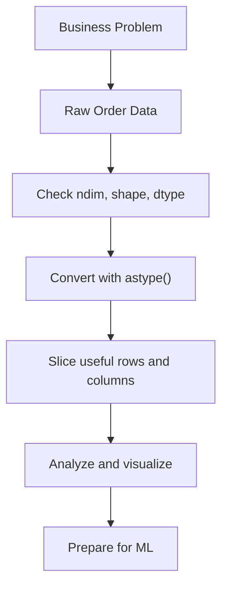

# Chapter 1 – Food Delivery Data Exploration and Analysis 1

## Part 1 – Why Data Must Be Understood Before It Can Be Modeled

> *"Before a machine learns patterns, a human must first learn the data."*

---

# 🌟 1. Motivation

Everyone wants to jump into Machine Learning.

People want to predict delivery times, recommend restaurants, estimate customer behavior, and optimize operations.

But here is the uncomfortable truth:

A model cannot rescue badly understood data.

Before prediction comes:

- understanding
- structuring
- cleaning
- and slicing the data correctly

This is why Data Analytics and Visualization (DAV) is the first real habit of a data scientist.

In this chapter, we are not just learning NumPy syntax.

We are learning how to think about data in a serious, scalable way.

> **Why should I care?**  
> Because if the raw data is misunderstood, every later step — analysis, visualization, and machine learning — becomes weak.

---

# 🎬 2. Story / Real World Analogy

Imagine you work at a food delivery company.

Thousands of orders arrive every hour.

Some deliveries are fast. Some are delayed. Some cities perform better. Some orders travel longer distances. Some kitchens prepare food more slowly.

Now your manager asks:

> “Why are evening deliveries slower than afternoon deliveries?”

To answer that, you need data.

But raw business activity is messy.

You must convert that messy reality into structure:

- each row = one order
- each column = one measurable feature
- each number = a value we can analyze

Think of it this way:

- A Python list is like loose order slips on a table.
- A NumPy array is like a neatly organized kitchen dashboard where every slot has a defined position.

Analytics begins the moment chaos becomes structure.

---

# 🤔 3. Think Like the Inventor

Suppose you are inventing a tool for analyzing millions of delivery records.

What would go wrong if you used only basic Python lists?

- Numerical operations would become slow.
- Repeating the same operation many times would need loops.
- Large-scale analysis would become clunky.
- Structure would be harder to reason about.
- Messy text-based numbers would block proper calculation.

So you naturally start asking for a better structure:

- something fast
- something compact
- something good with numbers
- something easy to slice
- and something that understands shape

That desire leads to NumPy arrays.

So NumPy is not just a programming convenience.

It is an answer to a real data problem:

> How do we handle large numerical datasets efficiently and correctly?

---

# 💡 4. Core Intuition

In analytics, data usually behaves like a table.

For a food delivery dataset:

- one row can represent one order
- one column can represent delivery time
- another can represent order value
- another can represent delivery distance
- another can represent preparation time

Once data is arranged properly, we can begin asking useful questions:

- What is the average delivery time?
- Which orders took the longest?
- How many features do we have?
- Are our values numeric or textual?
- Which subset of rows or columns matters right now?

This chapter teaches the foundational operations that make all later analysis possible:

1. understand the structure
2. inspect the type
3. convert when necessary
4. slice only what is needed

> Data science begins when data becomes structured enough to reason about.

---

# 📖 5. Formal Definitions

## NumPy Array

A NumPy array is a structured, efficient container for storing and computing on homogeneous numerical data.

**In simple words**  
It is a fast way to store lots of numerical values in an organized form.

**Remember this**  
Python lists are flexible containers. NumPy arrays are numerical workhorses.

## Shape

The shape of an array tells us how many rows and columns it has.

**In simple words**  
Shape tells us the structure of the data.

**Remember this**  
If you do not know the shape, you do not fully know the dataset.

## `astype()`

`astype()` converts data from one type to another.

**In simple words**  
It helps us turn values into the format needed for correct calculation.

**Remember this**  
A number stored as text is still text until converted.

## Slicing

Slicing means extracting a selected part of the data.

**In simple words**  
It helps us take only the rows or columns we currently need.

**Remember this**  
In Python slicing, the ending index is excluded.

---

# 🧠 6. Deep Conceptual Explanation

We will use a small toy food delivery dataset.

Each row will represent one order.

Each column will represent:

1. delivery time in minutes
2. order value in rupees
3. distance in kilometers
4. preparation time in minutes

To mimic the real world, we will first pretend that the data arrived as text.

This is realistic because many datasets come from CSV files or exports where numeric values are stored as strings.

```python
import numpy as np
import matplotlib.pyplot as plt
```

```python
raw_orders = np.array([
    ["32", "250", "4.5", "18"],
    ["28", "180", "3.2", "15"],
    ["45", "320", "7.1", "22"],
    ["25", "150", "2.8", "14"],
    ["38", "275", "5.6", "19"],
    ["41", "300", "6.4", "21"]
])

column_names = ["delivery_time_min", "order_value_rs", "distance_km", "prep_time_min"]

print("Column names:", column_names)
print("\nRaw dataset:\n", raw_orders)
print("\nShape:", raw_orders.shape)
print("Dimensions:", raw_orders.ndim)
print("Data type:", raw_orders.dtype)
```

At first glance, these values look numeric.

But NumPy is currently treating them as text.

That means:

- averages are not ready
- arithmetic is unsafe
- and real analytics has not started yet

This is why one of the first habits in data analysis is:

> Always inspect both `shape` and `dtype` before doing serious work.

## 6.1 Lists vs NumPy: Why the Upgrade Matters

A Python list is excellent for general programming.

But for numerical data analysis, it starts showing limitations:

- loops become repetitive
- bulk operations become awkward
- speed becomes an issue at scale

Let us compare both with a tiny example.

```python
delivery_times_list = [32, 28, 45, 25, 38, 41]

increased_list = []
for time in delivery_times_list:
    increased_list.append(time * 1.10)

print("Python list result:", increased_list)
```

```python
delivery_times_np = np.array([32, 28, 45, 25, 38, 41])

increased_np = delivery_times_np * 1.10

print("NumPy array result:", increased_np)
```

Both methods work.

But NumPy is cleaner and scales far better.

For a few values, the difference is small.

For millions of values, the difference becomes serious.

That is why NumPy is the natural next step after basic Python lists.

```python
big_list = list(range(1_000_000))
big_array = np.arange(1_000_000)
```

```python
# Run these inside a Jupyter notebook

%timeit [x * 2 for x in big_list]
%timeit big_array * 2
```

## 6.2 Dimensions and Shape

Data structure is not a minor detail.

It is the skeleton of the dataset.

A 1D array behaves like a single line of values.

A 2D array behaves like a table.

That distinction matters because many operations depend on whether the data is one-dimensional or two-dimensional.

```python
one_d = np.array([32, 28, 45, 25, 38])

print("1D array:", one_d)
print("ndim:", one_d.ndim)
print("shape:", one_d.shape)
print("size:", one_d.size)
print("dtype:", one_d.dtype)
```

```python
two_d = np.array([
    [32, 250, 4.5, 18],
    [28, 180, 3.2, 15],
    [45, 320, 7.1, 22],
    [25, 150, 2.8, 14],
    [38, 275, 5.6, 19]
])

print("2D array:\n", two_d)
print("ndim:", two_d.ndim)
print("shape:", two_d.shape)
print("size:", two_d.size)
print("dtype:", two_d.dtype)
```

Interpretation:

For the 2D array above:

- `ndim = 2` means it has two axes
- `shape = (5, 4)` means 5 rows and 4 columns
- `size = 20` means there are 20 values in total

This is why shape matters.

It tells us what kind of object we are working with before we start slicing, plotting, or computing.

## 6.3 Why `dtype` Matters

In real-world datasets, values often arrive in the wrong type.

For example:

- `"150"` may look like a number, but is actually text
- `"4.5"` may look like a decimal, but is still text
- `"N/A"` may break conversion completely

If we ignore this, we build analysis on weak foundations.

That is why `dtype` is not just a technical detail.

It tells us whether mathematics is truly possible.

```python
orders = raw_orders.astype(float)

print("Clean numeric dataset:\n", orders)
print("\nShape:", orders.shape)
print("Dimensions:", orders.ndim)
print("Data type:", orders.dtype)
```

```python
avg_delivery_time = np.mean(orders[:, 0])
avg_order_value = np.mean(orders[:, 1])
avg_distance = np.mean(orders[:, 2])

print("Average delivery time:", round(avg_delivery_time, 2))
print("Average order value:", round(avg_order_value, 2))
print("Average distance:", round(avg_distance, 2))
```

Once the data is converted properly, analytics becomes natural.

This is exactly why `astype()` is so important.

Before conversion:

- values look meaningful
- but calculation is blocked or misleading

After conversion:

- averages work
- plots work
- comparisons work
- downstream ML becomes possible

## 6.4 Slicing Data Like a Surgeon

Analysts rarely use the whole dataset at once.

Most of the time, they want:

- a few rows for inspection
- one column for a calculation
- a block of rows and columns for a specific question

Slicing is the art of taking exactly what is needed — no more, no less.

```python
print("First two rows:\n", orders[:2])
print("\nLast two rows:\n", orders[-2:])
print("\nAll delivery times:\n", orders[:, 0])
print("\nAll order values:\n", orders[:, 1])
print("\nRows 2 to 4, columns 1 to 3:\n", orders[1:4, 0:3])
```

```python
print("Third row:\n", orders[2])
print("\nSingle value (row 3, column 2):", orders[2, 1])
print("\nFirst three rows, first two columns:\n", orders[:3, :2])
print("\nLast column for all rows:\n", orders[:, -1])
```

Important rule:

> In Python slicing, the ending index is excluded.

So:

- `orders[1:4]` gives rows 1, 2, and 3
- row 4 is not included

A useful memory trick:

> **Start is included. End is excluded.**

---

# 🧮 7. Mathematics (Only if Required)

A tabular dataset can be thought of as a matrix:

$$
X \in \mathbb{R}^{m \times n}
$$

where:

- $m$ = number of rows
- $n$ = number of columns

In our delivery dataset:

- rows = orders
- columns = features

So if the shape is `(6, 4)`, that means:

- 6 orders
- 4 features per order

---

# 📊 8. Visual Learning

## Table View

| Column Index | Meaning |
|---|---|
| 0 | Delivery Time (minutes) |
| 1 | Order Value (rupees) |
| 2 | Distance (km) |
| 3 | Preparation Time (minutes) |

## ASCII Flow

```text
Business Problem
      ↓
Raw Delivery Data
      ↓
Check shape and dtype
      ↓
Convert text into numbers
      ↓
Slice relevant parts
      ↓
Visualize and analyze
      ↓
Prepare for ML
```

## Mermaid Flow



---

# 📈 9. Graphs / Plots

Let us create two simple visuals from the cleaned dataset:

1. a histogram of delivery times
2. a scatter plot of distance vs delivery time

This is important because analytics becomes much more intuitive once clean arrays turn into plots.

```python
delivery_time = orders[:, 0]
distance = orders[:, 2]

fig, axes = plt.subplots(1, 2, figsize=(12, 4))

axes[0].hist(delivery_time, bins=5, edgecolor="black", color="skyblue")
axes[0].set_title("Distribution of Delivery Time")
axes[0].set_xlabel("Delivery Time (minutes)")
axes[0].set_ylabel("Number of Orders")

axes[1].scatter(distance, delivery_time, color="tomato")
axes[1].set_title("Distance vs Delivery Time")
axes[1].set_xlabel("Distance (km)")
axes[1].set_ylabel("Delivery Time (minutes)")

plt.tight_layout()
plt.show()
```

Interpretation:

- The histogram shows whether delivery times are tightly grouped or widely spread.
- The scatter plot shows whether longer distance tends to correspond to longer delivery time.

Even in a tiny dataset, this already feels like real analytics.

We started with text values.

Now we have structure, numbers, slices, and visuals.

---

# 🖼 10. Images (Whenever Valuable)

This chapter does not need decorative images.

A table, a clean array, a histogram, and a scatter plot are enough.

That itself is a useful lesson:

> In analytics, clarity is more valuable than decoration.

---

# 💻 11. Coding

We followed this progression.

## Pseudocode

```text
Collect raw delivery data
      ↓
Store it in structured form
      ↓
Check shape and dtype
      ↓
Convert text into numbers
      ↓
Slice useful rows and columns
      ↓
Visualize and analyze
```

## Python from Scratch

Use loops with lists.

## NumPy Implementation

Use arrays and vectorized operations.

## Real-World Example

Use a toy food delivery dataset.

## Time Complexity

- indexing is fast
- slicing is expressive and efficient
- bulk numerical operations are far faster than manual loops at scale

## Space Complexity

NumPy is usually more memory-efficient than Python lists for large homogeneous numerical data.

## Common Errors

- forgetting that slice end is excluded
- trying 2D indexing on a 1D array
- assuming visible numbers are already numeric
- failing to inspect `dtype`

---

# 🏭 12. Industry Perspective

Companies like Swiggy, Zomato, Uber Eats, DoorDash, and Amazon rely on this exact mindset.

Before a company predicts delivery time, it first asks:

- What does one row mean?
- Which features matter?
- Is the data numeric?
- Is the data shaped correctly?
- Which subset should be analyzed first?

Real data teams spend enormous effort on:

- structure
- cleaning
- slicing
- and quality checks

That is why this chapter is foundational.

It is not “just NumPy.”

It is the beginning of professional data thinking.

---

# 🎯 13. Interview Questions

## Conceptual

1. Why is DAV necessary before ML?
2. Why are NumPy arrays generally preferred over Python lists for numerical analysis?
3. What is the difference between `ndim` and `shape`?
4. Why is `dtype` important?

## Coding

5. How do you convert an array of numeric strings into floats?
6. How do you extract one column from a 2D NumPy array?
7. How do you select rows 2 to 4 and columns 1 to 3?

## Industry

8. Why would a food delivery company care about slicing only part of a dataset?
9. How can wrong data types damage business analysis?

## Tricky

10. Can values look numeric but still behave like text?
11. Why can a wrong assumption about shape break the analysis?

---

# ❌ 14. Common Misconceptions

- **“If I can see numbers, they must already be numeric.”**  
  False. They may still be strings.

- **“Shape matters only in advanced mathematics.”**  
  False. Shape matters from the first day of analysis.

- **“Slicing is just a syntax trick.”**  
  False. Slicing is how analysts isolate useful data quickly.

- **“Python lists are enough for all analytics.”**  
  Not for serious large-scale numerical work.

- **“If code runs, analysis must be correct.”**  
  False. Code can run on badly structured data and still produce weak conclusions.

---

# 📝 15. Chapter Summary

- DAV comes before ML because data must be understood before it is modeled.
- Food delivery data can be represented in rows and columns.
- NumPy arrays are faster and more suitable than Python lists for numerical work.
- `ndim` tells us the number of dimensions.
- `shape` tells us the structure.
- `dtype` tells us the stored type.
- `astype()` converts data into usable numerical form.
- Slicing helps us extract exactly the part of the dataset we need.

> If the structure is clear, analysis becomes natural.

---

# 🧪 16. Self Check Questions

Try answering these without looking above.

1. Why is data understanding necessary before machine learning?
2. Why is a 2D array a natural structure for tabular data?
3. Why does `astype()` matter in real datasets?
4. What is the difference between `arr[1:4]` and `arr[1:5]`?
5. Why should analysts inspect `shape` and `dtype` early?

---

# 🏁 17. Short Practice Section with Answers

## Practice 1

Create a 1D NumPy array:

`[199, 249, 299, 179, 220]`

Then print:

- `ndim`
- `shape`
- `size`

### Answer

```python
arr = np.array([199, 249, 299, 179, 220])

print("ndim:", arr.ndim)
print("shape:", arr.shape)
print("size:", arr.size)
```

## Practice 2

Create a string array:

`["120.5", "89.0", "210.75", "150.0"]`

Convert it into float.

### Answer

```python
prices = np.array(["120.5", "89.0", "210.75", "150.0"])
prices = prices.astype(float)

print(prices)
print(prices.dtype)
```

## Practice 3

Given:

```python
sample = np.array([
    [10, 20, 30],
    [40, 50, 60],
    [70, 80, 90],
    [100, 110, 120]
])
```

Print:

- the first column
- the last two rows
- the first two rows and first two columns

### Answer

```python
sample = np.array([
    [10, 20, 30],
    [40, 50, 60],
    [70, 80, 90],
    [100, 110, 120]
])

print("First column:\n", sample[:, 0])
print("\nLast two rows:\n", sample[-2:])
print("\nFirst two rows and first two columns:\n", sample[:2, :2])
```

## Practice 4

Explain in one sentence each:

- Why is NumPy better than Python lists for numerical analysis?
- Why is checking `shape` important?
- Why is `astype()` useful?

### Answer

- NumPy is better because it is faster, more memory-efficient, and more natural for numerical computation.
- Checking `shape` is important because it tells us the structural layout of the dataset.
- `astype()` is useful because it converts data into the correct type for analysis and calculation.

---

# 🔗 18. Connections

## Previous Learning

If you already know basic Python and basic arrays, this chapter gives that knowledge a business purpose.

You are no longer just writing syntax.

You are learning to think like an analyst.

## Next Chapter

The next food delivery chapter will naturally build on this foundation by going deeper into exploration, inspection, and practical analysis.

So this chapter is not isolated.

It is the first brick in a larger DAV story.

---

# 📦 19. Final Quick-Revision Cheat Sheet

## One-Line Memory Map

```text
Understand the business
        ↓
Structure the data
        ↓
Check shape
        ↓
Check dtype
        ↓
Convert if needed
        ↓
Slice what matters
        ↓
Visualize
        ↓
Analyze
        ↓
Prepare for ML
```

## Fast Recall Table

| Concept | What it Means | Why it Matters |
|---|---|---|
| NumPy Array | Structured numerical container | Faster and cleaner analytics |
| `ndim` | Number of dimensions | Tells us whether data is 1D, 2D, etc. |
| `shape` | Rows and columns | Defines structure |
| `size` | Total number of values | Helps confirm scale |
| `dtype` | Stored data type | Tells us if math is safe |
| `astype()` | Type conversion | Cleans messy numerical text |
| Slicing | Extracting a subset | Gives only the rows/columns we need |

## Golden Rules

1. Never start analysis without checking `shape`.
2. Never trust numeric-looking values without checking `dtype`.
3. Use `astype()` when real-world data arrives in the wrong type.
4. Remember: slice end is excluded.
5. Prefer NumPy over Python lists for large numerical work.

## 30-Second Interview Revision

- DAV comes before ML.
- NumPy is built for fast numerical analysis.
- Shape tells structure.
- `dtype` tells type.
- `astype()` fixes type problems.
- Slicing isolates useful parts of the dataset.
- Clean structure leads to reliable analysis.

This is now the clean Chapter 1 notebook version. Send Chapter 2 notes and I’ll continue in exactly this style.
