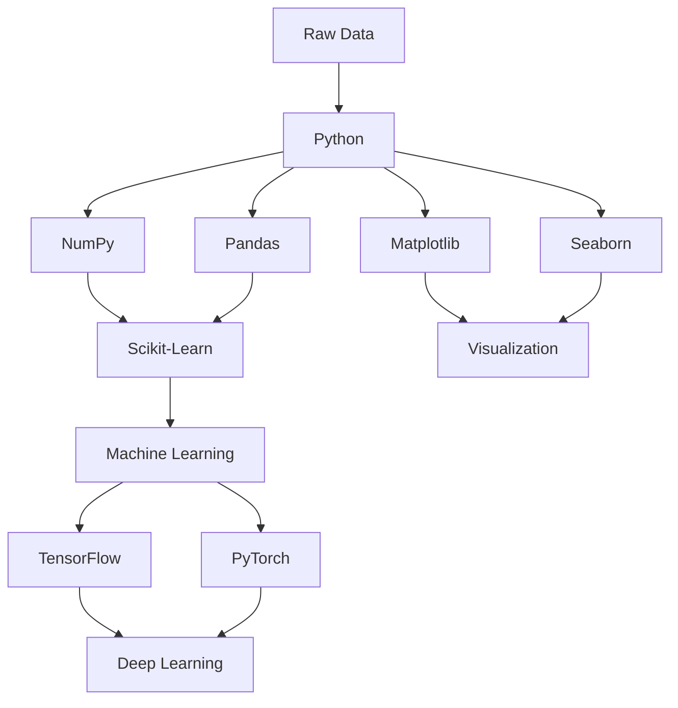
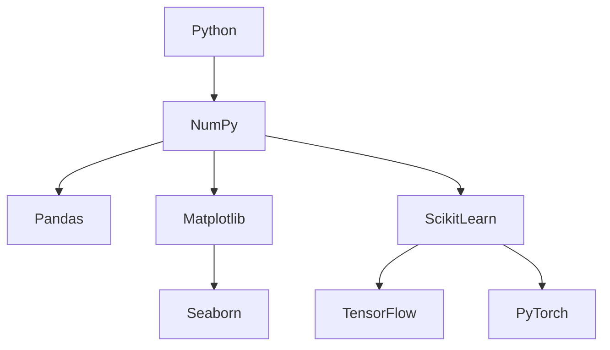
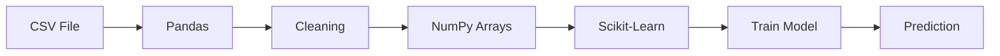
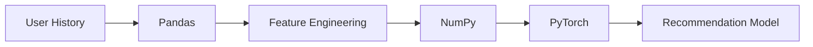
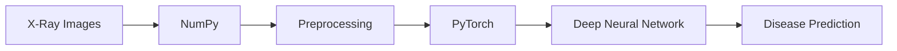

Excellent. Now we start building the actual ecosystem. This chapter is one of the most important chapters in the entire DAV course because if someone understands this correctly, they immediately understand **where every library fits**. Most courses simply draw a diagram like:

```
Python
├── NumPy
├── Pandas
├── Matplotlib
└── Seaborn
```

and move on.

That is not enough.

We are going to understand **why every library was invented**, **what problem it solves**, **how they work together**, and **how they ultimately help us build AI systems**.

---

# Chapter 1.2 — The Data Science Ecosystem

> *"A carpenter doesn't build a house with only a hammer. Likewise, a Data Scientist doesn't build AI with only Python."*

---

# 🎯 Learning Objectives

By the end of this chapter, you will:

* Understand the complete Data Science ecosystem.
* Know why Python became the dominant language.
* Understand the purpose of every major library.
* Learn how data flows from raw files to AI models.
* Understand the relationship between NumPy, Pandas, Matplotlib, Seaborn, Scikit-Learn, TensorFlow and PyTorch.
* Build a mental model of the complete AI pipeline.

---

# 🌍 A Story Before We Begin

Imagine your manager gives you this file.

```
sales.csv
```

It contains

```
10 Million Rows
```

with columns like

```
Customer ID
Age
City
Purchase Amount
Product
Payment Mode
Date
```

Now your manager asks

> **"Find why our sales dropped last month."**

Can Python alone answer this?

No.

You need different tools.

Some tools

* read data

Some

* clean data

Some

* analyze data

Some

* draw graphs

Some

* build ML models

Some

* build Deep Learning models

This collection of tools is called the **Data Science Ecosystem**.

---

# 🤔 What is an Ecosystem?

## Simple Definition

An ecosystem is a collection of different components working together to achieve one goal.

Example:

A hospital.

```
Doctors

Nurses

Reception

Pharmacy

Laboratory

Accounts
```

None of them alone can run a hospital.

Together they can.

Similarly,

Python alone cannot perform every Data Science task.

It needs specialized libraries.

---

# 🏗 The Complete Data Science Ecosystem



This is the roadmap we will gradually learn.

---

# 🧠 Mental Model

Imagine building a house.

You don't use one tool.

You use

```
Hammer

Saw

Drill

Measuring Tape

Paint Brush
```

Each tool has a purpose.

Similarly,

```
Python

↓

NumPy

↓

Pandas

↓

Matplotlib

↓

Seaborn

↓

Scikit-Learn

↓

TensorFlow / PyTorch
```

Each library performs one specialized task.

---

# 📌 The Big Picture


This is the lifecycle followed in almost every AI company.

---

# 🐍 Why Python Sits at the Center

Your Scaler notes place Python in the middle with libraries around it and show the relationship with lower-level languages.  

But why?

Because Python is not trying to be the fastest language.

Python is trying to maximize

* Productivity
* Readability
* Community
* Libraries

Think of Python as

> **The Manager**

It coordinates many highly optimized libraries.

---

# Python's Job

Python mostly

* writes logic
* calls optimized libraries
* glues different components together

Example

```python
import numpy as np

a = np.arange(1000000)

print(np.mean(a))
```

You wrote one line.

Behind the scenes,

Python called highly optimized compiled code.

---

# The Data Science Toolbox

---

# 1️⃣ NumPy

## Purpose

Efficient numerical computation.

Think

```
Numbers

Matrices

Vectors

Linear Algebra

Statistics

Scientific Computing
```

NumPy is the **foundation**.

Without NumPy,

most modern Python scientific libraries would not exist.

---

### Mental Model

```
Calculator

↓

Super Calculator

↓

NumPy
```

---

### Real Uses

* Images
* Audio
* Scientific Computing
* Machine Learning
* Robotics
* Computer Vision

---

# 2️⃣ Pandas

Suppose you have

```
Excel Sheet

↓

100 Columns

↓

2 Million Rows
```

Python Lists?

Impossible.

NumPy?

Possible but inconvenient.

Pandas?

Perfect.

---

### Mental Model

```
Excel

+

SQL

+

NumPy

=

Pandas
```

---

### Example

```
Employee

Age

Salary

Department

Experience
```

Pandas lets us

* Filter
* Sort
* Merge
* Group
* Aggregate

in a few lines.

---

# 3️⃣ Matplotlib

Humans understand pictures faster than tables.

Example

Instead of

```
Sales

Jan 100

Feb 120

Mar 180

Apr 220
```

Draw

```
     ●
   ●
 ●
●
```

Matplotlib creates

* Line Charts
* Scatter Plots
* Histograms
* Pie Charts
* Heatmaps
* Bar Charts

---

### Mental Model

```
Numbers

↓

Pictures
```

---

# 4️⃣ Seaborn

Matplotlib is powerful.

But

writing beautiful graphs takes work.

Seaborn was built on top of Matplotlib.

Think

```
Matplotlib

↓

Beautiful Default Styles

↓

Seaborn
```

---

Example

Instead of

20 lines

You may need

3 lines.

---

# 5️⃣ Scikit-Learn

Now data is clean.

We can finally build Machine Learning models.

Examples

```
Spam Detection

House Price Prediction

Customer Churn

Loan Approval

Fraud Detection
```

Scikit-Learn provides

* Linear Regression
* Decision Trees
* Random Forest
* KNN
* SVM
* Clustering
* PCA

---

# 6️⃣ TensorFlow

Google developed TensorFlow.

Purpose

Large-scale Deep Learning.

Examples

* Image Recognition
* Speech Recognition
* Medical AI

---

# 7️⃣ PyTorch

Developed by Meta.

Popular in

* AI Research
* LLMs
* Computer Vision
* NLP

Modern models like many research prototypes are commonly developed using PyTorch.

---

# The Complete Relationship



---

# Real AI Workflow

Suppose we are building

> House Price Prediction



---

# Example 2

Suppose we build

Netflix Recommendation



---

# Example 3

Suppose we build

Medical AI



---

# 📚 Library Dependency Pyramid

```text
                AI Applications
                     ▲
          TensorFlow / PyTorch
                     ▲
              Scikit-Learn
                     ▲
       Pandas      Matplotlib
             \       /
               NumPy
                 ▲
              Python
```

Notice something important.

Almost every library eventually depends on **NumPy**.

That is why we will spend considerable time mastering NumPy before moving to Pandas.

---

# 🧠 Thinking Like an Engineer

Suppose your dataset contains only

```
2
5
7
9
```

Should you use Pandas?

Probably not.

NumPy is sufficient.

Now suppose your data contains

```
Customer Name

Age

Salary

Department

Joining Date

City

Gender
```

Now NumPy becomes inconvenient.

Pandas is the better tool.

Choosing the correct tool is part of engineering.

---

# ⚠️ Common Beginner Mistakes

### ❌ "Python is enough."

No.

Most real projects rely heavily on libraries.

---

### ❌ "NumPy and Pandas are competitors."

Wrong.

Pandas is built on top of NumPy.

---

### ❌ "Seaborn replaces Matplotlib."

No.

Seaborn uses Matplotlib underneath.

---

### ❌ "TensorFlow and PyTorch replace Scikit-Learn."

Not exactly.

Scikit-Learn is excellent for traditional Machine Learning.

TensorFlow and PyTorch focus primarily on Deep Learning.

---

# 🏢 Industry Perspective

A typical AI project may involve:

| Stage                 | Primary Tool                                       |
| --------------------- | -------------------------------------------------- |
| Read CSV/Excel/SQL    | Pandas                                             |
| Numerical computation | NumPy                                              |
| Data visualization    | Matplotlib / Seaborn                               |
| Classical ML          | Scikit-Learn                                       |
| Deep Learning         | TensorFlow / PyTorch                               |
| Deployment            | FastAPI, Flask, Docker, Kubernetes (covered later) |

---

# 🎯 Interview Questions

### Basic

1. Why is Python popular in Data Science?
2. What is the purpose of NumPy?
3. Why do we need Pandas if NumPy already exists?
4. Difference between Matplotlib and Seaborn?

### Intermediate

5. Explain the complete Data Science ecosystem.
6. Why is NumPy considered the foundation of scientific Python?
7. Can Pandas work without NumPy? Explain conceptually.

### Advanced

8. Describe the journey of data from a CSV file to a trained Machine Learning model.
9. If you were building a recommendation system, which libraries would you use at each stage and why?

---

# 📝 Chapter Summary

✅ Data Science relies on an ecosystem of specialized libraries rather than a single language.

✅ Python acts as the orchestration layer because of its readability and extensive ecosystem.

✅ NumPy provides the numerical foundation on which many scientific libraries are built.

✅ Pandas simplifies working with structured, tabular data.

✅ Matplotlib and Seaborn transform data into visual insights.

✅ Scikit-Learn enables classical Machine Learning.

✅ TensorFlow and PyTorch power modern Deep Learning applications.

---

# 📌 Cheat Sheet

| Library      | Primary Purpose                     | Mental Model                      |
| ------------ | ----------------------------------- | --------------------------------- |
| Python       | General programming & orchestration | The manager                       |
| NumPy        | Fast numerical computing            | Super calculator                  |
| Pandas       | Structured data analysis            | Excel + SQL + NumPy               |
| Matplotlib   | Core plotting library               | Draw graphs                       |
| Seaborn      | Statistical visualization           | Beautiful Matplotlib              |
| Scikit-Learn | Classical Machine Learning          | ML toolkit                        |
| TensorFlow   | Deep Learning (production-focused)  | Neural network framework          |
| PyTorch      | Deep Learning (research & industry) | Flexible neural network framework |

---

# ✅ Scaler Coverage Check

### Covered from Scaler

* ✔ Python as the central language
* ✔ NumPy, Pandas, Matplotlib and Seaborn ecosystem
* ✔ Relationship between Python and lower-level languages
* ✔ The role of these tools in Data Analytics & Visualization

### Added Beyond Scaler

* ➕ Complete Data Science ecosystem
* ➕ Mermaid architecture diagrams
* ➕ End-to-end data flow from business problem to AI solution
* ➕ Library dependency pyramid
* ➕ Detailed explanation of each library's purpose
* ➕ Real-world AI workflows (housing, recommendations, medical AI)
* ➕ Industry perspective, interview questions, mental models, and engineering decision-making

---

### 📖 References (for further reading)

* Python documentation
* NumPy User Guide
* Pandas User Guide
* Matplotlib Documentation
* Seaborn Documentation
* Scikit-learn User Guide
* TensorFlow Guides
* PyTorch Documentation

These are the primary sources we'll conceptually align with while keeping the explanations beginner-friendly and progressively building toward ML and AI. 

