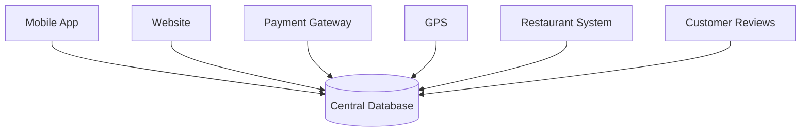

# Chapter 1.3 — From Raw Data to Business Decision

> **"Data has no value until it helps someone make a better decision."**

---

# 🎯 Learning Objectives

By the end of this chapter, you will understand:

* Why companies collect enormous amounts of data.
* The complete journey of data from its source to a business decision.
* The difference between **Data**, **Analytics**, **Insights**, and **Decision Making**.
* The role of Data Analytics, Visualization, and Machine Learning in this journey.
* Why 80–90% of a Data Scientist's time is often spent before building a model.
* The real-world data pipeline followed by companies like Amazon, Netflix, Google, Uber, and banks.

---

# 🌍 Story: The CEO's Morning Meeting

Imagine you are the CEO of **Swiggy**.

At 9:00 AM, your team enters the meeting room.

The CEO asks five simple questions:

1. Why did yesterday's revenue drop by **15%**?
2. Why are customers cancelling more orders?
3. Which cities are growing the fastest?
4. Why are delivery times increasing?
5. Which restaurants should appear first in recommendations?

No one answers by opening a CSV file with 50 million rows.

Instead, they answer using **analytics**.

This is the entire purpose of Data Analytics.

---

# 🤔 What Happens When a Customer Places an Order?

Suppose Rahul orders a pizza.

```text
Customer Name : Rahul
Restaurant    : Pizza Hut
Amount         : ₹550
Payment Mode   : UPI
Delivery Time  : 28 min
Location        : Bangalore
Rating          : 5
```

This looks simple.

But internally...

---

# What the Company Actually Receives

```text
Customer ID

Restaurant ID

Latitude

Longitude

GPS Coordinates

Device Type

Internet Speed

Payment Gateway

Delivery Partner ID

Order Time

Cooking Time

Packing Time

Traffic Data

Weather Data

Coupon Used

App Version

Battery Percentage

...
```

One order can generate **hundreds of data points**.

Now imagine

```text
50 Million Orders
```

per month.

---

# 🤯 The Problem

Can a manager read

```text
50 Million Rows
```

and answer

> "Why are sales dropping?"

Impossible.

We need a systematic process.

---

# The Journey of Data


This is one of the most important diagrams in Data Analytics.

**Memorize it.**

---

# Step 1 — Raw Data

Everything begins here.

Raw data can come from

* Mobile Apps
* Websites
* Sensors
* Cameras
* GPS
* Databases
* Excel
* CSV
* APIs
* IoT Devices

Example

```text
Uber Ride

Pickup

Drop

Distance

Driver

Rating

Fare

Time
```

Nothing has been analyzed yet.

---

# Step 2 — Data Collection

The company gathers data from multiple sources.



Everything eventually reaches a central storage system.

---

# Step 3 — Data Storage

Now the company stores the information.

Examples

* SQL Databases
* Data Warehouses
* Data Lakes
* Cloud Storage

Think of it like a giant digital warehouse.

```text
Warehouse

Shelf A → Customers

Shelf B → Orders

Shelf C → Payments

Shelf D → Restaurants
```

Nothing intelligent has happened yet.

---

# Step 4 — Data Cleaning

This is where reality begins.

Real-world data is messy.

Example

| Name  | Age  | Salary |
| ----- | ---- | ------ |
| Rahul | 25   | 8L     |
| Priya | NULL | 9L     |
| Rahul | 25   | 8L     |
| Amit  | -5   | 7L     |

Problems

* Missing values
* Duplicate records
* Wrong ages
* Incorrect spellings
* Invalid entries

Without cleaning,

Machine Learning becomes unreliable.

> 💡 **Industry Fact**
>
> Data professionals often spend a large portion of their project time cleaning and preparing data rather than training models.

---

# Step 5 — Data Exploration

Now we begin asking questions.

Examples

* Which city has maximum sales?
* Average delivery time?
* Highest-rated restaurant?
* Which age group orders most frequently?

Notice

We are **not building models.**

We are understanding the data.

This aligns with the Scaler notes where **Data Exploration** is introduced before predictive modeling. 

---

# Step 6 — Data Analysis

Now patterns begin to emerge.

Example

After analysis

We discover

```text
Orders after 8 PM

↓

Average bill increases by 27%
```

Another discovery

```text
Rain

↓

Orders increase

↓

Delivery time also increases
```

These are patterns.

---

# Step 7 — Visualization

Imagine explaining

```text
50 Million Rows
```

to your CEO.

Impossible.

Instead

You show

* Line Chart
* Bar Chart
* Heatmap
* Histogram
* Dashboard

Within seconds

the CEO understands the situation.

This is why visualization exists.

---

# Example

Instead of

```text
City

Delhi

Revenue

₹7.2 Cr
```

We show

```text
Revenue

Delhi       ███████████

Mumbai      █████████

Bangalore   ███████

Pune         ████
```

Instant understanding.

---

# Step 8 — Business Insights

Analytics answers

> What happened?

Insights answer

> What should we do?

Example

Analytics says

```text
Users abandon carts

after adding

3 or more products.
```

Insight

```text
Introduce

Free Delivery

for 3+

items.
```

Now we have an actionable recommendation.

---

# Step 9 — Business Decision

Management now decides

```text
Free Delivery

after 3 items

starting Monday
```

This is no longer analytics.

This is business strategy.

---

# Step 10 — Business Value

Finally,

we measure

```text
Revenue ↑

Customer Satisfaction ↑

Profit ↑

Delivery Time ↓

Customer Retention ↑
```

The goal of analytics is **not charts**.

The goal is **business value**.

---

# 🏦 Complete Banking Example

Your Scaler notes use a loan approval example to motivate analytics. Let's expand it into a full business pipeline. 

## Customer Applies

```text
Name

Salary

Credit Score

Age

Occupation

Loan Amount
```

↓

## Data Collection

Bank gathers

```text
Previous Loans

Default History

Income Tax

Bank Balance

Investments
```

↓

## Cleaning

Remove

* Missing values
* Incorrect entries
* Duplicate records

↓

## Analytics

Questions

* Can customer repay?
* Similar successful customers?
* Default probability?

↓

## Visualization

Dashboard

```text
Risk Score

███████
```

↓

## Decision

```text
Approve

OR

Reject
```

↓

## Business Outcome

```text
Lower Defaults

Higher Profit

Better Customer Experience
```

---

# 🛒 Amazon Example

Suppose Amazon observes

```text
Laptop Buyers

↓

Also buy

Wireless Mouse
```

Analytics discovers the pattern.

Business Decision

Recommend

```text
Customers also bought...
```

Result

Higher sales.

---

# 🎬 Netflix Example

Netflix collects

* Watch Time
* Pause Frequency
* Rewatch Count
* Language
* Device

Analytics discovers

```text
Users watching

Sci-Fi

also watch

Space Documentaries
```

Decision

Recommend

more Sci-Fi.

Result

Higher engagement.

---

# 🚖 Uber Example

Uber collects

* Driver Location
* Rider Location
* Time
* Weather
* Traffic

Analytics discovers

```text
Rain

↓

Ride Requests Double
```

Business Decision

Increase driver availability.

---

# 🤖 Where Does Machine Learning Enter?

Many beginners think

```text
Raw Data

↓

Machine Learning
```

Wrong.

The real process is


Machine Learning is only one stage in a much larger pipeline.

---

# 🧠 Mental Model

Imagine cooking.

```text
Raw Vegetables

↓

Wash

↓

Cut

↓

Cook

↓

Taste

↓

Serve
```

Would you directly cook dirty vegetables?

No.

Similarly

Machine Learning should never receive dirty data.

---

# ⚠️ Common Beginner Mistakes

### ❌ "Data Analytics means creating dashboards."

Dashboards are only the communication layer.

Analytics includes understanding, cleaning, analyzing, and interpreting data.

---

### ❌ "Machine Learning automatically cleans data."

No.

Poor-quality input almost always leads to poor-quality predictions.

---

### ❌ "More data always means better decisions."

Not necessarily.

High-quality, relevant data is usually more valuable than a larger amount of noisy data.

---

# 🏢 Industry Insight

Different teams participate in this pipeline:

| Team               | Responsibility                   |
| ------------------ | -------------------------------- |
| Software Engineers | Collect application data         |
| Data Engineers     | Build data pipelines and storage |
| Data Analysts      | Explore, analyze, and visualize  |
| Data Scientists    | Build predictive models          |
| ML Engineers       | Deploy and maintain ML systems   |
| Business Team      | Take strategic decisions         |

A successful AI product is a collaboration across all these teams.

---

# 🎯 Interview Questions

## Basic

1. Explain the journey from raw data to business decision.
2. Why is data cleaning important?
3. Why is visualization needed before decision making?

## Intermediate

4. Explain the difference between analytics and business insights.
5. Where does Machine Learning fit in the analytics pipeline?
6. Give a real-world example of analytics creating business value.

## Advanced

7. Why do many data projects spend most of their time before model training?
8. Describe the complete pipeline for a food delivery company from customer order to business decision.
9. If the CEO asks, "Revenue dropped yesterday," how would you approach the problem using the analytics pipeline?

---

# 📝 Chapter Summary

✅ Raw data is generated from many business sources.

✅ Data must be collected, stored, and cleaned before meaningful analysis.

✅ Data exploration helps us understand the structure and quality of the data.

✅ Data analysis discovers patterns and relationships.

✅ Data visualization communicates findings quickly and effectively.

✅ Insights lead to business decisions.

✅ Business decisions create measurable business value.

✅ Machine Learning is an important stage, but it relies on a strong analytics foundation.

---

# 📌 Cheat Sheet

| Stage            | Purpose                 | Typical Tools (examples)          |
| ---------------- | ----------------------- | --------------------------------- |
| Data Collection  | Gather raw information  | Apps, APIs, Databases             |
| Storage          | Persist data            | SQL, Data Warehouses              |
| Cleaning         | Improve data quality    | Pandas, SQL                       |
| Exploration      | Understand the dataset  | Pandas, NumPy                     |
| Analysis         | Discover patterns       | Pandas, NumPy                     |
| Visualization    | Communicate findings    | Matplotlib, Seaborn               |
| Machine Learning | Build predictive models | Scikit-Learn, TensorFlow, PyTorch |
| Decision         | Business action         | Human stakeholders                |
| Business Value   | Measure impact          | KPIs, Revenue, Retention          |

---

# ✅ Scaler Coverage Check

### Covered from Scaler

* ✔ Banking/loan approval scenario
* ✔ Reporting and Data Exploration concepts
* ✔ Food delivery example
* ✔ Predictive thinking before ML

### Added Beyond Scaler

* ➕ Complete end-to-end analytics pipeline
* ➕ Mermaid workflow diagrams
* ➕ Multiple industry case studies (Amazon, Netflix, Uber)
* ➕ Team responsibilities across the data lifecycle
* ➕ Machine Learning's exact place in the pipeline
* ➕ Business-value-first perspective
* ➕ Interview preparation, mental models, and revision material

---

## 🚀 Preview of Chapter 1.4

In the next chapter, we'll answer one of the most common questions in AI:

> **Why did Python become the language of Data Science and AI despite being slower than C/C++?**

We'll go far beyond "Python is easy" and cover:

* The history of Python in scientific computing
* Why C/C++ still powers NumPy internally
* The relationship between Python, C, assembly, CPU, and hardware (building on the diagram from your Scaler notes)
* Why Python can feel fast even though it is an interpreted language
* Why almost every major AI framework exposes a Python interface

This chapter will give you the architectural understanding that many practitioners use without ever fully learning. 

