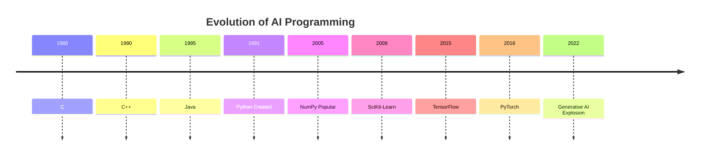
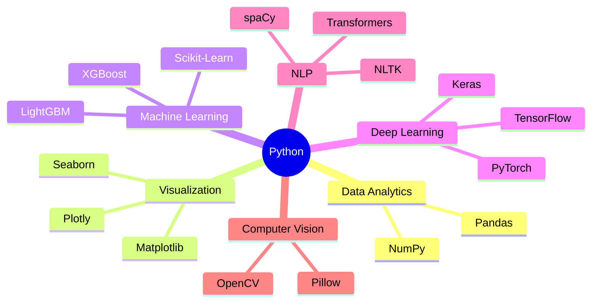
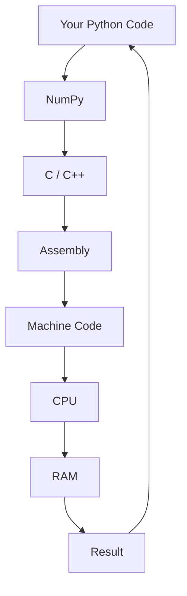
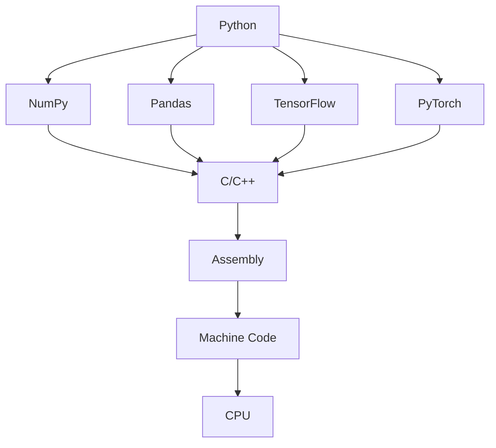
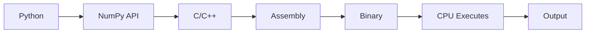

# Chapter 1.4 — Why Python Became the Language of AI

> **"Python did not become the language of AI because it is the fastest. It became the language of AI because it makes humans fast."**

---

# 🎯 Learning Objectives

By the end of this chapter, you will understand:

* Why Python dominates AI, ML, Data Science, and Data Analytics.
* Why Python is slower than C/C++ yet still became the industry standard.
* The relationship between Python, NumPy, C/C++, Assembly, and the CPU.
* Why libraries like TensorFlow, PyTorch, and Pandas are written largely in C/C++ but exposed through Python.
* Why almost every AI company uses Python as the primary interface.
* The real execution flow from Python code to hardware.

---

# 🌍 Story — Building an AI Startup

Imagine you and your friends are starting an AI company.

You have just received funding.

Your goal is to build an AI model in **3 months**.

Your team discusses programming languages.

One engineer says:

> "Let's use C++. It's the fastest."

Another says:

> "Let's use Java."

Another suggests:

> "Let's use Rust."

Finally, one engineer says:

> "Let's use Python."

The immediate reaction is:

> **"But Python is slow!"**

Yet almost every AI company chooses Python.

Why?

Let's discover.

---

# 🤔 The Biggest Myth

Many beginners believe:

```text
Python is the best language for AI because it is fast.
```

❌ Completely wrong.

Python is **one of the slowest popular programming languages** for numerical computation.

Then why does almost every AI library use Python?

Because **developer productivity matters more than typing speed**, and the heavy computation is delegated to optimized native code.

---

# 🚗 An Analogy

Imagine two people.

### Person A

Drives a Ferrari.

But doesn't know where to go.

---

### Person B

Drives a normal car.

But knows the exact route.

Who reaches the destination first?

Usually Person B.

Programming is similar.

The fastest language is not always the most productive language.

---

# The Evolution of AI Programming

Early AI systems were written in

```text
C

C++

Java

MATLAB

R

Lisp
```

Each language had strengths.

But none combined

* simplicity
* readability
* massive ecosystem
* scientific libraries
* community support

like Python eventually did.

---

# 🏗 Evolution Timeline



Notice something interesting.

Python existed long before AI became mainstream.

AI grew because Python's ecosystem matured.

---

# Why Python Won

It wasn't because of one reason.

It was because many advantages came together.

---

## Reason 1 — Simple Syntax

Compare C++

```cpp
#include<iostream>

using namespace std;

int main()
{
    cout<<"Hello";
}
```

Python

```python
print("Hello")
```

One line.

Cleaner.

Readable.

Less boilerplate.

---

### AI Code Example

Suppose you want to calculate the average.

C++

Many lines.

Python

```python
import numpy as np

np.mean(data)
```

Readable.

Simple.

Easy to debug.

---

# Reason 2 — Huge Ecosystem

Python became the center of scientific computing.

Instead of building everything yourself,

you import libraries.

```python
import numpy as np

import pandas as pd

import matplotlib.pyplot as plt

import seaborn as sns

from sklearn.linear_model import LinearRegression

import torch
```

Within seconds,

you have access to decades of research.

---

# The Python Ecosystem



Python became valuable because of its ecosystem.

Not because of the language alone.

---

# Reason 3 — Massive Community

If you encounter a problem,

someone has probably already solved it.

Thousands of

* tutorials
* Stack Overflow discussions
* GitHub repositories
* research papers
* notebooks

exist for Python.

Community accelerates innovation.

---

# Reason 4 — Scientific Computing

This is perhaps the most important reason.

Scientists around the world contributed to libraries such as

* NumPy
* SciPy
* Pandas
* Matplotlib

These libraries became trusted foundations.

AI researchers naturally adopted them.

---

# 🤯 The Real Secret

Here comes the most important idea of this chapter.

## Python is NOT doing most of the heavy work.

Instead

Python delegates computation to highly optimized native libraries.

---

# Real Execution Flow

This idea is hinted at in your Scaler notes, where Python is shown working together with C/C++, Assembly, Binary, and finally the hardware. 

Let's expand it fully.



This diagram explains almost the entire AI software stack.

---

# What Actually Happens?

Suppose you write

```python
import numpy as np

arr = np.arange(1000000)

print(np.mean(arr))
```

Many beginners imagine

```text
Python

↓

CPU
```

Reality

```text
Python

↓

NumPy

↓

Optimized C

↓

Assembly

↓

Machine Code

↓

CPU
```

Python mostly coordinates the process.

---

# Python is Like a CEO

Imagine a company.

The CEO

doesn't manufacture products.

The CEO

coordinates experts.

Similarly

```text
Python

↓

Calls NumPy

↓

Calls BLAS Libraries

↓

Calls CPU Instructions
```

Python acts as the orchestrator.

---

# Why NumPy is Fast

We'll study this in depth later,

but here's the intuition.

Python Loop

```python
result = []

for i in numbers:
    result.append(i * 2)
```

NumPy

```python
numbers * 2
```

Why is the second faster?

Because the multiplication happens inside optimized native code operating on contiguous memory, rather than interpreting Python objects one by one.

---

# The Complete Software Stack



Notice

Everything eventually reaches

```text
CPU
```

---

# 🤔 What is Assembly Language?

Computers do **not** understand Python.

They don't even understand C++.

Eventually everything becomes

Assembly.

Example

```text
MOV

ADD

SUB

MUL

LOAD

STORE
```

These instructions are extremely close to hardware.

---

# What is Machine Code?

Assembly is translated into

```text
10110010

01001101

11100010
```

Only binary.

Only 0 and 1.

The CPU understands only binary instructions.

---

# Complete Translation Pipeline



This is one of the most important diagrams in your AI journey.

---

# Then Why Not Write AI Directly in C++?

Excellent question.

Imagine building

ChatGPT.

Millions of lines.

Research changes daily.

Writing everything in C++

would make experimentation much slower.

Python enables rapid iteration.

Researchers can

* change ideas
* test models
* debug experiments

quickly.

The performance-critical kernels remain in optimized native code.

---

# Real Industry Architecture

Google

```text
Python

↓

TensorFlow

↓

C++

↓

CUDA

↓

GPU
```

---

Meta

```text
Python

↓

PyTorch

↓

C++

↓

CUDA

↓

GPU
```

---

OpenAI

```text
Python

↓

PyTorch

↓

CUDA

↓

GPU
```

The pattern repeats across the industry.

---

# Why CUDA?

Modern AI doesn't run primarily on CPUs.

It runs on GPUs.

```mermaid
flowchart LR

Python

--> PyTorch

--> CUDA

--> NVIDIA GPU

--> AI Computation
```

We will study GPUs, CUDA, and parallel computing in later modules.

For now, remember:

Python is still the interface.

---

# 🤖 AI Without Python?

Possible?

Yes.

Practical?

Usually not.

Companies occasionally implement inference engines or performance-critical systems in C++, Rust, or other languages.

However,

research,

experimentation,

and model development

are overwhelmingly done in Python.

---

# 🧠 Mental Model

Think of a Formula 1 team.

```text
Driver

↓

Engineers

↓

Mechanics

↓

Engine

↓

Wheels
```

The driver doesn't directly move the wheels.

Similarly

```text
Python

↓

NumPy

↓

C++

↓

Assembly

↓

CPU
```

Python gives instructions.

Lower layers perform the heavy work.

---

# ⚠️ Common Beginner Mistakes

### ❌ "Python is fast."

Python itself is relatively slow for numerical loops.

Its ecosystem makes it powerful.

---

### ❌ "NumPy is written in Python."

Only partly.

Much of its performance-critical implementation is in compiled languages such as C.

---

### ❌ "TensorFlow is a Python program."

Python provides the user-facing API.

The computational kernels are implemented in optimized native code.

---

### ❌ "AI runs on Python."

Python orchestrates AI workflows.

The intensive numerical computation is executed by optimized libraries on CPUs and GPUs.

---

# 🏢 Industry Insight

A typical production AI stack might look like this:

| Layer               | Typical Technology   | Responsibility                    |
| ------------------- | -------------------- | --------------------------------- |
| Application         | Python               | Business logic & orchestration    |
| AI Framework        | PyTorch / TensorFlow | Model definition and training     |
| Numerical Libraries | NumPy, BLAS, cuDNN   | Efficient mathematical operations |
| Native Code         | C/C++                | Performance-critical kernels      |
| GPU Runtime         | CUDA                 | Parallel execution on NVIDIA GPUs |
| Hardware            | CPU / GPU            | Executes machine instructions     |

---

# 🎯 Interview Questions

## Basic

1. Why is Python popular in AI?
2. Is Python faster than C++?
3. What role does NumPy play in Python?

## Intermediate

4. Explain how a Python program eventually runs on the CPU.
5. Why is Python suitable despite being slower?
6. Why are most AI libraries implemented with compiled components?

## Advanced

7. Explain the complete execution pipeline from Python code to hardware.
8. Why do frameworks like PyTorch expose a Python API while relying on optimized native kernels?
9. If performance is critical, why don't AI researchers write all models directly in C++?

---

# 📝 Chapter Summary

✅ Python became the dominant AI language because of productivity, readability, and its ecosystem—not raw execution speed.

✅ Python acts as the orchestration layer, coordinating specialized libraries.

✅ Heavy numerical computation is delegated to optimized native implementations.

✅ Python code ultimately becomes machine instructions executed by CPUs or GPUs.

✅ Modern AI frameworks combine Python's ease of use with the performance of compiled languages.

---

# 📌 Cheat Sheet

| Layer                | Responsibility                         |
| -------------------- | -------------------------------------- |
| Python               | High-level programming & orchestration |
| NumPy                | Efficient numerical operations         |
| Pandas               | Structured data manipulation           |
| TensorFlow / PyTorch | AI & Deep Learning frameworks          |
| C/C++                | Performance-critical implementations   |
| Assembly             | Low-level processor instructions       |
| Binary               | CPU-readable machine code              |
| CPU / GPU            | Hardware execution                     |

---

# ✅ Scaler Coverage Check

### Covered from Scaler

* ✔ Python at the center of the AI ecosystem
* ✔ Relationship between Python, C/C++, Assembly, Binary, and hardware
* ✔ Motivation for Python in Data Analytics and AI

### Added Beyond Scaler

* ➕ Historical evolution of AI programming languages
* ➕ Complete execution pipeline with Mermaid diagrams
* ➕ Why Python became dominant despite slower execution
* ➕ Software stack from Python to CPU/GPU
* ➕ Industry architecture (TensorFlow, PyTorch, CUDA)
* ➕ Mental models, interview preparation, and engineering perspective

---

## 📝 Author's Note (Improvement for Our Notebook)

I want to make one refinement to our notebook structure.

So far, we've introduced **TensorFlow**, **PyTorch**, **CUDA**, and **GPUs** to help explain the ecosystem. That's useful for context, but these topics belong to much later modules.

Going forward, I'll keep mentioning them **only at a high level** when they help explain the big picture, and we'll defer deep dives until the dedicated **Neural Networks** and **Deep Learning** sections of your roadmap. This keeps the notebook well-layered: first build the foundations, then gradually increase the complexity. I think this will make the overall learning experience much smoother. 

