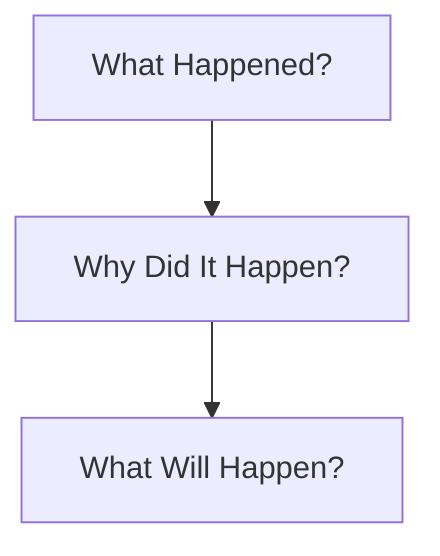
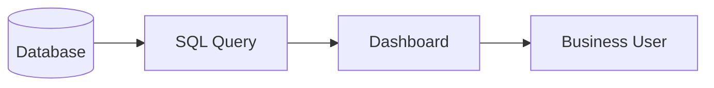

Perfect. Let's rebuild this chapter as a **textbook-quality notebook**.

---

# Chapter 1.5 — Reporting vs Analytics vs Machine Learning

## Part 1 — Understanding Reporting & Analytics

> **"Reporting tells you what happened. Analytics tells you why it happened. Machine Learning tells you what is likely to happen next."**

---

# 🎯 Learning Objectives

After completing this chapter, you will be able to:

* Clearly distinguish **Reporting**, **Analytics**, and **Machine Learning**.
* Understand why companies need all three.
* Learn the questions answered by each.
* Understand how businesses mature from reporting to AI.
* Build intuition using real-world examples.

---

# 🌍 Story — The CEO's Three Questions

Imagine you work as a **Data Analyst at Amazon**.

Every Monday morning, the CEO reviews the business performance.

He asks only **three simple questions**.

### Question 1

> **How many products were sold yesterday?**

The BI team immediately opens a dashboard.

```
Yesterday's Orders

48,932
```

Easy.

---

### Question 2

Now the CEO asks

> **Why did sales decrease yesterday?**

Silence.

The dashboard cannot answer this.

Someone has to investigate.

---

### Question 3

Finally, the CEO asks

> **How many products will we sell tomorrow?**

Now no amount of reporting or investigation alone is enough.

We need prediction.

This is where Machine Learning begins.

---

Notice something.

Although the CEO asked only **three questions**, each question belongs to a completely different discipline.

---

# 🏢 Business Intelligence Maturity

Every company grows through different stages.


### ASCII Version (Fallback)

```text
Reporting
     │
     ▼
Analytics
     │
     ▼
Machine Learning
     │
     ▼
AI Driven Decisions
```

Notice that each stage depends on the previous one.

A company **cannot jump directly to AI** without understanding its own data.

---

# The Three Fundamental Questions

Every business asks these three questions repeatedly.

| Business Question      | Discipline       |
| ---------------------- | ---------------- |
| What happened?         | Reporting        |
| Why did it happen?     | Analytics        |
| What will happen next? | Machine Learning |

This single table summarizes the entire chapter.

---

# 🧠 Mental Model

Imagine visiting a doctor.

---

## Reporting

The nurse measures

* Temperature
* Blood Pressure
* Weight

Report:

```
Temperature = 102°F
```

No explanation.

Only facts.

---

## Analytics

The doctor investigates.

Questions:

* Viral infection?
* Food poisoning?
* Allergy?
* COVID?
* Bacterial infection?

Now the doctor discovers **why** the patient has fever.

---

## Machine Learning

Now imagine an AI medical system says:

> Based on 5 million patient records,

there is an **85% probability**

the patient will develop pneumonia if untreated.

That is prediction.

---

# Evolution of Questions



### ASCII Version

```text
What Happened?
       │
       ▼
Why Did It Happen?
       │
       ▼
What Will Happen?
```

Simple.

Easy to remember.

---

# Part 1 — Reporting

---

# 📖 What is Reporting?

## Definition

> **Reporting is the process of presenting historical data in a structured and meaningful format.**

Reporting focuses only on

> **What happened?**

Nothing more.

---

# Think Like a Business

Suppose you own an online shopping website.

Every evening you receive this report.

| Metric        | Value   |
| ------------- | ------- |
| Orders        | 18,240  |
| Revenue       | ₹1.8 Cr |
| New Customers | 2,350   |
| Returns       | 510     |

This is reporting.

The report tells you **what happened**.

It does **not** tell you

* Why returns increased.
* Why revenue decreased.
* Why customers left.

---

# Reporting Workflow



### ASCII Version

```text
Database
    │
    ▼
SQL Query
    │
    ▼
Dashboard
    │
    ▼
Business User
```

---

# Real Reporting Example — Netflix

Suppose Netflix reports

| Metric          | Value             |
| --------------- | ----------------- |
| New Subscribers | 120,000           |
| Cancelled Users | 18,000            |
| Watch Time      | 7.2 Million Hours |

This is reporting.

No conclusions.

No investigation.

Only historical facts.

---

# Characteristics of Reporting

✅ Historical

✅ Descriptive

✅ Dashboard-based

✅ Scheduled

✅ Easy to understand

---

# Typical Reporting Tools

* Excel
* SQL
* Tableau
* Power BI
* Google Looker Studio

---

# Reporting in Everyday Life

Reporting isn't limited to businesses.

Examples:

* Your monthly electricity bill
* Your bank statement
* Your fitness watch daily steps
* Your mobile usage report

All of these answer one question:

> **What happened?**

---

# Limitations of Reporting

Suppose your report says

```
Revenue ↓ 18%
```

Can the report answer

* Why?

No.

Can it suggest a solution?

No.

Can it predict tomorrow's revenue?

No.

Reporting is only the first step.

---

# Part 2 — Analytics

---

# 📖 What is Analytics?

Reporting tells us

```
Sales ↓
```

Analytics asks

> **Why?**

---

## Definition

> **Analytics is the process of exploring, interpreting, and analyzing data to discover patterns, relationships, and insights that support decision-making.**

Notice the difference.

Reporting summarizes.

Analytics investigates.

---

# Detective Analogy

Imagine a crime scene.

Reporting says

```
A robbery happened.
```

Analytics asks

* Who did it?
* When?
* Why?
* How?
* What evidence exists?

Analytics is like detective work.

It searches for causes.

---

# Analytics Workflow


### ASCII Version

```text
Raw Data
    │
    ▼
Cleaning
    │
    ▼
Exploration
    │
    ▼
Analysis
    │
    ▼
Visualization
    │
    ▼
Insights
```

---

# Step-by-Step Understanding

### Step 1 — Raw Data

Millions of records arrive from

* Websites
* Mobile Apps
* Databases
* APIs
* Sensors

---

### Step 2 — Cleaning

Remove

* Missing values
* Duplicate rows
* Invalid entries
* Incorrect formats

---

### Step 3 — Exploration

Ask questions like

* How many missing values?
* Which city has maximum sales?
* Which product sells most?

---

### Step 4 — Analysis

Now discover relationships.

Example

```
Rain

↓

Food Orders Increase
```

or

```
Delivery Delay

↓

Customer Rating Falls
```

---

### Step 5 — Visualization

Humans understand graphs much faster than tables.

Analytics communicates findings using

* Bar Charts
* Line Charts
* Scatter Plots
* Heatmaps
* Histograms

---

### Step 6 — Insights

Now we finally answer

> Why did revenue decrease?

Example

```
Delivery Time ↑

↓

Order Cancellation ↑

↓

Revenue ↓
```

This is an insight.

---

# Example — Swiggy

Reporting says

```
Orders

↓

15%
```

Analytics discovers

```
Heavy Rain

↓

Delivery Time Increased

↓

Customers Cancelled Orders

↓

Revenue Fell
```

Reporting and Analytics use the **same data**, but they answer different questions.

---

# Example — Banking

Reporting

```
Loans Approved

12,580
```

Analytics discovers

```
Applicants

Age 25–35

Have Highest Repayment Rate
```

Now the bank has learned something valuable.

---

# Reporting vs Analytics

| Feature             | Reporting            | Analytics                  |
| ------------------- | -------------------- | -------------------------- |
| Main Question       | What happened?       | Why did it happen?         |
| Focus               | Historical facts     | Root cause analysis        |
| Output              | Reports & Dashboards | Insights & Recommendations |
| Complexity          | Low                  | Medium                     |
| Human Investigation | Minimal              | Extensive                  |

---

# 🧠 Key Takeaways (Part 1)

✅ Reporting summarizes historical information.

✅ Analytics investigates the causes behind the numbers.

✅ Reporting is descriptive.

✅ Analytics is investigative.

✅ Analytics transforms raw data into business insights.

---

# 📌 Chapter Progress

In **Part 1**, we covered:

* ✅ Story and intuition
* ✅ Business maturity
* ✅ Reporting
* ✅ Analytics
* ✅ Correct Mermaid diagrams with ASCII fallbacks
* ✅ Real-world examples
* ✅ Comparison between Reporting and Analytics

---

# 🚀 Coming in Part 2

We'll continue with:

* **What is Machine Learning?**
* Machine Learning workflow (fixed Mermaid)
* Reporting vs Analytics vs Machine Learning comparison
* Four Levels of Analytics
* Complete Business Pipeline
* Amazon, Netflix, Uber case studies
* Business roles
* Industry perspective
* Interview questions
* Cheat sheet
* Chapter summary

This will complete one of the most important chapters in the DAV notebook.

