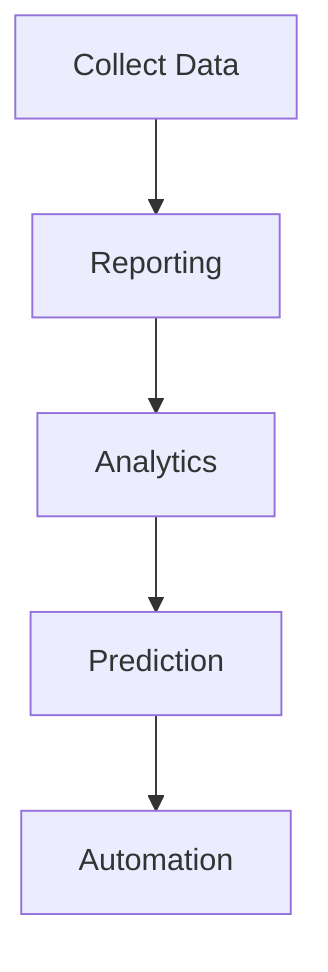

# Chapter 1.5 — Reporting vs Analytics vs Machine Learning

# Part 2 — Machine Learning, Business Pipeline & The Four Levels of Analytics

> **"Analytics discovers patterns. Machine Learning learns those patterns."**

---

# 📖 Part 3 — What is Machine Learning?

By now we understand:

* **Reporting** answers **What happened?**
* **Analytics** answers **Why did it happen?**

Now comes the next logical question.

> **What is likely to happen tomorrow?**

Humans can make guesses.

Machine Learning makes **data-driven predictions**.

---

# 🌍 Story — Amazon's Recommendation System

Imagine you bought

* Laptop
* Wireless Mouse

Last week.

Amazon now recommends

* Laptop Bag
* Keyboard
* USB Hub

How?

Did someone manually choose these products for millions of customers?

No.

Machine Learning learned patterns from millions of previous customers.

---

# 📖 Definition

> **Machine Learning is a branch of Artificial Intelligence that enables computers to learn patterns from historical data and make predictions or decisions without being explicitly programmed for every scenario.**

Unlike Reporting and Analytics,

Machine Learning focuses on

> **What is likely to happen next?**

---

# Traditional Programming vs Machine Learning

Before understanding ML,

let's compare it with traditional programming.

---

## Traditional Programming


### ASCII Version

```text
Rules
   │
   ▼
Computer
   │
   ▼
Output
```

Example

```python
if age >= 18:
    print("Eligible to Vote")
```

The programmer writes every rule.

---

## Machine Learning

Instead,

we provide

* Historical Data
* Correct Answers

The computer discovers the rules.


### ASCII Version

```text
Historical Data
        │
        ▼
Machine Learning
        │
        ▼
 Learned Model
        │
        ▼
 Prediction
```

This is one of the biggest shifts in computer science.

---

# Example — House Price Prediction

Suppose we have

| Area | Bedrooms | Price  |
| ---- | -------- | ------ |
| 800  | 2        | ₹40L   |
| 1200 | 3        | ₹65L   |
| 1600 | 3        | ₹80L   |
| 2200 | 4        | ₹1.2Cr |

Machine Learning studies these examples.

Now a new house arrives.

```
Area = 1500

Bedrooms = 3
```

Machine Learning predicts

```
Expected Price ≈ ₹78L
```

Notice

Nobody wrote

```python
if area == 1500:
    price = ...
```

The model learned the relationship.

---

# Machine Learning Workflow


### ASCII Version

```text
Historical Data
        │
        ▼
Cleaning
        │
        ▼
Feature Engineering
        │
        ▼
Model Training
        │
        ▼
Prediction
```

We'll study each stage in detail in the Supervised Learning notebook.

For DAV,

understand where Machine Learning fits.

---

# Example — Food Delivery

Reporting says

```
Today's Orders

82,000
```

Analytics discovers

```
Rain

↓

Orders Increase
```

Machine Learning predicts

```
Tomorrow

Expected Orders

≈ 97,500
```

Same business.

Three different jobs.

---

# Example — Banking

Reporting

```
Loans Approved

13,500
```

Analytics

```
People with

High Credit Score

Rarely Default
```

Machine Learning

```
Predict

Whether New Customer

Will Default
```

---

# Example — Netflix

Reporting

```
Most Watched Show

Stranger Things
```

Analytics

```
Users who watch

Sci-Fi

also watch

Space Documentaries
```

Machine Learning

```
Recommend

Next Movie
```

---

# Reporting → Analytics → Machine Learning

This is one of the most important diagrams of this chapter.


### ASCII Version

```text
Raw Data
    │
    ▼
Reporting
    │
    ▼
Analytics
    │
    ▼
Machine Learning
    │
    ▼
Business Decision
```

Notice

Each stage depends on the previous one.

Without good Reporting,

Analytics becomes difficult.

Without good Analytics,

Machine Learning becomes unreliable.

---

# Same Dataset — Three Perspectives

Suppose we have this data.

| Month    | Sales |
| -------- | ----- |
| January  | 120   |
| February | 145   |
| March    | 138   |
| April    | 110   |

---

## Reporting asks

> What were April sales?

Answer

```
110
```

---

## Analytics asks

Why did April decrease?

Possible reasons

* Marketing campaign stopped
* Weather
* Competition
* Inventory shortage

---

## Machine Learning asks

Based on history,

what will May sales be?

Example

```
Predicted Sales

≈135
```

---

# Business Maturity

Companies evolve gradually.



### ASCII Version

```text
Collect Data
      │
      ▼
Reporting
      │
      ▼
Analytics
      │
      ▼
Prediction
      │
      ▼
Automation
```

Notice

Automation is impossible

without prediction.

Prediction is impossible

without analytics.

Analytics is impossible

without data.

---

# The Four Levels of Analytics

Most universities teach only

Reporting

Analytics

Machine Learning

But industry uses another classification.

---

## Level 1 — Descriptive Analytics

Question

> What happened?

Examples

* Revenue
* Sales
* Orders

Reporting belongs here.

---

## Level 2 — Diagnostic Analytics

Question

> Why did it happen?

Examples

* Root Cause Analysis
* Customer Behaviour
* Product Analysis

Analytics belongs here.

---

## Level 3 — Predictive Analytics

Question

> What is likely to happen?

Examples

* Demand Forecasting
* Fraud Prediction
* House Price Prediction

Machine Learning belongs here.

---

## Level 4 — Prescriptive Analytics

Question

> What should we do?

Examples

* Increase Advertising
* Give Discount
* Launch Offer
* Increase Inventory

Modern AI systems increasingly assist with this level by recommending actions based on predictions and business constraints.

---

# Four Levels of Analytics


### ASCII Version

```text
Descriptive
      │
      ▼
Diagnostic
      │
      ▼
Predictive
      │
      ▼
Prescriptive
```

This diagram is extremely important for interviews.

---

# Complete Business Pipeline

Now let's combine everything we've learned.


### ASCII Version

```text
Business Problem
        │
        ▼
Collect Data
        │
        ▼
Reporting
        │
        ▼
Analytics
        │
        ▼
Machine Learning
        │
        ▼
Decision
        │
        ▼
Business Growth
```

This is one of the most important diagrams in the DAV notebook.

---

# Real Industry Example — Flipkart

Imagine it's the first day of the **Big Billion Days Sale**.

### Morning Dashboard

Reporting shows

```
Orders ↓ 12%
```

No explanation.

---

### Analytics Team

Investigates

Discovers

```
Payment Gateway

Failure

↓

Checkout Failed
```

Now everyone understands the problem.

---

### Machine Learning Team

Predicts

```
Tomorrow

Traffic

≈ 4 Million Users
```

Now infrastructure teams prepare additional servers.

---

### Business Decision

Management decides

* Increase servers
* Fix payment gateway
* Extend sale by one day

Business impact

```
Revenue Saved
```

---

# Which Team Performs Which Task?

| Team            | Primary Responsibility |
| --------------- | ---------------------- |
| BI Engineer     | Reporting              |
| Data Analyst    | Analytics              |
| Data Scientist  | Predictive Modeling    |
| ML Engineer     | Deploy ML Models       |
| Product Manager | Business Decisions     |

Notice

Everyone works on the **same data**.

But everyone answers different questions.

---

# 🧠 Thinking Like a Data Scientist

Suppose your CEO asks

> "Revenue dropped yesterday."

Should your first response be

> "Let's build an AI model."

No.

A good Data Scientist first asks

* Is the data correct?
* Is this seasonal?
* Did marketing change?
* Were there outages?
* Are there missing records?

Machine Learning should **never** be the first tool you reach for.

Understanding the business problem comes first.

---

# 📌 Key Takeaways (Part 2)

✅ Machine Learning predicts future outcomes using historical data.

✅ Reporting, Analytics, and Machine Learning answer different business questions.

✅ Businesses mature from Reporting → Analytics → Prediction → Automation.

✅ Industry often classifies analytics into Descriptive, Diagnostic, Predictive, and Prescriptive stages.

✅ Every successful AI system begins with understanding the business and the data—not by immediately training a model.

---

# 🚀 Coming in Part 3 (Final)

We'll complete this chapter with:

* Comprehensive comparison table
* Mental models
* Common beginner mistakes
* Industry insights
* FAANG interview questions
* Cheat sheet
* Chapter summary
* Scaler coverage checklist

At the end of Part 3, you'll have one of the strongest foundational chapters in the DAV notebook, and it will be fully compatible with Markdown renderers thanks to the simplified Mermaid diagrams.

