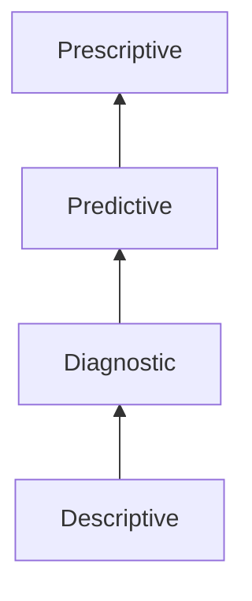
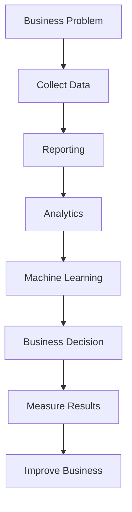
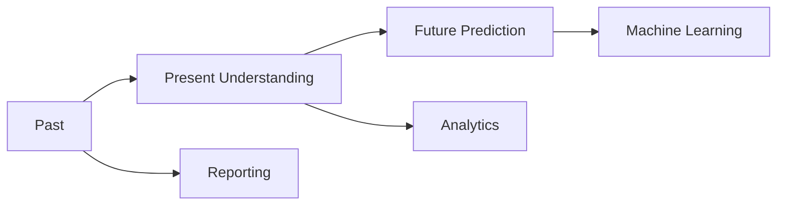

# Chapter 1.5 — Reporting vs Analytics vs Machine Learning

# Part 3 — Mental Models, Industry Perspective, Interview Preparation & Revision

> **"Great companies don't make decisions based on intuition. They make decisions based on data."**

---

# 📊 Complete Comparison

Let's compare everything we've learned so far.

| Feature                 | Reporting           | Analytics          | Machine Learning            |
| ----------------------- | ------------------- | ------------------ | --------------------------- |
| Main Question           | What happened?      | Why did it happen? | What will happen?           |
| Focus                   | Past                | Past + Present     | Future                      |
| Goal                    | Summarize           | Discover Insights  | Predict                     |
| Output                  | Reports, Dashboards | Business Insights  | Predictions                 |
| Human Investigation     | Very Low            | High               | Medium                      |
| Mathematical Complexity | Low                 | Medium             | High                        |
| Uses Statistics         | Basic               | Extensive          | Extensive                   |
| Uses AI Models          | ❌ No                | ❌ No               | ✅ Yes                       |
| Example                 | Yesterday's Sales   | Why Sales Dropped  | Tomorrow's Sales Prediction |

---

# 🧠 One Business Problem — Three Different Perspectives

Suppose you own an e-commerce company.

Sales suddenly decrease by **20%**.

How would different teams approach this?

---

## 📊 Reporting Team

Question:

> What happened?

Answer:

```text
Yesterday's Revenue

₹1.8 Cr

↓

Today's Revenue

₹1.44 Cr

↓

20% Decrease
```

Reporting ends here.

---

## 📈 Analytics Team

Question:

> Why did revenue decrease?

Investigation reveals:

```text
Payment Gateway Failure

↓

Checkout Failed

↓

Order Cancellation Increased

↓

Revenue Dropped
```

Analytics explains the reason.

---

## 🤖 Machine Learning Team

Question:

> What will happen tomorrow?

Machine Learning predicts:

```text
Expected Revenue Tomorrow

₹1.65 Cr
```

Now management can prepare.

---

# Visual Comparison


### ASCII Version

```text
Business Data
      │
      ▼
Reporting
      │
      ▼
Analytics
      │
      ▼
Machine Learning
      │
      ▼
Business Decision
```

---

# 🏢 Real Industry Examples

---

# Netflix

Imagine Netflix notices

```text
Subscribers ↓ 5%
```

### Reporting

Shows

* Total Subscribers
* Daily Watch Time
* Monthly Revenue

---

### Analytics

Discovers

```text
Users stop watching

after Episode 2
```

Why?

Episode pacing was poor.

---

### Machine Learning

Predicts

Which users are likely to

Cancel Subscription.

---

Business Decision

Offer

* Better Recommendations
* Personalized Homepage
* Email Reminders

---

# Amazon

Reporting

```text
Wireless Mouse Sales

↑ 18%
```

Analytics

discovers

Customers buying

Laptop

↓

often buy

Mouse

↓

within 3 days.

Machine Learning

Predicts

Who should receive

Mouse Recommendations.

---

# Uber

Reporting

```text
Average Wait Time

7 Minutes
```

Analytics

discovers

Rain

↓

Ride Requests

↑

150%

Machine Learning

Predicts

Expected Demand

Next Hour.

---

# Hospital

Reporting

```text
Patients Today

1,420
```

Analytics

discovers

Flu cases

increase

during winter.

Machine Learning

Predicts

Hospital Bed Occupancy

for next week.

---

# 🧠 Mental Model 1 — Looking Through Time

One of the easiest ways to remember the three concepts is to imagine standing in the **present**.

```text
           PAST             PRESENT             FUTURE
────────────┼──────────────────┼──────────────────────▶

 Reporting      Analytics        Machine Learning
```

* **Reporting** looks backward.
* **Analytics** explains what happened.
* **Machine Learning** looks forward.

---

# 🧠 Mental Model 2 — Driving a Car

Imagine driving.

```text
Rear View Mirror
        │
        ▼
   Reporting

Current Road
        │
        ▼
   Analytics

GPS Navigation
        │
        ▼
Machine Learning
```

### Explanation

Rear-view mirror

↓

Shows

where you've been.

Current Road

↓

Helps understand

current conditions.

GPS

↓

Predicts

best future route.

---

# 🧠 Mental Model 3 — Solving a Crime

Imagine a detective.

Reporting says

```text
A robbery occurred.
```

Analytics asks

* Who?
* Why?
* How?
* When?

Machine Learning predicts

```text
Based on previous crimes,

there is a high probability

another robbery

will occur

in this area.
```

---

# 📊 The Analytics Pyramid

Another way to understand business maturity.



### ASCII Version

```text
        Prescriptive
              ▲
        Predictive
              ▲
        Diagnostic
              ▲
        Descriptive
```

The higher we go,

the more intelligence is required.

---

# 📈 Business Value Increases


Generally,

business value increases as organizations mature.

However,

so do

* complexity
* cost
* infrastructure
* required expertise

---

# Industry Workflow

Let's combine everything we've learned so far.



### ASCII Version

```text
Business Problem
        │
        ▼
Collect Data
        │
        ▼
Reporting
        │
        ▼
Analytics
        │
        ▼
Machine Learning
        │
        ▼
Business Decision
        │
        ▼
Measure Results
        │
        ▼
Improve Business
```

Notice something important.

The process doesn't stop.

It forms a cycle.

Tomorrow,

new data is collected.

The cycle repeats.

---

# ⚠️ Common Beginner Mistakes

---

## ❌ Mistake 1

> Reporting and Analytics are the same.

Wrong.

Reporting summarizes.

Analytics investigates.

---

## ❌ Mistake 2

> Machine Learning replaces Analytics.

Wrong.

Machine Learning depends on good analytics.

Garbage data

↓

Garbage model.

---

## ❌ Mistake 3

> Every business needs AI.

Not true.

Many successful companies generate tremendous value using only

* SQL
* Excel
* Dashboards
* Analytics

AI should solve a real business problem—not be used for its own sake.

---

## ❌ Mistake 4

> More data automatically means better predictions.

Wrong.

Quality

>

Quantity

Poor-quality data often leads to poor predictions.

---

## ❌ Mistake 5

> A beautiful dashboard means good analytics.

No.

A dashboard can display incorrect conclusions if the underlying analysis is flawed.

---

# 🏢 Industry Insight

One of the biggest surprises for beginners is this:

> **Most companies spend far more time understanding data than building AI models.**

A common project lifecycle looks like:

| Activity                       | Approximate Effort |
| ------------------------------ | -----------------: |
| Understanding Business Problem |             10–15% |
| Data Collection & Cleaning     |             40–60% |
| Exploration & Analytics        |             20–30% |
| Model Building                 |             10–20% |
| Deployment & Monitoring        |            Ongoing |

The exact percentages vary by organization and project, but the key lesson is consistent:

> **Preparing and understanding data usually takes more effort than training the model.**

---

# 🎯 Interview Questions

## Basic

1. What is Reporting?

2. What is Analytics?

3. What is Machine Learning?

4. Difference between Reporting and Analytics?

5. Difference between Analytics and Machine Learning?

---

## Intermediate

6. Explain the complete business intelligence workflow.

7. Why is Analytics necessary before Machine Learning?

8. Explain Descriptive, Diagnostic, Predictive and Prescriptive Analytics.

9. Explain a real-world example using Amazon.

---

## Advanced (FAANG Style)

### Q1

Suppose a CEO says

> Revenue dropped by 25%.

Explain how

* Reporting
* Analytics
* Machine Learning

would contribute.

---

### Q2

Design the analytics pipeline for

Uber

or

Swiggy.

---

### Q3

Why do many companies fail when they directly jump into AI?

---

### Q4

Can Machine Learning work without Reporting?

Explain.

---

### Q5

How would you convince a company investing in AI to first improve its analytics capabilities?

---

# 📝 Chapter Summary

✅ Reporting answers

> **What happened?**

---

✅ Analytics answers

> **Why did it happen?**

---

✅ Machine Learning answers

> **What is likely to happen?**

---

✅ Businesses mature through

```text
Reporting

↓

Analytics

↓

Machine Learning

↓

AI Automation
```

---

✅ Reporting summarizes.

Analytics investigates.

Machine Learning predicts.

---

✅ Good Machine Learning is impossible without good Analytics.

---

# 📌 One-Page Revision

```text
REPORTING
──────────
Question:
What happened?

Output:
Reports
Dashboards
KPIs

Examples:
Sales
Revenue
Orders

==========================

ANALYTICS
──────────
Question:
Why did it happen?

Output:
Insights
Patterns
Root Cause

Examples:
Customer Behaviour
Marketing Analysis
Trend Analysis

==========================

MACHINE LEARNING
────────────────
Question:
What will happen?

Output:
Predictions

Examples:
House Price Prediction
Fraud Detection
Recommendation Systems
Demand Forecasting
```

---

# 📌 Cheat Sheet

| Stage                  | Question           | Output          | Example                                      |
| ---------------------- | ------------------ | --------------- | -------------------------------------------- |
| Reporting              | What happened?     | Reports         | Yesterday's Revenue                          |
| Analytics              | Why did it happen? | Insights        | Revenue fell because deliveries were delayed |
| Machine Learning       | What will happen?  | Predictions     | Tomorrow's revenue forecast                  |
| Prescriptive Analytics | What should we do? | Recommendations | Add delivery partners, launch offers         |

---

# 🎓 Final Mental Model (Remember Forever)



### ASCII Version

```text
Past                Present               Future
 │                     │                     │
 ▼                     ▼                     ▼
Reporting  ─────►  Analytics  ─────►  Machine Learning
```

If you remember **only this diagram**, you'll always be able to explain the difference in an interview.

---

# ✅ Scaler Coverage Check

### Covered from Scaler

* ✔ Reporting concepts
* ✔ Data exploration before ML
* ✔ Business decision-making workflow
* ✔ Motivation for predictive analytics
* ✔ Transition from analytics to machine learning

### Added Beyond Scaler

* ➕ Complete three-stage business intelligence framework
* ➕ Four Levels of Analytics (Descriptive, Diagnostic, Predictive, Prescriptive)
* ➕ Multiple industry case studies (Amazon, Netflix, Uber, Healthcare)
* ➕ Mermaid diagrams with ASCII fallbacks
* ➕ Business maturity model
* ➕ Mental models (Doctor, Car, Detective, Timeline)
* ➕ Industry project lifecycle
* ➕ FAANG-style interview questions
* ➕ One-page revision sheet
* ➕ Professional cheat sheet

---

# 🎯 End of Chapter 1.5

This chapter is now complete and forms one of the most important conceptual foundations of the DAV notebook.

---

## 📖 Next Chapter Preview — Chapter 1.6: Why NumPy Was Invented

This is where our journey into **NumPy** truly begins.

Rather than starting with `import numpy as np`, we'll answer the deeper engineering questions:

* Why wasn't Python's built-in `list` enough?
* What problems did scientists face before NumPy?
* Why is NumPy dramatically faster than Python lists?
* What does "homogeneous array" really mean?
* How does memory layout affect performance?
* Why do almost all scientific Python libraries depend on NumPy?

We'll build these ideas from first principles with memory diagrams, CPU intuition, and real benchmarks before writing a single line of NumPy code. This approach will make everything that follows—arrays, indexing, slicing, broadcasting, and linear algebra—much easier to understand.

