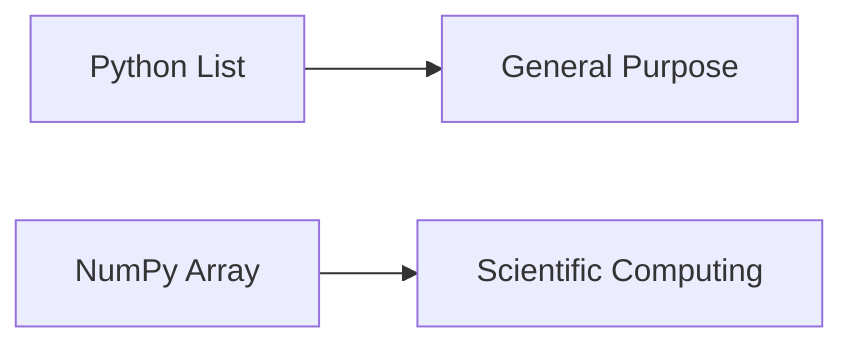
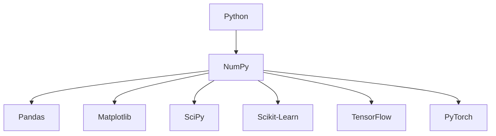

Excellent. This is where the **real technical journey** of the DAV notebook begins.

I also want to make a small improvement compared to our previous chapters.

---

# 📖 From this chapter onward, we are entering the "Core NumPy Module"

The previous chapters were **conceptual** (Business + Analytics + AI).

Now we are entering **Computer Science + Performance Engineering + NumPy**.

That means our notebook style will become even richer.

Every NumPy chapter will include:

* 💡 Story
* 🧠 Intuition
* 🏛 History
* ⚙️ Internal Working
* 🖥 Memory Diagrams
* 📦 CPU Perspective
* 🐍 Python Implementation
* ⚡ Performance Analysis
* 🏢 Industry Perspective
* 🎯 Interview Questions
* ⚠ Common Mistakes
* 📝 Cheat Sheet

Think of these chapters as **mini textbook chapters**, not course notes.

---

# Chapter 1.6 — Why NumPy Was Invented

> **"NumPy was not invented to make Python prettier. It was invented to make scientific computing practical."**

---

# 🎯 Learning Objectives

By the end of this chapter, you will understand:

* Why Python lists were not sufficient for scientific computing.
* Why NumPy was invented.
* The history of NumPy.
* The engineering problems NumPy solved.
* Why NumPy became the foundation of the scientific Python ecosystem.
* Why almost every ML library depends on NumPy.
* The difference between convenience and performance.

---

# 🌍 Story — NASA's Problem

Imagine it's the early 2000s.

You are a scientist at NASA.

You have collected data from a satellite.

The satellite sends

```text
Temperature
Pressure
Velocity
Position
Acceleration
```

every second.

After one week you now have

```text
100 Million Numbers
```

Now your manager says

> Calculate the average.

> Find the maximum.

> Multiply every value by 9.81.

> Compute matrix multiplication.

Python exists.

Python Lists exist.

Problem solved?

No.

---

# 🤔 The Challenge

Suppose we have

```python
numbers = [1,2,3,4,5]
```

Multiply every element by 2.

Python beginners usually write

```python
result = []

for x in numbers:
    result.append(x * 2)
```

Looks simple.

Now imagine

```text
5 Numbers
↓

5 Million Numbers
↓

500 Million Numbers
```

Now things become very slow.

---

# Why?

Let's understand.

---

# Python Was Never Designed for Scientific Computing

This is one of the biggest misconceptions.

Python was designed as

* General Purpose
* Easy to Learn
* Readable
* Flexible

Not

* High Performance
* Numerical Computing
* Matrix Algebra
* Scientific Simulation

---

# Think of Python Like This

Imagine buying a family car.

Can it travel?

Yes.

Can it carry groceries?

Yes.

Can it race in Formula 1?

No.

Python is like that family car.

Excellent for general programming.

Not optimized for heavy numerical computation.

---

# Scientific Computing Needs Different Requirements

Scientists need

```text
Millions of Numbers

↓

Matrix Multiplication

↓

Linear Algebra

↓

Statistics

↓

Signal Processing

↓

Image Processing

↓

Physics

↓

Machine Learning
```

Doing all this using Python Lists is inefficient.

---

# The Birth of NumPy

Scientists wanted

* Faster Arrays
* Less Memory
* Matrix Operations
* Better Mathematical Functions

Instead of changing Python,

they built a library.

That library became

# NumPy

---

# A Brief History

```text
1995
↓

Numeric Library

↓

Numarray

↓

2005

↓

NumPy

↓

Foundation of Scientific Python
```

NumPy unified earlier numerical libraries into a single, more efficient package and quickly became the standard for array computing in Python.

---

# The Big Idea

NumPy asked a simple question.

Instead of storing

```text
Python Objects

Python Objects

Python Objects

Python Objects
```

Why not store

```text
Raw Numbers
```

directly?

This single idea changed everything.

---

# Python List vs NumPy Array

Imagine

```python
numbers = [10,20,30,40]
```

Looks identical to

```python
arr = np.array([10,20,30,40])
```

But internally

they are completely different.

---

# High-Level View



### ASCII Version

```text
Python List             NumPy Array

General Purpose      Scientific Computing
```

---

# Why Scientists Loved NumPy

Because NumPy provided

✅ Fast Arrays

✅ Mathematical Functions

✅ Matrix Operations

✅ Statistics

✅ Broadcasting

✅ Linear Algebra

✅ Random Number Generation

All in one library.

---

# The NumPy Philosophy

NumPy follows one very important philosophy.

> **Store similar data together in contiguous memory and perform operations in optimized native code.**

Don't worry if this sounds difficult.

We'll understand every word over the next few chapters.

---

# Real-World Example

Imagine you own a warehouse.

---

## Python List

You randomly place boxes anywhere.

```text
Shelf A

📦

Shelf D

📦

Shelf B

📦

Shelf G

📦
```

Finding everything takes time.

---

## NumPy Array

Boxes are arranged neatly.

```text
📦 📦 📦 📦 📦 📦 📦 📦
```

Easy to access.

Easy to process.

Fast.

This is the intuition behind **contiguous memory**.

---

# Why Machine Learning Needed NumPy

Imagine training

Linear Regression.

The algorithm repeatedly performs

* Addition
* Multiplication
* Matrix Multiplication
* Dot Product
* Mean
* Standard Deviation

Millions of times.

Python Lists become a bottleneck.

NumPy makes these operations efficient.

---

# The Scientific Python Ecosystem

Almost every scientific library depends on NumPy.



### ASCII Version

```text
Python
   │
   ▼
 NumPy
 ├── Pandas
 ├── Matplotlib
 ├── SciPy
 ├── Scikit-Learn
 ├── TensorFlow
 └── PyTorch
```

Notice

NumPy sits at the center.

Remove NumPy,

and a large part of the scientific Python ecosystem is affected.

---

# Think Like an Engineer

Imagine you're building a house.

Would you build

* the walls,
* roof,
* windows,

without a foundation?

No.

NumPy is that foundation.

Every higher-level library builds upon it.

---

# Why Not Improve Python Lists Instead?

Good question.

Python Lists are designed to store

```python
[1, "Hello", 3.14, True, [5,6]]
```

Different types.

Different objects.

Maximum flexibility.

Scientists didn't want flexibility.

They wanted speed.

Those goals often conflict.

---

# Convenience vs Performance

| Python List         | NumPy Array          |
| ------------------- | -------------------- |
| Flexible            | Optimized            |
| Multiple Data Types | Single Data Type     |
| General Programming | Scientific Computing |
| Easy                | Fast                 |
| Dynamic             | Efficient            |

Neither is "better."

Each is designed for different purposes.

---

# 🧠 Mental Models

## Mental Model 1 — Toolbox

A Swiss Army Knife can do many things.

A professional drill does one thing extremely well.

Python List

↓

Swiss Army Knife

NumPy Array

↓

Professional Drill

---

## Mental Model 2 — Grocery Store

Python List

Different items together.

```text
Apple

Milk

Phone

Book

Laptop
```

NumPy Array

Only apples.

```text
🍎 🍎 🍎 🍎 🍎 🍎
```

Homogeneous data enables optimization.

---

## Mental Model 3 — Highway

Python List

```text
🚗      🚙

      🚕
🚚
```

Random traffic.

NumPy

```text
🚗🚗🚗🚗🚗🚗🚗
```

Organized lanes.

Better throughput.

---

# Industry Perspective

When working with

* Satellite data
* Medical imaging
* Financial time series
* Sensor streams
* Deep Learning
* Scientific simulations

you almost never operate on plain Python lists.

Arrays are the standard abstraction.

---

# ⚠️ Common Beginner Mistakes

### ❌ "NumPy is just another list."

No.

It is a completely different data structure with different design goals.

---

### ❌ "NumPy exists only for Machine Learning."

No.

It powers scientific computing across many domains.

---

### ❌ "Python Lists are bad."

Not at all.

Python Lists are excellent for general-purpose programming.

Use the right tool for the right problem.

---

# 🎯 Interview Questions

## Basic

1. Why was NumPy invented?
2. Why aren't Python lists enough for scientific computing?
3. What is the primary goal of NumPy?

---

## Intermediate

4. Why is NumPy the foundation of scientific Python?
5. Explain the design philosophy of NumPy.
6. Why do ML libraries depend on NumPy?

---

## Advanced

7. Why is storing homogeneous data beneficial?
8. Why didn't Python simply replace lists with NumPy arrays?
9. If Python lists are easier to use, why do data scientists still prefer NumPy?

---

# 📝 Chapter Summary

✅ Python was designed for general-purpose programming, not scientific computing.

✅ Scientific applications require efficient numerical operations on very large datasets.

✅ NumPy was created to provide fast, memory-efficient arrays and mathematical operations.

✅ NumPy became the foundation of the scientific Python ecosystem.

✅ Python Lists prioritize flexibility, while NumPy Arrays prioritize performance.

---

# 📌 Cheat Sheet

| Python List                | NumPy Array                    |
| -------------------------- | ------------------------------ |
| General-purpose            | Scientific computing           |
| Flexible                   | Optimized                      |
| Mixed data types           | Homogeneous data               |
| Good for application logic | Good for numerical computation |
| Dynamic structure          | Array-based structure          |

---

# ✅ Scaler Coverage Check

### Covered from Scaler

* ✔ Introduction to NumPy
* ✔ Motivation for NumPy
* ✔ NumPy as the foundation of scientific Python
* ✔ Relationship between Python and NumPy

### Added Beyond Scaler

* ➕ Historical background of NumPy
* ➕ Engineering motivation behind its creation
* ➕ Scientific computing perspective
* ➕ Multiple mental models (warehouse, toolbox, grocery store, highway)
* ➕ Scientific ecosystem diagram
* ➕ Convenience vs. performance comparison
* ➕ Industry perspective
* ➕ Interview preparation
* ➕ Structured revision and cheat sheet

---

## 📖 Preview of Chapter 1.7 — Why Python Lists Are Slow (One of the Most Important Chapters)

The chapter we've completed answers **why NumPy was invented**.

The next chapter answers the much deeper question:

> **Why are Python Lists slow?**

We'll go beyond "NumPy is faster" and explore the internals:

* 🧠 How Python stores objects in memory
* 📦 What actually lives inside a Python list
* 🔗 Pointers and references (visualized)
* 🧮 Contiguous vs. non-contiguous memory
* ⚡ CPU cache locality and why it matters
* 🐢 Why Python loops are slower
* 🚀 Why vectorized NumPy operations are dramatically faster
* 📊 Benchmarks and memory diagrams
* 🔬 Internal implementation intuition without overwhelming low-level details

This will be one of the most important chapters in the entire DAV notebook because understanding it will make **every future NumPy concept**—arrays, slicing, broadcasting, vectorization, and even deep learning tensors—feel natural rather than magical.

