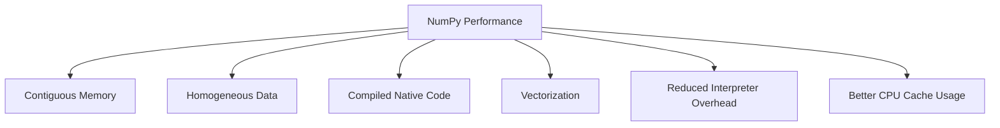
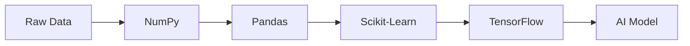

Perfect. I actually think this is the point where our notebook will become **significantly better than Scaler, MIT OCW notes, or most NumPy books**.

This chapter is the **Computer Science foundation of Machine Learning**.

Almost every ML engineer uses NumPy every day.

Very few know **why it is fast**.

If we understand this chapter deeply, then later topics like

* Pandas
* TensorFlow
* PyTorch
* JAX
* OpenCV
* CuPy
* CUDA
* Vectorization
* Broadcasting

will all become much easier.

---

# 📚 Master Chapter 1.7 — Why Python Lists Are Slow

Instead of a single chapter, we'll build a complete mini-book.

```
Chapter 1.7
│
├── 1.7.1 The Biggest Misconception
├── 1.7.2 How Python Stores Objects
├── 1.7.3 What Actually Happens During One Addition?
├── 1.7.4 Contiguous vs Non-Contiguous Memory
├── 1.7.5 CPU Cache & Cache Locality
├── 1.7.6 Interpreter Overhead
├── 1.7.7 Vectorization
└── 1.7.8 Putting Everything Together
```

Each section will naturally build on the previous one.

---

# Chapter 1.7.1 — The Biggest Misconception

> **"NumPy is not fast because it is written in C. It is fast because of multiple engineering decisions working together."**

---

# 🎯 Learning Objectives

After this chapter, you will understand

* Why most explanations about NumPy are incomplete.
* The real reasons behind NumPy's performance.
* Why Python Lists and NumPy Arrays were designed for different goals.
* The roadmap of concepts we'll study in this master chapter.

---

# 🌍 Story — Two Delivery Companies

Imagine two courier companies.

Both have to deliver **10 million packages**.

---

## Company A

Every driver works independently.

Each package is stored at a different warehouse.

Drivers constantly travel

Warehouse → Package → Road → Warehouse → Next Package.

Lots of travel.

Lots of overhead.

---

## Company B

All packages are already arranged

in one giant warehouse

in perfect order.

Drivers simply move forward.

Package

↓

Package

↓

Package

↓

Package

Very little wasted movement.

---

Both companies deliver packages.

But one is dramatically faster.

Python Lists and NumPy Arrays work in a very similar way.

---

# 🤔 The Common Explanation

Open almost any tutorial.

You'll read

> **"NumPy is faster because it is written in C."**

This statement is

✔️ partially true

❌ but incomplete.

If C alone were the answer,

then every C library would automatically be as fast as NumPy.

That isn't true.

There is much more happening.

---

# The Real Answer

NumPy is fast because of **multiple engineering decisions**.

Not one.

We'll study all of them.



### ASCII Version

```text
             NumPy Performance
                    │
 ┌──────────┬────────────┬────────────┐
 │          │            │            │
 ▼          ▼            ▼            ▼
Contiguous Homogeneous  Native      Vectorization
 Memory      Data        Code
                    │
                    ▼
         Reduced Python Overhead
                    │
                    ▼
            Better CPU Cache
```

Every box contributes to the final performance.

---

# 🏗 Building a House Analogy

Imagine someone asks

> Why is this skyscraper so strong?

Would you answer

> Because it has cement.

No.

A skyscraper stands because of

* Cement
* Steel
* Foundation
* Engineering
* Design
* Soil Testing
* Construction Quality

Similarly,

NumPy is fast because many design decisions work together.

---

# The Six Pillars of NumPy Performance

Throughout this master chapter, we'll study these six pillars.

---

## Pillar 1 — Homogeneous Data

Instead of storing

```python
[10, "Hello", 3.14, True]
```

NumPy stores

```python
[10, 20, 30, 40]
```

All elements have the same data type.

Why does that matter?

We'll learn in Chapter **1.7.2**.

---

## Pillar 2 — Contiguous Memory

Instead of scattered memory

```
📦

        📦

               📦

    📦
```

NumPy stores

```
📦📦📦📦📦📦📦📦
```

Why does this matter?

Because CPUs love sequential memory.

We'll prove this later.

---

## Pillar 3 — Compiled Native Code

Instead of executing

millions of Python instructions,

NumPy calls optimized native routines.

But this alone doesn't explain everything.

We'll see why.

---

## Pillar 4 — Reduced Interpreter Overhead

Python executes every loop

one element at a time.

NumPy avoids repeatedly entering the Python interpreter for every arithmetic operation.

---

## Pillar 5 — Vectorization

Instead of

```python
for x in numbers:
```

NumPy performs operations on many elements as a single array operation.

This dramatically reduces overhead and enables optimized execution.

---

## Pillar 6 — CPU Cache Locality

This is one of the least understood topics.

Modern CPUs are incredibly fast.

RAM is comparatively slow.

Contiguous memory allows CPUs to use their cache much more efficiently.

We'll dedicate an entire chapter to this concept.

---

# Why Python Lists Exist Then?

Excellent question.

If NumPy is so fast,

why doesn't Python simply replace Lists?

Because Lists solve a different problem.

Python Lists were designed for

* Flexibility
* Dynamic Programming
* General-purpose software

Not scientific computing.

---

# Different Design Goals

| Python List         | NumPy Array               |
| ------------------- | ------------------------- |
| Flexible            | Optimized                 |
| General Programming | Scientific Computing      |
| Mixed Types         | Single Type               |
| Dynamic Structure   | Fixed-Type Array          |
| Easy to Modify      | Fast Numerical Operations |

This is not a competition.

They solve different problems.

---

# 🧠 Mental Model — Swiss Army Knife vs Professional Tool

Imagine you own

A Swiss Army Knife.

It has

* Knife
* Spoon
* Screwdriver
* Scissors

Very flexible.

Now imagine

A professional electric drill.

It does only one job.

But it does that job extremely well.

Python List

↓

Swiss Army Knife

NumPy Array

↓

Professional Drill

---

# Another Mental Model — Office Workers

Imagine calculating salaries for

10 million employees.

---

### Python Approach

Each employee walks

individually

to HR.

HR calculates salary.

Next employee.

Repeat.

---

### NumPy Approach

Everyone is processed

using a highly optimized payroll system

designed specifically for bulk calculations.

The work is organized and streamlined.

---

# Why This Matters for Machine Learning

Think about Linear Regression.

Gradient Descent performs operations like

```text
Addition

Subtraction

Multiplication

Division

Matrix Multiplication
```

not once,

but **millions or even billions of times**.

If every operation carried unnecessary overhead,

training would become impractical.

Efficient numerical computation is therefore essential.

---

# Real AI Pipeline



Notice

Everything begins with efficient numerical computation.

That is why NumPy is the foundation.

---

# ⚠️ Common Misconceptions

---

## ❌ "NumPy is fast because C is fast."

Only partially true.

C contributes,

but memory layout,

vectorization,

cache behavior,

and reduced interpreter overhead are equally important.

---

## ❌ "Python Lists are bad."

No.

Lists are excellent.

They're simply optimized for different use cases.

---

## ❌ "NumPy is only useful for Machine Learning."

No.

It is widely used in

* Physics
* Astronomy
* Robotics
* Finance
* Signal Processing
* Image Processing
* Bioinformatics
* Scientific Research

---

# 🎯 Interview Questions

### Basic

1. Why is NumPy faster than Python Lists?

2. Is "NumPy is written in C" a complete explanation?

3. What are the main design goals of Python Lists?

---

### Intermediate

4. Explain the six pillars of NumPy performance.

5. Why wasn't Python List replaced by NumPy Array?

6. What role does contiguous memory play?

---

### Advanced

7. Explain why NumPy is foundational to modern AI frameworks.

8. If you had to design a numerical computing library today, what design choices would you prioritize?

---

# 📝 Chapter Summary

✅ NumPy's speed is the result of **multiple engineering decisions**, not a single optimization.

✅ Python Lists prioritize flexibility and general-purpose programming.

✅ NumPy prioritizes numerical performance and scientific computing.

✅ We identified six major factors behind NumPy's performance:

1. Homogeneous Data
2. Contiguous Memory
3. Compiled Native Code
4. Reduced Interpreter Overhead
5. Vectorization
6. CPU Cache Locality

These six ideas form the roadmap for the remaining sections of this master chapter.

---

# 📌 Cheat Sheet

| Concept      | Key Idea                                              |
| ------------ | ----------------------------------------------------- |
| Python List  | Flexible, general-purpose container                   |
| NumPy Array  | Optimized numerical array                             |
| Biggest Myth | "NumPy is fast only because of C"                     |
| Reality      | Performance comes from multiple engineering decisions |
| Next Step    | Understand how Python actually stores objects         |

---

# ✅ Scaler Coverage Check

### Covered from Scaler

* ✔ Motivation for NumPy performance
* ✔ Why Python Lists are insufficient for heavy numerical workloads

### Added Beyond Scaler

* ➕ Six-pillar performance model
* ➕ Multiple engineering mental models
* ➕ Business and AI motivation
* ➕ Design philosophy comparison
* ➕ Interview-focused reasoning
* ➕ Roadmap for the entire master chapter

---

# 🚀 Next: Chapter 1.7.2 — How Python Stores Objects

This is where we move from intuition to internals.

We'll answer questions that most Python users never ask:

* What exactly is a **Python object**?
* What is the difference between a **value**, an **object**, and a **reference**?
* Why doesn't a Python list store integers directly?
* What are pointers (explained without assuming C knowledge)?
* How does Python's memory model make lists flexible but slower for numerical computation?

We'll use **large memory diagrams**, **RAM visualizations**, and **step-by-step object layouts** to build an intuition that will make the rest of NumPy feel almost obvious. This is one of the most important conceptual chapters in the entire notebook.

