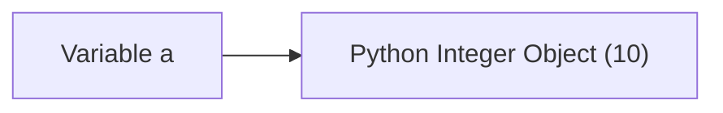
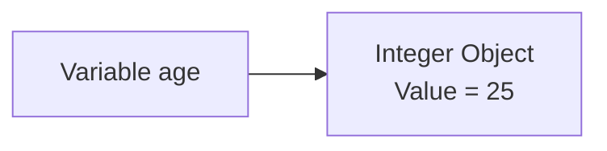
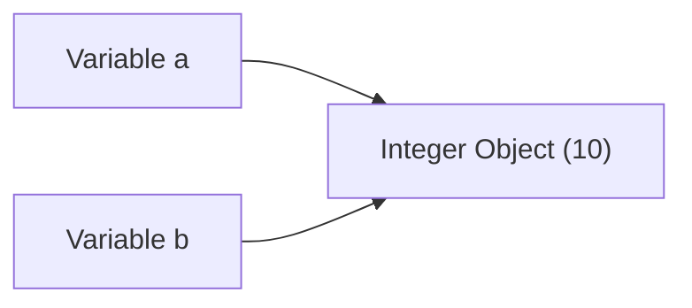
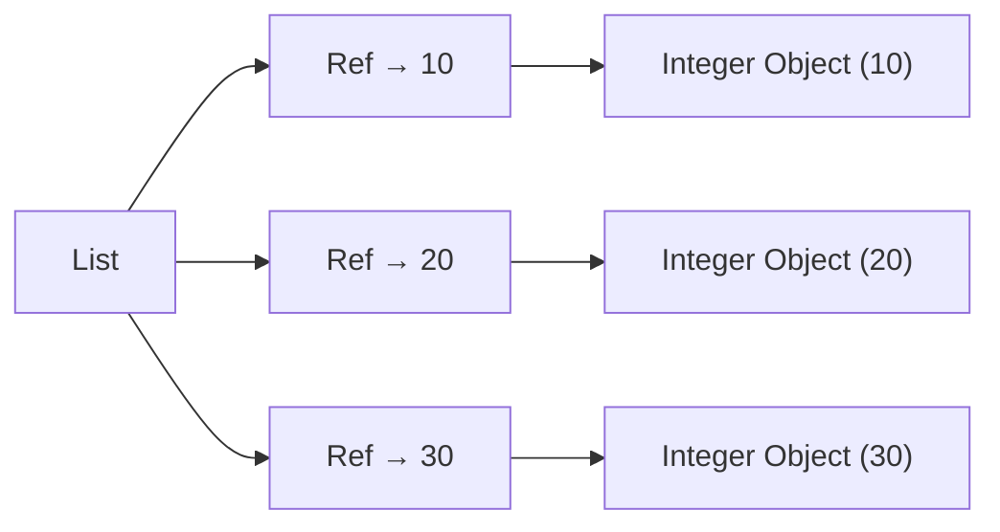

Excellent. This is one of those chapters that separates someone who **uses Python** from someone who **understands Python**.

I want to make one promise before we begin.

> **After this chapter, you will never again think of a Python list as "just an array."**

You'll understand what actually lives inside memory.

This chapter will also make future topics like:

* NumPy Arrays
* Pandas
* PyTorch Tensors
* Broadcasting
* Vectorization
* Copy vs View
* Slicing
* Memory Optimization

feel much more intuitive.

---

# 📖 Chapter 1.7.2 — How Python Stores Objects

> **"A Python List does not store integers. It stores references to Python objects."**

This single sentence explains almost everything about Python's flexibility and why NumPy was designed differently.

---

# 🎯 Learning Objectives

By the end of this chapter, you will understand:

* What a Python Object really is.
* Difference between Value, Object, Variable and Reference.
* Why Python stores references instead of raw values.
* What actually lives inside a Python List.
* How memory is organized.
* Why this design makes Python flexible.
* Why the same design makes numerical computation slower.

---

# 🌍 Story — The Apartment Analogy

Imagine a huge apartment complex.

Each apartment has

* Apartment Number
* Resident
* Furniture
* Electricity
* Water

Now suppose someone asks

> Where does Rahul live?

Do you carry Rahul everywhere?

No.

You simply say

```text
Apartment 305
```

Apartment **305** is the **address**.

Rahul is the **object**.

The address is only a **reference**.

Python memory works in a very similar way.

---

# 🤔 Before Understanding Lists, We Must Understand Objects

Most beginners think

```python
a = 10
```

means

> Variable `a` contains number 10.

That is **not exactly true**.

Python internally thinks differently.

---

# Python's Mental Model

Instead of

```text
a

↓

10
```

Python internally creates



### ASCII Version

```text
Variable a
     │
     ▼
+-------------------+
| Integer Object    |
| Value = 10        |
+-------------------+
```

Notice something.

The variable does **not** contain the integer.

It contains a **reference** to an object.

This distinction is extremely important.

---

# 🧠 Four Important Terms

Before going further,

let's define four terms.

---

## 1. Value

The actual information.

Example

```text
10

25

3.14

"Hello"
```

These are values.

---

## 2. Object

A Python object is a container that stores

* Value
* Type Information
* Reference Count
* Other internal metadata

Conceptually:

```text
+----------------------+
| Python Object        |
|----------------------|
| Type : int           |
| Value: 10            |
| Metadata             |
+----------------------+
```

> 💡 **Note:** The exact internal structure depends on Python's implementation (CPython, PyPy, etc.). Here we're building the conceptual model used by CPython, which is the most common implementation.

---

## 3. Variable

A variable is simply a **name**.

Example

```python
age = 25
```

`age`

is only a label.

---

## 4. Reference

A reference tells Python

where the object lives in memory.

Think

```text
Apartment Number

↓

305
```

instead of carrying Rahul everywhere.

---

# 🏗 Putting Everything Together

Example

```python
age = 25
```

Python roughly performs these steps:

1. Create an Integer Object.
2. Store value `25` inside it.
3. Store metadata.
4. Let variable `age` point to that object.

Visualization:



ASCII

```text
age
 │
 ▼
+------------------+
| Integer Object   |
| Value = 25       |
+------------------+
```

---

# Why Does Python Do This?

Excellent question.

Why not simply store

```text
25
```

directly?

Because Python wants **everything** to behave uniformly.

Whether it's

* Integer
* String
* List
* Function
* Dictionary
* Class

Everything is treated as an object.

This gives Python enormous flexibility.

---

# Everything Is an Object

In Python,

all of these are objects.

```python
10

3.14

"Hello"

[1,2,3]

{"name":"Rahul"}

True

print
```

Even functions are objects.

Even classes are objects.

This is one reason Python feels so expressive.

---

# What Happens with Two Variables?

Example

```python
a = 10

b = a
```

Many beginners imagine

```text
a → 10

b → 10
```

Actually,

both variables refer to the **same object**.



ASCII

```text
a ─────┐
        │
        ▼
+------------------+
| Integer Object   |
| Value = 10       |
+------------------+
        ▲
        │
b ──────┘
```

One object.

Two references.

---

# Now Let's Talk About Lists

Finally,

we're ready.

Suppose we create

```python
numbers = [10,20,30]
```

What do beginners imagine?

Usually this.

```text
+----+----+----+
|10  |20  |30  |
+----+----+----+
```

This is **not** how Python Lists work.

---

# Actual Conceptual Model

A Python list stores **references**, not raw integers.



ASCII Version

```text
Python List

+------+-------+-------+
| Ref  | Ref   | Ref   |
+------+-------+-------+
   │       │       │
   ▼       ▼       ▼

+------+ +------+ +------+
| 10   | | 20   | | 30   |
+------+ +------+ +------+
```

Notice something.

The list itself

does **not** contain

10

20

30

It contains references.

---

# Why Store References?

Because Python Lists can contain

```python
[
    10,
    "Hello",
    3.14,
    True,
    [1,2],
    {"x":1}
]
```

How can one container store all these different things?

Because every element is simply a reference to an object.

---

# Mixed Data Types

Visualization

```text
Python List

+-----+-----+-----+-----+------+
| Ref | Ref | Ref | Ref | Ref  |
+-----+-----+-----+-----+------+
   │     │     │     │      │
   ▼     ▼     ▼     ▼      ▼

 Integer  String Float Bool  List
 Object   Object Object Obj  Object
```

This is one of Python's greatest strengths.

And, as we'll soon see, one of the reasons numerical operations are slower than specialized array libraries.

---

# Advantages of This Design

✅ Can store any Python object.

✅ Extremely flexible.

✅ Easy to program.

✅ Dynamic typing.

✅ Powerful language features.

---

# Disadvantages for Numerical Computing

Imagine adding

```text
10 Million Numbers
```

For every element,

Python must first follow the reference to find the actual object before operating on its value.

That additional level of indirection introduces overhead.

We'll explore the performance implications in later sections.

---

# 🧠 Mental Models

## Mental Model 1 — Library Books

A library catalogue doesn't contain the books.

It contains

```text
Shelf Number
```

The shelf contains the actual book.

Variable

↓

Shelf Number

↓

Book

---

## Mental Model 2 — Contact List

Your phone stores

```text
Rahul

↓

Phone Number
```

Not Rahul himself.

Variables store references,

not objects.

---

## Mental Model 3 — Google Maps

Instead of carrying a house,

Google Maps gives

an address.

The address leads to the house.

Reference

↓

Object.

---

# ⚠️ Common Beginner Mistakes

---

## ❌ Variables store values.

Not exactly.

Variables store references to objects.

---

## ❌ Lists store integers.

Python Lists store references to objects.

---

## ❌ Every variable owns its object.

Many variables can refer to the same object.

---

## ❌ References are the same as C pointers.

Conceptually they both refer to objects in memory, but Python abstracts away pointer arithmetic and manual memory management. It's more accurate to think of a Python reference as a safe, high-level reference rather than a raw C pointer.

---

# 🎯 Interview Questions

### Basic

1. What is a Python object?
2. What is a reference?
3. Do Python variables store values directly?

### Intermediate

4. Why do Python Lists store references?
5. Explain the relationship between variables and objects.
6. Why can Python Lists store mixed data types?

### Advanced

7. Explain the internal conceptual structure of a Python List.
8. How does Python's object model contribute to flexibility?
9. Why is this design less suitable for heavy numerical computation?

---

# 📝 Chapter Summary

✅ Everything in Python is an object.

✅ Variables are names that refer to objects.

✅ Python Lists store references to objects, not raw values.

✅ This reference-based design allows Python Lists to store mixed data types.

✅ The same flexibility introduces extra overhead during numerical computation.

---

# 📌 Cheat Sheet

| Concept     | Meaning                                              |
| ----------- | ---------------------------------------------------- |
| Value       | Actual data (10, 3.14, "Hello")                      |
| Object      | Container holding value, type, and metadata          |
| Variable    | Name referring to an object                          |
| Reference   | Connection from a variable or container to an object |
| Python List | Stores references to objects                         |

---

# ✅ Scaler Coverage Check

### Covered from Scaler

* ✔ Conceptual foundation needed before understanding NumPy arrays

### Added Beyond Scaler

* ➕ Python object model
* ➕ Variables vs Objects vs References
* ➕ Memory visualizations
* ➕ Internal conceptual layout of Python Lists
* ➕ Why mixed data types are possible
* ➕ Mental models (Apartment, Library, Contact List, Maps)
* ➕ Interview preparation
* ➕ Common misconceptions and revision material

---

# 🚀 Preview of Chapter 1.7.3 — What Actually Happens During One Addition?

So far, we've learned **what a Python List stores**.

In the next chapter, we'll follow a **single addition operation** step by step.

When Python executes:

```python
x + 1
```

we'll trace every conceptual stage:

```text
Python Interpreter
        │
        ▼
Read Reference
        │
        ▼
Find Object
        │
        ▼
Check Type
        │
        ▼
Perform Addition
        │
        ▼
Create New Object
        │
        ▼
Return Reference
```

By the end of that chapter, you'll understand why performing millions of such operations in a Python loop is fundamentally different from how NumPy executes array operations. That understanding is the bridge to contiguous memory, cache locality, and vectorization.

