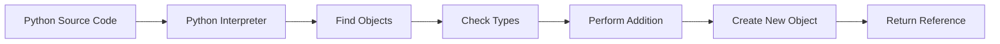
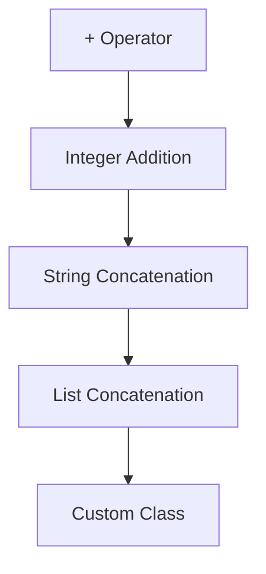
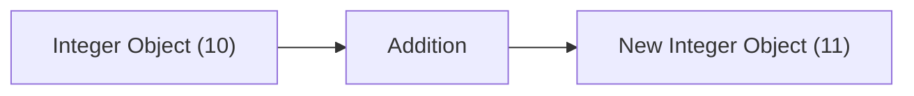
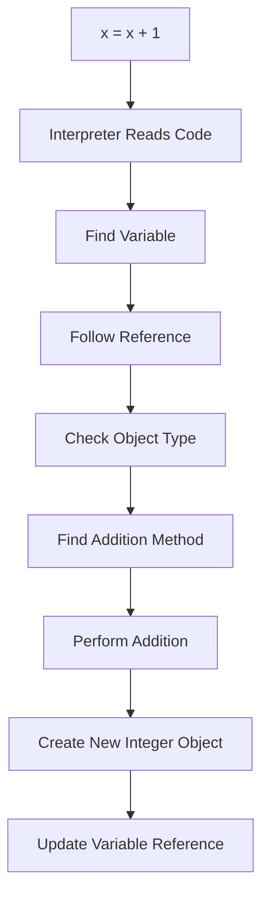

Excellent. This chapter is where we stop thinking like a Python programmer and start thinking like a **CPython runtime engineer**.

In my opinion, this is one of the most important chapters in the entire DAV notebook.

Most people know this code:

```python
x = x + 1
```

Almost nobody knows what actually happens.

The answer is **much more complicated** than simply "add one."

After this chapter, you'll understand why Python loops are slower and why NumPy vectorization is so powerful.

---

# Chapter 1.7.3 — What Actually Happens During One Addition?

> **"Adding two numbers in Python is not a CPU instruction. It is a sequence of object manipulations."**

---

# 🎯 Learning Objectives

After this chapter, you will understand:

* What really happens when Python executes `x + 1`
* Why Python arithmetic is slower than native machine arithmetic
* The role of the Python Interpreter
* Type checking
* Object creation
* Why integers are immutable
* Why Python loops become expensive
* Why NumPy avoids much of this overhead

---

# 🌍 Story — Two Cashiers

Imagine two supermarkets.

---

## Supermarket A

For every customer the cashier:

* Checks ID
* Checks membership
* Scans products
* Calculates tax
* Prints receipt
* Packs bags

Every single time.

---

## Supermarket B

The customer buys exactly one bottle of water.

The cashier already knows

* Product
* Price
* Tax

One scan.

Done.

Which supermarket serves customers faster?

Obviously,

Supermarket B.

Python behaves more like **Supermarket A**.

NumPy behaves more like **Supermarket B**.

---

# 🤔 The Code Looks Simple

```python
x = 10

x = x + 1
```

Most beginners imagine

```text
10

↓

11
```

Finished.

No.

Python performs many internal steps.

---

# High-Level Execution Flow



### ASCII Version

```text
Python Code
      │
      ▼
Interpreter
      │
      ▼
Find Objects
      │
      ▼
Type Check
      │
      ▼
Addition
      │
      ▼
Create New Object
      │
      ▼
Return Reference
```

---

# Step 1 — The Interpreter Reads the Code

Suppose Python sees

```python
x = x + 1
```

The interpreter first parses the statement.

Conceptually,

it understands

```text
Assignment

↓

Addition

↓

Store Result
```

Nothing has been added yet.

---

# Step 2 — Find the Variable

The interpreter asks

> Where is variable `x`?

Suppose

```python
x = 10
```

Memory looks like

```text
Variable x
     │
     ▼
+------------------+
| Integer Object   |
| Value = 10       |
+------------------+
```

The interpreter follows the reference.

---

# Step 3 — Find the Integer Object

Python now reaches

```text
+------------------+
| Integer Object   |
| Value = 10       |
| Type = int       |
+------------------+
```

Notice

Python still hasn't added anything.

It first needs to understand

what kind of object this is.

---

# Step 4 — Type Checking

Python asks

```text
What is x?
```

Answer

```text
Integer
```

Why?

Because Python allows

```python
x = 10

x = "Hello"

x = [1,2,3]
```

The interpreter cannot assume the type.

It must check.

Every operation.

---

# Dynamic Typing

This flexibility is called

**Dynamic Typing**.

Variables don't have fixed types.

Objects do.

```text
Variable

↓

Reference

↓

Object

↓

Type
```

---

# Why Type Checking Matters

Imagine

```python
x = 10
```

Addition means

```python
10 + 1
```

Now imagine

```python
x = "Hello"
```

Addition now means

```python
"Hello" + "World"
```

Completely different operation.

The interpreter must decide which operation is correct.

---

# Step 5 — Find the "+" Operation

Python now looks for

the correct implementation of

```python
+
```

For integers,

it performs integer addition.

For strings,

it performs concatenation.

For lists,

it performs list concatenation.

The same symbol

has different meanings.

---

# Operator Dispatch



### ASCII Version

```text
          +
          │
 ┌────────┼─────────┐
 │        │         │
 ▼        ▼         ▼
Int    String     List
```

This flexibility requires extra work.

---

# Step 6 — Perform Addition

Finally,

Python performs

```text
10 + 1
```

Result

```text
11
```

But something surprising happens next.

---

# Step 7 — Python Creates a New Object

Many beginners think

```text
10

↓

11
```

Actually

Python integers are **immutable**.

That means

they cannot be modified after creation.

Instead,

Python creates

an entirely new Integer Object.



### ASCII Version

```text
Old Object

+----------------+
| Value = 10     |
+----------------+

        +

       1

        │

        ▼

New Object

+----------------+
| Value = 11     |
+----------------+
```

The original object still exists (subject to Python's memory management and reference counting).

---

# Why Create a New Object?

Because integers are immutable.

Example

```python
a = 10

b = a

a = a + 1
```

If Python modified

the existing object,

then

```python
b
```

would unexpectedly become

11.

That would be incorrect.

Instead

Python creates

a new object.

---

# Memory Before

```text
a ─────┐
        │
        ▼
+---------------+
| Integer 10    |
+---------------+
        ▲
        │
b ──────┘
```

---

# Memory After

```text
b
 │
 ▼
+---------------+
| Integer 10    |
+---------------+

a
 │
 ▼
+---------------+
| Integer 11    |
+---------------+
```

Notice

Only

`a`

changes.

---

# Step 8 — Variable is Updated

Finally

Python changes

the reference.

```text
Old

a

↓

10
```

becomes

```text
New

a

↓

11
```

---

# Complete Execution Pipeline



### ASCII Version

```text
Code
 │
 ▼
Interpreter
 │
 ▼
Find Variable
 │
 ▼
Find Object
 │
 ▼
Check Type
 │
 ▼
Addition
 │
 ▼
Create New Object
 │
 ▼
Update Reference
```

This happens conceptually for every addition in ordinary Python code.

---

# Why Is This Expensive?

Imagine doing this

once.

No problem.

Now imagine

```python
for i in range(100000000):
    x += 1
```

Now Python performs

millions of

* Variable lookups
* Reference traversals
* Type checks
* Operator dispatches
* Object creations
* Reference updates

Even though each step is optimized, repeating them millions of times adds significant overhead.

---

# NumPy's Approach

Instead of repeating this process

for every element,

NumPy performs operations on arrays using optimized native code.

Conceptually,

```text
Python

Element

↓

Element

↓

Element

↓

Element
```

versus

```text
NumPy

Whole Array

↓

Optimized Native Loop

↓

Result
```

We'll understand exactly how this works in the Vectorization chapter.

---

# 🧠 Mental Model — Office Approval

Python

Every employee

needs approval

individually.

```text
Employee

↓

Verification

↓

Approval

↓

Processing
```

NumPy

Process everyone together

using one optimized workflow.

---

# Mental Model — Restaurant

Python

Every customer orders separately.

Chef cooks

one meal

at a time.

NumPy

Large catering order.

Chef prepares

hundreds of meals

using an optimized process.

---

# ⚠️ Common Beginner Mistakes

---

## ❌ Addition changes the existing integer.

No.

Python integers are immutable.

A new object is created.

---

## ❌ Variables contain numbers.

Variables reference objects.

---

## ❌ Python knows the type without checking.

Python is dynamically typed.

The interpreter determines the appropriate operation based on the object's type.

---

## ❌ The `+` operator always means integer addition.

It can also mean

* String concatenation
* List concatenation
* User-defined behavior via special methods

---

# 🎯 Interview Questions

### Basic

1. What happens internally when Python executes `x + 1`?

2. Why are Python integers immutable?

3. Why does Python create a new object?

---

### Intermediate

4. Explain dynamic typing.

5. Explain operator dispatch.

6. Why is repeated Python arithmetic slower than array operations?

---

### Advanced

7. Explain the complete conceptual execution pipeline for one addition operation.

8. How does immutability contribute to Python's object model?

9. Which steps in this pipeline are reduced or eliminated when using NumPy vectorized operations?

---

# 📝 Chapter Summary

✅ Python first locates the object referenced by the variable.

✅ It checks the object's type.

✅ It selects the correct implementation of the `+` operator.

✅ It performs the computation.

✅ Because integers are immutable, Python creates a new integer object.

✅ Finally, the variable is updated to reference the new object.

---

# 📌 Cheat Sheet

| Step | What Happens                      |
| ---- | --------------------------------- |
| 1    | Read Python code                  |
| 2    | Find variable                     |
| 3    | Follow reference to object        |
| 4    | Check object type                 |
| 5    | Resolve the correct `+` operation |
| 6    | Perform computation               |
| 7    | Create new immutable object       |
| 8    | Update variable reference         |

---

# ✅ Scaler Coverage Check

### Covered from Scaler

* ✔ Foundations required to understand why NumPy avoids Python-level arithmetic overhead

### Added Beyond Scaler

* ➕ Complete conceptual execution pipeline
* ➕ Dynamic typing explanation
* ➕ Operator dispatch
* ➕ Immutability and object creation
* ➕ Memory before/after diagrams
* ➕ Mental models (Supermarket, Office, Restaurant)
* ➕ Interview-focused discussion
* ➕ Step-by-step execution walkthrough

---

# 🚀 Preview of Chapter 1.7.4 — Contiguous vs Non-Contiguous Memory

Everything we've learned so far leads to one fundamental question:

> **Where are these objects actually stored in RAM?**

In the next chapter, we'll explore:

* 🧠 What "contiguous memory" really means
* 🏠 How RAM is organized (without needing hardware knowledge)
* 📦 Why Python lists point to objects scattered across memory
* 🚀 Why NumPy stores data in continuous blocks
* ⚡ Why contiguous memory is friendly to CPU caches
* 🎯 How this single design decision contributes to NumPy's performance

This chapter is the turning point where we'll connect Python's object model to modern computer architecture, building the intuition needed for cache locality and vectorization.

