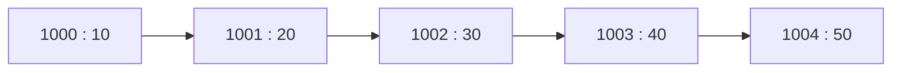
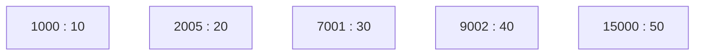
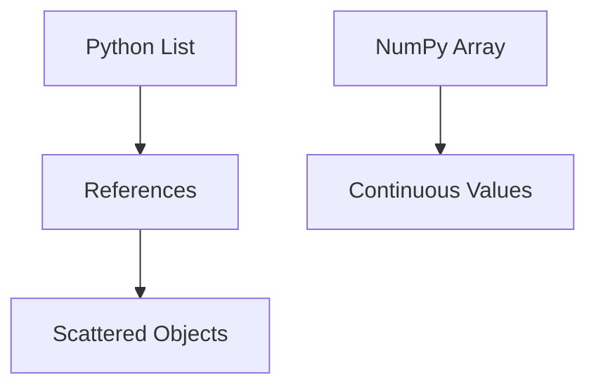

Excellent.

This chapter is **the turning point** of the entire NumPy module.

If the previous chapter explained **how Python stores objects**, this chapter explains **why that storage strategy affects performance**.

In my opinion, this is **the first true Computer Architecture chapter** in our DAV notebook.

After this chapter, you'll understand concepts that are usually taught separately in:

* Computer Organization
* Operating Systems
* High Performance Computing (HPC)
* NumPy
* Deep Learning
* CUDA Programming

We'll build all of that from first principles.

---

# Chapter 1.7.4 — Contiguous vs Non-Contiguous Memory

> **"Modern CPUs are incredibly fast. The real bottleneck is often memory."**

---

# 🎯 Learning Objectives

After completing this chapter, you will understand:

* What contiguous memory actually means.
* What non-contiguous memory means.
* How RAM is organized conceptually.
* Why Python Lists lead to scattered memory access.
* Why NumPy Arrays store data differently.
* How memory layout affects program performance.
* Why contiguous memory is the foundation of scientific computing.

---

# 🌍 Story — Finding Books in a Library

Imagine you visit a huge library.

You need to read **100 books**.

There are two possibilities.

---

## Library A

All books are placed together.

```text
Shelf

📘 📘 📘 📘 📘 📘 📘 📘 📘 📘
```

You simply walk along the shelf.

Very efficient.

---

## Library B

Books are scattered everywhere.

```text
Floor 1 → 📘

Floor 5 → 📘

Floor 2 → 📘

Floor 9 → 📘

Floor 3 → 📘
```

Now every book requires walking to a completely different location.

Same books.

Much more time.

---

Memory works exactly the same way.

---

# 🤔 Before We Begin...

Most beginners think RAM looks like this.

```text
RAM

██████████████████
```

Not quite.

A better mental model is:

```text
Address

1000

1001

1002

1003

1004

1005

1006

1007

...
```

RAM is conceptually a very long sequence of memory locations.

Each location has an address.

---

# Memory as Apartments

Imagine RAM is a huge apartment building.

```text
Address

1000

1001

1002

1003

1004

1005

1006

1007
```

Each apartment can store information.

When a program runs,

Python requests apartments from the Operating System.

---

# What Does "Contiguous" Mean?

The word

**Contiguous**

simply means

> **stored next to each other without gaps.**

Example

```text
Address

1000 → 10

1001 → 20

1002 → 30

1003 → 40

1004 → 50
```

Everything is together.

---

# Mermaid Visualization



---

### ASCII Version

```text
1000   1001   1002   1003   1004

+----+ +----+ +----+ +----+ +----+
|10  | |20  | |30  | |40  | |50  |
+----+ +----+ +----+ +----+ +----+
```

Everything lives together.

---

# What is Non-Contiguous Memory?

Now imagine

```text
Address

1000 → 10

2005 → 20

7001 → 30

9002 → 40

15000 → 50
```

Notice

The values exist,

but they are scattered.

---

Mermaid



---

ASCII

```text
1000       2005       7001      9002      15000

+----+     +----+     +----+    +----+    +----+
|10  |     |20  |     |30  |    |40  |    |50  |
+----+     +----+     +----+    +----+    +----+
```

Much farther apart.

---

# Why Does This Matter?

Suppose we need to add

all five numbers.

Contiguous Memory

```text
CPU

↓

10

↓

20

↓

30

↓

40

↓

50
```

Simple.

---

Non-Contiguous

```text
CPU

↓

10

↓

Jump

↓

20

↓

Jump

↓

30

↓

Jump

↓

40

↓

Jump

↓

50
```

The CPU constantly changes location.

This repeated memory traversal reduces efficiency.

---

# Python List Memory

Remember the previous chapter?

Python List stores

references.

Not integers.

Conceptually,

```python
numbers = [10,20,30]
```

looks like

```text
Python List

+------+-------+-------+
| Ref  | Ref   | Ref   |
+------+-------+-------+
   │       │       │
   ▼       ▼       ▼

1000    9005    5001
```

Now the objects

live somewhere else.

```text
Address

1000 → Integer Object

5001 → Integer Object

9005 → Integer Object
```

They are not necessarily adjacent.

---

# Complete Conceptual View

```text
Python List

+------+-------+-------+
| Ref  | Ref   | Ref   |
+------+-------+-------+
   │       │       │
   ▼       ▼       ▼

Address 1000

+-------------+
| Integer 10  |
+-------------+

Address 9005

+-------------+
| Integer 20  |
+-------------+

Address 5001

+-------------+
| Integer 30  |
+-------------+
```

The list itself is contiguous.

The objects it references may not be.

This distinction is extremely important.

---

# NumPy Array Memory

Now compare

```python
arr = np.array([10,20,30])
```

Conceptually

```text
Address

1000 → 10

1001 → 20

1002 → 30
```

Visualization

```text
Memory

+----+----+----+
|10  |20  |30  |
+----+----+----+
```

No references.

Just values.

One continuous block.

---

# Mermaid Comparison



---

# ASCII Comparison

```text
Python List

Reference
   │
   ├────────► Object

Reference
   │
   ├────────► Object

Reference
   │
   └────────► Object


NumPy Array

+----+----+----+----+
|10  |20  |30  |40  |
+----+----+----+----+
```

---

# Think Like a Delivery Driver

Python List

```text
House A

↓

House Z

↓

House C

↓

House M
```

Lots of driving.

---

NumPy

```text
House A

↓

House B

↓

House C

↓

House D
```

Everything is nearby.

---

# Warehouse Analogy

Python

Packages

```text
Shelf A

Shelf G

Shelf C

Shelf L

Shelf Z
```

NumPy

```text
Shelf A

Shelf B

Shelf C

Shelf D
```

The worker simply walks in one direction.

---

# Why Scientists Prefer Contiguous Memory

Imagine multiplying

10 million numbers.

Python List

Every multiplication requires

finding the object

before reading the value.

NumPy

The CPU reads

one value after another

in a predictable sequence.

This makes large numerical operations far more efficient.

---

# Why Not Make Everything Contiguous?

Excellent question.

Suppose Python allowed

```python
[
    10,
    "Hello",
    3.14,
    True
]
```

How large should each element be?

* Integer?
* Float?
* String?
* List?

Each object has a different internal representation.

A single contiguous block of raw values only works naturally when all elements share a common data type and representation.

That's why NumPy arrays are homogeneous.

---

# Mental Model — Train vs Taxi

Python List

```text
🚕      🚕

     🚕

🚕

       🚕
```

Independent taxis.

---

NumPy

```text
🚆══════════════════════🚆
```

One train.

Everything connected.

---

# Mental Model — Students

Python

Students are

randomly sitting

throughout the campus.

Teacher takes attendance.

Long walk.

NumPy

Students are

already sitting

in one classroom.

Attendance is quick.

---

# Advantages of Contiguous Memory

✅ Faster traversal

✅ Better locality

✅ Easier mathematical operations

✅ Efficient numerical processing

✅ Predictable memory access

---

# Limitations

Contiguous memory also has trade-offs.

For example:

* All elements must have the same data type.
* Very large contiguous blocks may be harder to allocate if memory is fragmented.
* Resizing can require allocating a new block and copying data.

These trade-offs are acceptable for most scientific computing workloads because performance benefits outweigh the costs.

---

# ⚠ Common Beginner Mistakes

### ❌ Contiguous means sorted.

No.

It only means

stored together.

---

### ❌ Python Lists are always slow.

Not true.

For many everyday programming tasks,

Python Lists are perfectly appropriate.

The performance differences become significant for large-scale numerical computation.

---

### ❌ NumPy stores references just like Lists.

A NumPy array stores the array data in a contiguous block of memory (for standard numeric dtypes). The array object itself still contains metadata such as shape, strides, and dtype.

---

# Industry Perspective

Scientific computing libraries

like

* NumPy
* TensorFlow
* PyTorch
* OpenCV

are designed around

efficient contiguous (or predictably strided) memory layouts whenever possible.

This design enables

* Matrix multiplication
* Deep Learning
* Image Processing
* Scientific Simulation

to run efficiently.

---

# 🎯 Interview Questions

### Basic

1. What is contiguous memory?

2. What is non-contiguous memory?

3. Why does NumPy use contiguous memory?

---

### Intermediate

4. Explain why Python Lists don't store raw integers.

5. Why does contiguous memory improve sequential processing?

6. Why are NumPy arrays homogeneous?

---

### Advanced

7. Explain the conceptual memory layout of Python Lists versus NumPy Arrays.

8. What are the trade-offs between flexibility and contiguous storage?

9. Why is contiguous memory a good foundation for numerical computing?

---

# 📝 Chapter Summary

✅ RAM can be viewed conceptually as a sequence of memory addresses.

✅ Contiguous memory means values are stored next to one another.

✅ Python Lists store references to objects, and those objects may be scattered in memory.

✅ NumPy Arrays store homogeneous numerical data in contiguous memory blocks.

✅ Contiguous storage improves the efficiency of sequential numerical processing.

---

# 📌 Cheat Sheet

| Python List              | NumPy Array                                    |
| ------------------------ | ---------------------------------------------- |
| Stores references        | Stores homogeneous values in contiguous memory |
| Objects may be scattered | Values are adjacent in memory                  |
| Flexible                 | Optimized                                      |
| Mixed data types         | Single data type                               |
| General programming      | Scientific computing                           |

---

# ✅ Scaler Coverage Check

### Covered from Scaler

* ✔ Motivation for contiguous arrays
* ✔ NumPy memory organization at a conceptual level

### Added Beyond Scaler

* ➕ RAM conceptual model
* ➕ Memory address intuition
* ➕ Library, warehouse, delivery, train, and classroom analogies
* ➕ Python List vs NumPy memory layouts
* ➕ Trade-offs of contiguous storage
* ➕ Industry perspective and interview preparation

---

# 🎯 Before We Move to Chapter 1.7.5 — CPU Cache & Cache Locality

I want to make one important improvement to our notebook.

So far, we've explained **contiguous memory** from the perspective of RAM.

The natural next question is:

> **Why does the CPU care whether memory is contiguous or scattered?**

To answer that properly, we first need a **small but essential foundation** on how a modern computer accesses memory.

So instead of jumping directly into cache locality, I recommend introducing a short bridging section:

### **Chapter 1.7.4A — How the CPU Reads Memory**

We'll cover:

* Why CPUs are much faster than RAM
* Registers vs Cache vs RAM
* Why waiting for memory is expensive
* A simple "chef and pantry" analogy
* How sequential memory access benefits the CPU

Then, **Chapter 1.7.5 — CPU Cache & Cache Locality** will feel completely natural rather than seeming like an isolated hardware topic.

This small addition will make the notebook flow much more logically and will give you a stronger intuition for why contiguous memory is such a powerful design choice.

