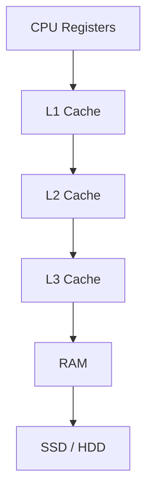
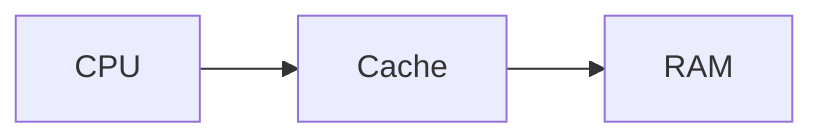

Excellent. I actually think this is a **better pedagogical sequence** than what most universities teach.

One thing I've learned while creating your **Supervised Learning** notebook is:

> **Never introduce a concept unless the student has all the prerequisites.**

Right now we have taught:

* ✅ Python Objects
* ✅ References
* ✅ Contiguous Memory

The next topic in most courses is **CPU Cache**.

But there is a hidden assumption:

> **How does a CPU actually obtain data from memory?**

Most books skip this.

I don't want to.

Instead, let's build one more foundation.

---

# 📚 Chapter 1.7.4A — How the CPU Reads Memory

> **"The CPU is incredibly fast. The real challenge is feeding it data quickly enough."**

---

# 🎯 Learning Objectives

By the end of this chapter, you will understand:

* Why CPUs don't directly work with RAM all the time.
* Why memory access is often slower than computation.
* What Registers, Cache, and RAM are (conceptually).
* Why modern computers have multiple memory levels.
* Why memory hierarchy exists.
* Why this is essential for understanding NumPy performance.

---

# 🌍 Story — The Master Chef

Imagine a famous chef.

The chef prepares meals in seconds.

But there is a problem.

The ingredients are stored

100 meters away

inside a warehouse.

Every time the chef needs

one tomato,

he has to

walk

100 meters

pick it up

come back

cook.

Ridiculous.

The chef spends more time walking

than cooking.

---

So the restaurant introduces

a small table

beside the chef.

Frequently used ingredients are kept there.

Now cooking becomes much faster.

---

Modern computers work exactly like this.

---

# The Computer Problem

Imagine

the CPU can perform

billions of calculations

every second.

But

RAM

is much slower.

If the CPU waited for RAM every time,

most of the processor would sit idle.

---

# The Memory Hierarchy

Computers solve this problem using multiple levels of memory.



---

### ASCII Version

```text
FASTEST

Registers
    │
    ▼
L1 Cache
    │
    ▼
L2 Cache
    │
    ▼
L3 Cache
    │
    ▼
RAM
    │
    ▼
SSD / HDD

SLOWEST
```

Notice

As we move downward

* Capacity increases
* Speed decreases

---

# Think of It Like an Office

Imagine an accountant.

---

## On the Desk

Calculator

Notebook

Pen

These are immediately available.

Equivalent to

```text
Registers
```

---

## Office Drawer

Frequently used files.

Equivalent to

```text
Cache
```

---

## Filing Cabinet

Old files.

Equivalent to

```text
RAM
```

---

## Warehouse

Archived documents.

Equivalent to

```text
Disk
```

---

The farther the data,

the longer it takes to retrieve.

---

# What Are Registers?

Registers are tiny storage locations

inside the CPU itself.

Conceptually,

they are like

the chef's hands.

```text
CPU

+---------+
|Register |
+---------+
```

Very small.

Extremely fast.

The CPU performs calculations using values already loaded into registers.

---

# What Is Cache?

Cache is a small,

very fast memory

located close to the CPU.

Its job is simple:

> Store data that the CPU is likely to need again soon.

Think of it as the chef's preparation table.

---

# What Is RAM?

RAM stores

the program's data.

It is much larger than cache,

but slower.

Imagine

an enormous warehouse.

---

# Memory Hierarchy Table

| Memory    | Approximate Size | Relative Speed | Purpose                |
| --------- | ---------------- | -------------- | ---------------------- |
| Registers | Very Tiny        | Fastest        | Immediate calculations |
| L1 Cache  | Tiny             | Extremely Fast | Frequently used data   |
| L2 Cache  | Small            | Very Fast      | Recently used data     |
| L3 Cache  | Larger           | Fast           | Shared working data    |
| RAM       | Much Larger      | Slower         | Active programs        |
| SSD / HDD | Very Large       | Slowest        | Permanent storage      |

> **Note:** Sizes vary by CPU architecture. The important idea is the **relative hierarchy**, not the exact numbers.

---

# Why Doesn't the CPU Use RAM Directly?

Imagine reading

10 million numbers.

Without cache

```text
CPU

↓

RAM

↓

CPU

↓

RAM

↓

CPU

↓

RAM
```

Millions of trips.

Very expensive.

Instead

```text
CPU

↓

Cache

↓

Cache

↓

Cache

↓

RAM (Occasionally)
```

Much fewer long trips.

---

# Visual Flow



---

ASCII

```text
CPU

↓

Cache

↓

RAM
```

Simple.

Elegant.

---

# Reading One Number

Suppose the CPU needs

```text
25
```

The CPU first checks

```text
Registers
```

Found?

Great.

Done.

---

Not found?

Check

```text
L1 Cache
```

Still not found?

Check

```text
L2
```

Then

```text
L3
```

Finally

```text
RAM
```

Only if necessary.

---

# Everyday Analogy

Imagine searching for your passport.

Where do you look first?

Desk.

Not there?

Drawer.

Not there?

Cupboard.

Not there?

Storage room.

Not there?

Bank locker.

Humans naturally use

memory hierarchy.

Computers do too.

---

# Why This Matters for NumPy

Suppose

NumPy stores

```text
10

20

30

40

50
```

together.

The CPU loads

10

into cache.

Guess what?

20

30

40

are right beside it.

Often, they arrive together because modern CPUs fetch blocks of nearby memory (called **cache lines**) rather than one value at a time.

This is why contiguous memory is so beneficial.

We'll study **cache lines** and **cache locality** in the next chapter.

---

# Why Python Lists Struggle

Python List

```text
10

↓

Address 500

20

↓

Address 9000

30

↓

Address 300
```

The CPU can't efficiently benefit from nearby data because the referenced objects may be scattered throughout memory.

That is exactly what **Cache Locality** means.

---

# Mental Model — Kitchen

Registers

↓

Chef's Hands

Cache

↓

Kitchen Table

RAM

↓

Pantry

SSD

↓

Warehouse

The farther away

the ingredients,

the slower cooking becomes.

---

# Mental Model — Backpack

During exams

Students keep

* Pens
* Calculator
* Formula Sheet

inside the backpack.

They don't run home

after every question.

Cache serves a similar purpose.

---

# ⚠ Common Beginner Mistakes

### ❌ Cache and RAM are the same.

No.

Cache is much smaller

and much faster.

---

### ❌ CPU works directly on RAM.

The CPU performs calculations using registers and relies heavily on caches to avoid frequent RAM accesses.

---

### ❌ Faster CPU automatically means faster programs.

Not always.

If the CPU constantly waits for memory,

overall performance suffers.

---

# 🎯 Interview Questions

### Basic

1. Why do computers have cache?

2. Difference between RAM and Cache?

3. What are registers?

---

### Intermediate

4. Explain memory hierarchy.

5. Why doesn't the CPU always access RAM directly?

6. Why is cache faster than RAM conceptually?

---

### Advanced

7. Why is memory hierarchy necessary for modern processors?

8. Explain how memory hierarchy benefits scientific computing.

9. How might contiguous memory improve cache utilization?

---

# 📝 Chapter Summary

✅ CPUs are much faster than RAM.

✅ Modern computers use a hierarchy of memory to reduce waiting.

✅ Registers are the fastest storage.

✅ Cache stores frequently used data close to the CPU.

✅ RAM stores active program data.

✅ Efficient memory access is just as important as fast computation.

---

# 📌 Cheat Sheet

| Memory Level | Purpose                | Relative Speed |
| ------------ | ---------------------- | -------------- |
| Registers    | Immediate calculations | Fastest        |
| L1 Cache     | Frequently used data   | Extremely Fast |
| L2 Cache     | Larger cache           | Very Fast      |
| L3 Cache     | Shared cache           | Fast           |
| RAM          | Program memory         | Slower         |
| SSD/HDD      | Permanent storage      | Slowest        |

---

# ✅ Scaler Coverage Check

### Covered from Scaler

* ✔ Foundation required before understanding NumPy's memory efficiency.

### Added Beyond Scaler

* ➕ Complete memory hierarchy.
* ➕ Registers, Cache, RAM explained intuitively.
* ➕ Chef, Office, Passport, and Backpack analogies.
* ➕ CPU–Cache–RAM workflow.
* ➕ Why memory access can dominate performance.
* ➕ Bridge to cache locality.

---

# 🚀 Next: Chapter 1.7.5 — CPU Cache & Cache Locality

This is where everything we've learned finally comes together.

We'll answer questions like:

* 🧠 What exactly is a **cache line**?
* 📦 Why does the CPU fetch multiple values at once?
* ⚡ What is **cache locality**?
* 🔄 What are **cache hits** and **cache misses**?
* 🚀 Why does contiguous memory make NumPy dramatically faster?
* 📊 We'll trace a CPU reading a Python List versus a NumPy Array, step by step, to see why one requires many memory fetches while the other streams efficiently through memory.

This chapter is widely considered one of the key concepts in high-performance computing, and understanding it will make NumPy's performance feel completely logical rather than mysterious.

