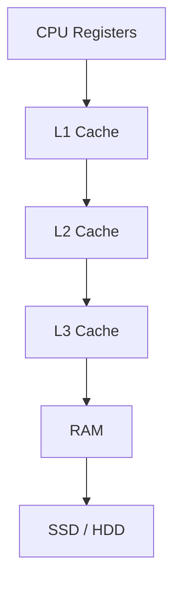
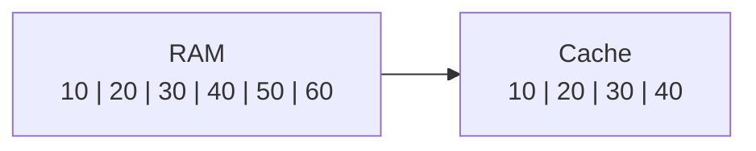
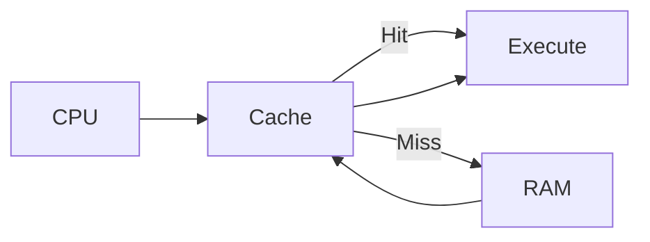
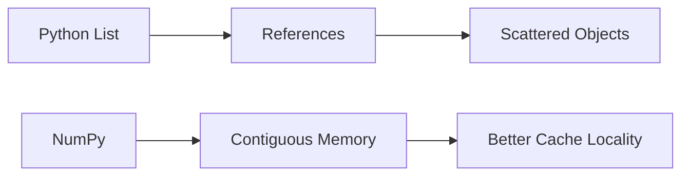

Excellent.

This chapter is one of the **most important Computer Science concepts** you'll ever learn.

In fact, if you understand this chapter deeply, you'll simultaneously understand why:

* NumPy is fast
* Pandas is fast
* TensorFlow is fast
* PyTorch is fast
* C is fast
* Matrix multiplication is fast
* GPUs prefer contiguous memory
* CPUs execute scientific programs efficiently

This topic belongs not only to **Machine Learning**, but also to

* Computer Architecture
* Operating Systems
* High Performance Computing (HPC)
* Compiler Design
* Database Systems

We'll explain it without assuming any prior hardware knowledge.

---

# 📖 Chapter 1.7.5 — CPU Cache & Cache Locality

> **"Modern CPUs are so fast that they often spend more time waiting for data than actually computing."**

---

# 🎯 Learning Objectives

After completing this chapter, you will understand:

* What is CPU Cache?
* Why Cache exists.
* What is a Cache Line?
* Cache Hit vs Cache Miss.
* Temporal Locality.
* Spatial Locality.
* Cache Locality.
* Why NumPy benefits enormously from contiguous memory.
* Why Python Lists suffer from poor cache locality.

---

# 🌍 Story — The Librarian

Imagine you are reading a textbook.

You ask the librarian,

> "Please give me Page 51."

The librarian thinks:

> "If you need Page 51,
> you'll probably need Page 52, 53, 54 too."

Instead of giving one page,

the librarian hands you the **entire chapter**.

Why?

Because humans usually read sequentially.

Modern CPUs think exactly the same way.

---

# The CPU Has a Problem

Suppose the CPU wants one number.

```text
25
```

Should it travel all the way to RAM

every single time?

That would be extremely inefficient.

Instead,

it copies a **small block of nearby memory**
into Cache.

---

# Memory Hierarchy Review



---

ASCII

```text
Registers
     │
     ▼
L1 Cache
     │
     ▼
L2 Cache
     │
     ▼
L3 Cache
     │
     ▼
RAM
     │
     ▼
Disk
```

As we move downward

* Memory becomes larger
* Memory becomes slower

---

# 🤔 What Is Cache?

Think of Cache as

> **A very small, extremely fast memory located close to the CPU that stores recently and nearby accessed data.**

Its purpose is simple:

> Reduce expensive trips to RAM.

---

# Chef Analogy Revisited

Chef

↓

Needs salt

If salt is

on the table

```text
Cooking

↓

Immediate
```

If salt is

inside the warehouse

```text
Walk

↓

Search

↓

Return

↓

Cook
```

CPU Cache is

the chef's table.

---

# What Is a Cache Line?

This is the concept almost every beginner misses.

Many people think

CPU loads

one number.

Wrong.

Suppose memory contains

```text
Address

1000 → 10

1001 → 20

1002 → 30

1003 → 40

1004 → 50

1005 → 60

1006 → 70

1007 → 80
```

When CPU requests

```text
10
```

It often loads a **block of adjacent memory** (a cache line), not just the single value.

Conceptually:

```text
10

20

30

40
```

arrive together.

---

# Why?

Because CPUs assume

> If you're reading

10,

you'll probably read

20,

30,

40

next.

This assumption is correct surprisingly often.

---

# Cache Line Visualization



---

ASCII

```text
RAM

+----+----+----+----+----+----+
|10  |20  |30  |40  |50  |60  |
+----+----+----+----+----+----+

             │

             ▼

Cache

+----+----+----+----+
|10  |20  |30  |40  |
+----+----+----+----+
```

The exact number of bytes in a cache line depends on the CPU architecture (commonly **64 bytes** on modern desktop CPUs), but the important idea is that **multiple nearby values are fetched together**.

---

# Cache Hit

Suppose CPU already has

```text
10

20

30

40
```

inside Cache.

Now CPU asks for

```text
30
```

No RAM access needed.

This is called

# Cache Hit

```text
CPU

↓

Cache

↓

Found

✅
```

Very fast.

---

# Cache Miss

Suppose CPU asks for

```text
90
```

Cache doesn't have it.

CPU must visit RAM.

```text
CPU

↓

Cache

↓

Not Found

↓

RAM

↓

Copy New Block

↓

Continue
```

This is

# Cache Miss

Cache misses are significantly more expensive than cache hits because data must be fetched from a slower memory level.

---

# Visualization



---

ASCII

```text
CPU

 │

 ▼

Cache?

 │

 ├── Yes

 │     │

 │     ▼

 │  Execute

 │

 └── No

       │

       ▼

      RAM

       │

       ▼

     Cache

       │

       ▼

    Execute
```

---

# What Is Cache Locality?

Cache Locality means

> **How effectively a program accesses memory so that useful data is already in cache when needed.**

Good locality

↓

More Cache Hits

↓

Higher performance

Poor locality

↓

More Cache Misses

↓

Lower performance

---

# Two Types of Locality

This is a classic Computer Architecture topic.

---

# 1️⃣ Temporal Locality

If you recently used something,

you're likely to use it again soon.

Example

```python
total += value
```

Variable

```text
total
```

is accessed repeatedly.

CPU keeps it in Cache (or even registers).

---

Example

```text
Calculator

↓

Used Every Minute
```

Keep it on your desk.

---

# 2️⃣ Spatial Locality

If you access one memory location,

you'll probably access nearby locations soon.

Example

```python
arr[0]

arr[1]

arr[2]

arr[3]
```

Perfect.

Sequential.

Exactly what CPUs expect.

---

Visualization


---

ASCII

```text
1000

↓

1001

↓

1002

↓

1003
```

Nearby addresses.

Great locality.

---

# Python List Example

Suppose

```python
numbers = [10,20,30,40]
```

Conceptually

```text
List

Ref

↓

Address 900

Ref

↓

Address 2000

Ref

↓

Address 500

Ref

↓

Address 7000
```

The CPU cannot efficiently use spatial locality because following each reference may lead to a completely different memory location.

---

# NumPy Example

```python
arr = np.array([10,20,30,40])
```

Memory

```text
1000

1001

1002

1003
```

CPU loads

```text
10

20

30

40
```

together.

Almost every next access becomes

a Cache Hit.

---

# Python vs NumPy



---

ASCII

```text
Python

Reference

↓

Object

Reference

↓

Object

Reference

↓

Object


NumPy

10

↓

20

↓

30

↓

40
```

---

# Walking Through an Example

Imagine summing

100 million numbers.

---

## Python List

For every element

CPU

↓

Read Reference

↓

Jump

↓

Find Object

↓

Read Value

↓

Next Reference

↓

Jump Again

Millions of jumps.

---

## NumPy

CPU

↓

Read Block

↓

Next Value

↓

Next Value

↓

Next Value

Everything already nearby.

Much fewer expensive memory accesses.

---

# Real-World Analogy — Reading a Book

Python List

Imagine

every page

of your book

is kept

in a different room.

Page 1

↓

Room A

Page 2

↓

Room Z

Page 3

↓

Room B

Reading becomes painfully slow.

---

NumPy

All pages

are bound

inside one book.

Simply

turn the page.

---

# Highway Analogy

Python

```text
🚗

        🚙

🚕

             🚚

     🚓
```

Vehicles everywhere.

---

NumPy

```text
🚗🚗🚗🚗🚗🚗🚗
```

Smooth traffic.

No unnecessary detours.

---

# Why Cache Locality Matters for ML

Training a neural network involves performing billions of operations over arrays and matrices.

If data is laid out contiguously:

* More cache hits
* Better CPU utilization
* Faster matrix operations

If data is scattered:

* More cache misses
* More waiting for memory
* Slower execution

This is one reason numerical libraries are designed around contiguous memory.

---

# Industry Perspective

High-performance libraries such as

* NumPy
* BLAS
* LAPACK
* Intel MKL
* OpenBLAS
* TensorFlow
* PyTorch

are all designed to maximize cache locality whenever practical.

Performance engineers often spend enormous effort improving memory access patterns because reducing cache misses can provide significant speedups.

---

# ⚠️ Common Beginner Mistakes

### ❌ Cache stores the whole program.

No.

Cache stores only a **small working subset** of recently or nearby accessed data.

---

### ❌ Cache Line contains only one value.

No.

It contains a block of adjacent memory.

---

### ❌ Cache Locality only matters for C.

No.

It matters for every language.

NumPy benefits because of its memory layout.

---

### ❌ Faster CPU always solves performance.

No.

If memory access is inefficient,

the CPU waits.

---

# 🎯 Interview Questions

### Basic

1. What is CPU Cache?

2. Difference between Cache and RAM?

3. What is Cache Hit?

4. What is Cache Miss?

---

### Intermediate

5. Explain Cache Locality.

6. Difference between Temporal and Spatial Locality.

7. Why does NumPy benefit from Spatial Locality?

---

### Advanced

8. Explain why Python Lists suffer from poor cache locality.

9. Describe how contiguous memory reduces cache misses.

10. Why do HPC libraries care so much about memory layout?

---

# 📝 Chapter Summary

✅ Cache is a small, extremely fast memory near the CPU.

✅ CPUs fetch blocks of nearby memory (cache lines), not just single values.

✅ Cache Hits are fast because the data is already in cache.

✅ Cache Misses require slower memory accesses.

✅ Spatial Locality means nearby memory is accessed together.

✅ Temporal Locality means recently used data is likely to be used again.

✅ NumPy benefits greatly from contiguous memory because it naturally aligns with how CPU caches work.

---

# 📌 Cheat Sheet

| Concept           | Meaning                                  |
| ----------------- | ---------------------------------------- |
| Cache             | Small, fast memory close to CPU          |
| Cache Line        | Block of adjacent memory loaded together |
| Cache Hit         | Data already in cache                    |
| Cache Miss        | Data fetched from a slower memory level  |
| Temporal Locality | Reuse recently accessed data             |
| Spatial Locality  | Access nearby memory locations           |
| Cache Locality    | Efficient memory access pattern          |

---

# ✅ Scaler Coverage Check

### Covered from Scaler

* ✔ Motivation for contiguous memory and performance

### Added Beyond Scaler

* ➕ Cache line concept
* ➕ Cache Hit vs Cache Miss
* ➕ Temporal vs Spatial Locality
* ➕ Step-by-step Python vs NumPy memory access
* ➕ Library, chef, book, and highway analogies
* ➕ Industry-level explanation of why memory layout matters
* ➕ Interview preparation and revision

---

# 🚀 Preview of Chapter 1.7.6 — Interpreter Overhead

So far, we've focused on **memory**.

The next performance factor comes from **software**.

We'll answer:

> **Why is a simple Python `for` loop slower than a NumPy array operation, even when both perform the same mathematical work?**

We'll explore:

* The role of the Python Interpreter
* Bytecode execution
* Loop overhead
* Function dispatch
* Dynamic type checks inside loops
* Why vectorized operations avoid repeatedly returning to the interpreter

This chapter will complete the second major pillar of NumPy's performance story: **memory efficiency + reduced interpreter overhead**.

