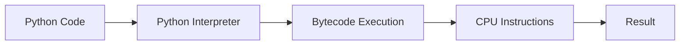
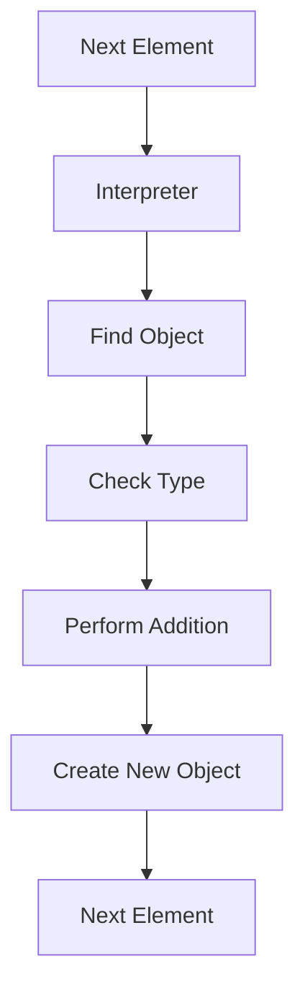
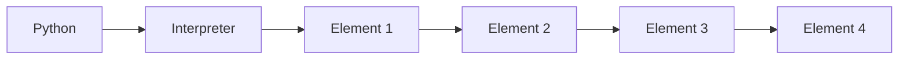
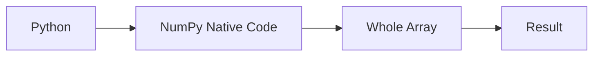
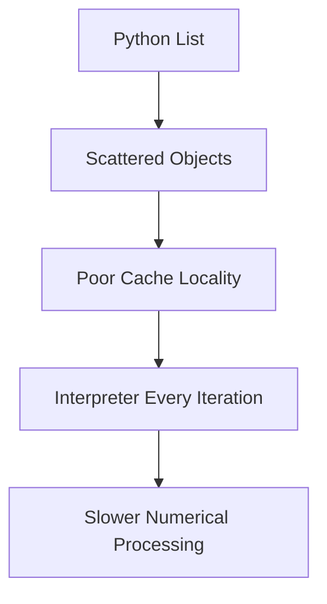
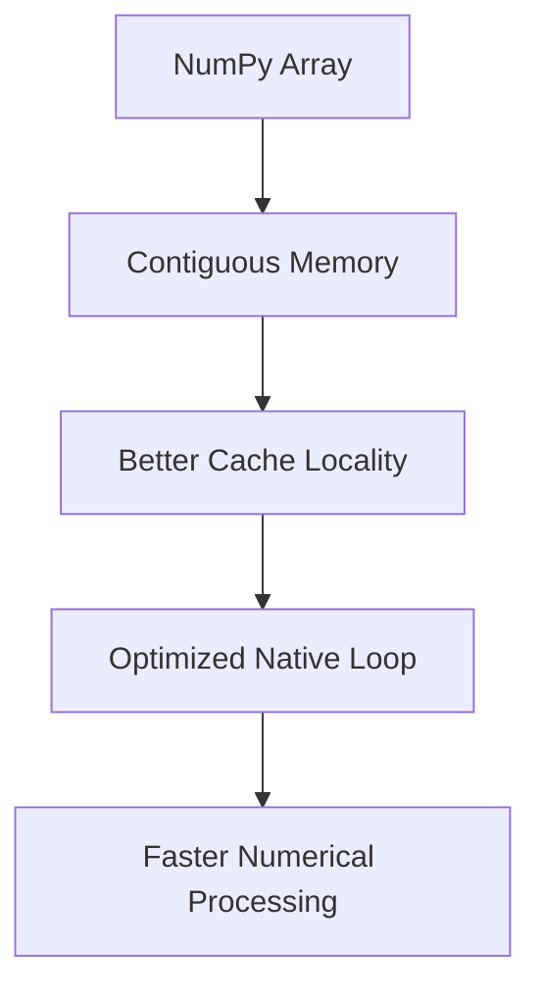

# Chapter 1.7.6 — Interpreter Overhead

## *The Hidden Cost of Python Loops*

> **"Python is often not slow because the CPU is slow. Python is slow because the interpreter has to do a lot of work before the CPU can perform even a simple calculation."**

---

# 🎯 Learning Objectives

By the end of this chapter, you will understand:

* What is the Python Interpreter?
* What is Interpreter Overhead?
* Why Python loops are slower than NumPy operations.
* How NumPy avoids repeated interpreter work.
* The relationship between bytecode, interpreter, and machine code.
* Why vectorization is so powerful.
* How this concept affects Machine Learning performance.

---

# 🌍 Story — The Translator

Imagine you are visiting Japan.

You don't know Japanese.

Every time you want to say something:

You speak English.

↓

Translator converts it.

↓

Japanese person understands.

↓

Replies in Japanese.

↓

Translator converts back.

Every single sentence.

Even saying

> "Hello"

requires the translator.

---

Now imagine talking for **10 million sentences**.

The translation itself becomes the bottleneck.

Python works similarly.

The **Python Interpreter** acts like that translator.

---

# 🤔 A Simple Program

Consider this Python code.

```python
x = 10

y = x + 1
```

Looks tiny.

But Python does **much more** internally than simply executing one CPU instruction.

---

# High-Level Execution



---

### ASCII Version

```text
Python Code
      │
      ▼
Interpreter
      │
      ▼
Execute Instructions
      │
      ▼
CPU
      │
      ▼
Result
```

---

# What is the Python Interpreter?

Python is generally an **interpreted language**.

That means

the CPU cannot understand

```python
print("Hello")
```

directly.

Instead

Python has a software program called

# The Interpreter

whose job is to

* read Python code
* understand it
* execute it

Think of it as

> **a software machine that understands Python.**

---

# Analogy — Restaurant Waiter

Imagine a restaurant.

Customer

↓

Waiter

↓

Chef

↓

Food

The waiter doesn't cook.

He only translates the customer's request.

Similarly,

Python Interpreter

↓

CPU

The interpreter tells the CPU what to do.

---

# Every Line Requires Work

Suppose Python sees

```python
x += 1
```

Many beginners imagine

```text
CPU

↓

Add 1
```

Reality is closer to

```text
Interpreter

↓

Read Variable

↓

Find Object

↓

Check Type

↓

Find Addition Function

↓

Perform Addition

↓

Create New Object

↓

Update Reference
```

This is the **interpreter overhead**.

---

# What Does "Overhead" Mean?

Overhead means

> **extra work that is necessary to perform the actual task but is not the task itself.**

Example

Suppose you want to drink water.

Actual task

```text
Drink Water
```

Extra work

```text
Stand Up

↓

Walk

↓

Open Fridge

↓

Take Bottle

↓

Open Bottle

↓

Drink
```

Everything before drinking

is overhead.

---

# Python Loop Example

Suppose

```python
numbers = [1,2,3,4]

for x in numbers:
    x = x + 1
```

Looks harmless.

But internally,

every iteration requires

* Loop management
* Fetch next element
* Follow reference
* Type check
* Operator lookup
* Create new object
* Assign result
* Check if loop should continue

Again.

Again.

Again.

Again.

---

# Interpreter Loop



---

### ASCII Version

```text
Next Element
      │
      ▼
Interpreter
      │
      ▼
Find Object
      │
      ▼
Check Type
      │
      ▼
Addition
      │
      ▼
New Object
      │
      ▼
Repeat
```

Notice

The interpreter participates

every single iteration.

---

# Imagine One Million Iterations

Suppose

```python
for x in million_numbers:
```

Now the interpreter repeats

```text
Read

↓

Interpret

↓

Dispatch

↓

Execute
```

One million times.

The mathematical operation

```text
+

```

is tiny.

The repeated interpreter work becomes significant.

---

# 🧠 Mental Model — School Attendance

Teacher wants to count students.

---

### Python

Teacher asks

every student

one by one.

```text
Name?

↓

Present?

↓

Next Student

↓

Name?

↓

Present?

↓

Next Student
```

---

### NumPy

Teacher receives

the complete attendance sheet

already organized.

Count immediately.

Much less overhead.

---

# Python vs NumPy

Suppose we want

```python
numbers * 2
```

---

## Python

```python
result = []

for x in numbers:
    result.append(x * 2)
```

Interpreter executes

every loop iteration.

---

## NumPy

```python
arr * 2
```

Python enters NumPy once.

NumPy performs the work using optimized native code.

Python regains control only after the operation finishes.

This dramatically reduces interpreter involvement.

---

# Visualization



---

NumPy



---

ASCII Comparison

```text
Python

Interpreter

↓

Element

↓

Interpreter

↓

Element

↓

Interpreter

↓

Element

↓

Interpreter

↓

Element


NumPy

Interpreter

↓

Entire Array

↓

Result
```

---

# Why Is This Important?

Imagine

100 million numbers.

Python

needs

100 million

interpreter-controlled iterations.

NumPy

needs

one Python call,

after which optimized native code processes the array.

This difference is one of the reasons NumPy scales much better for numerical workloads.

---

# Combining Everything We've Learned

Let's summarize the performance story so far.



---

NumPy



Notice

The speedup comes from multiple improvements working together.

---

# Real Machine Learning Example

Suppose you're training Linear Regression.

Gradient Descent performs

millions of

* additions
* multiplications
* subtractions

Imagine asking Python to interpret

every operation individually.

Training would take much longer.

Instead,

NumPy executes large batches of operations in optimized native code.

---

# Industry Perspective

High-performance numerical libraries such as

* NumPy
* SciPy
* OpenBLAS
* Intel MKL
* TensorFlow
* PyTorch

are designed to minimize Python interpreter involvement during heavy computation.

Python remains the orchestration layer,

while performance-critical work runs in optimized native implementations.

---

# Does This Mean Python Is Bad?

Absolutely not.

Python deliberately trades some execution speed for

* readability
* simplicity
* productivity
* flexibility

For application development,

this trade-off is often excellent.

For heavy numerical computation,

specialized libraries complement Python by handling the expensive work efficiently.

---

# 🧠 Mental Models

---

## Mental Model 1 — Manager vs Workers

Python

↓

Manager

assigns work

to every worker

individually.

NumPy

↓

Manager

gives one instruction

to the supervisor,

who efficiently coordinates the whole team.

---

## Mental Model 2 — Traffic Police

Python

Traffic police

stops

every vehicle

individually.

NumPy

Highway

lets vehicles

flow continuously.

---

## Mental Model 3 — Factory

Python

Worker assembles

one toy

at a time.

NumPy

Assembly line

produces

thousands of toys

continuously.

---

# ⚠ Common Beginner Mistakes

---

## ❌ Python loops are slow because Python is poorly designed.

No.

Python prioritizes developer productivity over raw execution speed.

---

## ❌ NumPy removes the interpreter completely.

No.

Python still calls NumPy.

The key difference is that the interpreter is not involved for every element of the array operation.

---

## ❌ C is always faster.

Not necessarily.

Algorithms,

memory layout,

cache behavior,

and vectorization

also matter.

---

## ❌ Vectorization is just syntax.

No.

Vectorization changes **how the computation is executed**, not just how it is written.

We'll study this in the next chapter.

---

# 🎯 Interview Questions

## Basic

1. What is the Python Interpreter?

2. What is Interpreter Overhead?

3. Why are Python loops slower than NumPy operations?

---

## Intermediate

4. Explain why NumPy reduces interpreter overhead.

5. Why is one NumPy operation often faster than millions of Python loop iterations?

6. What is meant by "Python is an orchestration layer"?

---

## Advanced

7. Explain the complete execution flow of a Python loop versus a NumPy array operation.

8. Why is reducing interpreter overhead important in Machine Learning?

9. Besides interpreter overhead, what other factors contribute to NumPy's performance?

---

# 📝 Chapter Summary

✅ The Python Interpreter reads and executes Python code.

✅ Every Python loop iteration involves additional interpreter work.

✅ Interpreter overhead becomes significant when operations are repeated millions of times.

✅ NumPy minimizes interpreter involvement by processing entire arrays in optimized native code.

✅ Interpreter overhead is one of several reasons why NumPy is much faster than Python Lists for numerical computation.

---

# 📌 Cheat Sheet

| Python Loop                          | NumPy Operation                 |
| ------------------------------------ | ------------------------------- |
| Interpreter involved every iteration | Interpreter enters once         |
| Repeated type checks                 | Optimized native implementation |
| High overhead                        | Low overhead                    |
| Better for general programming       | Better for numerical computing  |
| Flexible                             | Performance-oriented            |

---

# 🔗 Master Chapter Progress

We've now completed **six of the eight pillars** behind NumPy's performance story:

* ✅ **1.7.1** – The Biggest Misconception
* ✅ **1.7.2** – How Python Stores Objects
* ✅ **1.7.3** – What Actually Happens During One Addition
* ✅ **1.7.4** – Contiguous vs Non-Contiguous Memory
* ✅ **1.7.4A** – How the CPU Reads Memory
* ✅ **1.7.5** – CPU Cache & Cache Locality
* ✅ **1.7.6** – Interpreter Overhead

The final two sections will tie everything together:

* **1.7.7 – Vectorization: The Real Magic Behind NumPy**
* **1.7.8 – Putting Everything Together: Why NumPy Is Fast**

These chapters will connect all the concepts—contiguous memory, cache locality, interpreter overhead, and native execution—into one complete mental model that explains NumPy's performance from first principles.

---

# ✅ Scaler Coverage Check

### Covered from Scaler

* ✔ Why Python loops are slower
* ✔ Motivation for NumPy's optimized execution model

### Added Beyond Scaler

* ➕ Interpreter explained from first principles
* ➕ Clear definition of interpreter overhead
* ➕ Multiple execution flow diagrams
* ➕ Python loop vs NumPy execution comparison
* ➕ Real ML motivation
* ➕ Industry implementation perspective
* ➕ Three intuitive mental models
* ➕ Interview-focused explanations
* ➕ Integration with previous chapters into a coherent performance story

---

## 🚀 Preview — Chapter 1.7.7: Vectorization — The Real Magic Behind NumPy

This is where everything finally comes together.

We'll answer one of the most famous questions in scientific computing:

> **Why does writing `arr * 2` outperform a Python `for` loop over millions of elements?**

We'll explore:

* What **vectorization** really means (and what it does *not* mean)
* Element-wise operations from first principles
* Why vectorization reduces interpreter overhead
* How vectorization benefits from contiguous memory and cache locality
* Why vectorization is different from parallelism
* Common misconceptions and performance intuition

By the end of that chapter, you'll understand why a single line of NumPy code can replace an entire Python loop while being both **shorter** and **dramatically faster**.

