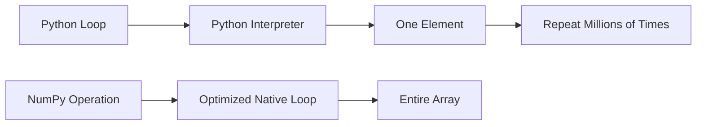
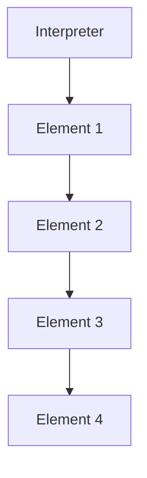
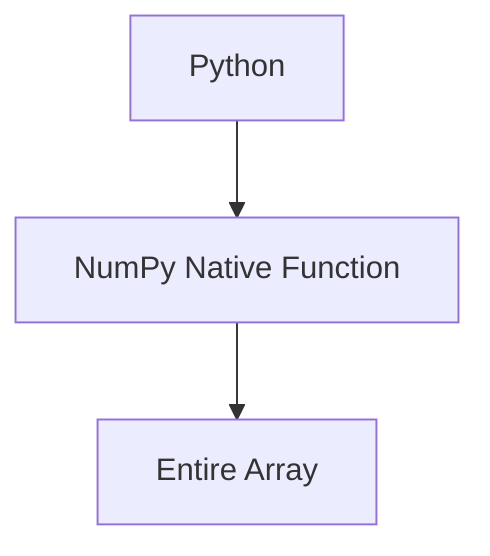
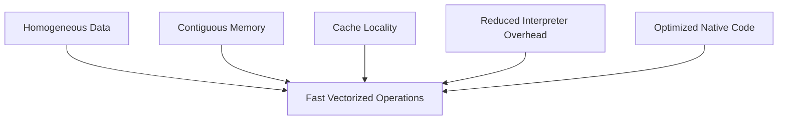
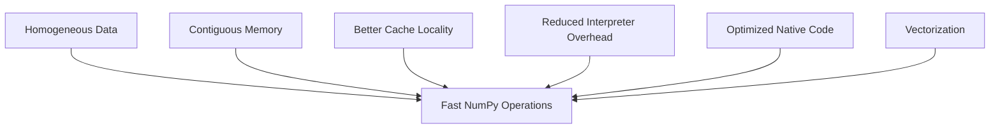

# Chapter 1.7.7 — Vectorization: The Real Magic Behind NumPy

## *The Secret That Makes One Line of NumPy Replace Millions of Python Operations*

> **"Vectorization is not just writing shorter code. It is changing *who performs the computation*."**

---

# 🎯 Learning Objectives

After completing this chapter, you will understand:

* What Vectorization really means.
* Why vectorization is much faster than Python loops.
* Why vectorization is not merely a syntax shortcut.
* How vectorization works conceptually.
* Why vectorization reduces interpreter overhead.
* How vectorization takes advantage of contiguous memory and CPU cache.
* Why every ML library is built around vectorized operations.

---

# 🌍 Story — The Factory

Imagine two factories producing smartphones.

---

## Factory A

One worker builds one phone.

```text
Worker

↓

Phone

↓

Worker

↓

Phone

↓

Worker

↓

Phone
```

Every worker repeats the same steps independently.

---

## Factory B

An assembly line.

```text
Worker 1 → Worker 2 → Worker 3 → Worker 4

Phone → Phone → Phone → Phone
```

Thousands of phones move continuously.

No unnecessary stopping.

Much faster.

---

Python loops behave like **Factory A**.

Vectorization behaves like **Factory B**.

---

# 🤔 The Problem

Suppose we want to multiply every element by 2.

Python

```python
numbers = [1,2,3,4,5]

result = []

for x in numbers:
    result.append(x * 2)
```

Nothing wrong with this.

But let's think.

Who is doing the work?

---

# What Actually Happens?

Every iteration requires

```text
Interpreter

↓

Find Element

↓

Type Check

↓

Multiply

↓

Create Object

↓

Append

↓

Repeat
```

Millions of times.

---

# NumPy Version

```python
import numpy as np

arr = np.array([1,2,3,4,5])

result = arr * 2
```

Only one line.

Many beginners think

> NumPy simply hides the loop.

That is only partly true.

The important question is

> **Where is the loop executed?**

---

# The Biggest Misconception

Most beginners imagine this:

```text
Python Loop

↓

NumPy Loop

↓

Same Thing
```

❌ Wrong.

The difference is **not the existence of a loop**.

The difference is

**who executes it.**

---

# Python Loop vs NumPy Loop



### ASCII Version

```text
Python

Interpreter

↓

Element

↓

Interpreter

↓

Element

↓

Interpreter

↓

Element


NumPy

Python

↓

Native Code

↓

Whole Array
```

This is the essence of vectorization.

---

# What is Vectorization?

## Definition

> **Vectorization is the process of applying the same operation to an entire collection of data at once using optimized native implementations, instead of executing explicit Python loops element by element.**

Notice

We are **not eliminating the loop.**

We are moving the loop

from Python

to optimized native code.

---

# Think Like a Manager

Imagine a company.

---

## Python

Manager says

```text
Employee 1

Do this.

Employee 2

Do this.

Employee 3

Do this.

Employee 4

Do this.
```

Manager speaks every time.

---

## NumPy

Manager says

```text
Entire Team

Multiply

everything

by 2.
```

The team handles the rest.

The manager doesn't interfere.

---

# Visual Workflow

Python



NumPy



---

# Step-by-Step Comparison

## Python

```python
for x in arr:
    x = x * 2
```

Conceptually

```text
Element 1

↓

Multiply

↓

Store

↓

Element 2

↓

Multiply

↓

Store

↓

Element 3

...
```

---

## NumPy

```python
arr * 2
```

Conceptually

```text
Entire Array

↓

Native Optimized Loop

↓

Result
```

---

# Why Is This Faster?

Vectorization combines everything we've learned.

Let's revisit the six pillars.

---

## Pillar 1

Homogeneous Data

All elements

have the same type.

No repeated type checking.

---

## Pillar 2

Contiguous Memory

Values live together.

The CPU reads them sequentially.

---

## Pillar 3

Cache Locality

Nearby values

are already in cache.

Fewer cache misses.

---

## Pillar 4

Reduced Interpreter Overhead

Python Interpreter

is called

once.

Not millions of times.

---

## Pillar 5

Optimized Native Code

Heavy work

is performed

using highly optimized compiled routines.

---

## Pillar 6

Efficient CPU Instructions

Because the data is homogeneous and contiguous, the compiler and CPU can often use highly optimized instructions internally.

(We'll discuss SIMD and low-level optimizations in later modules.)

---

# Everything Comes Together



---

ASCII

```text
Homogeneous Data
        │
Contiguous Memory
        │
Cache Locality
        │
Reduced Interpreter
        │
Native Code
        │
        ▼
Fast Vectorization
```

Now the entire NumPy story starts making sense.

---

# Real Machine Learning Example

Suppose

Gradient Descent computes

```text
Prediction

↓

Error

↓

Gradient

↓

Weight Update
```

millions of times.

Python loop

```python
for i in range(n):
```

would repeatedly involve the interpreter.

Instead

NumPy performs

vectorized array operations.

One statement.

Millions of values.

---

# Example — Image Processing

An image

contains

millions of pixels.

Suppose we want to

increase brightness.

Python

```python
for each pixel:
```

Very slow.

Vectorized

```python
image + 30
```

Entire image

processed efficiently.

---

# Example — Finance

Stock Prices

```text
₹100

₹105

₹110

₹115

₹120
```

Need

5% increase.

Python

loop.

NumPy

```python
prices * 1.05
```

Entire portfolio

updated.

---

# Example — Sensor Data

Temperature

recorded

every second.

One year.

Over 31 million readings.

Need

Celsius → Fahrenheit.

Python

millions of iterations.

NumPy

One vectorized expression.

---

# Mental Model — Washing Machine

Python

Wash

one shirt.

Repeat.

Wash

one shirt.

Repeat.

NumPy

Put

all clothes

inside.

Run once.

---

# Mental Model — Printer

Python

Print

one page.

Wait.

Print

next page.

NumPy

Print

entire document.

---

# Mental Model — Airport

Python

Security check

one passenger

at a time.

NumPy

Multiple lanes

processing passengers efficiently in parallelized workflows.

---

# Is Vectorization Parallelism?

This is a common interview question.

Many people think

Vectorization

=

Parallel Processing

Not necessarily.

Vectorization means

operating on an entire collection using optimized implementations.

Some vectorized operations may also take advantage of hardware parallelism (SIMD, multiple cores, GPUs), but the concepts are different.

We'll study

* SIMD
* Parallel Computing
* Multi-threading
* GPU Programming

later.

---

# Industry Perspective

Nearly every numerical computing library relies on vectorized operations.

Examples

* NumPy
* Pandas
* SciPy
* TensorFlow
* PyTorch
* JAX
* OpenCV

When reading production ML code,

you'll rarely see

```python
for
```

over numerical arrays.

Instead,

you'll see

vectorized expressions.

---

# Why Data Scientists Love Vectorization

Because it provides

✅ Cleaner Code

✅ Shorter Code

✅ Faster Code

✅ Better Memory Access

✅ Better CPU Utilization

One idea.

Five benefits.

---

# ⚠ Common Beginner Mistakes

---

## ❌ Vectorization means "no loops."

Wrong.

There is still a loop.

It is simply executed in optimized native code rather than in Python.

---

## ❌ Vectorization is just shorter syntax.

No.

It fundamentally changes the execution model.

---

## ❌ Python loops are always bad.

Not at all.

Loops are perfect for

* Business Logic
* File Processing
* Network Programming
* General Applications

Vectorization is valuable for **bulk numerical computation**.

---

## ❌ Every NumPy function is automatically parallel.

No.

Many are highly optimized and vectorized, but parallel execution depends on the specific operation and underlying implementation.

---

# 🎯 Interview Questions

### Basic

1. What is Vectorization?

2. Why is vectorization faster?

3. Does vectorization eliminate loops?

---

### Intermediate

4. Explain vectorization using NumPy.

5. Why does vectorization reduce interpreter overhead?

6. How does vectorization benefit from contiguous memory?

---

### Advanced

7. Explain the relationship between vectorization, cache locality, and interpreter overhead.

8. Why is vectorization fundamental to Machine Learning?

9. Is vectorization the same as parallel processing?

---

# 📝 Chapter Summary

✅ Vectorization applies one operation to an entire collection.

✅ The loop still exists—but it executes in optimized native code.

✅ Vectorization dramatically reduces Python interpreter overhead.

✅ Vectorization benefits from contiguous memory and CPU cache locality.

✅ Modern Machine Learning libraries are built around vectorized operations.

---

# 📌 Cheat Sheet

| Python Loop                 | Vectorization           |
| --------------------------- | ----------------------- |
| Interpreter every iteration | Interpreter enters once |
| Manual loop                 | Whole-array operation   |
| More overhead               | Less overhead           |
| General-purpose             | Numerical computing     |
| Flexible                    | Highly optimized        |

---

# 🧠 The Complete Performance Story (So Far)

This is the diagram we've been building throughout the master chapter.



### ASCII Version

```text
Homogeneous Data
        │
Contiguous Memory
        │
Better Cache Locality
        │
Reduced Interpreter Overhead
        │
Optimized Native Code
        │
Vectorization
        │
        ▼
Fast NumPy Operations
```

Notice something beautiful.

Everything we've learned since **Chapter 1.7.1** has been building toward this one diagram.

Each chapter explained **one pillar**.

Now they all connect into a single mental model.

---

# ✅ Scaler Coverage Check

### Covered from Scaler

* ✔ Vectorized operations
* ✔ Motivation for avoiding Python loops

### Added Beyond Scaler

* ➕ Formal definition of vectorization
* ➕ Execution model comparison
* ➕ Complete integration with previous chapters
* ➕ Multiple real-world examples (ML, Finance, Image Processing, Sensors)
* ➕ Vectorization vs Parallelism
* ➕ Industry practices
* ➕ Comprehensive interview preparation
* ➕ Unified performance architecture

---

# 🚀 Preview — Chapter 1.7.8: Putting Everything Together — Why NumPy Is Fast

This will be the **grand finale** of our Master Chapter.

We'll bring together **every concept** we've learned:

* Python Objects
* References
* Memory Layout
* Contiguous Memory
* CPU Cache
* Cache Locality
* Interpreter Overhead
* Vectorization
* Native Code

We'll follow a single operation from Python source code all the way to the CPU and compare:

```text
Python List
        vs
NumPy Array
```

step by step.

By the end of that chapter, you'll have a complete, end-to-end mental model of **why NumPy is fast**—one that will continue to pay dividends throughout the rest of your Machine Learning journey.

