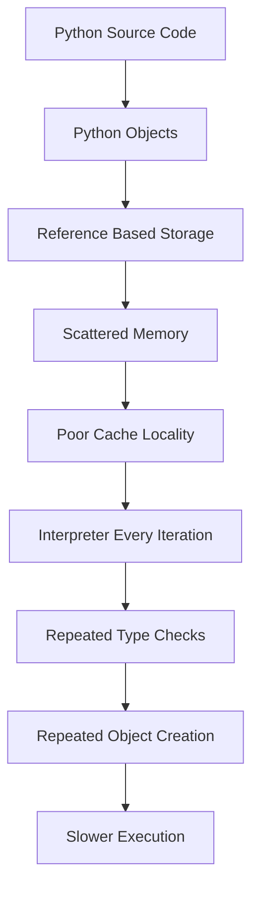
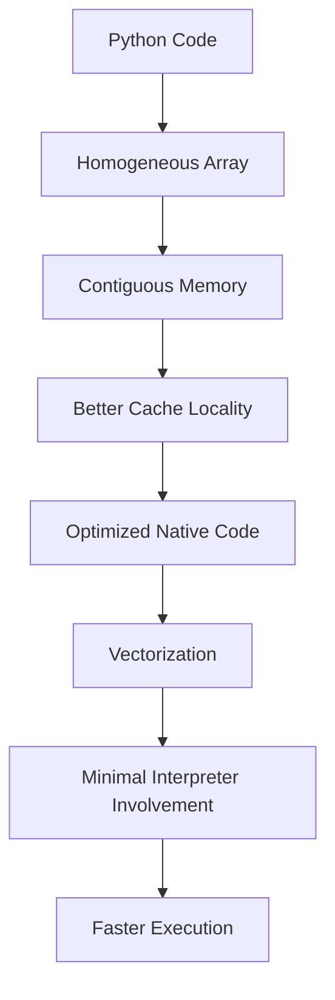
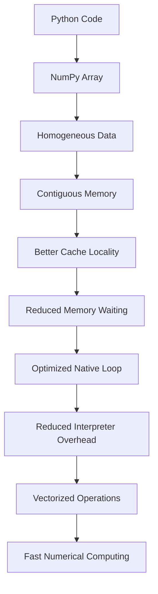
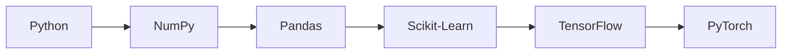

# Chapter 1.7.8 — Putting Everything Together — Why NumPy Is Fast

## *The Grand Finale of the Master Chapter*

> **"NumPy is not faster because of one magical optimization. It is faster because every layer of its design—from memory layout to CPU execution—works together."**

---

# 🎯 Learning Objectives

By the end of this chapter, you will be able to answer confidently:

* Why is NumPy faster than Python Lists?
* Why is `arr * 2` much faster than a Python loop?
* What role do Python Objects play?
* Why does contiguous memory matter?
* Why does CPU cache matter?
* What is interpreter overhead?
* What is vectorization?
* How do all these ideas connect into one complete picture?

---

# 🌍 Story — Building a Formula 1 Car

Imagine someone asks:

> **"Why is a Formula 1 car so fast?"**

Can you answer

> "Because it has good tires."

No.

Its speed comes from **many engineering decisions** working together.

* Aerodynamics
* Engine
* Tires
* Suspension
* Lightweight chassis
* Fuel system
* Driver

Remove any one of these,

and performance drops.

NumPy is exactly like that.

There is no single reason.

Its performance is the result of **multiple optimizations working together**.

---

# 🧩 The Journey We've Completed

Let's revisit every chapter we've studied.

```text
1.7.1  Biggest Misconception
        ↓
1.7.2  Python Objects
        ↓
1.7.3  One Addition
        ↓
1.7.4  Memory Layout
        ↓
1.7.4A CPU Reads Memory
        ↓
1.7.5  Cache Locality
        ↓
1.7.6  Interpreter Overhead
        ↓
1.7.7  Vectorization
        ↓
1.7.8  Complete Picture
```

Every chapter answered one question.

Today,

we combine them.

---

# The Big Question

Suppose we have

```python
numbers = [1,2,3,4]

result = []

for x in numbers:
    result.append(x * 2)
```

versus

```python
import numpy as np

arr = np.array([1,2,3,4])

result = arr * 2
```

Both produce

```text
2

4

6

8
```

Why is one dramatically faster?

---

# The Complete Pipeline

This is the most important diagram in this chapter.



---

### ASCII Version

```text
Python Code
      │
      ▼
Python Objects
      │
      ▼
References
      │
      ▼
Scattered Memory
      │
      ▼
Poor Cache Locality
      │
      ▼
Interpreter
      │
      ▼
Type Checks
      │
      ▼
Object Creation
      │
      ▼
Slower Execution
```

---

# NumPy Pipeline

Now compare.



---

### ASCII Version

```text
Python Code
      │
      ▼
Homogeneous Array
      │
      ▼
Contiguous Memory
      │
      ▼
Cache Friendly
      │
      ▼
Native Code
      │
      ▼
Vectorization
      │
      ▼
Fast Execution
```

This is the complete performance story.

---

# Step-by-Step Comparison

## Step 1 — Data Representation

### Python

```python
numbers = [1,2,3]
```

Conceptually

```text
List

↓

Reference

↓

Integer Object
```

---

### NumPy

```python
arr = np.array([1,2,3])
```

Conceptually

```text
Array

↓

Raw Numbers
```

No separate Python integer objects for every element of the array.

---

# Step 2 — Memory Layout

Python

```text
1000

↓

Object

9000

↓

Object

2500

↓

Object
```

Scattered.

---

NumPy

```text
1000

1001

1002

1003
```

Everything together.

---

# Step 3 — CPU Access

Python

```text
CPU

↓

Reference

↓

Jump

↓

Object

↓

Jump

↓

Object

↓

Jump
```

---

NumPy

```text
CPU

↓

10

↓

20

↓

30

↓

40
```

Sequential.

Predictable.

---

# Step 4 — Cache Behavior

Python

Many cache misses.

---

NumPy

Many cache hits.

---

Visualization


---

# Step 5 — Interpreter

Python

```python
for x in numbers:
```

Interpreter

↓

Interpreter

↓

Interpreter

↓

Interpreter

Millions of times.

---

NumPy

```python
arr * 2
```

Interpreter

↓

Native Code

↓

Result

Only one Python-to-NumPy transition.

---

# Step 6 — Loop Execution

Python

The loop is written

in Python.

---

NumPy

The loop still exists,

but it executes

inside optimized native code.

---

# Step 7 — Final Result

Everything together gives

Huge Performance Improvement.

---

# The Six Engineering Pillars

Let's summarize everything.

---

## 1️⃣ Homogeneous Data

All elements

same type.

No repeated type checking.

---

## 2️⃣ Contiguous Memory

Everything together.

Excellent memory layout.

---

## 3️⃣ Cache Locality

Nearby data

already in Cache.

Fewer expensive memory accesses.

---

## 4️⃣ Reduced Interpreter Overhead

Interpreter

called once.

Not millions of times.

---

## 5️⃣ Optimized Native Code

Heavy work

performed

using highly optimized compiled implementations.

---

## 6️⃣ Vectorization

Entire array

processed together.

---

# One Giant Diagram

This diagram summarizes the entire Master Chapter.



---

### ASCII Version

```text
Python Code
      │
      ▼
NumPy Array
      │
      ▼
Homogeneous Data
      │
      ▼
Contiguous Memory
      │
      ▼
Better Cache Locality
      │
      ▼
Less Memory Waiting
      │
      ▼
Optimized Native Loop
      │
      ▼
Less Interpreter Work
      │
      ▼
Vectorization
      │
      ▼
Fast Numerical Computing
```

This is the diagram I want you to remember forever.

---

# A Real ML Example

Suppose you're training Linear Regression using Gradient Descent.

Each iteration computes:

```python
prediction = X @ w
error = prediction - y
gradient = X.T @ error
w = w - learning_rate * gradient
```

Notice something.

There is almost **no explicit Python loop over individual data points**.

Instead, these are **vectorized matrix operations**.

Why?

Because:

* `X` is stored contiguously.
* Matrix operations are implemented in optimized native libraries (BLAS/LAPACK or vendor-specific equivalents).
* The interpreter only orchestrates the high-level steps.
* Millions of arithmetic operations happen beneath Python.

This is why modern ML libraries can process huge datasets efficiently.

---

# Where Does Pandas Fit?



Notice

Everything depends on NumPy.

Why?

Because NumPy solves

the performance problem.

---

# Real Industry Perspective

Let's see how this affects different domains.

| Domain                | Uses Vectorized Arrays? | Why?                                |
| --------------------- | ----------------------- | ----------------------------------- |
| Machine Learning      | ✅                       | Millions of mathematical operations |
| Finance               | ✅                       | Fast portfolio calculations         |
| Image Processing      | ✅                       | Pixel-wise operations               |
| Medical Imaging       | ✅                       | Large matrices                      |
| Scientific Simulation | ✅                       | Numerical computation               |
| Robotics              | ✅                       | Sensor and control data             |
| Astronomy             | ✅                       | Massive observational datasets      |

Notice

Almost every scientific field

needs

efficient numerical computation.

---

# Mental Model 1 — Orchestra

Python Loop

Every musician

receives

individual instructions.

---

NumPy

Conductor

raises the baton.

Entire orchestra

plays together.

---

# Mental Model 2 — Airport

Python

One security officer.

One passenger.

Repeat.

---

NumPy

Many lanes.

Entire queue

processed efficiently.

---

# Mental Model 3 — Highway

Python

```
🚗

       🚙

🚕

            🚚

      🚓
```

Random traffic.

---

NumPy

```
🚗🚗🚗🚗🚗🚗🚗🚗
```

Continuous flow.

---

# The Biggest Lesson

Many beginners ask

> Which is faster?

Wrong question.

The better question is

> **Why was NumPy designed differently?**

Performance is

a consequence

of

good engineering.

---

# When Should You Use Python Lists?

Python Lists are excellent when you need:

* Mixed data types
* Dynamic insertion/removal
* General application logic
* Small datasets
* Readability

---

# When Should You Use NumPy?

Use NumPy when you need:

* Numerical computation
* Scientific computing
* Matrix operations
* Machine Learning
* Deep Learning
* Large homogeneous datasets
* Statistical analysis

---

# Complete Comparison

| Feature                 | Python List            | NumPy Array         |
| ----------------------- | ---------------------- | ------------------- |
| Purpose                 | General Programming    | Numerical Computing |
| Data Type               | Mixed                  | Homogeneous         |
| Memory Layout           | References to Objects  | Contiguous Values   |
| Cache Locality          | Lower                  | Higher              |
| Interpreter Involvement | Every Iteration        | Minimal             |
| Vectorization           | No                     | Yes                 |
| Matrix Operations       | Slow                   | Optimized           |
| Memory Efficiency       | Lower for Numeric Data | Higher              |
| Scientific Computing    | Limited                | Excellent           |

---

# 🧠 The Complete Mental Model

If you remember **only one thing** from this entire master chapter, remember this:


### ASCII Version

```text
Better Data Layout
        │
        ▼
Better Memory Access
        │
        ▼
Less CPU Waiting
        │
        ▼
Less Interpreter Work
        │
        ▼
More Useful Computation
        │
        ▼
Higher Performance
```

**Performance is not magic.**

Performance is the result of removing unnecessary work.

---

# ⚠ Common Beginner Misconceptions

## ❌ "NumPy is faster because it's written in C."

**Incomplete.**

Compiled native code is only one part of the story.

Memory layout, cache locality, vectorization, homogeneous data, and reduced interpreter overhead are equally important.

---

## ❌ "Vectorization means parallel processing."

No.

Vectorization means expressing operations over whole arrays.

Some implementations may also use SIMD or multiple threads internally, but vectorization itself is a programming model.

---

## ❌ "Python Lists are bad."

No.

They solve a different engineering problem.

Always choose the right tool.

---

## ❌ "NumPy replaces Python."

No.

Python remains the language you write.

NumPy accelerates the numerical parts.

---

# 🎯 FAANG-Style Interview Questions

## Basic

1. Why is NumPy faster than Python Lists?
2. What is contiguous memory?
3. What is vectorization?

---

## Intermediate

4. Explain cache locality.
5. Why does NumPy reduce interpreter overhead?
6. Why are homogeneous arrays faster?

---

## Advanced

### Q1

Walk through the execution of:

```python
arr = np.array([1,2,3])

arr = arr * 2
```

Explain every layer,

from Python

↓

NumPy

↓

Memory

↓

CPU

↓

Result.

---

### Q2

Design a numerical library.

Which principles from NumPy would you keep?

---

### Q3

Suppose NumPy stored references like Python Lists.

Would it still be fast?

Explain.

---

### Q4

Why do TensorFlow and PyTorch tensors resemble NumPy arrays?

---

# 📝 Master Chapter Summary

We started with one simple question:

> **Why is NumPy faster than Python Lists?**

We discovered that the answer is **not one optimization**, but an entire engineering philosophy.

We learned:

* ✅ Python stores references to objects.
* ✅ Objects may be scattered in memory.
* ✅ Contiguous memory improves sequential access.
* ✅ CPU caches reward good memory layout.
* ✅ Python loops incur interpreter overhead.
* ✅ NumPy moves loops into optimized native code.
* ✅ Vectorization lets us operate on entire arrays efficiently.
* ✅ All these ideas combine to produce fast numerical computation.

---

# 📌 Ultimate Cheat Sheet

| Concept              | Key Idea                                        |
| -------------------- | ----------------------------------------------- |
| Python Objects       | Variables reference objects                     |
| Python Lists         | Store references, not raw values                |
| NumPy Arrays         | Store homogeneous values contiguously           |
| Contiguous Memory    | Sequential layout improves access               |
| CPU Cache            | Small, fast memory near the CPU                 |
| Cache Locality       | Nearby data is accessed efficiently             |
| Interpreter Overhead | Python manages every loop iteration             |
| Vectorization        | Whole-array operations in optimized native code |
| Final Outcome        | High-performance numerical computing            |

---

# 🏆 Master Chapter Completion

Congratulations!

You have completed one of the most important conceptual chapters in the entire DAV notebook.

Many learners **use** NumPy.

Very few understand **why it works so well**.

After this chapter, you don't just know *how* to use NumPy—you understand the engineering principles that make it the foundation of modern scientific computing.

---

# ✅ Scaler Coverage Check

### Covered from Scaler

* ✔ Why NumPy is faster than Python Lists
* ✔ Importance of vectorized computation
* ✔ High-level performance intuition

### Added Beyond Scaler

* ➕ End-to-end engineering explanation
* ➕ Integration of all previous subchapters
* ➕ CPU, memory, interpreter, and vectorization unified into one model
* ➕ Real Machine Learning execution pipeline
* ➕ Industry examples across multiple domains
* ➕ FAANG-style interview preparation
* ➕ Complete revision table and ultimate cheat sheet
* ➕ Engineering-first mental models

---

# 🚀 Next Module — Chapter 2.1: Installing NumPy & Creating Your First Array

We've now built a **deep conceptual foundation**.

From the next chapter onward, we'll transition into **hands-on NumPy**, but we'll continue with the same philosophy:

> **Never write code before understanding why it exists.**

We'll cover:

* Installing NumPy
* Importing NumPy
* Why `import numpy as np` became the community standard
* Creating arrays from Python lists
* Understanding `ndarray`
* Inspecting shape, size, dtype, and memory layout
* The difference between Python `list` and NumPy `ndarray`

From here onward, every line of NumPy code will make intuitive sense because you now understand the engineering principles beneath it.

