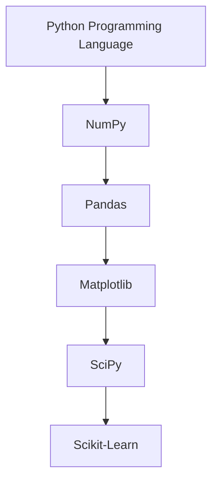
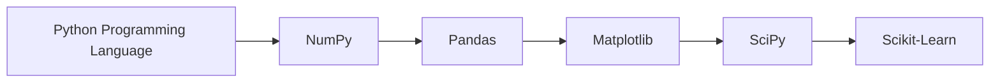

Excellent. We've now crossed the most difficult conceptual part of the NumPy journey.

From here onward, we'll start writing code.

But unlike most courses that begin with

```python
import numpy as np
```

without explanation, we'll first answer a more fundamental question:

> **Why do millions of Python developers write `import numpy as np`?**

Just as we did in the ML notebook, we'll first build intuition, then code.

---

# Chapter 2.1 — Installing NumPy & Creating Your First Array

> **"Before learning NumPy syntax, understand why the NumPy ecosystem looks the way it does."**

---

# 🎯 Learning Objectives

By the end of this chapter, you will understand:

* What NumPy actually is
* Why NumPy needs to be installed
* Why it is imported using `import numpy as np`
* What `np` means
* What an `ndarray` is
* How to create your first NumPy array
* How arrays differ from Python Lists
* Best practices followed in industry

---

# 🌍 Story — A Carpenter's Toolbox

Imagine a carpenter.

Can he build a house with only a hammer?

No.

He needs

* Hammer
* Drill
* Saw
* Measuring Tape
* Screwdriver

Python is like the carpenter.

It already has basic tools.

NumPy is a **specialized power tool** built specifically for numerical computation.

You don't replace Python.

You extend it.

---

# 🤔 Is NumPy Part of Python?

This is a very common beginner question.

The answer is

> **No.**

Python is the programming language.

NumPy is a third-party library (also called a package) that extends Python with high-performance numerical computing capabilities.

---

# Visual Relationship



### ASCII Version

```text
Python
   │
   ├── NumPy
   ├── Pandas
   ├── Matplotlib
   ├── SciPy
   └── Scikit-Learn
```

Notice

Python is the foundation.

Libraries extend Python's capabilities.

---

# What is a Library?

A **library** is simply a collection of pre-written code that solves common problems.

Instead of writing everything from scratch,

you reuse existing, well-tested code.

Example

Python already provides

```python
import math

math.sqrt(25)
```

You didn't implement square root.

You imported it.

NumPy works exactly the same way.

---

# Why Install NumPy?

A standard Python installation contains only the **Python Standard Library**.

NumPy is maintained as an external project and must usually be installed separately.

This separation keeps Python lightweight while allowing specialized libraries to evolve independently.

---

# Installing NumPy

The standard installation command is

```bash
pip install numpy
```

---

## What does this command mean?

```text
pip
│
▼
Python Package Installer

install
│
▼
Download and Install

numpy
│
▼
Package Name
```

---

# What is pip?

Many beginners think

```text
pip = Python
```

Wrong.

`pip` is a package manager.

Its job is to

* Download packages
* Install packages
* Update packages
* Remove packages

Think of it like an app store for Python libraries.

---

# Visual Flow

```mermaid
flowchart LR

A[pip]

--> B[Python Package Index (PyPI)]

--> C[Download NumPy]

--> D[Install into Python Environment]
```



---

### ASCII Version

```text
pip
 │
 ▼
PyPI
 │
 ▼
Download NumPy
 │
 ▼
Install
```

---

# Where Does NumPy Come From?

NumPy is distributed through the **Python Package Index (PyPI)**.

Think of PyPI as the official online repository where thousands of Python packages are published.

```text
Developer

↓

Upload Package

↓

PyPI

↓

Users Install with pip
```

---

# Verifying Installation

After installation,

you can verify it.

```bash
pip show numpy
```

or

```python
import numpy

print(numpy.__version__)
```

Example output

```text
2.x.x
```

(The exact version will depend on when you install it.)

---

# Importing NumPy

Every NumPy program starts with

```python
import numpy as np
```

This is one of the most recognized lines in Data Science.

---

# Breaking It Down

```python
import numpy as np
```

Let's understand every word.

---

## `import`

Means

> Bring this library into the current program.

Without importing,

Python doesn't know about NumPy.

---

## `numpy`

The actual package name.

---

## `as`

Creates an alias.

---

## `np`

The alias.

Instead of writing

```python
numpy.array(...)
```

we write

```python
np.array(...)
```

Shorter.

Cleaner.

---

# Why `np`?

This isn't required.

You could write

```python
import numpy as banana
```

and then

```python
banana.array([1,2,3])
```

Python would accept it.

But don't.

The entire scientific Python community uses

```python
import numpy as np
```

Using the standard alias makes code easier to read and collaborate on.

---

# Visual Explanation

```mermaid
flowchart LR

A[NumPy Library]

--> B[Alias: np]

--> C[np.array()]
```

---

### ASCII Version

```text
NumPy

↓

Alias

↓

np

↓

np.array()
```

---

# Your First NumPy Array

Let's create one.

```python
import numpy as np

arr = np.array([10, 20, 30, 40, 50])

print(arr)
```

Output

```text
[10 20 30 40 50]
```

Congratulations!

You've created your first NumPy array.

---

# Wait...

Is this just another Python List?

It looks similar.

```python
[10,20,30]
```

versus

```python
np.array([10,20,30])
```

Same appearance.

Different implementation.

---

# Python List

```python
numbers = [10,20,30]
```

Type

```python
type(numbers)
```

Output

```text
<class 'list'>
```

---

# NumPy Array

```python
arr = np.array([10,20,30])

type(arr)
```

Output

```text
<class 'numpy.ndarray'>
```

Notice

The type is completely different.

---

# What is `ndarray`?

`ndarray` stands for

> **N-Dimensional Array**

Breaking the name apart:

```text
N
│
▼
Any Number of Dimensions

Array
│
▼
Collection of Homogeneous Values
```

---

# Why "N-Dimensional"?

Because NumPy can represent

One-dimensional arrays

```text
[1 2 3]
```

Two-dimensional arrays

```text
[[1 2]
 [3 4]]
```

Three-dimensional arrays

```text
[
 [[1 2]
  [3 4]]
]
```

and even higher dimensions.

We'll study dimensions in detail later.

---

# First Comparison

```python
numbers = [1,2,3]

arr = np.array([1,2,3])
```

| Python List       | NumPy Array               |
| ----------------- | ------------------------- |
| `list`            | `ndarray`                 |
| General-purpose   | Numerical computing       |
| Stores references | Stores homogeneous values |
| Flexible          | Optimized                 |

---

# Interactive Example

```python
import numpy as np

numbers = [1,2,3]

arr = np.array(numbers)

print(numbers)

print(arr)

print(type(numbers))

print(type(arr))
```

Expected Output

```text
[1, 2, 3]

[1 2 3]

<class 'list'>

<class 'numpy.ndarray'>
```

---

# Creating Arrays from Different Iterables

NumPy accepts many iterable objects.

From a list

```python
np.array([1,2,3])
```

From a tuple

```python
np.array((1,2,3))
```

From another NumPy array

```python
np.array(existing_array)
```

Later we'll explore generators and other advanced inputs.

---

# Common Beginner Mistakes

## ❌ Forgetting to import NumPy

```python
array([1,2,3])
```

Error.

Always import first.

---

## ❌ Forgetting the alias

```python
numpy.array(...)
```

This works **only if** you imported using

```python
import numpy
```

If you wrote

```python
import numpy as np
```

use

```python
np.array(...)
```

---

## ❌ Expecting a NumPy array to behave exactly like a list

Many operations look similar,

but internally they are very different.

We'll explore those differences throughout the next chapters.

---

# Best Practices (Industry)

Almost every Data Science project starts with

```python
import numpy as np
import pandas as pd
import matplotlib.pyplot as plt
```

These aliases have become community conventions.

Following them makes your code immediately familiar to other developers.

---

# Real-World Example

Imagine you're working on a Machine Learning project.

You load customer data.

```python
import numpy as np

ages = np.array([22, 31, 45, 28, 39])
```

Later,

you'll compute

* Average age
* Standard deviation
* Maximum age
* Minimum age
* Normalization
* Matrix operations

All using NumPy.

---

# Mental Models

## Mental Model 1 — Smartphone Apps

Your phone comes with

* Calculator
* Camera
* Clock

Need navigation?

You install Google Maps.

Python comes with many built-in modules.

Need scientific computing?

Install NumPy.

---

## Mental Model 2 — Toolbox

Python

↓

Basic Toolbox

NumPy

↓

Professional Power Tool

---

## Mental Model 3 — LEGO

Python provides

basic LEGO bricks.

NumPy provides

specialized engineering pieces

for building scientific applications.

---

# 🎯 Interview Questions

### Basic

1. What is NumPy?
2. Is NumPy part of Python?
3. What does `pip` do?
4. Why do we write `import numpy as np`?

---

### Intermediate

5. What is an `ndarray`?
6. Why is `np` used instead of `numpy`?
7. Explain the difference between a Python List and a NumPy Array.

---

### Advanced

8. Why is NumPy distributed separately from Python?
9. Why has the alias `np` become an industry convention?
10. Why is `ndarray` called an N-dimensional array?

---

# 📝 Chapter Summary

✅ NumPy is a third-party library for numerical computing.

✅ It is typically installed using `pip`.

✅ The standard import statement is:

```python
import numpy as np
```

✅ `np` is the community-standard alias.

✅ NumPy's primary data structure is the **`ndarray`**.

✅ Although a NumPy array resembles a Python list, it is a fundamentally different data structure optimized for numerical computation.

---

# 📌 Cheat Sheet

| Concept      | Explanation                 |
| ------------ | --------------------------- |
| NumPy        | Numerical computing library |
| pip          | Python package manager      |
| `import`     | Loads a library             |
| `as`         | Creates an alias            |
| `np`         | Standard alias for NumPy    |
| `np.array()` | Creates a NumPy array       |
| `ndarray`    | N-dimensional array         |

---

# ✅ Scaler Coverage Check

### Covered from Scaler

* ✔ Installing NumPy
* ✔ Importing NumPy
* ✔ Creating the first array
* ✔ Introduction to `ndarray`

### Added Beyond Scaler

* ➕ How `pip` works conceptually
* ➕ Introduction to PyPI
* ➕ Why `np` became the standard alias
* ➕ Difference between Python Lists and NumPy Arrays
* ➕ Industry best practices
* ➕ Mental models (Toolbox, Smartphone, LEGO)
* ➕ Interview questions
* ➕ Detailed conceptual explanations before code

---

# 🚀 Preview — Chapter 2.2: Anatomy of an ndarray (The Most Important NumPy Object)

Now that you've created your first array, the next question is:

> **What exactly is an `ndarray` internally?**

We'll explore:

* What information an `ndarray` stores
* `shape`
* `ndim`
* `size`
* `dtype`
* `itemsize`
* `nbytes`
* Why these attributes matter
* How NumPy knows where each element lives in memory
* A conceptual introduction to **strides**, which will later explain slicing and views

This chapter will transform `ndarray` from a mysterious object into a structure you truly understand from both a programmer's and an engineer's perspective.

