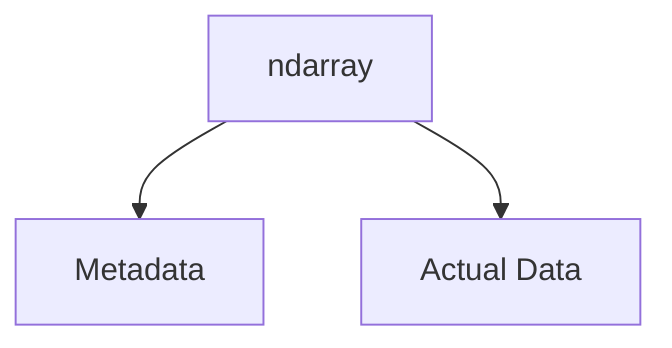
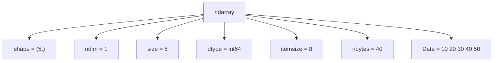

Excellent. This is the **first truly practical NumPy chapter**, and in my opinion, it is also **the most important NumPy object chapter**.

Almost every course teaches this like:

```python
arr.shape
arr.size
arr.ndim
arr.dtype
```

Students memorize these properties.

Then they forget them.

I don't want that.

Instead, I want you to think of an **`ndarray` as an actual object designed by engineers**.

By the end of this chapter, when you see

```python
arr.shape
```

you should think

> *"Ah, NumPy is reading metadata stored inside the ndarray object."*

instead of

> *"shape is just another function."*

This chapter will also prepare us for

* Slicing
* Views vs Copies
* Broadcasting
* Reshaping
* Matrix Operations
* Deep Learning Tensors

because **all of them depend on understanding the internal anatomy of an ndarray.**

---

# 📖 Chapter 2.2 — Anatomy of an ndarray

# *Understanding NumPy's Most Important Object*

> **"An ndarray is much more than a collection of numbers. It is a carefully engineered object that stores both data and metadata."**

---

# 🎯 Learning Objectives

By the end of this chapter, you will understand

* What an ndarray really is
* Data vs Metadata
* Shape
* Dimension (`ndim`)
* Size
* Data Type (`dtype`)
* Item Size (`itemsize`)
* Total Memory (`nbytes`)
* Why NumPy stores metadata
* How all these properties work together

---

# 🌍 Story — The Shipping Container

Imagine a shipping company.

You receive a container.

Outside the container,

there is a label.

```text
Container

Weight

Destination

Contents

Dimensions
```

Inside the container

are the actual goods.

Notice something.

The label

is NOT the goods.

It is information **about** the goods.

Computers call this

# Metadata

---

# Data vs Metadata

Suppose

```python
arr = np.array([10,20,30,40])
```

The numbers

```text
10

20

30

40
```

are

# Data

Everything else

like

```text
Shape

Size

Data Type

Memory Used

Dimensions
```

is

# Metadata

---

# Visual Representation



---

ASCII

```text
          ndarray

      ┌───────────────┐
      │   Metadata    │
      │───────────────│
      │ Shape         │
      │ Size          │
      │ dtype         │
      │ ndim          │
      │ itemsize      │
      │ nbytes        │
      ├───────────────┤
      │ Actual Data   │
      │10 20 30 40    │
      └───────────────┘
```

This is the most important mental model of this chapter.

---

# Creating Our Example Array

Throughout this chapter,

we'll use

```python
import numpy as np

arr = np.array([10,20,30,40,50])
```

---

# First Look

```python
print(arr)
```

Output

```text
[10 20 30 40 50]
```

Looks simple.

But internally,

NumPy stores much more information.

---

# The Anatomy of ndarray

Let's inspect it.

```python
print(type(arr))
```

Output

```text
<class 'numpy.ndarray'>
```

Remember

`ndarray`

means

> N-Dimensional Array

---

# Think Like an Engineer

Imagine a passport.

It stores

```text
Name

Age

Country

Passport Number

Photo
```

Similarly,

an ndarray stores

```text
Shape

Dimensions

dtype

Memory

Values
```

Everything required to work efficiently.

---

# Attribute 1 — Shape

Probably the most frequently used attribute.

```python
print(arr.shape)
```

Output

```text
(5,)
```

---

# What Does Shape Mean?

Shape tells us

> **How data is organized along each dimension.**

Our array contains

```text
10

20

30

40

50
```

One row.

Five elements.

Hence

```text
(5,)
```

---

# Visual

```text
Index

0   1   2   3   4

+----+----+----+----+----+
|10  |20  |30  |40  |50  |
+----+----+----+----+----+
```

Shape

```text
(5,)
```

---

# Two-Dimensional Example

```python
matrix = np.array([
    [1,2,3],
    [4,5,6]
])

print(matrix.shape)
```

Output

```text
(2,3)
```

Meaning

```text
2 Rows

3 Columns
```

Visualization

```text
      Cols

      0 1 2

Row0 1 2 3

Row1 4 5 6
```

---

# Mental Model

Think of

Shape

as

the **blueprint of a building**.

The blueprint tells

how rooms are arranged.

Not

what furniture is inside.

---

# Attribute 2 — ndim

```python
print(arr.ndim)
```

Output

```text
1
```

Meaning

One Dimension.

---

Two-dimensional example

```python
matrix.ndim
```

Output

```text
2
```

Three-dimensional arrays

would return

```text
3
```

---

# Difference Between Shape and ndim

Many beginners confuse these.

| Property | Meaning                   |
| -------- | ------------------------- |
| Shape    | Size along each dimension |
| ndim     | Number of dimensions      |

Example

```text
Shape = (2,3)

ndim = 2
```

---

# Visual

```text
Shape

↓

2 × 3

Dimension

↓

2
```

---

# Attribute 3 — Size

```python
print(arr.size)
```

Output

```text
5
```

Meaning

Total number of elements.

---

For

```python
matrix
```

Shape

```text
2 × 3
```

Size

```text
6
```

---

Formula

```text
Size

=

Product of Shape
```

Examples

```text
Shape

(5,)

↓

Size = 5


Shape

(2,3)

↓

Size = 6


Shape

(4,5,10)

↓

Size = 200
```

---

# Mental Model

Imagine a classroom.

Shape

↓

Rows and Columns.

Size

↓

Total Students.

---

# Attribute 4 — dtype

One of NumPy's most important properties.

```python
print(arr.dtype)
```

Output

```text
int64
```

(On many 64-bit systems. It may differ depending on your platform.)

---

# What is dtype?

It means

> **Data Type of every element in the array.**

Remember

NumPy Arrays are

Homogeneous.

Every element

has the same data type.

---

Examples

```python
np.array([1,2,3])
```

↓

```text
int64 (commonly)
```

---

```python
np.array([1.2,2.5])
```

↓

```text
float64 (commonly)
```

---

```python
np.array([True,False])
```

↓

```text
bool
```

---

# Why dtype Matters

Suppose NumPy allowed

```text
Integer

Float

String

Dictionary

```

inside one numerical array.

Contiguous memory would become much harder to maintain efficiently.

Homogeneous data enables

* predictable memory usage
* efficient arithmetic
* vectorization

---

# Attribute 5 — itemsize

```python
print(arr.itemsize)
```

Output

Typically

```text
8
```

Meaning

Each element

occupies

8 Bytes

(for `int64`).

---

Visualization

```text
10

↓

8 Bytes


20

↓

8 Bytes


30

↓

8 Bytes
```

---

# Attribute 6 — nbytes

```python
print(arr.nbytes)
```

Output

```text
40
```

Because

```text
5 Elements

×

8 Bytes

=

40 Bytes
```

---

Formula

```text
nbytes

=

size

×

itemsize
```

---

# Memory Visualization

```text
+--------+--------+--------+--------+--------+
|   10   |   20   |   30   |   40   |   50   |
+--------+--------+--------+--------+--------+
   8 B      8 B      8 B      8 B      8 B

Total = 40 Bytes
```

---

# Putting Everything Together

```python
import numpy as np

arr = np.array([10,20,30,40,50])

print(arr.shape)
print(arr.ndim)
print(arr.size)
print(arr.dtype)
print(arr.itemsize)
print(arr.nbytes)
```

Output

```text
(5,)
1
5
int64
8
40
```

(Exact `dtype` and `itemsize` may vary by platform.)

---

# Complete Anatomy Diagram



---

# Real Machine Learning Example

Imagine a dataset.

```python
X = np.array([
    [25,170],
    [30,165],
    [22,180]
])
```

Interpretation:

* 3 rows → 3 people
* 2 columns → Height and Weight (or any two features)

Now

```python
X.shape
```

returns

```text
(3,2)
```

Machine Learning algorithms use

* `shape`
* `dtype`
* `ndim`

constantly to validate inputs and perform efficient computations.

---

# Industry Perspective

Almost every NumPy-based library internally checks

```python
arr.shape

arr.dtype

arr.ndim
```

before computation.

Examples:

* Pandas
* Scikit-Learn
* TensorFlow
* PyTorch
* OpenCV

Input validation often begins with these properties.

---

# Mental Models

## 📦 Shipping Container

Metadata

↓

Label

Data

↓

Goods

---

## 🛂 Passport

Metadata

↓

Passport Information

Data

↓

Person

---

## 🏢 Building

Shape

↓

Blueprint

Size

↓

Total Rooms

---

# ⚠ Common Beginner Mistakes

---

## ❌ Shape equals Size.

Wrong.

```text
Shape

↓

Arrangement

Size

↓

Total Elements
```

---

## ❌ ndim equals Shape.

Wrong.

```text
Shape

(2,3)

↓

ndim

2
```

---

## ❌ dtype can be different for every element.

Not in a standard NumPy numeric array.

NumPy arrays are designed for homogeneous data.

---

## ❌ itemsize equals total memory.

Wrong.

```text
itemsize

↓

Memory of One Element


nbytes

↓

Memory of Entire Array
```

---

# 🎯 Interview Questions

## Basic

1. What is an ndarray?
2. What does `shape` return?
3. Difference between `shape` and `size`?
4. What is `dtype`?

---

## Intermediate

5. Explain `itemsize`.
6. Explain `nbytes`.
7. Why does NumPy store metadata?

---

## Advanced

8. Why is homogeneous `dtype` important for performance?
9. Explain the complete anatomy of an ndarray.
10. How do ML libraries use `shape` and `dtype` internally?

---

# 📝 Chapter Summary

✅ An `ndarray` contains both **data** and **metadata**.

✅ Metadata describes the array:

* `shape`
* `ndim`
* `size`
* `dtype`
* `itemsize`
* `nbytes`

✅ `shape` tells us how data is organized.

✅ `ndim` tells us how many dimensions exist.

✅ `size` tells us the total number of elements.

✅ `dtype` determines the data type of all elements.

✅ `itemsize` tells us the memory used by one element.

✅ `nbytes` tells us the total memory used by the array.

---

# 📌 One-Page Cheat Sheet

| Attribute  | Meaning                    | Example            |
| ---------- | -------------------------- | ------------------ |
| `shape`    | Elements in each dimension | `(2, 3)`           |
| `ndim`     | Number of dimensions       | `2`                |
| `size`     | Total elements             | `6`                |
| `dtype`    | Data type                  | `int64`, `float64` |
| `itemsize` | Bytes per element          | `8`                |
| `nbytes`   | Total memory               | `48`               |

**Remember:**

```text
ndarray
│
├── Data
│
└── Metadata
     ├── shape
     ├── ndim
     ├── size
     ├── dtype
     ├── itemsize
     └── nbytes
```

---

# ✅ Scaler Coverage Check

### Covered from Scaler

* ✔ Introduction to `ndarray`
* ✔ `shape`
* ✔ `ndim`
* ✔ `size`
* ✔ `dtype`
* ✔ `itemsize`
* ✔ `nbytes`

### Added Beyond Scaler

* ➕ Data vs Metadata from first principles
* ➕ Internal anatomy of an `ndarray`
* ➕ Memory calculations with formulas
* ➕ Multiple real-world analogies (Shipping Container, Passport, Building)
* ➕ Industry usage in ML frameworks
* ➕ Interview preparation
* ➕ Common misconceptions
* ➕ Complete conceptual model rather than attribute memorization

---

# 🚀 Preview — Chapter 2.3: Data Types (`dtype`) — The Hidden Power Behind NumPy Performance

Although we've introduced `dtype`, it deserves its own dedicated chapter because it is one of NumPy's most powerful features.

We'll explore:

* Why `dtype` exists
* Integer vs Float vs Boolean vs Complex types
* Signed vs Unsigned integers
* Platform differences (`int32` vs `int64`)
* Memory optimization using appropriate dtypes
* Overflow and precision
* How `dtype` influences speed, memory usage, and interoperability with Machine Learning libraries

Understanding `dtype` deeply will help you write NumPy code that is not only correct, but also memory-efficient and performant.

