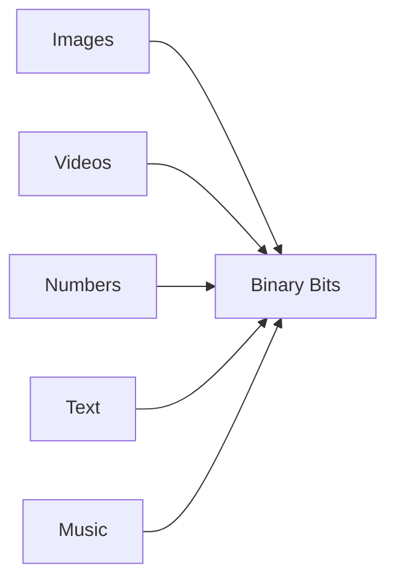
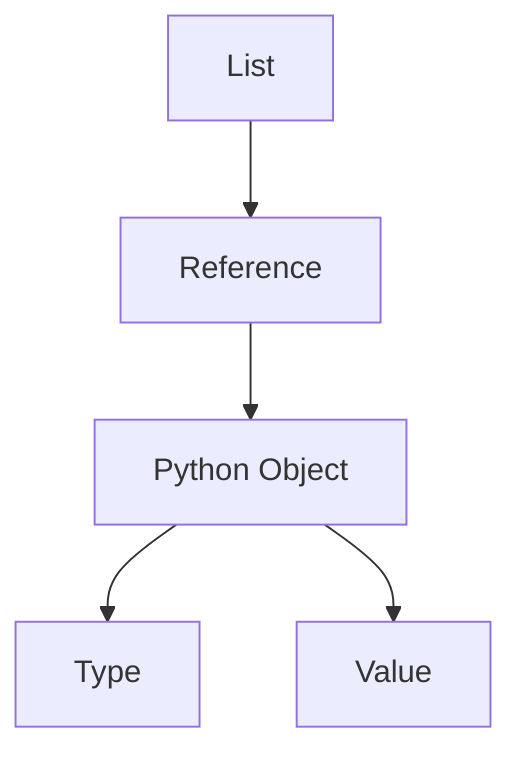
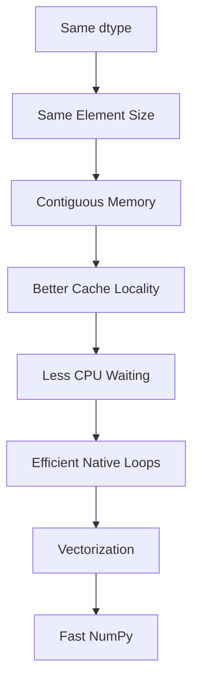

Yes. Let's make **Part 1** a complete standalone chapter worthy of an MIT-level notebook.

---

# Chapter 2.3.1 — Why Data Types Exist

# *The Story Behind `dtype`*

> **"A computer doesn't understand numbers. It only understands bits. A data type is the language that gives those bits meaning."**

---

# 🎯 Learning Objectives

By the end of this chapter, you will understand:

* Why data types exist
* Why computers cannot understand numbers directly
* Why everything inside a computer is just binary
* Why NumPy introduced `dtype`
* Why homogeneous data is the secret behind NumPy's speed
* The relationship between `dtype`, memory, CPU cache, and vectorization
* How this knowledge connects to Machine Learning

---

# 📖 Where We Are in Our Journey

Let's see how this chapter fits into the overall NumPy roadmap.

```text
NumPy Performance
        │
        ▼
Python Objects
        │
        ▼
Memory Layout
        │
        ▼
CPU Cache
        │
        ▼
Vectorization
        │
        ▼
ndarray Anatomy
        │
        ▼
⭐ Why Data Types Exist ⭐
        │
        ▼
Every NumPy dtype
        │
        ▼
Memory Optimization
        │
        ▼
Machine Learning
```

Notice something.

Everything we've learned so far naturally leads to one question:

> **How does the computer know whether a sequence of bits represents an integer, a decimal number, or a character?**

---

# 🌍 Story — The Mysterious Parcel

Imagine you're working in an international warehouse.

A delivery truck arrives.

Inside the truck is a sealed package.

```text
📦
```

There is **no label**.

Immediately dozens of questions arise.

* Is it glass?
* Is it food?
* Is it electronics?
* Is it medicine?
* Is it explosive?
* Is it clothing?

Without knowing **what the package contains**, nobody knows

* how to transport it,
* how to store it,
* how to open it,
* or whether it's even safe to touch.

Now imagine the same package with a label.

```text
📦

FRAGILE
Glass Items
```

Everything changes.

The workers instantly know

* Handle carefully
* Don't throw it
* Don't stack heavy boxes
* Keep it upright

The **contents never changed**.

Only the **label** changed.

That label completely changed how everyone treated the package.

---

A computer faces exactly the same problem.

Memory contains only bits.

Without a label,

the CPU has absolutely no idea

what those bits represent.

That label is called

# **Data Type**

---

# 🤔 The Biggest Misconception

Most beginners imagine memory like this.

```text
Memory

10

20

30

40

50
```

This is **not** how computers work.

---

## Reality

Memory actually looks more like this.

```text
01001010

00011101

11001010

01101010

10001010
```

Or even more accurately,

memory stores electrical states.

```text
ON

OFF

ON

ON

OFF

OFF

ON
```

We simply represent those states as

```text
1

0

1

1

0

0

1
```

Everything inside a computer—

* numbers,
* images,
* videos,
* music,
* text,
* machine learning models,

is ultimately stored as sequences of **0s and 1s**.

---

# Visual Representation



---

ASCII Version

```text
Images ───┐

Videos ───┤

Numbers ──┼────► Binary Bits

Text ─────┤

Music ────┘
```

Everything eventually becomes binary.

---

# 💡 But Wait...

Suppose memory contains

```text
01000001
```

Question:

What is this?

Take a minute.

Can you answer?

Actually,

you cannot.

Because

those bits

have **no inherent meaning**.

---

# One Sequence — Multiple Meanings

The same bits

```text
01000001
```

can mean completely different things depending on **how we interpret them**.

| Interpretation      | Meaning                                                 |
| ------------------- | ------------------------------------------------------- |
| ASCII Character     | `A`                                                     |
| Unsigned Integer    | `65`                                                    |
| Boolean             | Could represent part of a larger Boolean representation |
| RGB Image           | One color component                                     |
| Machine Instruction | Depends on CPU architecture                             |

Notice

The bits

never changed.

Only the **interpretation** changed.

---

# Language Analogy

Imagine someone says

```text
Gift
```

What does it mean?

English speaker

↓

Present

German speaker

↓

Poison

Same word.

Different language.

Exactly the same thing happens with bits.

Without knowing the language,

the sequence is meaningless.

---

# Data Type = Interpretation Rule

This leads to our first formal definition.

---

## 📖 Definition

> **A Data Type tells the computer how to interpret a sequence of binary bits.**

It answers questions like

* Is this an integer?
* Is this a decimal number?
* Is this text?
* Is this True or False?
* How many bytes does it occupy?
* Which arithmetic rules should be used?

---

# Visual


---

ASCII

```text
Binary

↓

dtype

↓

Meaning
```

---

# Why Not Just Store Numbers?

Excellent question.

Suppose you write

```python
10
```

How should the computer store it?

Should it use

```text
8 Bits?

16 Bits?

32 Bits?

64 Bits?
```

Nobody knows.

The computer needs instructions.

That's exactly what a data type provides.

---

# Example — Integer

Suppose we choose

```text
int8
```

The number

```text
10
```

is stored conceptually as

```text
00001010
```

Now the CPU knows

* this is an integer
* it occupies one byte
* arithmetic follows integer rules

---

# Example — Float

Now consider

```python
10.5
```

This cannot be stored using ordinary integer representation.

Instead,

the computer uses a completely different encoding called **IEEE-754 Floating Point**.

Conceptually,

```text
Sign

Exponent

Fraction
```

We'll study floating-point representation in a later section.

The important point is:

The bits are interpreted differently because the **dtype is different**.

---

# Example — Boolean

Suppose

```python
True
```

Conceptually,

it can be represented as

```text
1
```

while

```python
False
```

may be represented as

```text
0
```

Again,

same memory,

different interpretation.

---

# How Python Solves This Problem

Python allows

```python
data = [
    10,
    3.14,
    "Hello",
    True,
    {"age":25}
]
```

How is that possible?

Because every element is

its own Python object.

Each object stores

* Value
* Type
* Metadata

Visualization



Every object carries its own identity.

---

# Why NumPy Doesn't Do That

Suppose NumPy allowed

```text
10

↓

Integer

3.14

↓

Float

Hello

↓

String

True

↓

Boolean
```

Question.

How many bytes should each element occupy?

| Value   | Memory Requirement |
| ------- | ------------------ |
| Integer | Depends on dtype   |
| Float   | Usually larger     |
| Boolean | Smaller            |
| String  | Variable length    |

Now the CPU can no longer calculate

where the next element begins.

Performance suffers.

---

# NumPy's Brilliant Engineering Decision

NumPy says

> **One Array → One Data Type**

For example

```python
arr = np.array([10,20,30,40])
```

Every element is

```text
Integer

Integer

Integer

Integer
```

Perfect.

Now every element

occupies exactly the same amount of memory.

---

# Why Equal Size Matters

Imagine apartment buildings.

---

## Building A

Every apartment

has identical dimensions.

Construction is simple.

Navigation is easy.

Maintenance is predictable.

---

## Building B

Every apartment

has different dimensions.

Nothing lines up.

Everything becomes harder.

---

NumPy chooses

Building A.

---

# Relationship with Memory

Remember

our previous chapter.

```text
+--------+--------+--------+--------+
|   10   |   20   |   30   |   40   |
+--------+--------+--------+--------+
```

Every block

has identical size.

Therefore

NumPy instantly knows

where

the next element begins.

No searching.

No guessing.

---

# This Connects Everything We've Learned

Let's connect the entire story.



---

ASCII

```text
Same dtype
      │
      ▼
Same Memory Size
      │
      ▼
Contiguous Memory
      │
      ▼
Better Cache Locality
      │
      ▼
Less Waiting
      │
      ▼
Native Execution
      │
      ▼
Vectorization
      │
      ▼
Fast NumPy
```

Notice something beautiful.

Everything we've studied over the last **8 chapters** now connects.

---

# Real Machine Learning Example

Suppose you're training an image classifier.

One image contains

```text
224 × 224 × 3
```

pixels.

That's

```text
150,528
```

values.

Every pixel is stored as

```text
uint8
```

Every pixel occupies exactly

```text
1 Byte
```

Because every pixel has the same size,

the image becomes one contiguous block of memory.

This enables

* Fast loading
* Efficient convolution
* GPU acceleration
* Vectorized operations

Without a fixed dtype,

modern Deep Learning would be dramatically less efficient.

---

# Industry Perspective

Every major numerical framework depends on explicit dtypes.

| Framework  | Uses dtype? | Why?              |
| ---------- | ----------- | ----------------- |
| NumPy      | ✅           | Memory layout     |
| Pandas     | ✅           | Efficient columns |
| TensorFlow | ✅           | GPU kernels       |
| PyTorch    | ✅           | Tensor operations |
| JAX        | ✅           | XLA compilation   |
| OpenCV     | ✅           | Image processing  |

The common theme is

> **Predictable memory enables predictable performance.**

---

# 🧠 Mental Models

## 📦 Shipping Box

```text
Bits

↓

Package

dtype

↓

Label

↓

Meaning
```

---

## 🌍 Language

```text
Word

↓

Language

↓

Meaning
```

Same word.

Different language.

---

## 🏢 Apartment Building

```text
Same Apartment Size

↓

Easy Construction
```

↓

```text
Same Element Size

↓

Fast Memory Layout
```

---

## 📚 Dictionary

The letters

```
B A T
```

mean different things depending on the language or context.

Bits behave the same way.

Meaning comes from interpretation.

---

# ⚠ Common Beginner Mistakes

### ❌ Computers store integers.

No.

Computers store bits.

Integers are interpretations of those bits.

---

### ❌ dtype only affects memory.

Wrong.

It affects

* Memory
* Arithmetic
* Precision
* Overflow
* Performance
* Compatibility

---

### ❌ NumPy forces one dtype because of syntax.

Wrong.

It is a deliberate engineering choice to enable

* contiguous memory,
* vectorization,
* cache locality,
* and high-performance numerical computing.

---

# 🎯 Interview Questions

## Basic

1. Why do data types exist?
2. What is binary?
3. Why can't bits explain themselves?

---

## Intermediate

4. Why does NumPy require homogeneous dtypes?
5. How does dtype affect memory?
6. Explain the relationship between dtype and contiguous memory.

---

## Advanced

7. Explain why homogeneous data enables vectorization.
8. Why do TensorFlow and PyTorch require explicit dtypes?
9. How does dtype influence CPU cache efficiency?

---

# 📝 Chapter Summary

✅ Computers store only binary bits.

✅ Bits have no inherent meaning.

✅ A data type tells the computer how to interpret those bits.

✅ Python stores type information inside each object.

✅ NumPy uses one homogeneous dtype for an entire array.

✅ Homogeneous data enables equal-sized elements.

✅ Equal-sized elements enable contiguous memory.

✅ Contiguous memory improves cache locality.

✅ Better cache locality enables efficient vectorized numerical computation.

---

# 📌 Ultimate Cheat Sheet

| Concept             | Meaning                          |
| ------------------- | -------------------------------- |
| Binary              | Raw bits (`0` and `1`)           |
| Data Type (`dtype`) | Rules for interpreting bits      |
| Python              | Each object carries its own type |
| NumPy               | One dtype for the whole array    |
| Benefit             | Predictable memory + speed       |

---

# 🎯 Final Takeaway

This chapter answers one deceptively simple question:

> **Why does `dtype` exist?**

The answer is **not** "because NumPy needs to know whether something is an integer."

The deeper answer is:

> **`dtype` is the engineering contract between memory, the CPU, and numerical algorithms. It tells the computer how to interpret bits, enables fixed-size memory layouts, makes contiguous storage possible, improves cache locality, reduces computational overhead, and ultimately allows NumPy to achieve the performance that modern Machine Learning depends on.**

That single idea will keep reappearing throughout the rest of our NumPy, Pandas, and Deep Learning journey.

