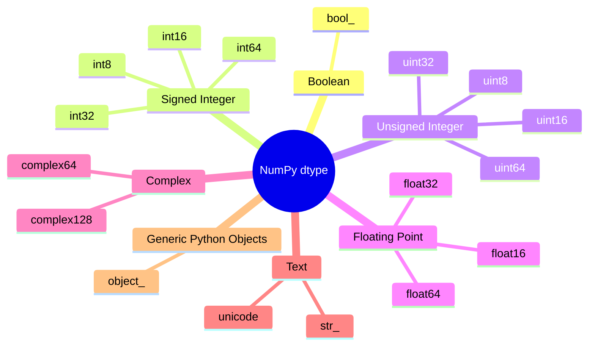

Excellent. Now we move to the chapter where most people start **memorizing** NumPy dtypes.

We won't.

We'll understand **why each dtype exists**, **what problem it solves**, and **when professionals choose it**.

This chapter will become your reference for years.

---

# 📖 Chapter 2.3.2 — Every NumPy Data Type

# *Understanding the Complete `dtype` Family*

> **"Different data types exist because different problems require different representations."**

---

# 🎯 Learning Objectives

By the end of this chapter, you will understand:

* Every major NumPy data type
* Why multiple integer types exist
* Signed vs Unsigned integers
* Floating point types
* Boolean type
* Complex numbers
* String types
* Object dtype
* Memory usage of each dtype
* Which dtype should be used in Machine Learning
* Industry best practices

---

# 🌍 Story — The Parking Lot

Imagine a city has only one parking space size.

```
□□□□□□□□□□□□□□□□□□□□□□□□
```

Now imagine parking:

* 🚲 Bicycle
* 🏍 Motorcycle
* 🚗 Car
* 🚐 Van
* 🚚 Truck

Everything gets the **same large parking slot**.

Huge waste.

Instead,

cities create different parking sizes.

```
Bike Slot
Car Slot
Truck Slot
```

Each vehicle gets

**exactly the amount of space it needs.**

---

NumPy works exactly the same way.

Different numbers require different amounts of memory.

---

# 🤔 Why Doesn't NumPy Use Just One Integer Type?

Suppose every number used

```
64 Bits
```

Even

```
0

1

2
```

would occupy

8 Bytes.

Wasteful.

Suppose every number used

```
8 Bits
```

Now

```
1000000000
```

cannot fit.

Neither solution works.

Hence

NumPy provides

multiple integer types.

---

# The Complete NumPy dtype Family

Let's organize all dtypes first.



---

## ASCII Version

```
NumPy dtype

├── Boolean
│      bool
│
├── Signed Integer
│      int8
│      int16
│      int32
│      int64
│
├── Unsigned Integer
│      uint8
│      uint16
│      uint32
│      uint64
│
├── Floating Point
│      float16
│      float32
│      float64
│
├── Complex Numbers
│      complex64
│      complex128
│
├── Strings
│      str_
│
└── Objects
       object_
```

---

# Classification by Purpose

| Category         | Stores                 | Examples  |
| ---------------- | ---------------------- | --------- |
| Boolean          | True/False             | bool      |
| Integer          | Whole Numbers          | int32     |
| Unsigned Integer | Positive Whole Numbers | uint8     |
| Float            | Decimal Numbers        | float32   |
| Complex          | Real + Imaginary       | complex64 |
| String           | Text                   | str       |
| Object           | Any Python Object      | object    |

---

# Category 1 — Boolean

The simplest dtype.

```python
np.array([True, False], dtype=np.bool_)
```

Output

```
[ True False ]
```

---

## What can it store?

Only

```
True

False
```

---

Memory

Typically

```
1 Byte
```

per element.

---

## Real Applications

* Machine Learning Masks

```python
is_adult = age >= 18
```

* Filtering

```python
salary > 50000
```

* Binary Images

```
0

1
```

---

# Visualization

```
True   False   True

│        │        │

1        0        1
```

---

# Category 2 — Signed Integers

These store

positive

and

negative

numbers.

Examples

```
-5

0

20

100
```

---

# Why "Signed"?

Because one bit stores

the sign.

```
+

-

```

---

## Integer Family

| dtype | Bytes | Approximate Range           |
| ----- | ----- | --------------------------- |
| int8  | 1     | −128 to 127                 |
| int16 | 2     | −32 thousand to 32 thousand |
| int32 | 4     | ±2.1 billion                |
| int64 | 8     | Very large integers         |

(*The exact ranges are powers of two and will be studied in the overflow chapter.*)

---

Visualization

```
int8

□□□□□□□□

8 Bits
```

---

```
int64

□□□□□□□□□□□□□□□□□□□□□□□□□□□□□□□□□□□□□□□□□□□□□□□□□□□□□□□□□□□□□□□□

64 Bits
```

---

# Why Multiple Sizes?

Suppose

Age

```
25
```

Needs

```
int64 ?
```

No.

```
int8
```

is sufficient.

Smaller memory.

Better cache utilization.

---

# Real Example

```python
ages = np.array([21,25,31], dtype=np.int8)
```

Excellent choice.

---

# Category 3 — Unsigned Integers

These store

only

positive numbers.

No negative values.

---

Examples

```
0

255

120

10
```

---

Family

| dtype  | Bytes | Typical Range Starts |
| ------ | ----- | -------------------- |
| uint8  | 1     | 0                    |
| uint16 | 2     | 0                    |
| uint32 | 4     | 0                    |
| uint64 | 8     | 0                    |

---

Why?

Because we don't waste a bit storing

the sign.

---

# Where is uint8 Used?

This is one of the most important ML examples.

Images.

Pixel values.

```
0

↓

Black


255

↓

White
```

Every grayscale pixel

fits perfectly inside

```
uint8
```

One byte.

No waste.

---

Image Example

```
120 140 150

110 200 255

30  90  80
```

Every pixel

```
uint8
```

---

# Category 4 — Floating Point Numbers

Integers cannot store

```
3.14

2.71

0.125
```

Need floating point.

---

Family

| dtype   | Bytes | Common Use           |
| ------- | ----- | -------------------- |
| float16 | 2     | GPUs / Inference     |
| float32 | 4     | Deep Learning        |
| float64 | 8     | Scientific Computing |

---

Example

```python
prices = np.array([10.5,20.75], dtype=np.float32)
```

---

Why Multiple Float Types?

Trade-off.

```
Memory

↓

Precision

↓

Speed
```

Different applications require different balances.

---

# Industry

Deep Learning

Mostly

```
float32
```

Scientific Computing

Often

```
float64
```

Mobile AI

Frequently

```
float16
```

---

# Category 5 — Complex Numbers

Mathematics sometimes needs numbers like

```
3 + 4i
```

NumPy supports this.

```python
np.array([1+2j])
```

Output

```
1+2j
```

---

Used in

* Signal Processing
* Fourier Transform
* Physics
* Electrical Engineering

Rare in beginner ML,

but essential in scientific computing.

---

# Category 6 — Strings

```python
names = np.array(["Alice","Bob"])
```

dtype

```
str
```

Useful,

but not optimized for numerical computation.

---

# Category 7 — Object

This one is dangerous.

Example

```python
np.array([1,"Hello",[1,2]], dtype=object)
```

Now NumPy stores

Python Objects.

Not raw values.

Meaning

many performance advantages disappear.

---

Visualization

```
object

↓

Reference

↓

Python Object

↓

Reference

↓

Python Object
```

Notice

We're back to something similar to Python Lists.

---

# Which dtypes Matter Most?

For Machine Learning,

these are the ones you'll use daily.

| dtype   | Importance |
| ------- | ---------- |
| int32   | ⭐⭐⭐⭐       |
| int64   | ⭐⭐⭐⭐⭐      |
| float32 | ⭐⭐⭐⭐⭐      |
| float64 | ⭐⭐⭐⭐       |
| bool    | ⭐⭐⭐⭐       |
| uint8   | ⭐⭐⭐⭐⭐      |

---

# Real ML Examples

### Images

```
uint8
```

---

### Labels

```
int32
```

---

### Neural Network Weights

```
float32
```

---

### Scientific Simulation

```
float64
```

---

### Masks

```
bool
```

---

# Memory Comparison

Suppose

One Million Numbers.

| dtype | Bytes per Element | Approx Memory |
| ----- | ----------------- | ------------- |
| int8  | 1                 | ~1 MB         |
| int16 | 2                 | ~2 MB         |
| int32 | 4                 | ~4 MB         |
| int64 | 8                 | ~8 MB         |

Notice

Choosing the wrong dtype

can multiply memory usage.

---

# Industry Perspective

Different libraries prefer different dtypes.

| Library    | Default Common dtype                 |
| ---------- | ------------------------------------ |
| NumPy      | int64 / float64 (platform dependent) |
| Pandas     | Depends on data                      |
| TensorFlow | float32                              |
| PyTorch    | float32                              |
| OpenCV     | uint8                                |

---

# Mental Models

## 🚗 Vehicle Sizes

```
Bike

↓

Small Slot

Car

↓

Medium Slot

Truck

↓

Large Slot
```

Exactly enough space.

---

## 📦 Shipping Boxes

Small item

↓

Small box

Large item

↓

Large box

No waste.

---

## 🏢 Apartments

Different families

need

different apartment sizes.

Numbers

need

different memory sizes.

---

# ⚠ Common Beginner Mistakes

### ❌ Bigger dtype is always better.

Wrong.

Larger dtype means

more memory.

---

### ❌ int64 is always faster.

Not necessarily.

Performance depends on workload, hardware, and memory behavior.

---

### ❌ object dtype is just another NumPy dtype.

It behaves very differently because it stores references to Python objects.

---

### ❌ float32 and float64 give identical precision.

No.

They trade memory for numerical precision.

We'll study this in detail in the precision chapter.

---

# 🎯 Interview Questions

## Basic

1. Why are there multiple integer dtypes?
2. Difference between signed and unsigned integers?
3. Why do floating-point dtypes exist?

---

## Intermediate

4. When should you use `uint8`?
5. Why is `float32` popular in Deep Learning?
6. Why should `object` dtype be avoided for numerical computation?

---

## Advanced

7. Explain the engineering trade-off between memory and precision.
8. Why are homogeneous dtypes important for NumPy's performance?
9. How does dtype selection affect cache utilization and memory footprint?

---

# 📝 Chapter Summary

✅ NumPy provides specialized data types for different categories of data.

✅ Integer types differ mainly in memory usage and value range.

✅ Unsigned integers efficiently store non-negative values.

✅ Floating-point types balance memory and numerical precision.

✅ `uint8` is the standard choice for image pixels.

✅ `float32` is the dominant dtype in modern Deep Learning.

✅ `object` dtype stores Python objects and sacrifices many NumPy performance benefits.

---

# 📌 Ultimate Cheat Sheet

| dtype      | Bytes     | Typical Use                    |
| ---------- | --------- | ------------------------------ |
| bool       | 1         | Masks, filters                 |
| int8       | 1         | Small integers                 |
| int16      | 2         | Medium integers                |
| int32      | 4         | Labels, IDs                    |
| int64      | 8         | Large integers                 |
| uint8      | 1         | Images                         |
| float16    | 2         | Inference, GPUs                |
| float32    | 4         | Deep Learning                  |
| float64    | 8         | Scientific computing           |
| complex64  | 8         | Signal processing              |
| complex128 | 16        | High-precision scientific work |
| str_       | Variable  | Text                           |
| object_    | Reference | Mixed Python objects           |

---

# ✅ Scaler Coverage Check

### Covered from Scaler

* ✔ Major NumPy dtypes
* ✔ Integer, float, boolean overview

### Added Beyond Scaler

* ➕ Complete dtype classification
* ➕ Engineering rationale behind each dtype
* ➕ Memory vs precision trade-offs
* ➕ Industry use cases (ML, CV, scientific computing)
* ➕ `object` dtype internals and performance implications
* ➕ Memory comparison tables
* ➕ Interview-focused explanations
* ➕ Practical dtype selection guidance

---

# 🚀 Preview — Chapter 2.3.3: Memory Representation of Every dtype

So far, we've learned **what** the different dtypes are.

Next, we'll go one level deeper and explore **how they are actually stored in memory**.

We'll visualize:

* `int8` vs `int16` vs `int32` vs `int64` bit layouts
* Signed vs unsigned binary representations
* How `float32` and `float64` are organized internally (sign, exponent, mantissa)
* Memory diagrams for each dtype
* Why different dtypes consume different amounts of memory
* How these representations influence overflow, precision, and computational performance

This chapter will bridge NumPy with fundamental Computer Architecture concepts and prepare us for the upcoming chapters on **overflow** and **floating-point precision**.

