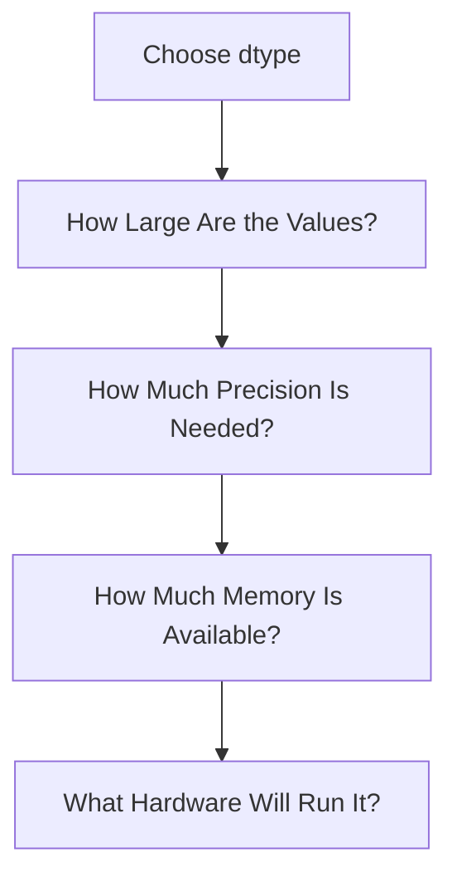
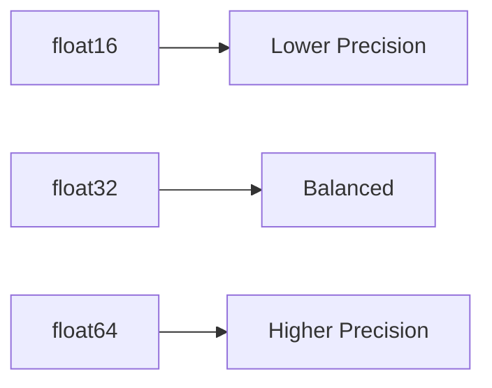
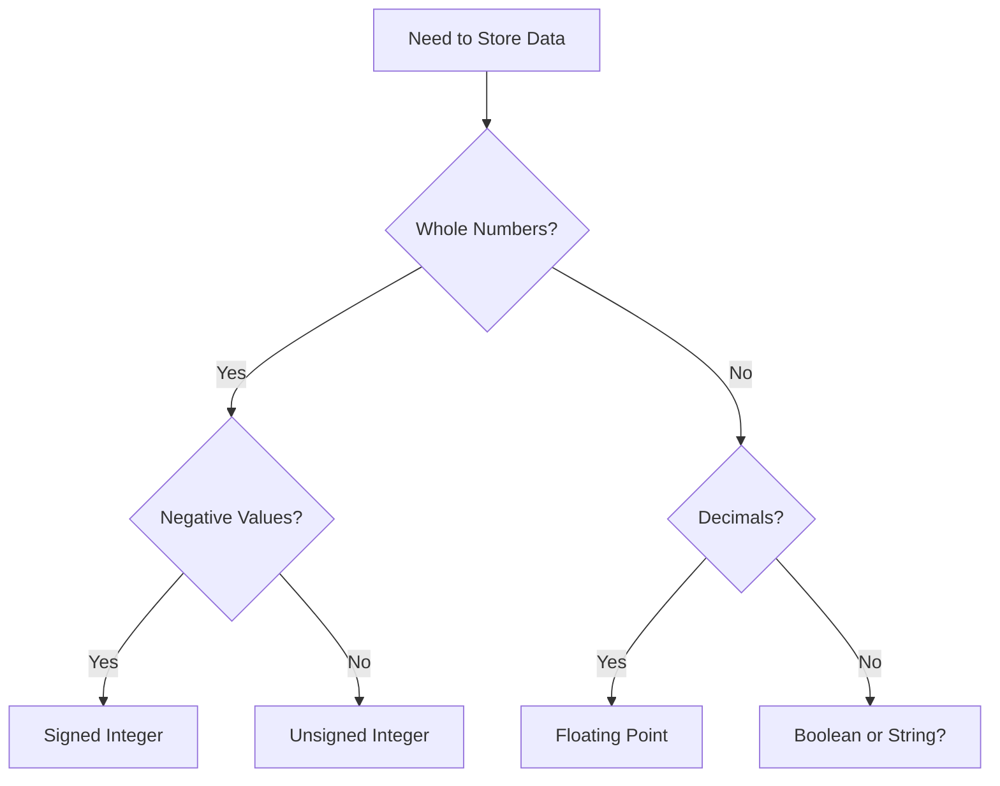

Excellent. This is one of those chapters that separates someone who **knows NumPy** from someone who **thinks like an ML Engineer**.

Most tutorials simply tell you:

```python
dtype=np.float32
```

without explaining **why**.

In industry, choosing the wrong `dtype` can:

* Double your RAM usage
* Cause GPU Out of Memory (OOM) errors
* Slow down training
* Reduce numerical precision
* Increase cloud costs

This chapter will teach you **how professionals choose dtypes**, not just what they are.

---

# 📖 Chapter 2.3.4 — Choosing the Right `dtype`

# *An Engineer's Decision, Not a Guess*

> **"Choosing a dtype is a trade-off between memory, precision, performance, and the problem you're trying to solve."**

---

# 🎯 Learning Objectives

By the end of this chapter, you will understand:

* Why choosing the correct dtype matters
* The four factors engineers consider
* Memory vs Precision trade-offs
* When to use `int8`, `int32`, `float32`, etc.
* Industry best practices
* How ML engineers choose dtypes
* Common mistakes beginners make

---

# 🌍 Story — Buying a Vehicle

Imagine you need transportation.

Would you buy a truck to commute alone?

```text
🚛
```

Probably not.

Would you buy a bicycle to transport 10 tons of steel?

```text
🚲
```

Also impossible.

The best vehicle depends on the task.

Exactly the same is true for NumPy data types.

There is **no universally best dtype**.

There is only the **most appropriate dtype for a specific problem**.

---

# The Engineer's Thought Process

A beginner asks

> Which dtype is best?

An engineer asks

> What are my constraints?

Professional engineers evaluate four questions.



---

ASCII

```text
Choose dtype

↓

Maximum Value?

↓

Required Precision?

↓

Memory Available?

↓

CPU / GPU?

↓

Choose dtype
```

---

# The Four Pillars of dtype Selection

Everything in this chapter comes down to these four pillars.

| Factor      | Question                                         |
| ----------- | ------------------------------------------------ |
| Value Range | How big can the numbers become?                  |
| Precision   | How accurate must calculations be?               |
| Memory      | How much RAM/GPU memory do we have?              |
| Performance | Which dtype is optimized on the target hardware? |

Think of these as your engineering checklist.

---

# Pillar 1 — Value Range

The first question is always

> **What is the largest and smallest value I need to store?**

Example

Student ages

```text
18

22

35

41
```

Maximum

```text
41
```

Does this require

```text
int64 ?
```

No.

Even

```text
int8
```

can represent these values comfortably.

---

Visualization

```text
Age

↓

41

↓

int8

✓
```

---

Now consider

India's population.

```text
1,450,000,000
```

`int8`

Obviously impossible.

Need

```text
int32
```

or

```text
int64
```

---

# Engineering Rule 1

> **Choose the smallest dtype that safely represents all possible values.**

Smaller dtypes:

* Reduce memory
* Improve cache utilization
* Allow larger datasets in RAM

---

# Pillar 2 — Precision

Suppose you're storing

```text
3.141592653589793
```

Should you use

```text
float16 ?
```

Probably not.

Too much information will be lost.

---

Compare

```text
float16

↓

3.14
```

```text
float32

↓

3.1415927
```

```text
float64

↓

3.141592653589793
```

(The exact stored values depend on IEEE-754 representation and rounding.)

---

Visualization



---

Engineering Rule

> **Use the lowest precision that still produces correct results.**

---

# Pillar 3 — Memory

Suppose

you have

100 million numbers.

Let's compare.

| dtype | Memory  |
| ----- | ------- |
| int8  | ~100 MB |
| int16 | ~200 MB |
| int32 | ~400 MB |
| int64 | ~800 MB |

One decision

↓

700 MB difference.

---

Visualization

```text
int8

█

int16

██

int32

████

int64

████████
```

Same data.

Different memory.

---

# Pillar 4 — Hardware

Hardware matters.

Modern GPUs are highly optimized for

```text
float32
```

Many AI accelerators are optimized for

```text
float16
```

Embedded AI devices often use

```text
int8
```

Professional engineers don't only think about mathematics.

They think about

**hardware capabilities.**

---

# Putting Everything Together

Suppose you're designing a system.

Ask yourself



This simple decision tree is surprisingly useful.

---

# Real-World Example 1 — Student Ages

Data

```text
21

19

24

30
```

Need

Negative numbers?

No.

Decimals?

No.

Largest value?

30.

Possible choices

```text
int8

✓
```

Using

```text
int64
```

would waste memory.

---

# Real-World Example 2 — Image Processing

Pixel values

```text
0

255
```

Need decimals?

No.

Need negatives?

No.

Need values above 255?

No.

Perfect choice

```text
uint8
```

This is exactly why JPEGs, PNGs, and OpenCV commonly use 8-bit unsigned integers for standard image channels.

---

# Real-World Example 3 — Deep Learning

Neural network weights

```text
0.152

-0.837

1.203
```

Need decimals?

Yes.

Need very high precision?

Usually no.

Industry standard

```text
float32
```

Why?

Excellent balance between

* Accuracy
* Speed
* GPU optimization
* Memory

---

# Real-World Example 4 — Scientific Computing

Suppose

NASA

simulates planetary motion.

Tiny rounding errors

can accumulate over millions of calculations.

Here

```text
float64
```

is often preferred.

---

# Real-World Example 5 — Boolean Masks

Suppose

```python
salary > 50000
```

Result

```text
True

False

True

False
```

Need integers?

No.

Need decimals?

No.

Correct dtype

```text
bool
```

---

# Industry Cheat Sheet

| Problem               | Recommended dtype | Why                        |
| --------------------- | ----------------- | -------------------------- |
| Student Age           | int8              | Small integers             |
| Employee ID           | int32             | Moderate range             |
| Population            | int64             | Large values               |
| Images                | uint8             | Pixel values 0–255         |
| Neural Networks       | float32           | Memory + Speed             |
| Scientific Simulation | float64           | Higher numerical precision |
| Binary Masks          | bool              | Only two states            |
| Embedded AI           | int8              | Smaller models             |

---

# Decision Matrix

| Question                | If YES        | If NO        |
| ----------------------- | ------------- | ------------ |
| Need decimals?          | float32/64    | Integer      |
| Need negatives?         | Signed int    | Unsigned int |
| Need maximum precision? | float64       | float32      |
| Memory limited?         | Smaller dtype | Larger dtype |

---

# Memory Savings Example

Suppose

100 million ages.

Using

```text
int64
```

Memory

```text
800 MB
```

Using

```text
int8
```

Memory

```text
100 MB
```

Savings

```text
700 MB
```

One engineering decision.

No algorithm changed.

---

# How ML Engineers Think

Instead of asking

> Which dtype should I use?

they ask

```text
What is my data?

↓

How large are the values?

↓

Do I need decimals?

↓

How much precision?

↓

How much memory?

↓

Which hardware?

↓

Choose dtype.
```

---

# Mental Models

---

## 🚗 Vehicle Selection

```text
Bike

↓

Small Job

Car

↓

Daily Work

Truck

↓

Heavy Load
```

Different tasks.

Different vehicles.

---

## 📦 Box Size

Small item

↓

Small box.

Large item

↓

Large box.

---

## 🏢 Apartment

One person

↓

Studio Apartment

Family

↓

Large Apartment

Don't waste space.

---

# Common Beginner Mistakes

---

## ❌ Always use int64.

Wrong.

Use the smallest safe integer type.

---

## ❌ Always use float64.

Not in Machine Learning.

Most frameworks default to

```text
float32
```

because it is usually sufficient and more efficient.

---

## ❌ uint8 is only for images.

No.

It can be used for **any non-negative integer values within the range 0–255**.

---

## ❌ Smaller dtype is always better.

No.

If the value exceeds the dtype's range,

overflow occurs.

We'll study that next.

---

# Industry Perspective

Let's see what major frameworks prefer.

| Framework    | Common Default                                     |
| ------------ | -------------------------------------------------- |
| NumPy        | Platform-dependent (`int64`, `float64` are common) |
| Pandas       | Depends on inferred data                           |
| TensorFlow   | float32                                            |
| PyTorch      | float32                                            |
| OpenCV       | uint8                                              |
| ONNX Runtime | float32 / float16                                  |
| TensorRT     | float16 / int8                                     |

Notice

The "best" dtype depends on

the application.

---

# 🎯 Interview Questions

## Basic

1. Why shouldn't you always use `int64`?
2. Why are images stored as `uint8`?
3. Why is `float32` popular in Deep Learning?

---

## Intermediate

4. Explain the trade-off between memory and precision.
5. How would you choose a dtype for a new dataset?
6. Why is `bool` better than `int32` for masks?

---

## Advanced

7. Explain how dtype affects cache locality.
8. How can choosing the wrong dtype increase cloud infrastructure costs?
9. Design the dtype strategy for:

   * Customer IDs
   * Satellite Images
   * Stock Prices
   * Neural Network Weights
   * Binary Classification Labels

---

# 📝 Chapter Summary

✅ Choosing a dtype is an engineering decision.

✅ Four factors drive the decision:

* Value Range
* Precision
* Memory
* Hardware

✅ Smaller dtypes reduce memory usage but have smaller ranges.

✅ `float32` is the industry standard for Deep Learning.

✅ `uint8` is ideal for image pixels.

✅ Always choose the smallest dtype that safely satisfies your application's requirements.

---

# 📌 Engineer's Decision Tree (One-Page Revision)

```text
Need Decimal Numbers?
        │
   Yes ─┴──► Float
        │
        ▼
Need Very High Precision?
        │
   Yes ─┴──► float64
        │
   No  ─┴──► float32


Need Whole Numbers?
        │
        ▼
Need Negative Values?
        │
Yes ───────► Signed Integer
No ────────► Unsigned Integer

Choose the smallest safe size.
```

---

# 📌 Ultimate Cheat Sheet

| Data                   | Best dtype                                 |
| ---------------------- | ------------------------------------------ |
| Age                    | int8                                       |
| Temperature            | float32                                    |
| Image Pixels           | uint8                                      |
| Neural Network Weights | float32                                    |
| Scientific Simulation  | float64                                    |
| Boolean Mask           | bool                                       |
| Customer ID            | int32 / int64 (depending on maximum value) |

---

# ✅ Scaler Coverage Check

### Covered from Scaler

* ✔ Choosing appropriate dtypes
* ✔ Memory considerations
* ✔ Basic dtype recommendations

### Added Beyond Scaler

* ➕ Engineering decision framework
* ➕ Four-pillar decision model
* ➕ Practical decision tree
* ➕ Multiple real-world case studies
* ➕ Industry framework defaults
* ➕ Hardware-aware dtype selection
* ➕ Memory cost analysis
* ➕ ML engineering perspective
* ➕ FAANG-style interview questions

---

# 🚀 Preview — Chapter 2.3.5: Overflow — When Computers "Wrap Around"

So far, we've assumed numbers always fit into their chosen dtype.

But what happens when they **don't**?

For example:

```python
import numpy as np

x = np.array([127], dtype=np.int8)
print(x + 1)
```

Many beginners expect:

```text
128
```

Instead, they'll observe a surprising result because the value can no longer be represented in `int8`.

In the next chapter, we'll uncover:

* Why overflow happens
* How binary limits cause wrap-around behavior
* Two's complement representation
* Signed vs unsigned overflow
* Why overflow can silently produce incorrect results
* Real-world bugs caused by overflow
* How ML libraries and data pipelines guard against it

After that chapter, you'll never be surprised by integer overflow again.

