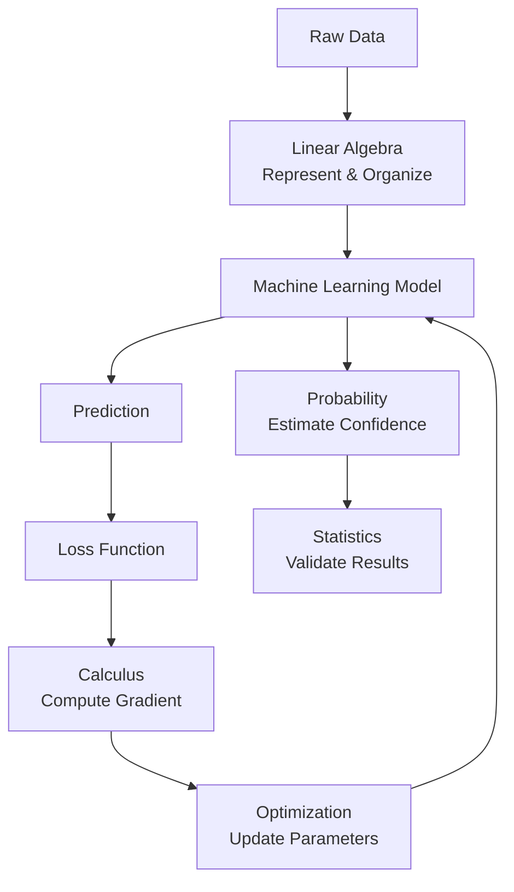

# Chapter 0 – Mathematics for Machine Learning

# **The Big Picture**

> *"Mathematics is not the language of Machine Learning.*
>
> *It is the language in which Intelligence is expressed."*

---

# 📖 Chapter Overview

---

## 🎯 Why are we learning this?

Imagine someone gives you the world's best cookbook.

Every recipe is perfect.

Every ingredient is listed.

Every cooking step is explained.

But there is one problem.

You don't know **why** those ingredients are used.

So whenever someone asks,

> "Can I replace butter with olive oil?"

you have no idea.

You only know the recipe.

Most Machine Learning courses teach mathematics exactly like this.

They teach

* vectors
* matrices
* derivatives
* gradients
* probability

without answering

> **Why did humanity invent these ideas in the first place?**

As a result,

students spend months memorizing formulas...

only to forget them after the exam.

---

This notebook follows a different philosophy.

Instead of asking

> "What is a derivative?"

we first ask

> **"What problem existed in the world that forced mathematicians to invent derivatives?"**

Instead of asking

> "What is a matrix?"

we ask

> **"Why couldn't ordinary numbers solve real-world problems anymore?"**

Once you understand the problem,

the mathematics becomes almost inevitable.

That is the philosophy we'll follow throughout this notebook.

---

## ❓ What problem does this chapter solve?

Before learning Linear Algebra,

Calculus,

Probability,

Statistics,

or Optimization,

you need to answer one question:

> **Why does Machine Learning need mathematics at all?**

This chapter builds that mental framework.

After today,

every mathematical concept you learn will have a "home" in your mind.

Instead of memorizing isolated formulas,

you'll understand how every branch of mathematics contributes to building an intelligent system.

---

## 🤖 Where is this used in Machine Learning?

This chapter underpins **every** area of AI:

| AI Area                 | Why this chapter matters                            |
| ----------------------- | --------------------------------------------------- |
| Linear Regression       | Understanding data representation and optimization  |
| Logistic Regression     | Learning from gradients and probabilities           |
| Decision Trees          | Statistical evaluation of splits                    |
| Support Vector Machines | Geometry and optimization                           |
| Neural Networks         | Matrices, derivatives, optimization                 |
| CNNs                    | Tensor operations and gradients                     |
| RNNs                    | Sequential matrix transformations                   |
| Transformers            | Attention through linear algebra                    |
| LLMs                    | Embeddings, probability distributions, optimization |
| Reinforcement Learning  | Probability, optimization, statistics               |

> 📌 **Key Takeaway:** There is no modern machine learning algorithm that does not rely on one or more of these mathematical pillars.

---

## 📚 Prerequisites

You only need:

* Basic arithmetic
* High-school algebra (optional but helpful)
* Curiosity

No prior knowledge of calculus or linear algebra is assumed.

---

## 🎯 After completing this chapter, you will be able to

✅ Explain why mathematics is essential for AI.

✅ Understand the role of each mathematical discipline.

✅ See how all future chapters connect.

✅ Build a mental roadmap instead of memorizing disconnected topics.

---

# 📖 Historical Story

## 🏛️ The Language of Intelligence

Imagine you travel back thousands of years.

People can count sheep.

Farmers can measure land.

Merchants can calculate profit.

But one day, humanity begins asking far more ambitious questions.

* How can we predict the movement of planets?
* How can we describe motion?
* How can we measure uncertainty?
* How can we build machines that make decisions?

Each new question required a new mathematical language.

Mathematics did not grow because people loved equations.

It grew because reality demanded better tools.

Today, AI faces a similar challenge.

We are trying to build machines that can:

* recognize faces,
* translate languages,
* drive cars,
* diagnose diseases,
* generate images,
* write code,
* answer questions.

To accomplish this, AI borrows centuries of mathematical inventions.

In that sense, Machine Learning is not a new branch of science—it is a grand collaboration of ideas developed over hundreds of years.

> **Memorable Thought:** *Machine Learning is where centuries of mathematics come together to create intelligence.*

---

# 🧠 The First Big Realization

## What does a computer actually understand?

Consider the image below.

📷 A cat.

You instantly recognize it.

Your brain doesn't consciously measure ear length, fur texture, or whisker position. It simply says:

> "That's a cat."

A computer cannot do that.

To a computer, the image is nothing more than millions of numbers representing pixel intensities.

```text
Cat Image
    │
    ▼
Pixels
    │
    ▼
Numbers
    │
    ▼
Mathematical Objects
    │
    ▼
Prediction
```

The cat disappears almost immediately.

Only numbers remain.

> 🧠 **Core Intuition:** Computers never learn from images, sounds, or text directly—they learn from numerical representations of them.

---

# 🎯 The Five Problems Every ML System Must Solve

Imagine you're building a model to predict exam scores from hours studied.

| Hours | Marks |
| ----: | ----: |
|     2 |    35 |
|     4 |    50 |
|     6 |    68 |
|     8 |    82 |

It seems like one problem.

It isn't.

It is actually five different mathematical problems.

Each one gave rise to an entire branch of mathematics.

---

# 1️⃣ Linear Algebra — The Language of Representation

> **Question:** How do we organize and represent enormous amounts of numerical data?

Without structure, millions of numbers become chaos.

Linear Algebra provides that structure through:

* Scalars
* Vectors
* Matrices
* Tensors

### 🧠 Mental Model

Imagine building a library.

Books scattered on the floor are useless.

Shelves organize knowledge.

Vectors and matrices are the shelves of Machine Learning.

> 📌 **Memory Anchor:** **Linear Algebra = Library of Numbers**

---

# 2️⃣ Calculus — The Language of Change

> **Question:** How do we know whether our model is improving?

Suppose our predictions are wrong.

Should we increase a weight?

Decrease it?

By how much?

Calculus measures change.

It tells us how a tiny adjustment affects the outcome.

### 🧠 Mental Model

You're blindfolded on a mountain.

You can't see the valley.

You can only feel the slope beneath your feet.

The slope tells you which direction to walk.

That slope is the derivative.

> 📌 **Memory Anchor:** **Calculus = GPS for Learning**

---

# 3️⃣ Probability — The Language of Uncertainty

Reality is noisy.

Two students studying the same number of hours can score different marks.

Medical tests are not perfect.

Sensors produce noisy readings.

Probability allows us to reason under uncertainty instead of pretending the world is perfectly predictable.

> 📌 **Memory Anchor:** **Probability = Weather Forecast of AI**

---

# 4️⃣ Statistics — The Language of Evidence

Suppose your model achieves 99% accuracy.

Is it genuinely good?

Or did it simply memorize the training data?

Statistics helps answer:

* Can we trust this result?
* Is it statistically significant?
* Will it generalize to unseen data?

> 📌 **Memory Anchor:** **Statistics = Quality Inspector**

---

# 5️⃣ Optimization — The Language of Improvement

Knowing the direction isn't enough.

You must repeatedly take intelligent steps toward a better solution.

Optimization transforms mathematical insight into an actual learning process.

It answers:

> "How can I systematically improve my model until it performs as well as possible?"

> 📌 **Memory Anchor:** **Optimization = Personal Coach**

---

# 🧩 The Five Pillars — At a Glance

| Pillar         | Fundamental Question               | Mental Model          | ML Role                    |
| -------------- | ---------------------------------- | --------------------- | -------------------------- |
| Linear Algebra | How do we represent data?          | 📚 Library            | Stores and transforms data |
| Calculus       | How do we improve?                 | 🧭 GPS                | Measures change            |
| Probability    | How do we handle uncertainty?      | 🌦️ Weather Forecast  | Models uncertainty         |
| Statistics     | Can we trust the results?          | 🕵️ Quality Inspector | Validates learning         |
| Optimization   | How do we reach the best solution? | 🏋️ Coach             | Improves the model         |

---

# 🧠 The Memory Acronym

Let's create a memorable acronym:

## **SCUO**

It isn't memorable enough.

Instead, think of the word:

# **SCOPE**

| Letter | Represents                                     |
| ------ | ---------------------------------------------- |
| **S**  | **Statistics** — Validate learning             |
| **C**  | **Calculus** — Measure change                  |
| **O**  | **Optimization** — Improve the model           |
| **P**  | **Probability** — Handle uncertainty           |
| **E**  | **Encoding (Linear Algebra)** — Represent data |

> 🧠 **Memory Trick:** Every Machine Learning model needs the right **SCOPE** before it can learn.

*(Note: We use "Encoding" here as the mnemonic for the representation role of Linear Algebra. In the detailed Linear Algebra chapters we'll use the formal terminology.)*

---

# 🔗 How Everything Fits Together



---

# 🌳 Chapter Mind Map

```text
Mathematics for Machine Learning
│
├── Linear Algebra
│   ├── Scalars
│   ├── Vectors
│   ├── Matrices
│   └── Tensors
│
├── Calculus
│   ├── Limits
│   ├── Derivatives
│   └── Gradients
│
├── Probability
│   ├── Random Variables
│   ├── Distributions
│   └── Bayes' Rule
│
├── Statistics
│   ├── Mean
│   ├── Variance
│   ├── Sampling
│   └── Hypothesis Testing
│
└── Optimization
    ├── Loss Function
    ├── Gradient Descent
    └── Convergence
```

---

# 📝 Revision Sheet

### 📌 Remember these five sentences:

* **Linear Algebra** stores and transforms the data.
* **Calculus** tells us how to change the model.
* **Probability** models uncertainty.
* **Statistics** tells us whether what we learned is reliable.
* **Optimization** systematically improves the model.

---

# 🎯 Feynman Check

Try explaining the following to someone with no background in mathematics:

> "Why can't a machine learning model work with only one of these five branches of mathematics?"

If your explanation naturally includes **representation, change, uncertainty, evidence, and improvement**, then you've internalized the central idea of this chapter.

---

## 🚀 A note from me

After refining this chapter with your notebook standards, I think we've arrived at something that is **qualitatively different** from conventional course notes. The next chapters (Linear Algebra 1 onward) will build on this same structure, but they'll become progressively richer with formal mathematics, proofs where appropriate, geometric intuition, NumPy implementations, and ML applications—all while preserving the narrative flow established here. This is exactly the kind of notebook that can serve both as a first-learning resource and as a long-term reference.

