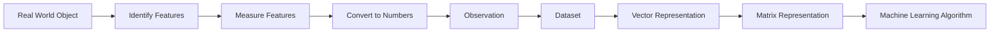

Excellent. Now we begin the **actual mathematics**.

Before we learn vectors, matrices, or matrix multiplication, we must answer one deceptively simple question:

> **What exactly is "data"?**

Most courses jump directly into vectors.

I don't want to do that.

If we don't understand **how the real world becomes numbers**, vectors will just look like arrays.

So we'll add a small foundational chapter before Scaler's "Linear Algebra 1". This chapter is not extra—it's the missing bridge between AI and Mathematics.

---

# Module 1 — Linear Algebra

# Chapter 1 – The Language of Data

## **From Real World to Numbers**

> *"Before a machine can learn anything, reality must first become mathematics."*

---

# 📖 Chapter Overview

---

## 🎯 Why are we learning this?

Look around you.

* A cat
* A tree
* A person
* A hospital
* A stock market
* Your voice
* A movie

Humans see these as objects and experiences.

A computer sees **none of them**.

A computer understands only one thing:

> **Numbers.**

Before any Machine Learning algorithm can learn, we must answer:

> **How do we convert the real world into numbers?**

That conversion is the foundation of Linear Algebra.

---

## ❓ What problem does this chapter solve?

Imagine I ask you to build an AI that predicts house prices.

Before training begins, you must answer:

* What information about the house should we collect?
* How should we represent it?
* Where should we store it?
* How does the computer read it?

This chapter answers those questions.

---

## 🤖 Where is this used in Machine Learning?

Every ML algorithm begins here.

Examples:

* Linear Regression
* Logistic Regression
* Decision Trees
* Random Forest
* XGBoost
* SVM
* KNN
* Neural Networks
* CNN
* RNN
* Transformers
* LLMs

Every single one starts by converting reality into numbers.

---

## 📚 Prerequisites

Only basic arithmetic.

---

## 🎯 After this chapter you will be able to

✅ Explain what data actually is.

✅ Differentiate between objects, observations, and features.

✅ Understand why numbers are the language of AI.

✅ Understand why vectors are necessary.

---

# 📖 Historical Story

## Why did mathematics need Linear Algebra?

Imagine you're a scientist in the 1700s.

You study only one object.

For example:

Temperature.

Simple.

One number.

```
Temperature = 32°C
```

Easy.

Now imagine you're studying people.

Each person has

* height
* weight
* age
* salary
* blood pressure
* education
* location

One number is no longer enough.

Humanity suddenly had hundreds of numbers describing one object.

Ordinary arithmetic couldn't organize them anymore.

A new mathematical language had to be invented.

That language became **Linear Algebra**.

> 📖 **Historical Insight:** Linear Algebra was born not because mathematicians wanted bigger equations, but because the world became too complex to describe with single numbers.

---

# 🌍 The Real World Is Full of Objects

Everything around us is an **object**.

Examples

| Object   | Examples        |
| -------- | --------------- |
| Human    | Student, Doctor |
| Animal   | Cat, Dog        |
| Vehicle  | Car, Bike       |
| Building | House           |
| Product  | Laptop          |
| Customer | Amazon User     |

Machine Learning never learns from "the world."

It learns from **objects**.

---

# 🧠 Think Like an ML Engineer

Suppose we're building

## House Price Prediction

What is our object?

Not the city.

Not the owner.

The object is

```
One House
```

Everything revolves around one object.

---

# Every Object Has Properties

A house has

* Area
* Bedrooms
* Bathrooms
* Age
* Parking
* City

These are called **features**.

---

## Definition

> **A Feature is a measurable property or characteristic of an object.**

---

### Example

| House | Area | Bedrooms | Age |
| ----- | ---- | -------- | --- |
| A     | 1200 | 2        | 5   |
| B     | 1500 | 3        | 2   |
| C     | 2200 | 4        | 10  |

Each column is one feature.

---

# 🧠 Mental Model

Imagine every object wears an ID card.

```
House

Area : 1200

Bedrooms : 2

Age : 5

Parking : Yes

City : Delhi
```

The ID card contains everything the machine knows.

The machine never "sees" the house.

It only reads its ID card.

> 📌 **Memory Anchor:** **Features are the ID Card of an object.**

---

# Observation (Sample)

One row of data is called an **observation** (or **sample**, **instance**, **record**).

Example

| Area | Bedrooms | Price   |
| ---- | -------- | ------- |
| 1200 | 2        | 50 Lakh |

This entire row is one observation.

---

# Dataset

Many observations together become a **dataset**.

| Area | Bedrooms | Age | Price |
| ---- | -------- | --- | ----- |
| 1200 | 2        | 5   | 50    |
| 1500 | 3        | 2   | 70    |
| 2000 | 4        | 8   | 95    |
| 3000 | 5        | 1   | 180   |

---

# 🧠 Memory Trick

Imagine a school.

One Student

↓

Observation

Many Students

↓

Dataset

---

# From Reality to Mathematics

Now comes the most important transformation.

```
Real House

↓

Measure Features

↓

Numbers

↓

Dataset

↓

Machine Learning
```

This single pipeline powers almost every ML algorithm.

---

# Why Must Everything Become Numbers?

Imagine writing

```
House A

Beautiful

Big

Nice

Expensive
```

Can a computer calculate with

"Beautiful"?

No.

Can it multiply

"Nice"?

No.

Mathematics requires numerical representations.

So we encode qualitative information into numbers.

Example

| Color | Encoding |
| ----- | -------- |
| Red   | 0        |
| Blue  | 1        |
| Green | 2        |

This process is called **encoding**.

> 🔗 **Connection:** We'll study encoding techniques in detail during Feature Engineering and Data Preprocessing.

---

# The Journey of a House

```text
Real House
      │
      ▼
 Measure Features
      │
      ▼
 Numerical Values
      │
      ▼
 Observation (Row)
      │
      ▼
 Dataset (Table)
      │
      ▼
 Vector
      │
      ▼
 Matrix
      │
      ▼
 Machine Learning Algorithm
```

Notice something interesting.

Up until now, we've never mentioned vectors or matrices.

Yet we've naturally arrived at them.

That's exactly how mathematics should feel.

---

# Why Tables Are Not Enough

Suppose our dataset has one million houses.

Can we perform millions of calculations efficiently using ordinary tables?

Not really.

Mathematicians asked a deeper question:

> "Can an entire row be treated as a single mathematical object?"

That idea led to the invention of the **vector**.

And when many vectors are stacked together, we obtain a **matrix**.

These ideas form the heart of Linear Algebra.

> 📌 **Bridge to Next Chapter:** A row of numbers is more than just a row—it is a mathematical object called a **vector**.

---

# 📊 Mermaid Diagram



---

# 🧠 The Memory Framework

## Acronym — **OFDM**

Think of every ML dataset as following this order:

| Letter | Meaning  |
| ------ | -------- |
| **O**  | Object   |
| **F**  | Features |
| **D**  | Dataset  |
| **M**  | Model    |

> 🧠 **Memory Trick:** Before a **Model** learns, we first need an **Object**, describe it with **Features**, and organize everything into a **Dataset**.

---

# 🌳 Mind Map

```text
Real World
│
├── Objects
│      │
│      ├── House
│      ├── Student
│      ├── Customer
│      └── Image
│
├── Features
│      │
│      ├── Area
│      ├── Height
│      ├── Age
│      └── Color
│
├── Observation
│
├── Dataset
│
└── Numerical Representation
       │
       ├── Vector
       └── Matrix
```

---

# 💻 Python Preview

Although we haven't learned NumPy yet, this is what a single observation looks like in Python:

```python
# One house (one observation)
house = [1200, 2, 5]

print(house)
```

Output:

```text
[1200, 2, 5]
```

And multiple observations:

```python
houses = [
    [1200, 2, 5],
    [1500, 3, 2],
    [2000, 4, 8]
]

print(houses)
```

You don't need to understand the code yet. The goal is to recognize that Python naturally mirrors the mathematical structures we'll soon formalize.

---

# ⚠️ Common Misconceptions

| ❌ Misconception                      | ✅ Reality                                                       |
| ------------------------------------ | --------------------------------------------------------------- |
| Data is just numbers                 | Data begins as real-world objects and is measured into numbers. |
| Every column is a dataset            | A column is typically one feature.                              |
| A row is a feature                   | A row is an observation (sample).                               |
| Computers understand images directly | Computers process numerical representations of images.          |

---

# 🎯 Interview Corner

### Q1. What is a feature?

> A measurable property or characteristic of an object used as input to a machine learning model.

### Q2. What is an observation?

> A single data record containing values for all features.

### Q3. Why must data be numerical?

> Because computers perform mathematical operations on numbers; algorithms cannot directly compute with raw semantic concepts like "beautiful" or "fast."

---

# 📝 Revision Sheet

### 📌 Remember these five ideas:

* **Object** → The entity we want to learn about.
* **Feature** → A measurable property of that object.
* **Observation** → One complete record (one row).
* **Dataset** → A collection of observations.
* **Numbers** → The universal language of machine learning.

---

# 🔗 What's Next?

We now have a dataset.

But mathematics asks one final question:

> **Can an entire row of numbers be treated as a single entity?**

The answer is **yes**.

That entity is called a **Vector**.

And that is where **Linear Algebra 1** truly begins.

---

## 📖 End-of-Chapter Quote

> *"Machine Learning does not begin with algorithms. It begins with representing the real world as data. Once reality becomes numbers, mathematics can begin—and once mathematics begins, intelligence can emerge."*

---

### 🔍 One refinement I'd make to the overall roadmap

I suggest we treat the next Scaler lecture (**Linear Algebra 1**) as **Chapter 2 – Scalars, Vectors, and the Birth of Linear Algebra**, where we cover:

1. Why single numbers (scalars) were not enough.
2. The invention of vectors.
3. Scalars vs vectors.
4. Magnitude and direction.
5. Geometric intuition.
6. Vectors as data points in ML.
7. NumPy vector representation.
8. Real ML applications (embeddings, feature vectors, gradients).

This progression is much more natural than jumping directly into vector notation, and it aligns with the "problem first, mathematics second" philosophy we've established.

