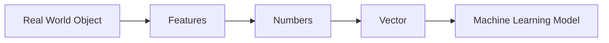

Excellent. Now we officially begin **Linear Algebra**.

This chapter corresponds to **Scaler Day 6 (Linear Algebra - 1)**, but as discussed, we'll transform it into a world-class chapter rather than lecture notes.

---

# 📚 Module 1 — Linear Algebra

# Chapter 2 — Scalars, Vectors & The Birth of Linear Algebra

> **"Every Machine Learning model, from Linear Regression to ChatGPT, begins with one simple mathematical idea—a vector."**

---

# 📌 Chapter Information

| Item                 | Details                                        |
| -------------------- | ---------------------------------------------- |
| Module               | Mathematics for Machine Learning               |
| Chapter              | 2                                              |
| Title                | Scalars, Vectors & The Birth of Linear Algebra |
| Version              | v1.0                                           |
| Status               | 🟢 Complete                                    |
| Difficulty           | ⭐☆☆☆☆ (Foundation)                             |
| Estimated Study Time | 90–120 Minutes                                 |

---

# 📋 Chapter Coverage Matrix

## 🎓 Scaler Coverage

| Scaler Topic            | Status | Our Coverage                        |
| ----------------------- | ------ | ----------------------------------- |
| Scalar                  | ✅      | Deep intuition + formal mathematics |
| Vector                  | ✅      | Geometry + ML interpretation        |
| Vector Representation   | ✅      | Mathematical + Programming view     |
| Dimension               | ✅      | Visual explanation                  |
| Magnitude               | ✅      | With proofs & intuition             |
| Unit Vector             | ✅      | Complete                            |
| Basic Vector Operations | ✅      | Extended with ML examples           |

---

## 🚀 Additional Topics Added

| Additional Topic            | Why Added                 |
| --------------------------- | ------------------------- |
| History of Linear Algebra   | Understand why it exists  |
| Why Numbers Are Not Enough  | Motivation before vectors |
| Computer Memory Perspective | How vectors are stored    |
| Geometry of Vectors         | Visual intuition          |
| ML Feature Vectors          | Real AI applications      |
| Embeddings Preview          | Connection to LLMs        |
| NumPy Representation        | Practical implementation  |
| Memory Tricks & Acronyms    | Long-term retention       |
| Interview Questions         | Placement preparation     |
| Common Misconceptions       | Avoid conceptual errors   |
| Research Insights           | Bridge to advanced ML     |

---

# 📚 Sources Used (Verified)

| Source                                    | Purpose                    |
| ----------------------------------------- | -------------------------- |
| ✅ Scaler AIML                             | Syllabus                   |
| ✅ MIT 18.06 (Gilbert Strang)              | Linear Algebra concepts    |
| ✅ 3Blue1Brown – Essence of Linear Algebra | Visual intuition           |
| ✅ Mathematics for Machine Learning        | Formal definitions         |
| ✅ Stanford CS229                          | ML perspective             |
| ✅ NumPy Documentation                     | Programming implementation |

---

# 🗺️ Position in the Roadmap

```text
Mathematics for Machine Learning

✅ Chapter 0 : Big Picture

✅ Chapter 1 : Language of Data

▶ Chapter 2 : Scalars & Vectors

⬜ Chapter 3 : Vector Operations

⬜ Chapter 4 : Matrices

⬜ Chapter 5 : Matrix Operations

...
```

---

# 📖 Chapter Overview

## 🎯 Why are we learning this?

In the previous chapter, we learned how the real world becomes data.

But now we face a new challenge.

Suppose you're building a house price prediction model.

One house has:

* Area = 1800 sq.ft.
* Bedrooms = 3
* Bathrooms = 2
* Age = 5 years

Should we store these as four unrelated numbers?

Or should we treat them as **one object** describing the house?

This simple question led to one of the greatest inventions in mathematics:

> **The Vector**

---

## ❓ What Problem Does This Chapter Solve?

One number can describe one quantity.

But reality is rarely one-dimensional.

A patient has:

* Age
* Blood Pressure
* Sugar
* Cholesterol
* Weight
* Height

A movie has:

* Duration
* Rating
* Genre
* Revenue
* Year

A customer has:

* Income
* Purchases
* Age
* Location
* Interests

How can mathematics describe many related quantities together?

That problem gave birth to vectors.

---

## 🤖 Where Is This Used in ML?

Vectors appear everywhere.

| Algorithm           | Vector Usage                |
| ------------------- | --------------------------- |
| Linear Regression   | Feature Vector              |
| Logistic Regression | Weight Vector               |
| KNN                 | Distance Between Vectors    |
| SVM                 | Support Vectors             |
| PCA                 | Principal Component Vectors |
| Neural Networks     | Input & Weight Vectors      |
| CNN                 | Feature Maps                |
| Transformers        | Word Embeddings             |
| LLMs                | Token Embeddings            |

> 📌 **Key Insight:** Every modern AI system manipulates vectors.

---

# 📖 Historical Story

## The Problem That Changed Mathematics

Imagine living 400 years ago.

You only measure temperature.

Easy.

```
Temperature = 32°C
```

One number.

Now you're a navigator sailing across oceans.

To describe your ship, one number is useless.

You need:

* Speed
* Direction

Suppose two ships move at **20 km/h**.

One moves north.

The other moves south.

If we only write:

```
20 km/h
```

They appear identical.

But in reality, they're moving in opposite directions.

Something important is missing.

> **Direction.**

Ordinary numbers cannot represent direction.

Mathematics needed something richer than numbers.

That invention became the **vector**.

---

# 🧠 Think Like a Mathematician

## Numbers Were Never the Problem

Numbers are excellent at answering:

* How much?
* How many?
* How heavy?

But they fail at answering:

* Which direction?
* Which combination of properties?
* Which point in space?

Vectors solved this limitation.

---

# Part 1 — Scalars

---

## Definition

> A **scalar** is a quantity described completely by **magnitude only**.

No direction.

Only size.

---

### Examples

| Quantity    | Scalar? | Why?           |
| ----------- | ------- | -------------- |
| Age         | ✅       | No direction   |
| Height      | ✅       | Just magnitude |
| Salary      | ✅       | Magnitude only |
| Temperature | ✅       | Magnitude only |
| Weight      | ✅       | Magnitude only |

---

## Mathematical Representation

Usually written as

$$
a,b,x,5,3.14
$$

A scalar is simply one number.

---

## Python Representation

```python
temperature = 32
salary = 50000
pi = 3.14159
```

---

## ML Example

Learning Rate

$$
\alpha = 0.01
$$

is a scalar.

Loss

$$
L = 2.45
$$

is also a scalar.

---

# 🧠 Memory Anchor

> **Scalar = Single Number = Magnitude Only**

Think:

📏 Length

🌡 Temperature

💰 Salary

---

# Part 2 — Vectors

---

## Why Were Vectors Invented?

Suppose one student has

| Feature | Value |
| ------- | ----- |
| Age     | 22    |
| Height  | 175   |
| Weight  | 70    |

Instead of storing

```
22

175

70
```

Mathematicians asked:

> Can we package these together?

The answer was:

Yes.

That package is called a vector.

---

## Definition

> A **vector** is an ordered collection of numbers representing multiple related quantities.

Mathematically,

$$
\mathbf{x}=
\begin{bmatrix}
22\
175\
70
\end{bmatrix}
$$

````math
X = \begin{bmatrix} 2 \\ 4 \\ 6 \\ 8 \end{bmatrix}
````

Where:

* 22 = Age
* 175 = Height
* 70 = Weight

---

# 🧠 Important Observation

Notice something.

This vector does **not** necessarily represent movement.

It represents one student.

This is extremely important for ML.

Many beginners think vectors always mean arrows.

Not in Machine Learning.

---

# Two Interpretations of Vectors

| Mathematics           | Machine Learning |
| --------------------- | ---------------- |
| Arrow                 | Data Point       |
| Magnitude & Direction | Features         |
| Geometry              | Representation   |

Both are correct.

They are simply two different perspectives.

---

# 🧠 Mental Model

Imagine a student's digital identity card.

```
Student

Age : 22

Height : 175

Weight : 70
```

A vector is nothing more than this identity card written mathematically.

> 📌 **Memory Anchor:** **Vector = Digital Identity Card**

---

# Geometry Corner

Imagine a point on a graph.

```
        y

        •

        |

--------+----------- x
```

That point has coordinates.

Those coordinates form a vector.

In higher dimensions, we cannot draw the picture, but the mathematical idea remains identical.

---

# Computer Science Perspective

A vector is stored as a contiguous sequence of numbers in memory.

Conceptually:

```text
Memory

+----+----+----+
| 22 |175 | 70 |
+----+----+----+
```

Libraries such as NumPy optimize operations on these contiguous arrays, enabling efficient numerical computation.

---

# Machine Learning Perspective

One student

↓

One Vector

One house

↓

One Vector

One customer

↓

One Vector

One image

↓

Thousands of vectors

Even ChatGPT ultimately processes vectors called **embeddings**.

---

# 🧮 Dimension

How many numbers are inside the vector?

That determines its **dimension**.

Example

$$
\begin{bmatrix}
5\
2
\end{bmatrix}
$$

contains two values.

So it is a

**2-dimensional vector**.

---

Another example

$$
\begin{bmatrix}
1\
5\
7\
9
\end{bmatrix}
$$

contains four values.

It is a

**4-dimensional vector**.

---

## Definition

> The **dimension** of a vector is the number of components (entries) it contains.

---

# Memory Trick

**Dimension = Count the Boxes**

```
□

□

□
```

Three boxes

↓

3D Vector

---

# 📊 Scalar vs Vector

| Property  | Scalar              | Vector                                   |
| --------- | ------------------- | ---------------------------------------- |
| Stores    | One value           | Multiple values                          |
| Direction | ❌                   | Sometimes (geometry), not required in ML |
| ML Usage  | Learning Rate, Loss | Features, Embeddings, Weights            |
| Example   | 25                  | [25, 175, 70]                            |

---

# Mermaid Summary



---

# 💻 Python Implementation

```python
import numpy as np

student = np.array([22, 175, 70])

print(student)
```

Output

```text
[22 175 70]
```

Shape

```python
print(student.shape)
```

Output

```text
(3,)
```

Meaning

Three-dimensional vector.

---

# 🧠 Memory Framework

## Acronym — **SVD**

Not **Singular Value Decomposition** 😊

For this chapter:

| Letter | Meaning   |
| ------ | --------- |
| **S**  | Scalar    |
| **V**  | Vector    |
| **D**  | Dimension |

Whenever you see a dataset, ask:

* What are the **Scalars**?
* How are they grouped into **Vectors**?
* What is the **Dimension**?

---

# ⚠️ Common Misconceptions

| ❌ Myth                          | ✅ Reality                                                             |
| ------------------------------- | --------------------------------------------------------------------- |
| Vectors always represent arrows | In ML, vectors often represent feature collections.                   |
| Dimension means physical space  | It means the number of components.                                    |
| A vector is just a Python list  | A list is a programming structure; a vector is a mathematical object. |
| Scalars are unimportant         | Hyperparameters and losses are scalars.                               |

---

# 🎯 Interview Corner

### Q1. What is the difference between a scalar and a vector?

### Q2. Why are vectors used in Machine Learning?

### Q3. What is the dimension of a vector?

### Q4. Can a vector represent a customer?

### Q5. Are embeddings vectors?

---

# 🌳 Chapter Mind Map

```text
Linear Algebra
│
├── Scalar
│   ├── Single Value
│   └── Magnitude
│
├── Vector
│   ├── Ordered Collection
│   ├── Feature Representation
│   ├── Geometry
│   └── Embeddings
│
└── Dimension
    ├── Number of Components
    └── Feature Count
```

---

# 📝 Revision Sheet

## 📌 Five Things to Remember

1. A **scalar** stores one numerical value.
2. A **vector** stores multiple related values in an ordered way.
3. Every observation in a dataset can be represented as a vector.
4. The **dimension** of a vector equals the number of its components.
5. Nearly every machine learning algorithm operates on vectors.

---

# 🔗 Connection Map

```text
Scalars
    │
    ▼
Vectors
    │
    ▼
Vector Operations
    │
    ▼
Matrices
    │
    ▼
Matrix Multiplication
    │
    ▼
Machine Learning Algorithms
```

---

# 📦 Chapter Deliverables Checklist

| Deliverable                 | Status |
| --------------------------- | ------ |
| 📖 Historical Context       | ✅      |
| 🧠 Intuition                | ✅      |
| 🧮 Mathematical Definitions | ✅      |
| 📐 Geometry                 | ✅      |
| 💻 Python & NumPy           | ✅      |
| 🤖 ML Applications          | ✅      |
| 🎯 Interview Questions      | ✅      |
| ⚠️ Common Misconceptions    | ✅      |
| 📝 Revision Notes           | ✅      |
| 🌳 Mind Map                 | ✅      |
| 📋 Scaler Coverage Matrix   | ✅      |
| 📚 Verified Sources         | ✅      |

---

## 🔍 **Revision Suggestion (Improving Beyond This Draft)**

As we continue refining this notebook, I'd like to make one more enhancement that will distinguish it from almost every ML mathematics resource.

From the **next chapter onward**, every important mathematical concept (such as vectors, matrices, dot products, gradients, eigenvectors, etc.) will have a dedicated **"Four-Lens Analysis"**:

1. 🧮 **Mathematical Lens** – Formal definition, notation, properties, and derivation.
2. 📐 **Geometric Lens** – Visual intuition and spatial interpretation.
3. 💻 **Computer Science Lens** – Memory layout, computational representation, and algorithmic implications.
4. 🤖 **Machine Learning Lens** – Where and why the concept appears in ML algorithms (Linear Regression, PCA, Neural Networks, Transformers, LLM embeddings, etc.).

This will become the **signature style** of our notebook, ensuring every concept is understood deeply from multiple perspectives instead of being memorized in isolation.

