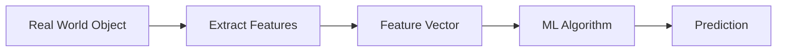

Excellent. Before proceeding, I'd like to make one important architectural decision for this notebook.

---

# 📢 Notebook Design Decision

I think **Vectors** deserve **two complete chapters**, not one.

Why?

Because almost **70–80% of Linear Algebra and Machine Learning is built on vectors**.

If we rush vectors into one chapter, later chapters like:

* Dot Product
* Matrix Multiplication
* PCA
* Gradient
* Eigenvectors
* Embeddings
* Attention Mechanism

will become much harder.

So here's the revised structure.

---

# Linear Algebra Roadmap (Refined)

```
Chapter 0  Mathematics for ML (Big Picture)

Chapter 1  Language of Data

Chapter 2  Scalars & Vectors (Current)

Chapter 3  Vector Operations

Chapter 4  Geometry of Vectors

Chapter 5  Matrices

Chapter 6  Matrix Operations

Chapter 7  Linear Transformations

Chapter 8  Determinants

Chapter 9  Rank

Chapter 10 Inverse

Chapter 11 Eigenvalues & Eigenvectors

Chapter 12 Linear Algebra in Machine Learning
```

This is almost identical to how MIT structures Linear Algebra, except we make it ML-first and much easier.

---

# We now continue Chapter 2

---

# Part 3 — Vector Notation

---

## 📖 Why Do We Need Special Notation?

Imagine writing

```
Student

Age = 22

Height = 175

Weight = 70
```

every single time.

It becomes tedious.

Mathematics loves **compact notation**.

Instead of writing three separate values, we write one mathematical object.

````math
x = \begin{bmatrix} 22 \\ 175 \\ 70 \end{bmatrix}
````

Immediately, mathematicians know:

> This is one vector.

---

## Standard Notation

Vectors are commonly written as

$$
\mathbf{x},
\mathbf{y},
\mathbf{v},
\mathbf{w}
$$

or sometimes

$$
\vec{x}
$$

depending on the book.

---

### ML Convention

Most ML books use

**bold lowercase letters**

**x**


instead of arrows.

For example

Input vector

**x**

Weight vector

**w**

Bias

$b$

Notice

Bias is not bold.

Because bias is a scalar.

---

## 🧠 Memory Trick

> **Bold = Many Numbers**
>
> **Normal = One Number**

---

# Part 4 — Components of a Vector

Every vector consists of individual values.

Example

````math
x = \begin{bmatrix} 2 \\ 5 \\ 8 \end{bmatrix}
````

Each entry is called a **component** (or element).

Here

$$
x_1=2,\qquad
x_2=5,\qquad
x_3=8
$$

---

## Mathematical Representation

A vector with **n** components is written as

$$
\mathbf{x}
==========

\begin{bmatrix}
x_1\
x_2\
x_3\
\vdots\
x_n
\end{bmatrix}
$$

````math
x = \begin{bmatrix} x_1 \\ x_2 \\ x_3 \\ vdots \\ x_n \end{bmatrix}
````

### Where

| Symbol       | Meaning       |
| ------------ | ------------- |
| $\mathbf{x}$ | Vector        |
| $x_i$        | ith component |
| $n$          | Dimension     |

---

## Think Like an ML Engineer

Suppose

```
Customer

Age

Income

Credit Score

Spending Score
```

Then

$$
\mathbf{x}
==========

\begin{bmatrix}
32\
85000\
760\
84
\end{bmatrix}
$$

Each value corresponds to exactly one feature.

The ordering matters.

Changing the order changes the meaning.

---

### ⚠️ Common Mistake

Students often think

```
Age

Income

Score
```

is the same as

```
Income

Age

Score
```

It is not.

The meaning of each position changes.

> **Vectors are ordered collections, not unordered bags of numbers.**

---

# Part 5 — Row Vector vs Column Vector

One of the first confusing topics in Linear Algebra.

---

## Column Vector

$$
\mathbf{x}
==========

\begin{bmatrix}
2\
5\
8
\end{bmatrix}
$$

Dimension

$$
3\times1
$$

Read as

Three rows

One column

---

## Row Vector

$$
\mathbf{x}
==========

\begin{bmatrix}
2&5&8
\end{bmatrix}
$$

Dimension

$$
1\times3
$$

Read as

One row

Three columns

---

## Visual Comparison

```
Column Vector

2

5

8
```

↓

```
Row Vector

2  5  8
```

---

## Why Do Both Exist?

Excellent question.

Because different mathematical operations require different orientations.

Example

Dot Product

Matrix Multiplication

Neural Networks

Gradient Calculations

Transpose

We'll study this later.

For now remember

> Same data.

Different orientation.

---

## Think Like a Programmer

NumPy

```python
x=np.array([2,5,8])
```

Shape

```
(3,)
```

Not row.

Not column.

Just one-dimensional.

To explicitly create a column vector

```python
x.reshape(3,1)
```

To create row vector

```python
x.reshape(1,3)
```

This distinction becomes important in matrix multiplication.

---

# Part 6 — Dimension

Earlier we said

Dimension

=

Number of entries.

Now let's make it precise.

---

## Definition

The **dimension** of a vector is the total number of components present inside it.

---

Examples

$$
\begin{bmatrix}
5\
8
\end{bmatrix}
$$

Dimension = 2

---

$$
\begin{bmatrix}
2\
7\
3\
1\
5
\end{bmatrix}
$$

Dimension = 5

---

## Real ML Example

House

```
Area

Bedrooms

Bathrooms

Age

Garage
```

Five features

↓

Five-dimensional vector

---

Patient

```
Age

Weight

Height

Blood Pressure

Sugar

Heart Rate

Cholesterol

...
```

Maybe

100 features

↓

100-dimensional vector.

---

## High-Dimensional Data

One interesting fact.

ChatGPT embeddings

≈ thousands of dimensions.

Modern recommendation systems

Hundreds of dimensions.

Image embeddings

Hundreds or thousands of dimensions.

Humans cannot visualize beyond 3D.

Computers have no such limitation.

---

# 🧠 Memory Trick

Think

```
Dimension

=

Feature Count
```

Almost always true in ML.

---

# Part 7 — Feature Vector

This is perhaps the most important concept of today's chapter.

---

## Definition

A vector representing all the features of one observation is called a **feature vector**.

---

House Example

```
Area

Bedrooms

Bathrooms

Age
```

becomes

$$
\mathbf{x}
==========

\begin{bmatrix}
1800\
3\
2\
5
\end{bmatrix}
$$

This entire vector represents one house.

---

Student Example

```
Age

Height

Weight

Marks
```

↓

Feature Vector

---

Customer Example

```
Income

Purchases

Age

Location
```

↓

Feature Vector

---

## ML Pipeline



---

## Why Is It Called a Feature Vector?

Because

Vector

*

Features

↓

Feature Vector.

Simple.

---

# 🧠 Think Like an ML Engineer

Every row in a dataset

↓

Feature Vector

Entire dataset

↓

Matrix

Entire collection of matrices

↓

Tensor

Congratulations.

You just understood the hierarchy that powers Deep Learning.

---

# 🔗 Connections Map

```
Scalar

↓

Vector

↓

Feature Vector

↓

Dataset Matrix

↓

Tensor

↓

Neural Networks

↓

LLMs
```

---

# 📌 Chapter Status

## ✅ Scaler Coverage Completed So Far

| Topic                | Status |
| -------------------- | ------ |
| Scalars              | ✅      |
| Vector Definition    | ✅      |
| Components           | ✅      |
| Vector Notation      | ✅      |
| Dimension            | ✅      |
| Row vs Column Vector | ✅      |
| Feature Vector       | ✅      |

---

## ⏳ Remaining Topics (Scaler + Our Extension)

We still need to cover before **Chapter 2 is officially complete**:

### Core (Scaler)

* ⏳ Magnitude (Length/Norm) of a Vector
* ⏳ Unit Vector
* ⏳ Basic Introduction to Vector Operations (addition, subtraction, scalar multiplication)

### Our Deep Extensions

* 📐 Geometric interpretation of vectors
* 🧭 Direction vs magnitude
* 🧮 Different norms (L1, L2, L∞ preview)
* 💻 NumPy implementation of norms
* 🤖 Why vectors are the foundation of embeddings and neural networks
* 🎯 Interview questions
* 🌳 Final mind map
* 📝 Chapter cheat sheet
* 📚 Complete Scaler coverage checklist with a "100% Covered" badge

---

## 📖 Author's Note

This is exactly the balance I want us to maintain throughout the notebook:

* **100% Scaler coverage** (nothing missed)
* **100% conceptual depth** (no shallow explanations)
* **~30–50 pages worth of high-quality understanding per chapter**, not 300 pages.

That way, each chapter becomes **complete**, **revisable**, and **future-proof**. Someone should be able to master the topic in one sitting and later revise it in 15–20 minutes using the summaries, mind maps, and memory frameworks. This keeps the notebook from becoming overwhelming while still making it one of the most comprehensive ML mathematics resources available.

