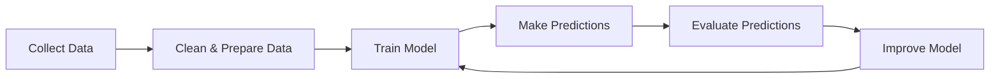
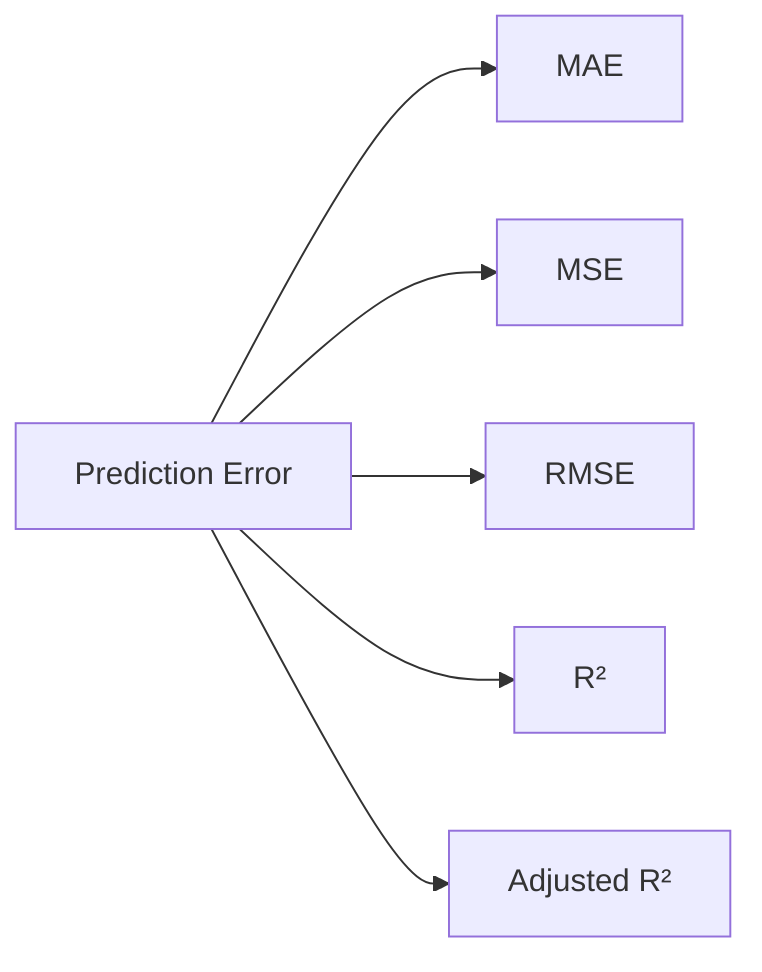
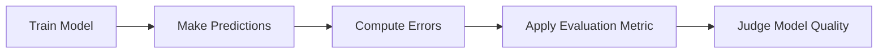

I'm excited to start this module because, in my opinion, this is where many ML learners begin to think like **data scientists** rather than just **algorithm learners**.

Up to now, our question has been:

> **"How does a model learn?"**

From this chapter onward, our question becomes:

> **"How do we know whether the model learned well?"**

That shift is incredibly important.

---

# 📚 Module V — Regression Evaluation Metrics

```text
Chapter 19 — Regression Evaluation Metrics

➡ Chapter 19.1 Why Do We Need Evaluation Metrics?

Upcoming

Chapter 19.2 Mean Absolute Error (MAE)
Chapter 19.3 Mean Squared Error (MSE)
Chapter 19.4 Root Mean Squared Error (RMSE)
Chapter 19.5 R² Score
Chapter 19.6 Adjusted R²
Chapter 19.7 Comparing All Regression Metrics
Chapter 19.8 Choosing the Right Metric
Chapter 19.9 Interview Questions & Revision
```

---

# 🟡 Remember Forever

> **Training a model is only half the job.**
>
> **The other half is proving that it actually works.**

---

# 📖 Chapter 19.1

# Why Do We Need Evaluation Metrics?

---

# Learning Objectives

By the end of this chapter, you'll understand:

- Why training a model is not enough.
- Why predictions must be evaluated.
- What makes a "good" model.
- Why we need numerical evaluation metrics.
- The difference between learning and evaluation.
- Why different metrics exist.

---

# The Big Picture

Let's step back and look at the entire Machine Learning pipeline.



Notice something important.

Training is **not the final step**.

The model must be evaluated before we can trust it.

---

# Imagine You Built Your First Model

Suppose you trained a Linear Regression model.

The model predicts house prices.

You are excited because the training completed successfully.

You ask your friend:

> **"My model is ready!"**

Your friend asks:

> **"How good is it?"**

You answer:

> **"...I don't know."**

This is exactly why evaluation metrics exist.

---

# Training vs Evaluation

Many beginners think:

```text
Training Complete

↓

Machine Learning Complete
```

This is incorrect.

The real workflow is:

```text
Train Model

↓

Predict

↓

Measure Prediction Quality

↓

Improve Model
```

Without evaluation, the model is just making guesses.

---

# An Everyday Analogy

Imagine a student appears for an exam.

The student studies for months.

Finally, the exam ends.

Now imagine the teacher says:

> "Great. You studied."

But never checks the answers.

Can we say the student performed well?

Of course not.

The exam must be graded.

Machine Learning works the same way.

| Student | Machine Learning |
|----------|------------------|
| Studies | Training |
| Writes Exam | Makes Predictions |
| Teacher Checks Answers | Evaluation Metric |
| Score | Model Performance |

Training teaches.

Evaluation measures learning.

---

# What Does "Good Prediction" Mean?

Consider these predictions for house prices.

| Actual Price | Predicted Price |
|-------------:|----------------:|
| ₹50 Lakh | ₹49 Lakh |
| ₹80 Lakh | ₹82 Lakh |
| ₹35 Lakh | ₹36 Lakh |

These seem reasonable.

Now consider another model.

| Actual Price | Predicted Price |
|-------------:|----------------:|
| ₹50 Lakh | ₹12 Lakh |
| ₹80 Lakh | ₹1.5 Crore |
| ₹35 Lakh | ₹90 Lakh |

Clearly, the second model is much worse.

But instead of saying:

> "Looks bad."

we want a numerical measure.

That's the purpose of evaluation metrics.

---

# Why Numbers Matter

Suppose you build two models.

### Model A

```text
Looks Good
```

### Model B

```text
Also Looks Good
```

Which one should you deploy?

You cannot decide by intuition alone.

Instead, you compute evaluation metrics.

Example:

| Model | Error |
|--------|------:|
| Model A | 3.8 |
| Model B | 2.1 |

Now the decision is objective.

---

# Why Can't We Just Look at Predictions?

Imagine predicting 10,000 house prices.

Can a human inspect all predictions manually?

No.

Now imagine:

- 1 million predictions.
- 100 million predictions.

Manual evaluation becomes impossible.

We need automated numerical measures.

---

# The Core Idea

Every prediction creates an **error**.

Let's define:

- Actual value

$$
y
$$

- Predicted value

$$
\hat{y}
$$

The prediction error is

$$
\text{Error} = y - \hat{y}
$$

This simple difference is the foundation of almost every regression evaluation metric.

---

# A Small Example

Suppose:

Actual salary:

₹10,00,000

Predicted salary:

₹9,20,000

Error:

$$10,00,000 - 9,20,000=80,000$$

The model missed by ₹80,000.

Now imagine doing this for thousands of predictions.

How do we combine all these errors into one meaningful number?

That is exactly what the upcoming metrics answer.

---

# Why Different Metrics Exist

Here's an interesting question.

If the error is simply:

$$
y - \hat{y}
$$

why don't we just average all errors?

Consider these two predictions:

| Actual | Predicted | Error |
|---------|-----------|------:|
| 100 | 90 | +10 |
| 100 | 110 | -10 |

Average error:

$$
\frac{10 + (-10)}{2} = 0
$$

Does this mean the model is perfect?

No.

The model made two mistakes of 10 units each.

The positive and negative errors simply canceled each other.

This is why we need smarter evaluation metrics.

---

# The Evolution of Regression Metrics

Different metrics were created to solve different problems.



Each metric answers a slightly different question.

---

# Preview of Upcoming Chapters

## MAE

Measures the average absolute error.

Easy to interpret.

---

## MSE

Squares errors.

Punishes large mistakes more heavily.

---

## RMSE

Converts squared error back to the original unit.

Often easier to interpret than MSE.

---

## R² Score

Measures how much of the variation in the target variable is explained by the model.

This is one of the most widely reported regression metrics.

---

## Adjusted R²

Improves R² when multiple input features are involved.

---

# Real-World Example

Imagine you're building a system to predict:

- house prices,
- stock prices,
- electricity demand,
- hospital costs,
- delivery times.

Different applications value different kinds of mistakes.

For example:

Predicting a house price ₹50,000 off may be acceptable.

Predicting a patient's medication dosage incorrectly by a large amount could have much more serious consequences.

The choice of evaluation metric should reflect the problem you're solving.

---

# Industry Perspective

In production ML, training a model is often the easier part.

A significant amount of engineering effort goes into:

- evaluating models,
- comparing experiments,
- deciding whether a new model is better than the current one,
- monitoring performance after deployment.

Evaluation metrics guide these decisions.

---

# Common Misconceptions

### ❌ Lower training loss always means a better model.

Not necessarily.

Training loss measures performance on the training data.

We care about how well the model performs on **unseen data**.

---

### ❌ There is one best evaluation metric.

No.

Different metrics emphasize different aspects of prediction quality.

---

### ❌ A perfect metric value guarantees a useful model.

Not always.

Metrics should be interpreted alongside domain knowledge and the business context.

---

# Why? Box

## Why don't we just look at predictions?

Because humans cannot reliably compare thousands or millions of predictions.

Metrics summarize prediction quality objectively.

---

## Why do we need multiple metrics?

Because different applications care about different types of prediction errors.

Some want to penalize large errors more heavily, while others prioritize interpretability.

---

# Interview Questions

### Beginner

1. Why do we need evaluation metrics in Machine Learning?
2. What is prediction error?
3. Why isn't training alone sufficient?

---

### Intermediate

4. Why can't we average raw prediction errors?
5. Why do different regression metrics exist?

---

### Advanced

6. Can two models have similar predictions but different evaluation metric values? Why?
7. How would you choose an evaluation metric for a business problem?

---

# 🔗 Connections

## Connected to Previous Chapters

We've already learned:

- Linear Regression
- Cost Function
- Gradient Descent
- Optimization

Now the natural question is:

> **"The model has learned. How do we measure how well it learned?"**

That's exactly what this module answers.

---

## Prepares for the Next Chapter

We've established that prediction errors need to be summarized.

The simplest and most intuitive way to do that is by looking at the **average magnitude of errors**, regardless of whether they're positive or negative.

In the next chapter:

# **Chapter 19.2 — Mean Absolute Error (MAE)**

We'll build the first regression evaluation metric from first principles, understand why absolute values are used, derive the formula mathematically, implement it in Python, and explore when MAE is the best choice.

---

# ⭐ Chapter Summary (Revision Notes)

## Key Takeaways

- Training produces a model.
- Evaluation tells us how good that model is.
- Predictions alone are not enough; they must be measured objectively.
- Every prediction creates an error.
- Different metrics summarize errors in different ways.
- No single evaluation metric is universally best.

---

## Learning Pipeline



---

# 🧠 Self-Check Questions

1. Why can't we decide whether a model is good just by saying its predictions "look reasonable"?
2. What is prediction error?
3. Why is averaging raw errors misleading?
4. Why do we need different regression evaluation metrics instead of a single universal metric?
5. What question does every evaluation metric ultimately try to answer?

---

# 📖 Author's Note

This chapter introduces a subtle but powerful shift in thinking. Up to now, we've focused on **how models learn**. From this point onward, we'll focus on **how models are judged**.

As an ML engineer or data scientist, you'll often spend as much time comparing models as building them. Understanding evaluation metrics is therefore not just a mathematical exercise—it is a practical skill that influences model selection, deployment decisions, and business outcomes.

The next chapter begins that journey with the simplest and most intuitive metric: **Mean Absolute Error (MAE)**. It will become the foundation upon which all the remaining regression metrics are built.
