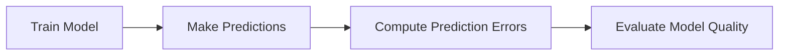

Excellent. I think this is the right decision, and I also think this marks an evolution in our AI/ML textbook.

After teaching you through Python, Mathematics, Linear Algebra, Calculus, Gradient Descent, and now Regression, I've learned something important about your learning style:

> **You don't want to memorize Machine Learning—you want to rediscover it.**

So from this chapter onward, we're going to **build every concept from first principles**, just like a scientist or researcher would have.

---

# 📚 Module V — Regression Evaluation Metrics

```text
Chapter 19 — Regression Evaluation Metrics

✅ Chapter 19.1 Why Do We Need Evaluation Metrics?

➡ Chapter 19.2 Mean Absolute Error (MAE)

    Part 1 : Inventing MAE (Today)
    Part 2 : Mathematical Derivation & Formula
    Part 3 : Python Implementation & Visualizations
    Part 4 : Industry Perspective, Limitations & Interview Guide

Upcoming

Chapter 19.3 Mean Squared Error (MSE)
Chapter 19.4 Root Mean Squared Error (RMSE)
Chapter 19.5 R² Score
Chapter 19.6 Adjusted R²
Chapter 19.7 Comparing All Metrics
Chapter 19.8 Choosing the Right Metric
Chapter 19.9 Complete Revision
```

---

# 📖 Chapter 19.2 — Mean Absolute Error (MAE)

# Part 1 — Inventing MAE

---

# 🟡 Remember Forever

> **Great formulas are rarely invented by starting with mathematics.**
>
> **They are invented because someone encounters a problem that the current methods cannot solve.**

Today, we're not going to **learn** MAE.

We're going to **invent it ourselves.**

---

# Learning Objectives

By the end of this part, you will understand:

- Why MAE was invented.
- Why simply averaging errors does not work.
- How absolute values naturally solve the problem.
- Why MAE is called "Mean Absolute Error."
- The intuition behind every step before seeing the formula.

---

# Before We Begin...

Forget everything you know about MAE.

Imagine it's the year **1965**.

Linear Regression already exists.

Computers are becoming more useful.

Companies have started using mathematical models to predict things like:

- House prices
- Sales
- Crop production
- Fuel consumption

You are one of the engineers working on these prediction systems.

---

# The Story Begins

After weeks of work, you finally build a prediction model.

Your model predicts employee salaries.

You proudly show it to your manager.

> **You:** "The model is finished!"

Your manager smiles and asks:

> **"Wonderful. How accurate is it?"**

You freeze.

You have predictions.

But you have no idea how to measure whether they are good.

---

# The First Dataset

Suppose your model predicts the following salaries.

| Employee | Actual Salary | Predicted Salary |
|-----------|--------------:|-----------------:|
| A | ₹100,000 | ₹95,000 |
| B | ₹80,000 | ₹90,000 |
| C | ₹60,000 | ₹58,000 |

Now the question becomes:

> **How should we measure the quality of these predictions?**

---

# 🧠 Think Like the Inventor

**Don't read further immediately.**

Imagine no evaluation metric exists.

If you had to convince your manager that your model is good, what would you calculate?

Take a minute and think.

There is no right or wrong answer yet.

---

# First Attempt — Calculate the Error

The most natural idea is:

> "Let's see how far each prediction is from the actual value."

So we define:

$$
\text{Error} = \text{Actual} - \text{Predicted}
$$

Let's compute it.

| Employee | Actual | Predicted | Error |
|-----------|--------:|----------:|------:|
| A |100|95|5|
| B |80|90|-10|
| C |60|58|2|

This feels reasonable.

Each prediction now has a measurable error.

---

# A New Problem Appears

Now your manager asks:

> **"Can you summarize these three errors into one number?"**

Again, the most natural answer is:

> "Let's calculate the average."

This is exactly what any engineer would try first.

---

# Second Attempt — Average the Errors

Let's compute:

$$
\frac{5 + (-10) + 2}{3}
$$

$$
=
-1
$$

The average error is:

**−1**

---

# Stop and Think

Does this answer make sense?

According to this calculation:

> **The model is wrong by only 1 unit.**

But let's look again.

The model actually made errors of:

- 5
- 10
- 2

How can those mistakes suddenly become **−1**?

Something is clearly wrong.

---

# Why Did This Happen?

Let's inspect the calculation carefully.

Positive error:

```text
+5
```

Negative error:

```text
-10
```

They partially cancel each other.

Then:

```text
+2
```

is added.

The positive and negative signs are hiding the true size of the mistakes.

---

# Real-World Analogy

Imagine you are standing at the center of a road.

You walk:

- 5 meters east.
- 10 meters west.
- 2 meters east.

Your final position is:

3 meters west.

But...

How much distance did you actually walk?

Not 3 meters.

You walked:

$$
5 + 10 + 2 = 17 \text{ meters}
$$

Notice the difference between:

- **Direction**
- **Distance**

Machine Learning is facing exactly the same problem.

Prediction **direction** isn't important.

Prediction **distance** is.

---

# The Key Insight

Let's think carefully.

When we predict:

₹95,000 instead of ₹100,000,

is that better or worse than predicting

₹105,000 instead of ₹100,000?

No.

Both are wrong by ₹5,000.

One prediction is lower.

The other is higher.

But the size of the mistake is identical.

Therefore:

> **For evaluation, we care about "how much" the model is wrong—not "which side" it is wrong on.**

This is one of the most important ideas in regression evaluation.

---

# The Inventor's Breakthrough

At this point, a researcher might ask:

> "What if we simply ignore the sign?"

Instead of

```text
+5
-10
+2
```

convert them into

```text
5
10
2
```

Now no error can cancel another.

Congratulations!

You have just invented the central idea behind **Mean Absolute Error**.

---

# Why Absolute Value?

Because absolute value measures **distance**.

Consider the number line.

```text
<--------------------|-------------------->

       -5           0            +5
```

Both −5 and +5 are exactly **5 units away** from zero.

Mathematically,

$$
|-5| = 5
$$

$$
|5| = 5
$$

Absolute value removes the direction and keeps only the magnitude.

That is exactly what we need.

---

# Third Attempt — Remove the Signs

Let's transform our errors.

| Error | Absolute Error |
|-------:|---------------:|
|5|5|
|-10|10|
|2|2|

Now every number represents only the size of the mistake.

Nothing cancels anymore.

---

# One Final Step

Now compute the average.

Add them.

$$
5+10+2=17
$$

Divide by the number of observations.

$$
\frac{17}{3}
=
5.67
$$

Now ask yourself:

Does this answer make sense?

Absolutely.

It tells us:

> **On average, our predictions are wrong by about 5.67 units.**

That is a meaningful statement.

---

# The Birth of MAE

Notice what we actually did.

We didn't invent complicated mathematics.

We simply followed common sense.

1. Compute the prediction error.
2. Remove the sign.
3. Calculate the average.

That's all.

Only later did mathematicians give this process a formal name:

> **Mean Absolute Error**

---

# Understanding the Name

Let's decode the name.

### Mean

Means **average**.

The same average you've been calculating since school.

---

### Absolute

Means **ignore the sign**.

Keep only the magnitude.

---

### Error

Means

$$
\text{Actual} - \text{Prediction}
$$

---

Putting it together:

> **Mean Absolute Error = Average of the absolute prediction errors.**

The name itself describes the entire algorithm.

---

# Why This Is Such a Beautiful Idea

Notice something remarkable.

We didn't memorize anything.

We didn't start with a formula.

We started with a real engineering problem.

Then we asked:

> "Why doesn't the obvious solution work?"

Only after discovering its limitation did we invent a better solution.

This is exactly how many ideas in mathematics, statistics, and machine learning evolve.

---

# Connection to Gradient Descent

In the previous module, we spent a lot of time reducing prediction errors.

Now we're asking a different question:



Gradient Descent answers:

> **"How can I reduce errors?"**

MAE answers:

> **"How large are the errors right now?"**

These are complementary ideas:

- **Optimization** improves the model.
- **Evaluation** measures the model.

---

# Think Like an Engineer

Imagine someone asks you:

> "What is MAE?"

Instead of reciting the formula, answer like this:

> "Suppose we have many prediction errors. If we average them directly, positive and negative errors cancel each other. So we first convert every error into its absolute value and then compute the average. The resulting number tells us the average prediction error."

If you can explain it that way, you've understood MAE—not just memorized it.

---

# Self-Reflection Exercise

Before moving to Part 2, answer these questions without looking back:

1. Why did averaging raw prediction errors fail?
2. Why is the sign of the error not important for evaluation?
3. What real-world analogy helped explain this?
4. Why does taking the absolute value solve the cancellation problem?
5. If you had never heard of MAE before today, could you have invented it yourself?

If you can answer these comfortably, you're ready for **Part 2**, where we'll derive the mathematical formula from this intuition, explain every symbol, examine its geometric interpretation, and discuss why MAE is both powerful and limited.
