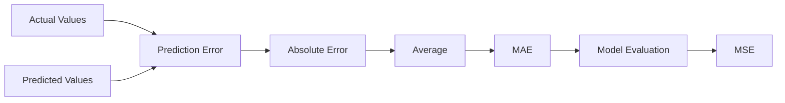

Excellent! Welcome to what I consider the **most enjoyable part** of every chapter.

Until now, we've answered:

- ✅ **Why MAE was invented**
- ✅ **How it was derived mathematically**

Now comes the engineer's perspective:

> **"How do I actually use MAE on a real dataset?"**

This chapter is not about memorizing code. It's about connecting **mathematics → visualization → Python → industry**.

---

# 📚 Chapter Map

```text
Chapter 19.2 — Mean Absolute Error (MAE)

✅ Part 1 — Inventing MAE
✅ Part 2 — Mathematical Derivation

➡ Part 3 — Interactive Lab & Python Implementation

Upcoming

Part 4 — Industry Perspective, Limitations & Interview Guide
```

---

# 🎯 Learning Objectives

By the end of this chapter, you will be able to:

- Calculate MAE manually.
- Write MAE from scratch in Python.
- Implement MAE using NumPy.
- Implement MAE using Scikit-Learn.
- Visualize MAE geometrically.
- Interpret MAE in business terms.
- Understand what changing predictions does to MAE.

---

# 🌍 Interactive Lab 1 — Residual Sign Cancellation

## Objective

Understand why **raw errors fail** and why **absolute values** are necessary.

### Website

**AIML Visualization**

https://aiml-vizs-new.vercel.app/supervised-learning-regression/residual-sign-cancellation-problem/

---

## Activity

Move the prediction line.

Observe:

- Some residuals become positive.
- Some become negative.

Now imagine averaging those raw residuals.

---

## Question

Suppose the residuals are

```text
+6

-6

+2

-2
```

Average?

$$
\frac{6-6+2-2}{4}=0
$$

Does zero mean the model is perfect?

**No.**

The model still made four mistakes.

---

## 🎯 What to Observe

✔ Residual direction changes.

✔ Magnitude remains.

✔ Positive and negative residuals cancel.

✔ MAE fixes this problem.

---

# 🌍 Interactive Lab 2 — Understanding Residual Distance

Open:

**Desmos**

https://www.desmos.com/calculator

Create three points.

```text
Actual

(1,2)

(2,4)

(3,6)
```

Now create predictions.

```text
(1,1)

(2,5)

(3,5)
```

---

Draw vertical segments.

Those vertical distances are the residuals.

Now ask yourself:

> Does MAE care whether the prediction is above or below?

No.

It only measures the length of those vertical segments.

---

# 🌍 Interactive Lab 3 — Regression Playground

Open

https://aiml-vizs-new.vercel.app/supervised-learning-regression/

---

Move the regression line.

Observe

- residuals increase
- residuals decrease
- MAE changes

---

## Think

Which line gives the smallest average distance?

That is exactly what MAE measures.

---

# ✍ Manual Calculation

Suppose

| Actual | Predicted |
|---------|----------:|
|100|95|
|80|90|
|60|58|
|90|94|

---

## Step 1

Calculate errors.

| Error |
|-------:|
|5|
|-10|
|2|
|-4|

---

## Step 2

Absolute errors.

| Absolute Error |
|---------------:|
|5|
|10|
|2|
|4|

---

## Step 3

Sum

$$
5+10+2+4=21
$$

---

## Step 4

Average

$$
MAE=\frac{21}{4}=5.25
$$

Interpretation:

> **Our predictions are wrong by about 5.25 units on average.**

---

# 💻 Coding Lab 1 — Pure Python

Let's first solve the problem without using NumPy or any ML libraries. This helps reinforce the algorithm.

```python
y_true = [100, 80, 60, 90]
y_pred = [95, 90, 58, 94]

total_error = 0

for actual, predicted in zip(y_true, y_pred):
    error = abs(actual - predicted)
    total_error += error

mae = total_error / len(y_true)

print(f"MAE = {mae}")
```

### Output

```text
MAE = 5.25
```

---

## 💡 Why start with pure Python?

Before using optimized libraries, it's important to understand the underlying algorithm.

The code directly mirrors the mathematical steps:

1. Compute the error.
2. Take the absolute value.
3. Add all absolute errors.
4. Divide by the number of observations.

---

# 💻 Coding Lab 2 — Building a Reusable Function

```python
def mean_absolute_error(y_true, y_pred):
    total_error = 0

    for actual, predicted in zip(y_true, y_pred):
        total_error += abs(actual - predicted)

    return total_error / len(y_true)


actual = [100, 80, 60, 90]
predicted = [95, 90, 58, 94]

print(mean_absolute_error(actual, predicted))
```

This is essentially what every library does internally, just with more optimization and error handling.

---

# 💻 Coding Lab 3 — NumPy Implementation

Now let's leverage vectorized operations.

```python
import numpy as np

y_true = np.array([100, 80, 60, 90])
y_pred = np.array([95, 90, 58, 94])

absolute_errors = np.abs(y_true - y_pred)

print("Absolute Errors:", absolute_errors)

mae = np.mean(absolute_errors)

print("MAE =", mae)
```

### Output

```text
Absolute Errors:
[ 5 10  2  4]

MAE = 5.25
```

---

# 🧠 What Happened Internally?

Let's break down this single line:

```python
absolute_errors = np.abs(y_true - y_pred)
```

### Step 1

```python
y_true - y_pred
```

Result

```text
[5, -10, 2, -4]
```

---

### Step 2

```python
np.abs(...)
```

Result

```text
[5, 10, 2, 4]
```

---

### Step 3

```python
np.mean(...)
```

Result

```text
5.25
```

Notice how the code directly matches the mathematical formula.

---

# 💻 Coding Lab 4 — Scikit-Learn Implementation

Now let's use the standard implementation provided by Scikit-Learn.

```python
from sklearn.metrics import mean_absolute_error

y_true = [100, 80, 60, 90]
y_pred = [95, 90, 58, 94]

mae = mean_absolute_error(y_true, y_pred)

print(mae)
```

Output

```text
5.25
```

---

# 🤔 Which Implementation Should You Use?

| Situation | Recommended Approach |
|-----------|----------------------|
| Learning the concept | Pure Python |
| Working with arrays | NumPy |
| Building ML models | Scikit-Learn |

---

# 🧪 Experiment Lab

Now let's develop intuition by changing the predictions.

---

## Experiment 1 — Better Predictions

```python
y_pred = [99, 81, 61, 91]
```

### Before calculating...

**Pause.**

Predict:

Will MAE increase or decrease?

Then run the code.

---

### Observation

The prediction errors become much smaller, so MAE decreases.

---

## Experiment 2 — Worse Predictions

```python
y_pred = [150, 20, 130, 10]
```

Before running the code:

Can you estimate whether the MAE will be larger than 30?

Why?

---

### Observation

Large prediction errors directly increase the average absolute error.

---

## Experiment 3 — Perfect Model

```python
y_pred = [100, 80, 60, 90]
```

Result

```text
MAE = 0
```

Interpretation:

Every prediction matches the actual value exactly.

---

# 📊 Visual Interpretation

Suppose the data looks like this.

```text
Actual

●

Prediction

×

```

The vertical distance between them is the absolute error.

Now imagine doing this for every data point.

MAE is simply the **average length of all those vertical distances**.

---

# 🌍 Business Interpretation

Suppose you're building different ML systems.

| Application | MAE Interpretation |
|-------------|-------------------|
| House Prices | Average price error |
| Delivery Time | Average delay prediction error |
| Temperature | Average temperature prediction error |
| Sales Forecast | Average sales prediction error |

Notice something important.

Business stakeholders don't think in terms of formulas.

They ask:

> **"On average, how wrong is the model?"**

MAE answers that question directly.

---

# ⚡ Performance Considerations

For very large datasets:

- Pure Python loops are simple but slower.
- NumPy uses optimized vectorized operations.
- Scikit-Learn builds on these efficient numerical libraries and adds validation.

This is why production ML code typically uses NumPy or Scikit-Learn rather than manual loops.

---

# 🧠 Mini Challenge

Without using `np.mean()`, compute MAE using only:

- `np.abs()`
- `np.sum()`
- `len()`

Try solving it yourself before looking at the solution.

### Solution

```python
mae = np.sum(np.abs(y_true - y_pred)) / len(y_true)
```

Can you explain why this is mathematically identical to the MAE formula?

---

# 📝 Coding Exercises

### Exercise 1

Write a function that calculates MAE without using `abs()`.

*(Hint: Use an `if` statement to handle negative errors.)*

---

### Exercise 2

Generate 100 random actual values and 100 random predictions.

Compute the MAE.

---

### Exercise 3

Compare the outputs of:

- Your own implementation
- NumPy implementation
- Scikit-Learn implementation

They should all produce the same result.

---

# 🔗 Concept Connections



---

# 🎯 Key Takeaways

- MAE is straightforward to compute manually and programmatically.
- The implementation mirrors the mathematical derivation exactly.
- NumPy simplifies the computation through vectorized operations.
- Scikit-Learn provides a production-ready implementation.
- MAE is easy to explain because it stays in the same units as the target variable.
- Interactive visualizations help build intuition by showing how residuals change as predictions change.

---

# 📌 Before Moving to Part 4

Ask yourself these questions:

1. Can I calculate MAE by hand?
2. Can I derive the Python implementation from the mathematical formula?
3. Why does `np.abs()` appear before `np.mean()`?
4. Why is MAE easy for business stakeholders to understand?
5. If I make every prediction slightly better, what happens to MAE?

If you can confidently answer these, you're ready for **Part 4**, where we'll explore **when MAE is the right metric, where it falls short, why MSE was invented, and how interviewers expect you to compare them**.
