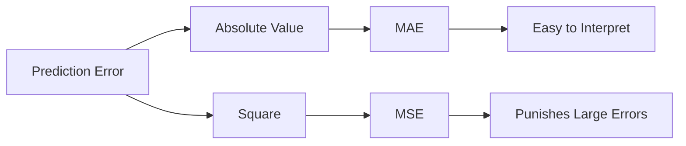

# 📚 Chapter 19.2 – Mean Absolute Error (MAE)

## Part 4 – Industry Perspective, Limitations & Interview Guide

---

# Chapter Roadmap

```text
Regression Evaluation Metrics

├── 19.1 Why Evaluation Metrics Matter ✅
│
├── 19.2 Mean Absolute Error (Current Chapter)
│     ├── Part 1 – Inventing MAE ✅
│     ├── Part 2 – Mathematical Derivation ✅
│     ├── Part 3 – Interactive Lab & Python ✅
│     └── Part 4 – Industry Perspective & Interview ⭐
│
├── 19.3 Mean Squared Error (Next)
├── 19.4 Root Mean Squared Error
├── 19.5 R² Score
└── ...
```

---

# 🎯 Learning Objectives

By the end of this chapter, you should be able to answer questions like:

- Why do companies use MAE?
- When should MAE be avoided?
- Why wasn't MAE enough?
- Why was MSE invented?
- If MAE seems so intuitive, why do most ML algorithms optimize MSE instead?

These are the kinds of questions that distinguish someone who has memorized metrics from someone who truly understands machine learning.

---

# Part 1 – Industry Perspective

## Imagine You Are Building an ML Product

Let's stop thinking like a student for a moment.

Imagine you're working as an ML Engineer at:

- Amazon
- Uber
- Netflix
- Google
- Swiggy
- Zomato

Your manager says:

> "Our model predicts delivery time. Customers are complaining. Tell me—how wrong is our model on average?"

Would they ask for:

- Sum of squared errors?
- Gradient?
- Cost function?

No.

They want a simple business answer.

> **"On average, how many minutes are we off?"**

This is exactly what MAE provides.

---

# Real Industry Examples

## 🚕 Uber

Target:

Predict ride duration.

Actual ride:

35 minutes

Prediction:

32 minutes

Error:

3 minutes

After millions of rides:

MAE = 2.8 minutes

Business interpretation:

> "Our ETA predictions are wrong by about 3 minutes."

Anyone in the company can understand this.

---

## 🏠 House Price Prediction

Target:

House price

Actual:

₹85 lakh

Prediction:

₹82 lakh

Error:

₹3 lakh

Suppose

MAE = ₹2.5 lakh

Interpretation:

> "Our model misses the house price by about ₹2.5 lakh."

Notice how the unit remains unchanged.

---

## 🌡 Weather Forecasting

Target:

Temperature

MAE = 1.2°C

Interpretation:

"Our weather prediction is off by about one degree."

Again—

No mathematics required for interpretation.

---

# Why Business Teams Love MAE

Let's compare how different people view the same metric.

| Person | Question |
|---------|----------|
| CEO | How wrong is the model? |
| Product Manager | Can users trust the predictions? |
| Customer | How accurate is it? |
| ML Engineer | Average prediction error? |

MAE answers all of these with one intuitive number.

---

# Part 2 – Why Engineers Also Like MAE

Suppose your model reports:

MAE = 4.7

What does that mean?

Exactly this:

> "On average, every prediction misses the true value by about 4.7 units."

No additional conversion is needed.

This makes MAE excellent for:

- Dashboards
- Weekly reports
- Client presentations
- Product monitoring

---

# Part 3 – Where MAE Starts to Fail

Now let's think like the inventors again.

Imagine two models.

## Model A

Errors:

```text
2
2
2
2
2
```

MAE

$$
=2
$$

---

## Model B

Errors

```text
0
0
0
0
10
```

MAE

$$
=\frac{10}{5}=2
$$

Interesting.

Both models have exactly the same MAE.

---

## But Which Model Would You Trust?

Model A

```text
2
2
2
2
2
```

Every prediction is consistently close.

---

Model B

```text
0
0
0
0
10
```

Most predictions are perfect...

…but one prediction is **terrible**.

---

Yet MAE says:

Both are equally good.

That doesn't feel right.

---

# 🧠 Think Like the Inventor

Imagine you're building software for:

- Self-driving cars
- Medical diagnosis
- Aircraft navigation

Would you want a metric that treats

```
1

and

100
```

almost proportionally?

Probably not.

A prediction error of **100** is much more dangerous than **100 small errors of 1** in many applications.

---

# The Core Limitation of MAE

MAE gives **equal importance to every unit of error**.

Consider the following table.

| Error | MAE Contribution |
|------:|-----------------:|
|1|1|
|2|2|
|5|5|
|20|20|
|100|100|

The contribution grows **linearly**.

A 100-unit mistake is considered only 100 times worse than a 1-unit mistake.

In many real-world problems, we may want to penalize large mistakes much more heavily.

---

# Why This Became a Problem

Imagine predicting:

## Delivery Time

Prediction:

32 min

Actual:

34 min

Error = 2

Fine.

---

Another prediction:

Prediction:

15 min

Actual:

90 min

Error = 75

This prediction is disastrous.

Should the model treat it as merely "75 times worse"?

Or should it receive a much larger penalty?

This question motivated the invention of another metric.

---

# The Birth of MSE

Engineers realized:

> "Large mistakes should hurt more than small mistakes."

How can we achieve that?

Instead of taking the absolute value, let's **square** the errors.

| Error | Absolute Error | Squared Error |
|------:|---------------:|--------------:|
|2|2|4|
|5|5|25|
|10|10|100|
|20|20|400|

Now large errors grow much faster than small ones.

This simple idea gave birth to **Mean Squared Error (MSE)**.

---

# 🌉 Concept Connection



This is why MSE naturally follows MAE in our roadmap.

---

# Part 4 – MAE vs MSE (First Look)

| Property | MAE | MSE |
|-----------|-----|-----|
|Easy to understand|✅|❌|
|Same unit as target|✅|❌ (squared units)|
|Sensitive to outliers|❌|✅|
|Penalizes large errors heavily|❌|✅|
|Business reporting|Excellent|Less intuitive|
|Optimization in ML|Less common|Very common|

Don't worry if you don't yet understand why MSE is preferred for optimization—we'll explore that in the next chapter.

---

# Part 5 – Common Misconceptions

## ❌ Misconception 1

> Lower MAE always means the better model.

Not necessarily.

A slightly lower MAE might come at the cost of a model that performs poorly on rare but critical cases.

---

## ❌ Misconception 2

> MAE should always be used.

No.

It depends on your objective.

If large errors are especially costly, MAE may not be the best choice.

---

## ❌ Misconception 3

> MAE ignores the direction of errors.

This is actually true—but it's intentional.

MAE measures **how far** predictions are from reality, not **whether** they are above or below it.

---

# Part 6 – Interview Guide

## Beginner Questions

### Q1. What is MAE?

**Answer:**

MAE is the average of the absolute differences between actual and predicted values. It measures the average prediction error while ignoring the direction of the errors.

---

### Q2. Why do we use absolute values?

Because positive and negative errors cancel each other when averaged directly. Taking the absolute value ensures every mistake contributes positively.

---

### Q3. Why is MAE easy to interpret?

Because it is expressed in the same units as the target variable.

---

## Intermediate Questions

### Q4. When would you use MAE?

When every unit of error has approximately the same cost and you need a metric that is easy to explain to business stakeholders.

---

### Q5. What is the main limitation of MAE?

It treats all errors linearly and does not penalize very large errors more aggressively.

---

### Q6. Why is MAE less affected by outliers than MSE?

Because MAE increases linearly with error magnitude, whereas MSE squares the errors, causing large mistakes to dominate the metric.

---

## Advanced Questions

### Q7. If MAE is so intuitive, why do many ML algorithms minimize MSE instead?

This is an excellent interview question, and the full answer spans the next chapter. In short:

- Squaring errors makes the loss function smooth and differentiable (except at isolated points), which is advantageous for gradient-based optimization.
- Large errors receive a stronger penalty, encouraging the model to correct significant mistakes more aggressively.

We'll derive this mathematically in Chapter 19.3 rather than treating it as a fact to memorize.

---

# Part 7 – Revision Sheet

## Formula

$$
MAE=\frac{1}{n}\sum_{i=1}^{n}|y_i-\hat{y_i}|
$$

---

## Mental Model

> **MAE = Average Distance Between Predictions and Reality**

---

## Strengths

- Simple to understand
- Easy to explain to non-technical audiences
- Same units as the target variable
- Robust compared with MSE when outliers are present

---

## Limitations

- Treats all errors equally
- Does not emphasize large mistakes
- Less suitable when catastrophic errors must be strongly discouraged

---

## Industry Use Cases

| Domain | Why MAE Fits |
|---------|--------------|
| Weather forecasting | Temperature errors are easy to interpret |
| Delivery time prediction | Average delay is meaningful to users |
| Sales forecasting | Average forecast error is business-friendly |
| Energy consumption | Error remains in kWh, making it actionable |

---

# 📚 Looking Ahead

We've now answered three important questions:

1. **Why do we need evaluation metrics?**
2. **Why was MAE invented?**
3. **What are MAE's strengths and weaknesses?**

The next natural question is:

> **"If MAE has limitations, how did machine learning researchers improve upon it?"**

That question leads us to the next chapter:

## **Chapter 19.3 – Mean Squared Error (MSE)**

We'll once again follow our "invent together" philosophy, starting not with the formula, but with the problem that MAE could not solve. This transition is one of the most important conceptual steps in understanding regression evaluation and optimization.
