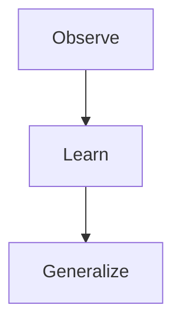

Excellent. Let's begin building this as if it were the **first chapter of a world-class Machine Learning textbook**.

One small note before we begin:

> **This chapter is too large to fit into a single response while maintaining the depth and quality we've agreed on.**

So, just like a real textbook, we'll divide it into multiple parts. Each part will flow naturally into the next.

---

# 📖 Chapter 1

# What is Intelligence? Why Machine Learning Exists?

> *"Every great invention begins with a question. Machine Learning was born from one of the most fascinating questions ever asked: Can a machine learn the way humans do?"*

---

# 🌟 Why This Chapter Matters

Before we dive into algorithms, equations, Python code, or neural networks, we need to answer a much more fundamental question:

> **Why was Machine Learning invented in the first place?**

Imagine trying to learn calculus without understanding what numbers are. It would feel like memorizing formulas without knowing why they exist.

Machine Learning is no different.

Many beginners jump directly into topics like:

- Linear Regression
- Decision Trees
- Neural Networks
- Gradient Descent

Without ever asking:

> **"What problem were these algorithms created to solve?"**

As a result, they learn to use libraries like Scikit-Learn or TensorFlow but never truly understand what those algorithms are doing.

This chapter lays the philosophical and conceptual foundation for everything that follows.

By the end of this chapter, you won't just know *what* Machine Learning is—you'll understand *why humanity needed it*.

---

# 🗺️ Chapter Roadmap

```text
Chapter 1 – What is Intelligence? Why Machine Learning Exists?

Part 1 (Current)
├── Why This Chapter Matters
├── A Question That Changed Computer Science
├── What is Intelligence?
└── The Three Pillars of Intelligence

Part 2
├── Learning vs Memorization
├── Generalization
├── Why Generalization is the Goal of ML

Part 3
├── Can Machines Learn?
├── Why Traditional Programming Failed
├── Birth of Machine Learning

Part 4
├── Interactive Labs
├── Industry Perspective
├── Interview Guide
├── Revision Sheet
└── Author's Notes
```

---

# 🎯 Learning Objectives

After completing this chapter, you should be able to answer:

- What is intelligence?
- What does it mean to learn?
- Why do humans learn?
- Why is memorization different from learning?
- What is generalization?
- Why can't traditional programming solve every problem?
- Why was Machine Learning invented?
- What does a Machine Learning model actually learn?
- Why do we call it "learning"?

---

# Part 1 – A Question That Changed Computer Science

## Imagine It's the 1950s...

Let's travel back in time.

The year is **1955**.

Computers are incredibly rare.

They occupy entire rooms.

They consume enormous amounts of electricity.

And despite their impressive appearance...

They are surprisingly **dumb**.

If you ask a computer:

> **What is 15 × 17?**

It can answer instantly.

But if you ask:

> **Is this a picture of a cat?**

It has absolutely no idea.

Not because computers are slow.

Not because they lack memory.

But because they have never been taught **how to recognize a cat**.

At that time, computers could only follow instructions that humans explicitly wrote.

They could calculate.

They could sort numbers.

They could perform arithmetic.

But they could not **learn**.

Then a remarkable question emerged.

> **"Humans are not born knowing language, mathematics, or how to drive. They learn these skills through experience. Could a computer learn in the same way?"**

That question eventually led to:

- Artificial Intelligence
- Machine Learning
- Deep Learning
- Modern Generative AI
- ChatGPT

Everything you'll study in this book can be traced back to that single question.

---

# 🧠 Think Like the Inventor

Imagine you are one of those researchers in the 1950s.

You don't know what Machine Learning is because it hasn't been invented yet.

Someone gives you this challenge:

> **Build a computer program that can recognize cats in photographs.**

Take a moment before reading further.

How would **you** solve it?

Would you write rules like:

```text
IF ears are triangular

AND tail exists

AND whiskers exist

THEN Cat
```

It sounds reasonable.

Now let's test those rules.

---

## Case 1

The cat is sleeping.

Its ears are hidden.

Does your program still recognize it?

Probably not.

---

## Case 2

The cat is facing away from the camera.

No face is visible.

Now what?

---

## Case 3

The room is dark.

Only the eyes are visible.

Does your program still work?

---

## Case 4

Only half the cat appears in the image.

Can your rules identify it?

---

## Case 5

What if it's a tiger?

It has:

- Ears
- Tail
- Whiskers

Your program now thinks a tiger is a house cat.

---

You quickly realize something important:

> **Writing rules for every possible situation is practically impossible.**

Congratulations.

You have just rediscovered the exact problem that frustrated early computer scientists.

Machine Learning wasn't invented because people wanted a fashionable new technology.

It was invented because **hand-written rules eventually break down in the real world.**

---

# Part 2 – What is Intelligence?

Now that we've seen the problem, let's step back.

Before we teach machines to become intelligent, we first need to answer a surprisingly difficult question:

> **What exactly is intelligence?**

This question has fascinated philosophers, psychologists, neuroscientists, and computer scientists for centuries.

Ask ten people and you'll probably hear ten different answers.

Some might say:

- "Intelligence means having a high IQ."
- "It's about being knowledgeable."
- "It's having a great memory."
- "It's solving difficult mathematics."
- "It's getting good grades."

These qualities are certainly useful.

But are they really the essence of intelligence?

Let's test them.

---

## Example 1 – A Newborn Baby

Consider a newborn baby.

How much mathematics does the baby know?

None.

How many languages can the baby speak?

None.

How many books has the baby read?

None.

Yet within just a few years, the baby learns to:

- Walk
- Speak
- Recognize parents
- Understand emotions
- Identify food
- Avoid danger

Nobody sits down and programs these behaviors line by line.

The baby learns from experience.

This suggests that intelligence isn't simply about what you already know.

It's about your **ability to acquire new knowledge**.

---

## Example 2 – The Human Calculator

Now imagine another person.

They have memorized every mathematics textbook ever written.

Every theorem.

Every formula.

Every solved example.

Then you present them with a completely new problem that requires creative thinking.

They struggle.

Why?

Because **memorization is not the same as understanding**.

They stored answers.

They didn't learn the underlying patterns.

---

# A Better Definition of Intelligence

Let's build our own definition.

An intelligent system should be able to:

1. Observe the world.
2. Learn from its experiences.
3. Use what it learned to handle situations it has never encountered before.

That leads us to our working definition.

> **Intelligence is the ability to learn patterns from experience and use those patterns to make good decisions in new situations.**

Notice the most important phrase:

> **"New situations."**

Not situations you've already memorized.

Not questions you've already solved.

But problems you've **never seen before**.

That single phrase is the foundation of Machine Learning.

---

# Part 3 – The Three Pillars of Intelligence

Although intelligence appears incredibly complex, almost every intelligent behavior can be broken into three simple stages.



Every intelligent system—whether it's a child learning to walk or a self-driving car learning to navigate traffic—follows this same cycle.

Let's explore each pillar.

---

## Pillar 1 – Observe

Everything begins with **experience**.

Humans experience the world through their senses.

| Human | Experience Collected |
|--------|----------------------|
| Eyes | Images and motion |
| Ears | Sounds and speech |
| Skin | Temperature and touch |
| Nose | Smells |
| Tongue | Taste |

Without experience, there is nothing to learn from.

Machine Learning systems also begin with experience.

The only difference is that their "experience" comes in the form of data.

| Machine | Experience (Data) |
|----------|-------------------|
| Self-driving car | Camera images, LiDAR, radar |
| Spam detector | Emails |
| Netflix | Viewing history |
| Hospital AI | Medical records |
| ChatGPT | Large collections of text |

For both humans and machines:

> **Experience is simply data collected from the world.**

---

## Pillar 2 – Learn

Observation alone is not enough.

Suppose a child touches a hot pan.

The sequence looks like this:

```text
Observe the hot pan
        ↓
Touch it
        ↓
Feel pain
        ↓
Brain updates its understanding
        ↓
Avoid touching hot objects next time
```

What changed?

The pan didn't change.

The room didn't change.

The child changed.

More precisely, the child's **internal model of the world** changed.

That change is what we call **learning**.

---

We'll continue with **Part 2** of Chapter 1 next, where we'll explore:

- **Pillar 3 – Generalization**
- **Learning vs Memorization**
- **Why Generalization Is the Heart of Machine Learning**

These ideas form the conceptual bridge between human intelligence and machine learning, and they're arguably the most important concepts in the entire field.
