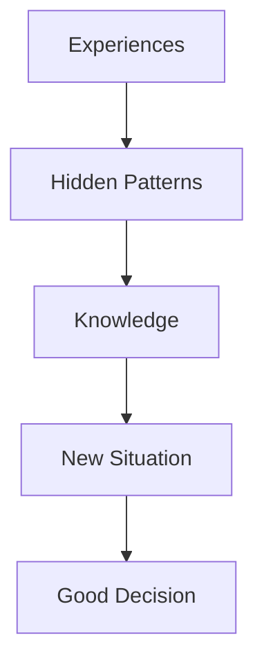

# 📖 Chapter 1 – What is Intelligence? Why Machine Learning Exists

# **Part 2 – The Heart of Intelligence: Learning, Memorization & Generalization**

> *"If there is one concept you remember from this entire chapter, let it be this: Intelligence is not measured by how much you remember, but by how well you can deal with something you've never seen before."*

---

# 📍 Where We Are

```text
Chapter 1 – What is Intelligence? Why Machine Learning Exists?

✅ Part 1
├── Why This Chapter Matters
├── A Question That Changed Computer Science
├── What is Intelligence?
├── The Three Pillars of Intelligence
├── Observe
└── Learn

🚀 Part 2 (Current)
├── Generalization
├── Learning vs Memorization
├── Why Generalization is Everything
└── The Golden Definition of Learning

Upcoming

Part 3
├── Can Machines Learn?
├── Why Traditional Programming Failed
└── Birth of Machine Learning
```

---

# Part 3 – The Third Pillar of Intelligence

In Part 1, we discovered that intelligence has three pillars:


We have already understood:

- Observe
- Learn

Now we arrive at the **most important pillar**.

## Generalize

This single word separates a calculator from a human.

It also separates **Artificial Intelligence** from ordinary computer programs.

---

# 🧠 Think Like the Inventor

Imagine a child.

One day the child touches a hot iron.

The sequence looks like this:

```text
Hot Iron
      ↓
Touch
      ↓
Pain
      ↓
Learning
```

The next day, the child sees another hot object.

This time it is **not** the same iron.

It is a hot cooking pan.

Nobody has told the child:

> "Don't touch hot pans."

Yet the child hesitates.

Why?

---

Did the child memorize

```text
Red Iron = Dangerous
```

No.

The child's brain learned something deeper.

It discovered the pattern:

```text
Hot Objects
        ↓
Cause Pain
```

Notice what happened.

The child didn't memorize one object.

The child learned a **general rule**.

This ability is called **generalization**.

---

# 🌟 The Biggest Difference Between Humans and Machines

Let's compare two systems.

## System A

Remembers exactly one experience.

```text
Touched Iron

↓

Avoid Iron
```

---

## System B

Learns the underlying pattern.

```text
Touched Iron

↓

Understood Heat

↓

Avoid Any Hot Object
```

Which one appears more intelligent?

Obviously,

**System B.**

Because it can handle situations it has never encountered before.

That is the essence of intelligence.

---

# Another Everyday Example

Suppose you have never seen this dog before.

🐶

Yet you instantly know it is a dog.

How?

Nobody showed you every dog that exists.

In fact,

No one can.

There are millions of dogs.

Different:

- colors
- sizes
- breeds
- ages

Still...

You recognize them effortlessly.

Why?

Because your brain has learned the **concept** of a dog—not memorized individual dogs.

---

# 💡 The Secret Behind Intelligence

Intelligent systems do not memorize examples.

They discover **patterns** hidden inside those examples.

Once the pattern is learned,

new situations become much easier.



This is exactly what Machine Learning models attempt to do.

---

# Learning vs Memorization

This is one of the most misunderstood ideas in Machine Learning.

Many beginners believe:

> "The model learns the training dataset."

That statement is **not entirely correct**.

Let's understand why.

---

## Student A — Memorization

Student A studies like this:

```text
Question 1

↓

Answer
```

```text
Question 2

↓

Answer
```

```text
Question 3

↓

Answer
```

The student memorizes hundreds of solved problems.

During the exam,

everything looks fine...

until a new question appears.

The student panics.

Because the question wasn't memorized.

---

## Student B — Understanding

Student B studies differently.

Instead of memorizing answers,

the student asks:

- Why does this formula work?
- What principle is being used?
- Can I solve a similar problem?

The student learns the **pattern**.

During the exam,

even if the question is completely new,

the student can still solve it.

---

# Visual Comparison

| Memorization | Learning |
|---------------|-----------|
| Stores answers | Discovers patterns |
| Depends on memory | Depends on understanding |
| Works only for familiar questions | Works for new questions |
| Fragile | Flexible |
| Cannot adapt | Can adapt |

---

# 🧠 Think Like the Inventor

Suppose I teach you:

```text
2 + 2 = 4

3 + 3 = 6

5 + 5 = 10
```

Now I ask:

```text
127 + 127 = ?
```

If you memorized,

you'll struggle.

But if you understood **addition**,

the answer is easy.

Notice something profound.

The new problem never appeared during training.

Yet you solved it.

That is **generalization**.

---

# The Golden Definition of Learning

Now we are finally ready to define learning.

After everything we've seen,

learning is much more than storing information.

A better definition is:

> **Learning is the process of converting experience into generalizable knowledge.**

Let's break this definition apart.

---

## Experience

Everything we observe.

Examples:

- Emails
- Images
- Medical records
- Customer purchases
- Road signs

---

## Knowledge

The hidden relationships inside the data.

Examples:

- Cats usually have certain visual patterns.
- Spam emails often contain suspicious characteristics.
- Larger houses usually cost more.

---

## Generalizable

This is the keyword.

Knowledge is only useful if it helps us make good decisions about situations we've **never seen before**.

Without generalization,

there is no intelligence.

---

# Why Generalization Is the Goal of Machine Learning

Imagine we train a model using this data.

| House Area (sq ft) | Price (₹ Lakhs) |
|-------------------:|----------------:|
| 1000 | 50 |
| 1200 | 60 |
| 1500 | 75 |

Now a customer arrives with a house measuring:

```text
1300 sq ft
```

Look carefully.

1300 does **not** exist in our training data.

What should the model do?

---

## Scenario 1 – Memorization

The model replies:

> "Sorry.
>
> I have never seen 1300."

This isn't useful.

---

## Scenario 2 – Learning

Instead, the model notices a pattern.

```text
Larger Area

↓

Higher Price
```

Using this relationship,

it predicts:

```text
1300 sq ft

↓

≈ ₹65 Lakhs
```

The model successfully answered a question it had never seen before.

This is generalization.

---

# 🌍 Real-World Analogy

Imagine learning to ride a bicycle.

The first day:

- You wobble.
- You fall.
- You lose balance.

The second day:

Still difficult.

The third day:

Better.

After a few weeks:

You can ride almost any bicycle.

Now imagine someone gives you a completely different bicycle.

Maybe it's:

- Bigger
- Smaller
- A mountain bike
- A racing bike

Can you still ride it?

Yes.

Did you memorize one bicycle?

No.

You learned the **principles of balancing**.

This is another example of generalization.

---

# Interactive Thinking Exercise

Don't answer immediately.

Take a minute to think.

## Scenario 1

A child learns:

```text
Dog

↓

Barks
```

Later,

the child sees another dog.

Different breed.

Different color.

Still recognizes it.

Why?

---

## Scenario 2

An ML model is trained on thousands of cat images.

Later,

it correctly identifies a cat it has never seen before.

What exactly did the model learn?

Did it memorize every image?

Or did it learn visual patterns common to cats?

This is the exact question we'll keep exploring throughout the book.

---

# 🔬 Mini Experiment (No Coding Yet)

Let's play a small game.

Imagine I show you these numbers:

```text
2

4

6

8
```

What comes next?

Almost everyone answers:

```text
10
```

But here's the interesting question:

**Why?**

Because your brain detected the pattern:

> "Add 2."

You didn't memorize the sequence.

You inferred the underlying rule.

This is precisely what Machine Learning algorithms attempt to do with data.

---

# 🌉 Concept Connection

Everything we've learned so far fits into one beautiful flow.


This diagram is worth revisiting throughout the course. Whether you're studying Linear Regression, Decision Trees, Neural Networks, or Large Language Models, they're all trying to move from **data** to **generalization**.

---

# 📝 Key Takeaways

By the end of this part, you should remember:

- Intelligence is demonstrated by handling **new situations**, not familiar ones.
- Learning is about discovering **patterns**, not memorizing examples.
- Generalization is the ability to apply learned patterns to unseen data.
- A Machine Learning model is valuable only if it generalizes beyond its training data.
- Every ML algorithm you'll study is ultimately designed to improve generalization.

---

# ✍️ Author's Note

This is one of the most important ideas in the entire book.

Whenever you encounter a new Machine Learning algorithm, don't ask:

> **"How does this algorithm work?"**

Ask a deeper question:

> **"What pattern is this algorithm trying to discover, and how will it use that pattern to make good predictions on data it has never seen before?"**

If you keep this question in mind, topics like Linear Regression, Decision Trees, Neural Networks, Gradient Descent, and even Large Language Models will feel like different answers to the same fundamental problem.

In **Part 3**, we'll answer the next big question:

> **If humans learn by discovering patterns from experience, why couldn't we simply write those patterns as computer programs?**

That question leads directly to the invention of **Machine Learning** itself.
