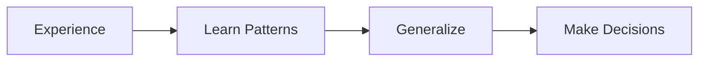
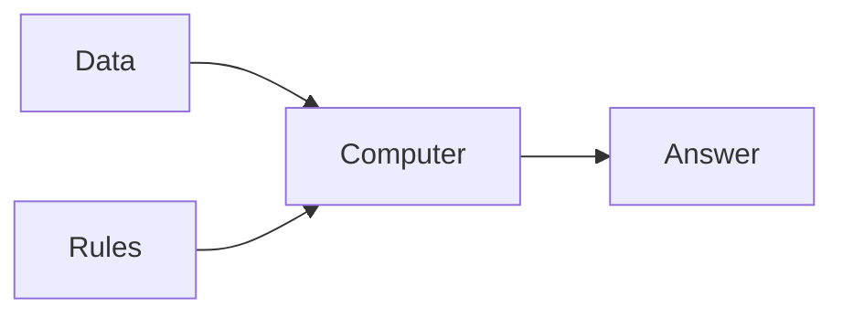
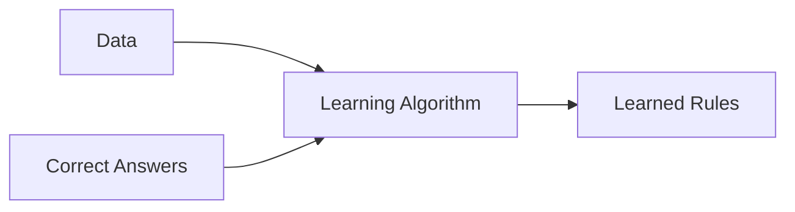
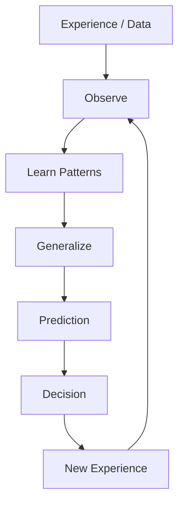

# 📖 Chapter 1 – What is Intelligence? Why Machine Learning Exists

# **Part 3 – Can Machines Learn? Why Traditional Programming Failed & The Birth of Machine Learning**

> *"Machine Learning wasn't invented because computers became faster. It was invented because humans discovered that some problems cannot be solved by writing rules."*

---

# 📍 Where We Are

```text
Chapter 1 – What is Intelligence? Why Machine Learning Exists?

✅ Part 1
├── Why This Chapter Matters
├── What is Intelligence?
├── Observe
└── Learn

✅ Part 2
├── Generalization
├── Learning vs Memorization
├── Why Generalization Matters

🚀 Part 3 (Current)
├── Can Machines Learn?
├── The Limits of Classical Programming
├── Why Machine Learning Was Invented
├── Classical Programming vs Machine Learning
└── What Does an ML Model Actually Learn?

Upcoming

Part 4
├── Interactive Labs
├── Industry Perspective
├── Interview Guide
├── Revision Sheet
└── Author's Notes
```

---

# Before We Talk About Machine Learning...

Let's pause for a moment.

So far, we've learned that humans become intelligent through this process:



Now comes a fascinating question.

> **If humans can learn from experience, why can't computers?**

At first glance, this sounds reasonable.

After all, computers are much faster than humans.

They have more memory.

They perform billions of calculations every second.

So why can't they simply learn?

The answer lies in understanding how computers originally worked.

---

# 🧠 Think Like the Inventor

Imagine you're a software engineer in **1985**.

Machine Learning doesn't exist yet.

Your manager gives you a task.

> **Build software that identifies spam emails.**

You have only one tool:

**Programming.**

No AI.

No ML.

No neural networks.

How would you solve it?

Most people would start writing rules.

---

# Attempt 1 – Rule-Based Programming

You observe that many spam emails contain the word:

```text
Lottery
```

So you write:

```python
if "lottery" in email:
    mark_as_spam()
```

It works.

You celebrate.

The next day...

The spammer writes:

```text
L0ttery
```

(with a zero instead of the letter "o")

Your software fails.

---

You update the code.

```python
if "lottery" in email:
    spam()

elif "l0ttery" in email:
    spam()
```

Again it works.

Until tomorrow.

---

Now the spammer writes

```text
Congratulations!
```

No mention of lottery.

Your software fails again.

---

You add another rule.

```python
if "congratulations" in email:
    spam()
```

The next day:

```text
Claim Your Prize
```

Fails.

---

Then:

```text
Exclusive Offer
```

Fails.

---

Then:

```text
Free Gift
```

Fails.

---

After a few months, your code looks like this.

```python
if ...

elif ...

elif ...

elif ...

elif ...

elif ...

elif ...

elif ...

elif ...

...
```

Thousands of rules.

Thousands of exceptions.

Thousands of bugs.

---

# The Real Problem

The problem wasn't that you were a bad programmer.

The problem was much deeper.

You were trying to solve an **infinite problem** using a **finite list of rules**.

The real world is messy.

People constantly invent new words.

New fraud techniques.

New products.

New languages.

New situations.

You simply cannot predict every possibility.

---

# 🌍 This Problem Exists Everywhere

Spam detection was only the beginning.

Let's explore other domains.

---

## 🚗 Self-Driving Cars

Imagine writing rules like:

```text
IF road is straight

Drive Forward
```

Easy.

Now consider:

- Rain
- Snow
- Fog
- Construction
- A child running across the road
- An ambulance approaching
- A fallen tree
- A cyclist signaling a turn

Would you write a rule for every situation?

Impossible.

---

## 🎬 Netflix Recommendations

Suppose Netflix wants to recommend movies.

Can a programmer write:

```text
IF age > 30

Recommend Movie A
```

What about:

- Different cultures?
- Personal taste?
- Mood?
- Weekend vs weekday?
- Family watching together?
- New movies?

Again...

Too many possibilities.

---

## 🌍 Google Translate

Suppose you decide to translate English to Hindi.

Would you manually write grammar rules for every sentence?

Consider:

```text
I saw the man with the telescope.
```

Who has the telescope?

- You?
- The man?

Even humans debate such sentences.

How can we hard-code every rule?

---

## 🤖 ChatGPT

Now think about ChatGPT.

Imagine writing rules like:

```text
IF user asks about Python

Give Python answer
```

Easy.

Now imagine handling:

- Millions of topics
- Hundreds of languages
- Different writing styles
- Follow-up questions
- Ambiguous prompts
- Creative writing
- Technical debugging
- Mathematics
- Philosophy

Would handwritten rules ever be enough?

Not even remotely.

---

# The Fundamental Limitation of Classical Programming

Let's summarize.

Classical programming assumes:

> **The programmer already knows every rule needed to solve the problem.**

This works beautifully for well-defined tasks.

For example:

Calculator

```text
2 + 3
```

The rule is fixed.

Always.

---

Sorting numbers.

```text
Sort ascending.
```

Again,

The rules never change.

---

But many real-world problems don't have fixed rules.

Instead,

the rules are hidden inside the data.

This realization changed computer science forever.

---

# The Big Paradigm Shift

For decades, software followed this model.



This is called **Classical Programming**.

You provide:

- Data
- Rules

The computer produces an answer.

---

Then researchers asked:

> **What if we reverse the process?**

Instead of giving the computer rules,

what if we give it examples?

---

This leads to an entirely different pipeline.



This is **Machine Learning**.

Notice what changed.

The computer is no longer executing rules.

It is **discovering** them.

---

# Why This Is Revolutionary

Let's compare the two approaches.

| Classical Programming | Machine Learning |
|------------------------|------------------|
| Human writes rules | Algorithm discovers rules |
| Rules are explicit | Rules are learned |
| Good for fixed problems | Good for changing problems |
| Difficult to maintain | Improves with more data |
| Programmer supplies intelligence | Data supplies experience |

This single inversion is one of the biggest paradigm shifts in the history of computing.

---

# What Does an ML Model Actually Learn?

Here's a question almost every beginner asks:

> **"Where are the learned rules stored?"**

Excellent question.

They are **not** stored like this:

```text
Rule 1

Rule 2

Rule 3
```

Instead,

Machine Learning models learn **parameters**.

For Linear Regression,

these parameters are numbers like:

```text
Weight (w)

Bias (b)
```

For Neural Networks,

they may be millions or even billions of weights.

These numbers collectively represent the patterns hidden in the data.

Think of them as the model's **internal knowledge**.

---

# The Human Brain Analogy

Imagine learning to play cricket.

When you first pick up a bat:

- You miss the ball.
- Your timing is poor.
- Your footwork is awkward.

After months of practice:

- Your reactions improve.
- Your balance improves.
- Your timing improves.

Can you point to a single "rule" in your brain that says:

> "Move your left foot exactly 12 cm before swinging."

Of course not.

Instead,

your brain gradually adjusted billions of neural connections through experience.

Machine Learning models do something conceptually similar.

During training,

their parameters are adjusted repeatedly until they capture useful patterns.

Later in this book, we'll learn exactly how **Gradient Descent** performs these adjustments.

---

# Arthur Samuel's Historic Definition

One of the earliest pioneers of Machine Learning, **Arthur Samuel**, gave a definition in 1959 that is still widely quoted today:

> **"Machine Learning is the field of study that gives computers the ability to learn without being explicitly programmed."**

Notice the phrase:

> **without being explicitly programmed**

This doesn't mean there is no programming.

It means we program **how to learn**, rather than programming **every rule**.

---

# 🌉 Concept Connection

Everything we've learned now fits together beautifully.



This feedback loop is the foundation of both:

- Human learning
- Machine learning

---

# 📝 Key Takeaways

- Traditional programming works well when rules are known and stable.
- Many real-world problems have hidden or constantly changing rules.
- Writing rules manually for such problems is impractical.
- Machine Learning shifts the burden from writing rules to learning rules from data.
- A trained ML model stores knowledge as learned parameters rather than handwritten logic.

---

# ✍️ Author's Note

This chapter marks one of the biggest mindset shifts you'll make in your Machine Learning journey.

Many people think:

> "Machine Learning is just another programming technique."

It isn't.

It is a completely different philosophy of solving problems.

Classical programming asks:

> **"What rules should I write?"**

Machine Learning asks:

> **"What examples can I learn from?"**

That single change transformed computing and made possible technologies like recommendation systems, speech recognition, self-driving cars, medical diagnosis, and modern AI assistants.

In **Part 4**, we'll consolidate everything you've learned through interactive thought experiments, real industry examples, interview preparation, and a one-page revision sheet. That final part will also serve as your quick-reference guide before moving on to Chapter 2.
