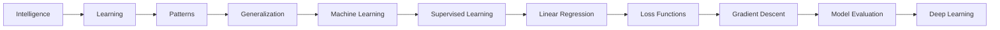

# 📖 Chapter 1 – What is Intelligence? Why Machine Learning Exists

# **Part 4 – Interactive Labs, Industry Perspective, Interview Guide & Revision**

> *"Knowledge becomes understanding only when you can use it, explain it, and connect it to the real world."*

---

# 📍 Where We Are

```text
Chapter 1 – What is Intelligence? Why Machine Learning Exists?

✅ Part 1
├── Why This Chapter Matters
├── What is Intelligence?
├── Observe
└── Learn

✅ Part 2
├── Generalization
├── Learning vs Memorization
└── Why Generalization Matters

✅ Part 3
├── Why Traditional Programming Failed
├── Birth of Machine Learning
└── Classical Programming vs Machine Learning

🚀 Part 4 (Current)
├── Interactive Labs
├── Industry Perspective
├── Interview Guide
├── Chapter Summary
├── Revision Sheet
├── Exercises
└── Author's Notes
```

---

# 🧪 Interactive Lab 1 – Become a Machine Learning Researcher

## Objective

Experience why writing rules becomes impossible.

---

## Scenario

Imagine you are hired by a company to build software that detects **cats**.

Here are four images.

🐈 Image 1

🐈 Image 2

🐈 Image 3

🐈 Image 4

Your task is simple.

> **Write rules that correctly identify every cat.**

Take two minutes before reading further.

---

### Most people write rules like

```text
Has two ears

Has four legs

Has a tail

Has whiskers
```

Looks good.

Now let's test them.

---

### Case 1

A cat is sleeping.

Only its face is visible.

Still works?

---

### Case 2

The cat lost its tail.

Now?

---

### Case 3

The room is dark.

Only glowing eyes are visible.

Now?

---

### Case 4

The image contains a tiger.

It also has:

- ears
- whiskers
- four legs
- tail

Oops.

Your software calls it a cat.

---

## 🎯 What You Should Observe

Writing rules works for simple examples.

But real life contains **millions of variations**.

This is exactly why Machine Learning became necessary.

---

# 🧪 Interactive Lab 2 – Memory vs Learning

Let's play a game.

Suppose I teach you only these examples.

```text
2 + 2 = 4

5 + 5 = 10

8 + 8 = 16
```

Now answer

```text
127 + 127 = ?
```

Why could you solve it?

Because you remembered?

No.

Because you understood the **pattern of addition**.

---

## 🎯 What You Should Observe

Learning

≠

Remembering.

Learning

=

Understanding the underlying rule.

---

# 🧪 Interactive Lab 3 – Can You Recognize Your Mother?

This sounds funny...

but it demonstrates one of the deepest ideas in AI.

Question:

Can you recognize your mother?

Obviously yes.

Now write the algorithm.

Most people freeze.

You know *how* to recognize her.

But you cannot explicitly describe every rule.

This demonstrates an important distinction:

> Humans often possess **implicit knowledge** that is difficult to express as explicit rules.

Machine Learning aims to capture such patterns directly from data.

---

# 🧪 Interactive Lab 4 – Discover the Pattern

Continue the sequence.

```text
3

6

9

12

?
```

Most people answer

```text
15
```

Now ask yourself:

Did you memorize the sequence?

Or did you discover the rule?

This is exactly what a Machine Learning model tries to do.

---

# 🌍 Industry Perspective

Let's revisit the central question.

Why wasn't traditional programming enough?

The answer becomes clearer when we examine real-world applications.

| Industry | Why Classical Programming Fails | Why ML Works |
|-----------|--------------------------------|--------------|
| Gmail | Spam tactics constantly change | Learns new spam patterns from data |
| Netflix | Millions of users have unique preferences | Learns viewing behavior |
| Amazon | Impossible to manually recommend products | Learns purchase patterns |
| Tesla | Infinite driving scenarios | Learns from driving data |
| Google Translate | Human language is highly ambiguous | Learns statistical language patterns |
| ChatGPT | Impossible to prewrite every conversation | Learns patterns from large text corpora |
| Banking | Fraud techniques evolve daily | Learns suspicious transaction behavior |
| Healthcare | Diseases present differently across patients | Learns diagnostic patterns from medical data |

---

# 💼 Industry Case Study

## Netflix Recommendation System

Imagine Netflix has:

- 300 million users
- 20,000 movies
- Thousands of new titles each year

Could engineers write rules like:

```text
IF Age > 25

Recommend Movie X
```

Of course not.

Two people of the same age may enjoy completely different genres.

Instead, Netflix collects data such as:

- Viewing history
- Watch duration
- Ratings
- Time of day
- Genres watched

The recommendation model discovers patterns that no human could manually encode.

---

# 💡 Machine Learning Is Everywhere

Once you understand the core idea, you'll start noticing ML in daily life.

| Application | What is the Model Learning? |
|-------------|-----------------------------|
| Face Unlock | Facial features |
| Google Maps | Traffic patterns |
| Spotify | Music preferences |
| YouTube | Viewing interests |
| Credit Card Fraud | Unusual spending behavior |
| Weather Forecast | Atmospheric patterns |
| Stock Prediction | Historical market relationships (to a limited extent) |
| ChatGPT | Statistical patterns in language |

Notice the common theme.

Every application is learning **patterns**, not memorizing examples.

---

# 🧠 Think Like an ML Engineer

Whenever someone tells you,

> "We built an AI system."

Ask yourself these questions:

1. What data does it observe?
2. What pattern is it trying to learn?
3. How does it generalize to unseen data?
4. What decisions does it make using those learned patterns?

If you can answer these four questions, you've begun thinking like an ML engineer.

---

# 🎯 Common Misconceptions

## ❌ Misconception 1

> Machine Learning means the computer becomes conscious.

No.

Machine Learning is about discovering statistical patterns.

It does not imply consciousness or self-awareness.

---

## ❌ Misconception 2

> Machine Learning memorizes data.

A good ML model should **not** memorize.

Its goal is to generalize to unseen examples.

---

## ❌ Misconception 3

> AI, Machine Learning, and Deep Learning are the same thing.

Not quite.

```text
Artificial Intelligence
        │
        └── Machine Learning
                 │
                 └── Deep Learning
```

We'll explore this relationship in upcoming chapters.

---

# 🎤 Interview Guide

## Beginner Questions

### Q1. What is intelligence?

**Answer**

Intelligence is the ability to learn patterns from experience and use those patterns to make good decisions in new situations.

---

### Q2. What is learning?

Learning is the process of converting experience into generalizable knowledge.

---

### Q3. What is generalization?

Generalization is the ability of a model to perform well on data it has never seen before.

---

### Q4. Why was Machine Learning invented?

Because many real-world problems are too complex and dynamic to solve using manually written rules.

---

## Intermediate Questions

### Q5. Explain Classical Programming vs Machine Learning.

| Classical Programming | Machine Learning |
|------------------------|------------------|
| Data + Rules → Output | Data + Correct Outputs → Learned Rules |

---

### Q6. What does a Machine Learning model actually learn?

It learns parameters (such as weights and biases) that capture useful patterns in the data.

---

### Q7. Why is memorization undesirable?

Because memorized models perform well only on the training data and fail when presented with new, unseen examples.

---

## Advanced Questions

### Q8. Is a highly accurate model always intelligent?

Not necessarily.

If it simply memorizes the training data, it may perform poorly in real-world situations. True intelligence requires generalization.

---

### Q9. Can a rule-based system ever outperform Machine Learning?

Yes.

If the rules are simple, stable, and completely known (for example, calculating taxes using fixed regulations or sorting numbers), classical programming is often the better choice.

---

# 📝 Revision Sheet

## The Five Ideas to Remember

### 1.

**Intelligence**

↓

Learning from experience

↓

Making good decisions

---

### 2.

Learning

↓

Finding patterns

↓

Not memorizing answers

---

### 3.

Goal of Machine Learning

↓

Generalization

↓

Good performance on unseen data

---

### 4.

Classical Programming

```text
Data

+

Rules

↓

Answer
```

---

### 5.

Machine Learning

```text
Data

+

Correct Answers

↓

Learned Rules
```

---

# 🌉 Concept Connection

This chapter forms the foundation for the entire book.



Whenever you feel overwhelmed later in the course, come back to this roadmap. Every chapter is simply another layer built on the concepts introduced here.

---

# 🧩 Exercises

## Conceptual

1. Explain the difference between intelligence and memorization in your own words.
2. Give three real-world examples where classical programming is sufficient.
3. Give three real-world examples where Machine Learning is a better choice.
4. Why is generalization more important than training accuracy?
5. If a model achieves 100% accuracy on the training data but performs poorly on new data, what likely happened?

---

## Thinking Exercise

Imagine you have to build an AI that recognizes mangoes.

Without using Machine Learning:

- What rules would you write?
- How many exceptions would eventually appear?
- At what point would writing more rules become impractical?

This exercise is designed to help you *feel* why Machine Learning emerged.

---

## Coding Preview (Coming Soon)

In the next few chapters, we'll move from ideas to implementation.

You'll learn how to:

- Represent data using NumPy.
- Train your first Machine Learning model.
- Measure prediction errors.
- Optimize models using Gradient Descent.

The concepts from this chapter will become concrete through code.

---

# ✍️ Author's Note

If this chapter has done its job well, your mindset should now be different.

Before this chapter, you might have thought:

> "Machine Learning is a collection of algorithms."

Now you should see it differently:

> **Machine Learning is a new way of solving problems.**

Classical programming asks:

> **"What rules should I write?"**

Machine Learning asks:

> **"What examples can I learn from?"**

That single shift—from **writing rules** to **learning patterns**—is the foundation of modern AI.

As we move into the next chapters, every algorithm we study—Linear Regression, Logistic Regression, Decision Trees, Random Forests, Support Vector Machines, Neural Networks, and Large Language Models—will simply be a different answer to one recurring question:

> **"How can a machine learn patterns from experience and use them to make reliable predictions about situations it has never seen before?"**

Keep this question with you throughout the book. It is the thread that ties the entire field of Machine Learning together.

---

# 🎓 End of Chapter Reflection

Before moving to Chapter 2, ask yourself:

- Can I clearly explain why Machine Learning was invented?
- Do I understand the difference between memorization and learning?
- Can I explain generalization without looking at my notes?
- Can I identify real-world problems where Machine Learning is appropriate?
- Do I now think about AI as **learning patterns from data** rather than **executing programmed rules**?

If your answer is **yes**, then you have built one of the strongest conceptual foundations possible for the journey ahead.

---

## 📌 My Suggestion for Future Chapters

After completing this chapter, I'd like to add a **"Historical Timeline"** box at the end of each major chapter. For example, after this chapter:

```text
1943 → Artificial Neuron (McCulloch & Pitts)
1950 → Turing Test
1956 → Dartmouth Conference (Birth of AI)
1959 → Arthur Samuel coins Machine Learning
1986 → Backpropagation popularized
2012 → AlexNet sparks Deep Learning revolution
2022 → ChatGPT brings Generative AI to the mainstream
```

This will help connect concepts with the evolution of the field and make the textbook feel even more cohesive and memorable. I think it would be a valuable addition as we continue rebuilding the earlier chapters.
