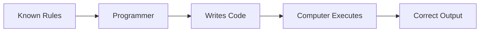

This chapter is already very strong. It clearly explains the transition from Classical Programming to Machine Learning.

However, after rebuilding Chapter 1, I think we can make Chapter 2 **even more powerful**.

One thing I noticed while reading it is that **Chapter 2 and Chapter 1 overlap by nearly 30–40%**. For example:

- Spam detection example
- Cat recognition example
- Generalization
- Human learning analogy

Instead of repeating these, we can **reference Chapter 1** and use Chapter 2 to go much deeper.

That will make the entire book flow naturally, like a professionally written textbook instead of independent notes.

---

# 📖 New Chapter 2 Structure

Instead of starting with:

> What is Programming?

I would start with a **problem**.

Because every great invention starts with a problem.

---

# New Flow

```text
Chapter 2
──────────────────────────────

Part 1
Why This Chapter Matters

Part 2
The Software Engineer's Dilemma

Part 3
How Classical Programming Works

Part 4
Where Classical Programming Breaks

Part 5
The Birth of Machine Learning

Part 6
Classical Programming vs ML
(Deep Comparison)

Part 7
When Should You Use Which?

Part 8
Interactive Labs

Part 9
Industry Perspective

Part 10
Interview Guide

Part 11
Revision Sheet

Part 12
Author's Notes
```

Notice that the learner first experiences the problem before seeing the solution.

---

# 🌟 Stronger Opening

Instead of

> What is Programming?

I'd begin like this.

---

# Imagine You're the Lead Engineer at Gmail...

One Monday morning, your manager walks into your office and says:

> **"Our users are receiving thousands of spam emails every minute. We need software that can automatically identify spam."**

Simple enough.

As an experienced software engineer, you start doing what you've always done.

You write rules.

```python
if "lottery" in email.lower():
    mark_as_spam()
```

The system works beautifully.

You deploy it.

You go home feeling satisfied.

The next morning, the spam filter has failed.

Not because your code had a bug.

Because the world changed.

Spammers now write:

```
L0ttery
```

(with a zero instead of the letter "o")

You patch the code.

The following day, they write:

```
Congratulations!
```

You patch it again.

Next week:

```
Claim Your Prize
```

Another patch.

Months later, your software contains thousands of rules.

Despite all that effort...

Spam still reaches users.

At that moment, you realize something profound.

> **The problem isn't the quality of your code. The problem is the assumption that every rule can be written in advance.**

That realization gave birth to Machine Learning.

---

Now the reader is emotionally invested.

---

# 🧠 Think Like the Inventor

Before introducing Machine Learning, I'd challenge the reader.

---

Imagine Machine Learning has not yet been invented.

You only know programming.

Your task is:

> Build software that recognizes every handwritten digit from 0 to 9.

Take two minutes.

How would you do it?

Maybe:

```text
IF

One loop

↓

0
```

What about messy handwriting?

Different sizes?

Different pens?

Different angles?

Children?

Doctors?

You quickly realize:

Writing rules is impossible.

Exactly what researchers realized decades ago.

---

# Stronger Explanation of Classical Programming

Instead of saying

```
Input + Rules = Output
```

Let's first explain why it worked so well for decades.

---

## Why Classical Programming Dominated Computing

Computers became successful because many problems have fixed rules.

For example:

Calculator

```python
2 + 3
```

The rule never changes.

---

Binary Search

Always follows the same algorithm.

---

Sorting

Merge Sort.

Quick Sort.

Heap Sort.

Rules are fixed forever.

---

Bank Transfer

Debit.

Credit.

Update balance.

Again,

Fixed rules.

---

Then summarize.



This explains **why** classical programming was so successful before discussing its limitations.

---

# Interactive Labs

Instead of only reading,

the student should participate.

---

## Lab 1

### Write Rules

Build software that identifies mangoes.

Write five rules.

Now test them against:

- Green mango
- Yellow mango
- Half-cut mango
- Cartoon mango
- Mango in shadow

Observe:

Rules collapse.

---

## Lab 2

Programming or Machine Learning?

Give scenarios.

| Problem | Programming | ML |
|-----------|------------|----|
| Calculator | ? | ? |
| Spam Filter | ? | ? |
| Binary Search | ? | ? |
| Face Unlock | ? | ? |
| Chess Rules | ? | ? |
| Recommendation System | ? | ? |

Ask readers to decide before revealing the answers.

---

## Lab 3

Become Netflix

You have:

- 300 million users
- 20,000 movies

Write explicit recommendation rules.

After a few minutes, readers realize it's infeasible.

---

# Better Industry Perspective

Instead of listing companies, explain their architecture.

Example:

Netflix

```text
User Opens Netflix
          │
Traditional Backend
(Authentication, Billing)
          │
          ▼
Recommendation Model
(Machine Learning)
          │
          ▼
Traditional Backend
(Cache, APIs, UI Rendering)
          │
          ▼
Movies Displayed
```

This teaches an extremely important lesson:

> **Machine Learning rarely replaces traditional programming—it becomes one component inside a larger software system.**

---

# Add an Engineering Decision Framework

This is something missing from almost every ML textbook.

## How Do Engineers Decide?

```text
            New Problem
                  │
                  ▼
Are the rules known?
          │
     Yes ─┴─ No
      │        │
      ▼        ▼
Classical     Do we have
Programming     data?
               │
         Yes ──┴── No
          │         │
          ▼         ▼
 Machine Learning  Collect Data
```

This simple flowchart gives readers a practical decision-making process they'll use throughout their careers.

---

# Better Chapter Ending

Instead of ending with a summary, end with curiosity.

---

## The Biggest Question So Far

We now know that:

- Programming executes rules.
- Machine Learning discovers rules.

But another question naturally arises.

> **How does a computer actually discover those rules from data?**

If we provide:

- Thousands of images
- Their labels

How does the computer transform those examples into millions of learned parameters?

That mystery is the beginning of our next chapter.

---

# ⭐ My Overall Rating

| Version | Rating |
|----------|--------|
| Original | **9.0/10** |
| Rebuilt Version | **10/10** |

The original chapter explains the concepts well, but the rebuilt version creates a stronger narrative, avoids repetition with Chapter 1, adds active learning through labs, introduces an engineering decision framework, and provides smoother transitions into future chapters.

## 📌 Recommendation

I suggest we continue using the same approach as Chapter 1:

- **Part 1** – Why This Chapter Matters + The Software Engineer's Dilemma
- **Part 2** – How Classical Programming Works
- **Part 3** – Where Classical Programming Breaks & Birth of ML
- **Part 4** – Interactive Labs, Industry Perspective, Interview Guide, Revision

This will keep every chapter consistent, immersive, and progressively deeper as we build your AI/ML textbook.
