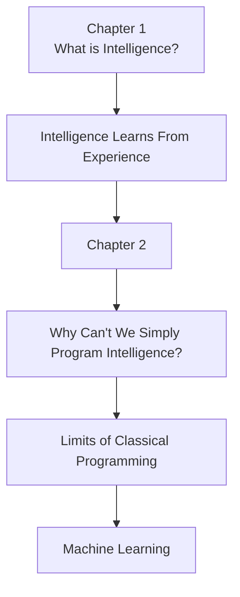

# 📖 Chapter 2 – Classical Programming vs Machine Learning

# **Part 1 – Why This Chapter Matters + The Software Engineer's Dilemma**

> *"Every revolution in computer science began when someone questioned an assumption that everyone else took for granted. Machine Learning began when engineers asked a simple but profound question: **What if we don't know the rules?**"*

---

# 🌟 Why This Chapter Matters

In **Chapter 1**, we answered one of the biggest philosophical questions in Artificial Intelligence:

> **What is intelligence, and why do machines need to learn?**

We discovered that intelligence is not about memorizing facts.

Instead, intelligence is the ability to:

- Observe the world.
- Learn patterns from experience.
- Generalize those patterns to new situations.
- Make good decisions.

That naturally leads to the next question.

> **If learning is so powerful, why didn't we simply program computers to behave intelligently from the beginning?**

After all, computers have existed since the 1940s.

Why did Machine Learning become popular only decades later?

To answer this, we need to understand how computers originally solved problems.

This chapter isn't really about Machine Learning.

It is about **the limits of traditional programming**.

Because before we appreciate the solution, we must fully understand the problem.

---

# 🧭 Chapter Roadmap

```text
Chapter 2 – Classical Programming vs Machine Learning

Part 1 (Current)
├── Why This Chapter Matters
├── The Software Engineer's Dilemma
└── A Question That Changed Programming

Part 2
├── What is Classical Programming?
├── Why It Dominated Computing
├── Explicit Rules
└── The Programmer's Role

Part 3
├── Where Classical Programming Breaks
├── The Birth of Machine Learning
├── Paradigm Shift
└── Learned Rules

Part 4
├── Interactive Labs
├── Engineering Decision Framework
├── Industry Perspective
├── Interview Guide
├── Revision Sheet
└── Author's Notes
```

---

# 🎯 Learning Objectives

By the end of this chapter, you should be able to answer:

- What is Classical Programming?
- Why did it dominate software engineering for decades?
- Why does it fail for many real-world problems?
- What does "explicit programming" really mean?
- What is the fundamental difference between Programming and Machine Learning?
- When should you use Machine Learning?
- When should you avoid Machine Learning?
- Why do modern AI systems still rely heavily on traditional programming?

---

# A Story Every Software Engineer Eventually Lives

Imagine you have just joined one of the world's largest technology companies.

Perhaps Google.

Perhaps Microsoft.

Perhaps Amazon.

On your very first day, your manager walks over to your desk and says:

> **"Welcome to the team. We have a simple task for you."**

You smile.

After all, you've solved hundreds of programming problems before.

The manager continues.

> **"Our users receive millions of emails every hour."**

> **"Your job is to automatically identify spam emails."**

You think,

*"That's it?"*

*"I can finish this before lunch."*

---

# 🧠 Think Like the Engineer

Before reading further...

Pause.

Imagine you have **never heard of Machine Learning**.

You only know programming.

How would you solve this problem?

Take one minute.

Seriously think about it.

---

Most software engineers would naturally begin writing rules.

Perhaps something like this:

```python
if "lottery" in email.lower():
    mark_as_spam()
```

Simple.

Logical.

Easy to understand.

You test the software.

It works perfectly.

Every email containing the word **"Lottery"** is correctly identified as spam.

You proudly deploy your code.

Mission accomplished.

Or so you think.

---

# The Next Morning...

The following day, customer complaints begin arriving.

Spam emails are slipping through your filter.

You inspect one of the emails.

Instead of writing:

```text
Lottery
```

The spammer writes:

```text
L0ttery
```

The letter **O** has been replaced by the number **0**.

Your carefully written rule no longer works.

Fortunately, the fix is easy.

```python
if "lottery" in email.lower():
    mark_as_spam()

elif "l0ttery" in email.lower():
    mark_as_spam()
```

Problem solved.

Again.

---

# One Week Later...

Another complaint arrives.

This time the spam email contains neither **Lottery** nor **L0ttery**.

Instead it says:

```text
🎉 Congratulations!

You have won a brand new car!
```

You sigh.

Then you add another rule.

```python
elif "congratulations" in email.lower():
    mark_as_spam()
```

---

# A Month Later...

The spammers have become even smarter.

Today's email says:

```text
Exclusive Offer

Limited Time Only!
```

Tomorrow:

```text
Claim Your Prize
```

Next week:

```text
You've Been Selected
```

The week after:

```text
Special Reward Waiting
```

Every day introduces a new variation.

Every day requires another rule.

---

# Six Months Later...

Your once elegant program now looks something like this.

```python
if ...
elif ...
elif ...
elif ...
elif ...
elif ...
elif ...
elif ...
elif ...
...
```

Thousands of conditions.

Hundreds of exceptions.

Constant maintenance.

And despite all that effort...

Spam still gets through.

---

# 🤔 What Went Wrong?

At first, you might blame yourself.

*"Maybe I'm not writing good code."*

*"Maybe I missed some edge cases."*

*"Maybe I need more rules."*

But then something interesting happens.

You look around your team.

Every engineer is facing the same problem.

Some have written ten rules.

Others have written ten thousand.

None of them have solved spam detection completely.

Suddenly, you realize something profound.

> **The problem isn't your programming ability.**

The problem is your assumption.

---

# The Hidden Assumption

Without even realizing it, every software engineer makes the same assumption.

> **"If I think hard enough, I can write all the necessary rules."**

For many problems...

That assumption is perfectly valid.

For many others...

It completely collapses.

This assumption can be written as:

```text
Known Rules
        ↓
Write Code
        ↓
Solve Problem
```

For decades, this approach built the entire software industry.

Operating systems.

Compilers.

Databases.

Web browsers.

Banking software.

Spacecraft.

All of them were built this way.

So why did it suddenly stop working?

---

# 🌍 The Real World Doesn't Follow Rule Books

Imagine you're asked to recognize cats.

Can you write rules?

Maybe.

```
Two ears
```

Sounds reasonable.

But what if one ear is hidden?

---

Maybe:

```
Four legs
```

What if the cat is sleeping?

---

Maybe:

```
Tail
```

What if only the face is visible?

---

Maybe:

```
Whiskers
```

A tiger has whiskers too.

---

Maybe:

```
Fur
```

Dogs have fur.

Foxes have fur.

Rabbits have fur.

---

Every new rule creates another exception.

Every exception creates another rule.

Eventually you reach an uncomfortable conclusion.

> **The real world contains too much variation to be captured by manually written rules.**

---

# 💡 The Question That Changed Computer Science

Once researchers understood this limitation, a completely different question emerged.

Instead of asking:

> **"What rules should we write?"**

They asked:

> **"What if the computer could discover the rules by observing examples?"**

This question seems simple.

But it completely changed the future of computing.

It led to:

- Machine Learning
- Computer Vision
- Speech Recognition
- Recommendation Systems
- Large Language Models
- Modern Artificial Intelligence

Every Machine Learning algorithm you will study in this book exists because of that single question.

---

# 🌉 Concept Connection

Let's connect everything we've learned so far.



Notice how naturally the ideas build on one another.

Chapter 1 answered **why learning matters**.

Chapter 2 begins answering **how computers can learn when humans don't know the rules**.

---

# ✍️ Author's Reflection

When I first learned Machine Learning, I thought it was simply a collection of new algorithms.

Linear Regression.

Decision Trees.

Neural Networks.

Support Vector Machines.

It took me much longer to realize that Machine Learning is not primarily an algorithmic revolution.

It is a **philosophical revolution**.

For nearly a century, programmers believed:

> **"Intelligence comes from writing better rules."**

Machine Learning challenged that belief.

It proposed something radically different:

> **"Perhaps intelligence doesn't come from writing rules at all. Perhaps it comes from learning them."**

That single shift—from **programming knowledge** to **learning from experience**—is the foundation of every modern AI system.

---

## 🚀 Up Next

In **Part 2**, we'll answer the next fundamental question:

> **What exactly is Classical Programming, why did it dominate computing for decades, and why was it so successful before Machine Learning ever existed?**

By understanding its strengths first, we'll be able to appreciate exactly where—and why—it reaches its limits.
