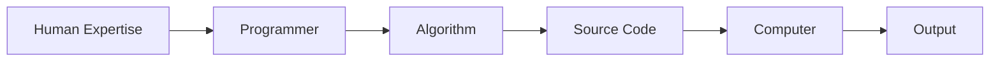
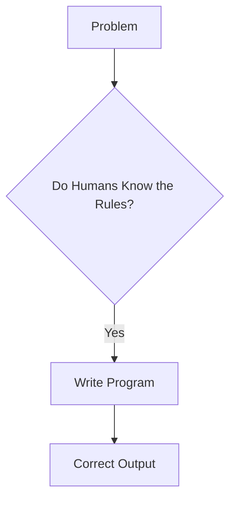
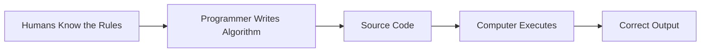

# 📖 Chapter 2 – Classical Programming vs Machine Learning

# **Part 2 – What is Classical Programming? Why It Dominated Computing for More Than 70 Years**

> *"Before we understand why Machine Learning became necessary, we must first appreciate one of humanity's greatest inventions—Classical Programming. Without it, there would be no operating systems, no internet, no mobile apps, and no Machine Learning."*

---

# 📍 Where We Are

```text
Chapter 2 – Classical Programming vs Machine Learning

✅ Part 1
├── Why This Chapter Matters
├── The Software Engineer's Dilemma
└── A Question That Changed Programming

🚀 Part 2 (Current)
├── What is Classical Programming?
├── The Programmer's Role
├── Explicit Programming
├── Why Classical Programming Dominated
└── The Fundamental Assumption

Upcoming

Part 3
├── Where Classical Programming Breaks
├── Birth of Machine Learning
├── Paradigm Shift
└── Learned Rules
```

---

# Before We Criticize Classical Programming...

Let's be fair.

Many beginners think:

> **"Machine Learning is newer, so Classical Programming must be outdated."**

That is completely wrong.

Even today, in 2026, **more than 95% of the software running in the world is still classical programming.**

Think about it.

When you:

- Open WhatsApp
- Use Instagram
- Transfer money through your banking app
- Book a flight
- Log in to Amazon
- Compile a C++ program
- Sort a list
- Search using Binary Search

You are mostly using **traditional software engineering**, not Machine Learning.

Machine Learning didn't replace programming.

It filled a gap that programming could not.

Before we understand that gap, we need to understand why classical programming became one of the greatest engineering ideas in history.

---

# 🧠 Think Like the Inventor

Imagine you are a software engineer in the early 1980s.

Machine Learning doesn't exist.

Artificial Intelligence is mostly a research topic.

Yet companies are building:

- Operating Systems
- Banking Software
- Air Traffic Control Systems
- Spacecraft Navigation
- Compilers
- Databases

None of these systems use Machine Learning.

Yet they work astonishingly well.

Why?

Because these problems share one beautiful property.

> **The rules are already known.**

---

# What is Classical Programming?

Let's build the definition ourselves instead of memorizing one.

Imagine someone asks you to build a calculator.

What should happen when a user enters:

```
8 + 5
```

You already know the answer.

You also know the rule.

> **Addition means combining two numbers.**

So you write:

```python
def add(a, b):
    return a + b
```

Notice something important.

The computer didn't discover addition.

The computer didn't invent mathematics.

The computer didn't think.

**You already knew the rule.**

The computer simply executed it.

---

Now consider multiplication.

```python
def multiply(a, b):
    return a * b
```

Again,

Who supplied the knowledge?

**The programmer.**

The computer merely followed instructions.

---

# The First Principle of Programming

Every classical program begins with one assumption:

> **The human already knows how to solve the problem.**

The programmer's job is not to discover the solution.

The programmer's job is to **translate human knowledge into instructions that a computer can execute.**

That is the essence of programming.

---

# A Better Definition

Instead of memorizing a textbook definition like:

> *Programming is writing instructions for a computer.*

Let's use a deeper definition.

> **Classical Programming is the process of converting human knowledge into executable instructions.**

Notice the three key components:

```text
Human Knowledge
        ↓
Programmer
        ↓
Computer Instructions
        ↓
Execution
        ↓
Correct Output
```

The intelligence originates from the **human**, not the machine.

---

# The Role of the Programmer

In classical programming, the programmer plays three distinct roles.

## Role 1 – Understand the Problem

Before writing any code, you first ask:

- What is the problem?
- What should happen?
- What are the rules?

For example:

> Calculate GST.

You study the tax regulations.

Only after understanding the rules do you begin coding.

---

## Role 2 – Design the Algorithm

Once you know the rules, you convert them into logical steps.

For example:

```text
Receive Income
      ↓
Compare with Tax Slab
      ↓
Apply Percentage
      ↓
Return Tax
```

This sequence of logical steps is called an **algorithm**.

---

## Role 3 – Translate the Algorithm into Code

Finally, you express those logical steps in a programming language.

```python
if income < 500000:
    tax = 0
else:
    tax = income * 0.20
```

Notice that the code is merely the final translation.

The real intelligence came from the programmer's understanding.

---

# From Knowledge to Code

Let's visualize the complete process.



This workflow powered almost every major software system built during the twentieth century.

---

# Explicit Programming

You'll often hear people say:

> **"Classical programming is explicit programming."**

What does that actually mean?

It means every important decision has already been written by the programmer.

For example:

```python
if age >= 18:
    allow_voting()
else:
    deny_voting()
```

Nothing is left for the computer to figure out.

Every possible action has already been specified.

The computer doesn't ask:

> "Should I allow voting at age 17?"

It simply executes the rule.

This is what "explicit" means.

---

# Why Computers Love Explicit Instructions

Humans are comfortable with ambiguity.

Computers are not.

Imagine telling a computer:

> "Sort these numbers nicely."

What does "nicely" mean?

Ascending?

Descending?

Odd numbers first?

Even numbers first?

Computers cannot interpret vague instructions.

They require precision.

Instead, we specify:

```python
numbers.sort()
```

Or,

```python
numbers.sort(reverse=True)
```

Every instruction is unambiguous.

That precision is one of the greatest strengths of programming.

---

# 🌍 Why Classical Programming Dominated the World

Now let's answer an important historical question.

Why did classical programming dominate computing for more than seventy years?

Because many problems are governed by fixed, deterministic rules.

Let's explore a few examples.

---

## Example 1 – Calculator

Question:

```
347 + 925
```

Will the answer change tomorrow?

No.

Will it change next year?

No.

Addition is universal.

The rule is permanent.

---

## Example 2 – Binary Search

Suppose you want to find a value in a sorted array.

The algorithm is always the same.

```text
Check Middle
      ↓
Too Small?
      ↓
Search Right

Too Large?
      ↓
Search Left
```

The logic never changes.

This makes Binary Search a perfect candidate for classical programming.

---

## Example 3 – ATM Withdrawal

An ATM follows a sequence of rules.

```text
Insert Card
      ↓
Verify PIN
      ↓
Check Balance
      ↓
Sufficient Funds?
      ↓
Dispense Cash
```

Every customer follows the same process.

The rules are well-defined.

---

## Example 4 – Airline Booking

When you reserve a flight:

- Check seat availability.
- Reserve the seat.
- Update the database.
- Process payment.
- Generate a ticket.

These are deterministic business rules.

Again, classical programming is ideal.

---

# The Common Pattern

Let's compare these problems.

| Problem | Are Rules Known? | Does Logic Change Frequently? | Best Solution |
|----------|------------------|-------------------------------|---------------|
| Calculator | ✅ Yes | ❌ No | Classical Programming |
| Binary Search | ✅ Yes | ❌ No | Classical Programming |
| GST Calculation | ✅ Yes | Occasionally (laws change) | Classical Programming |
| ATM Software | ✅ Yes | ❌ No | Classical Programming |
| Inventory Management | ✅ Yes | Rarely | Classical Programming |

Notice something remarkable.

Every one of these problems has a **clear algorithm**.

The programmer already knows what to do.

---

# The Hidden Assumption

We've now seen many successful examples.

Let's uncover the common assumption behind all of them.



This simple assumption fueled decades of software innovation.

It allowed engineers to build:

- Windows
- Linux
- macOS
- Android
- iOS
- Databases
- Search Engines
- Financial Systems

As long as humans understood the rules, computers could execute them flawlessly.

---

# ⚠️ But What Happens When Humans Don't Know the Rules?

Now let's revisit the spam filter from Part 1.

Why did it fail?

Was it because Python wasn't powerful enough?

No.

Was it because computers were too slow?

No.

Was it because programmers weren't intelligent enough?

Again, no.

The real reason was much deeper.

> **Nobody knew how to write all the rules.**

This is the point where classical programming reaches its natural boundary.

Not because programming is weak.

But because some problems simply **do not come with a rule book**.

---

# 🌉 Concept Connection

Everything we've learned in this part can be summarized in one diagram.



This pipeline explains why classical programming has been one of the most successful engineering methodologies in history.

But it also hints at its limitation.

If the **first box disappears**—

> **Humans Know the Rules**

—the entire pipeline collapses.

That single missing piece gave birth to Machine Learning.

---

# 📝 Key Takeaways

- Classical programming assumes that humans already know the correct rules.
- The programmer converts those rules into algorithms and code.
- Computers execute instructions—they do not invent them.
- Classical programming excels when problems are deterministic and well-defined.
- Its greatest strength is precision and reliability.
- Its greatest limitation appears when the rules are unknown, incomplete, or constantly changing.

---

# ✍️ Author's Reflection

One of the biggest misconceptions in AI is that Machine Learning is a replacement for programming.

It isn't.

Machine Learning exists **because classical programming was extraordinarily successful**—but only within the domain of problems where humans could explicitly describe the solution.

In fact, every Machine Learning system you will ever build will still rely heavily on classical programming.

The APIs, data pipelines, databases, authentication, deployment, monitoring, logging, user interfaces, and cloud infrastructure are all written using traditional software engineering.

Machine Learning doesn't replace programming.

It extends it into a new class of problems where **experience becomes more valuable than explicit rules**.

---

## 🚀 Up Next

In **Part 3**, we'll cross the boundary where classical programming can no longer help us.

We'll explore:

- Why writing more rules eventually becomes impossible.
- The exact moment computer scientists realized they needed a different approach.
- The birth of the Machine Learning paradigm.
- Why the famous diagram

> **Data + Rules → Output**

became

> **Data + Answers → Learned Rules**

That transformation is one of the most important paradigm shifts in the history of computer science.
