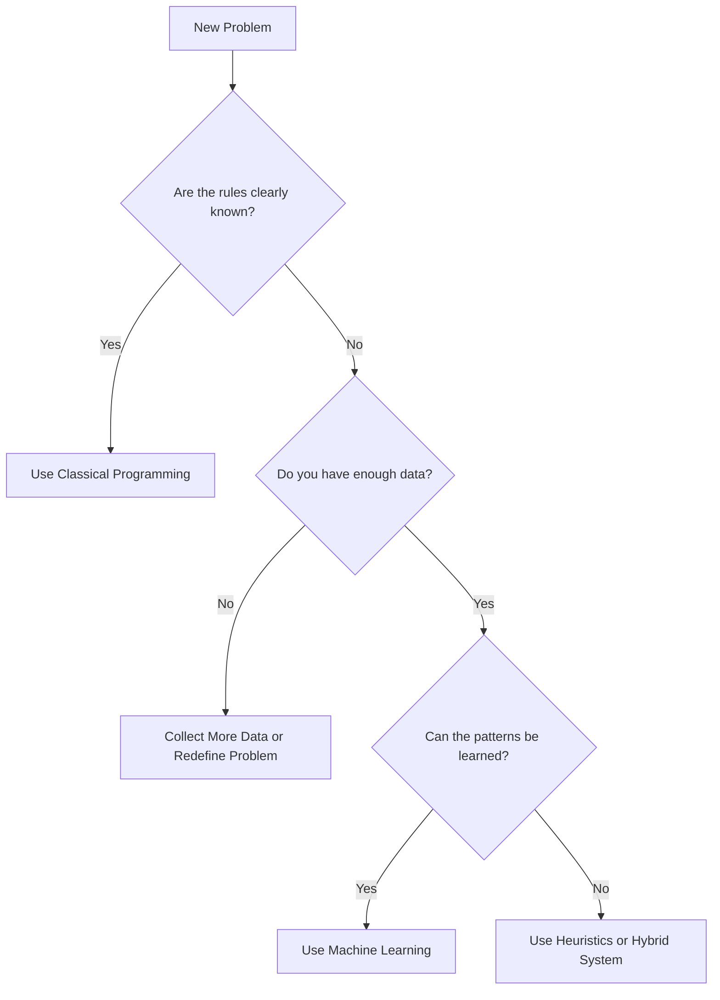
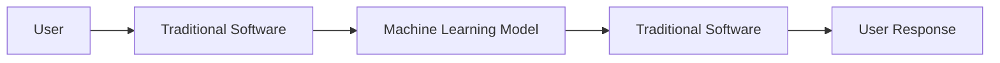
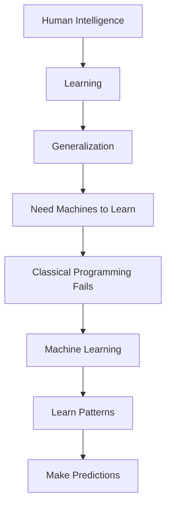

# 📖 Chapter 2 – Classical Programming vs Machine Learning

# **Part 4 – Interactive Labs, Engineering Decision Framework, Industry Perspective, Interview Guide & Revision**

> *"Understanding a concept is the beginning. Being able to choose the right approach for a real engineering problem is what makes you an engineer."*

---

# 📍 Where We Are

```text
Chapter 2 – Classical Programming vs Machine Learning

✅ Part 1
├── Why This Chapter Matters
├── The Software Engineer's Dilemma
└── A Question That Changed Programming

✅ Part 2
├── What is Classical Programming?
├── Explicit Programming
├── Why It Dominated Computing
└── The Programmer's Role

✅ Part 3
├── Where Classical Programming Breaks
├── Birth of Machine Learning
├── Paradigm Shift
└── What Does an ML Model Learn?

🚀 Part 4 (Current)
├── Interactive Labs
├── Engineering Decision Framework
├── Industry Perspective
├── Interview Guide
├── Revision Sheet
├── Exercises
└── Author's Notes
```

---

# 🧪 Interactive Lab 1 – Become a Software Engineer

## Objective

Experience the strengths of Classical Programming.

---

## Problem

Write software to calculate electricity bills.

Rules:

- Units ≤ 100 → ₹5/unit
- 101–300 → ₹7/unit
- Above 300 → ₹10/unit

Before reading further,

think about how you would solve it.

---

Most engineers naturally write something like:

```python
if units <= 100:
    bill = units * 5

elif units <= 300:
    bill = 100 * 5 + (units - 100) * 7

else:
    bill = 100 * 5 + 200 * 7 + (units - 300) * 10
```

Perfect.

No ambiguity.

No learning required.

---

## 🎯 What You Should Observe

This problem has:

- Clear rules
- Stable logic
- Deterministic behavior

Classical Programming is the ideal solution.

Using Machine Learning here would only make the system slower, harder to debug, and less reliable.

---

# 🧪 Interactive Lab 2 – Become an ML Engineer

Now let's change the problem.

Instead of electricity bills,

your manager asks:

> **"Detect fake product reviews."**

Examples:

```
★★★★★

Amazing product!!
```

```
★★★★★

Excellent quality!!
```

```
★★★★★

Highly recommended!!
```

Easy?

Now consider genuine reviews:

```
★★★★★

Amazing camera.
```

Looks similar.

Now think.

What rules would you write?

Take two minutes.

---

You'll quickly realize:

Every rule creates another exception.

Eventually, you stop writing rules and begin asking:

> **Can I collect thousands of reviews instead?**

Congratulations.

You've just shifted from **Programming Thinking** to **Machine Learning Thinking**.

---

# 🧪 Interactive Lab 3 – Programming or Machine Learning?

Decide **before** looking at the answers.

| Problem | Your Choice |
|----------|-------------|
| Calculator | ? |
| Binary Search | ? |
| Face Unlock | ? |
| Recommendation System | ? |
| Chess Rules | ? |
| Spam Detection | ? |
| Weather Prediction | ? |
| ATM Software | ? |
| Speech Recognition | ? |
| Tax Calculator | ? |

---

## Answers

| Problem | Best Solution | Why? |
|----------|--------------|------|
| Calculator | Classical Programming | Fixed mathematical rules |
| Binary Search | Classical Programming | Deterministic algorithm |
| ATM Software | Classical Programming | Business rules are known |
| Tax Calculator | Classical Programming | Government regulations define the logic |
| Face Unlock | Machine Learning | Complex visual patterns |
| Recommendation System | Machine Learning | Preferences differ across users |
| Spam Detection | Machine Learning | Spam evolves continuously |
| Speech Recognition | Machine Learning | Infinite variation in speech |
| Weather Prediction | Hybrid | Physical models + data-driven models |
| Chess Rules | Classical Programming | Rules are fixed (although chess-playing strength often uses ML today) |

---

## 🎯 Important Observation

The deciding factor isn't **difficulty**.

It's **whether the rules are explicitly known**.

---

# 🧪 Interactive Lab 4 – Write Rules for Netflix

Imagine you're the lead engineer at Netflix.

You have:

- 300 million users
- 20,000 movies
- Thousands of new movies every year

Write recommendation rules.

Maybe:

```
Age > 25

↓

Action Movies
```

Immediately someone breaks your rule.

A 60-year-old loves anime.

A teenager watches documentaries.

A family shares one account.

People's preferences change over time.

Soon you realize:

The problem isn't writing **better** rules.

The problem is trying to write rules at all.

---

# 🧪 Interactive Lab 5 – The Rule Explosion

Imagine building a face recognition system.

You begin with:

```
Has two eyes
```

Then discover:

- Sunglasses
- Closed eyes
- Side profile
- Beard
- Mask
- Different lighting
- Aging
- Makeup

Every exception needs another rule.

Now estimate.

How many rules would be enough?

100?

10,000?

10 million?

This is called the **Rule Explosion Problem**.

It explains why Machine Learning became necessary.

---

# 🛠 Engineering Decision Framework

One of the most useful skills you'll develop as an ML engineer is deciding **whether Machine Learning is even the right tool**.

Many beginners jump to ML immediately.

Experienced engineers don't.

They ask questions first.

---

## The Engineering Decision Tree



This flowchart is worth remembering.

Professional engineers use a similar thought process every day.

---

# 🌍 Industry Perspective

One of the biggest misconceptions is that companies like Google or Netflix have "ML applications."

In reality,

they build **software systems** that contain ML components.

Let's look at a recommendation system.

```text
                User Opens Netflix
                        │
                        ▼
              Authentication Service
                        │
                        ▼
                User Profile Service
                        │
                        ▼
              Recommendation Request
                        │
                        ▼
             Machine Learning Model
           Predicts Relevant Movies
                        │
                        ▼
               Ranking & Filtering
                        │
                        ▼
               Cache & Database
                        │
                        ▼
                User Interface
```

Notice something.

Only one small block is Machine Learning.

Everything else is Classical Programming.

---

## Another Example – Face Unlock

```text
Camera Opens
      │
Traditional Programming
(Camera API)

      │
      ▼
Capture Image

      │
      ▼
Machine Learning
Face Recognition Model

      │
      ▼
Traditional Programming
Unlock Device
```

Again,

Programming and Machine Learning work together.

Not against each other.

---

# 🏗 The Hybrid Architecture of Modern AI Systems

Almost every AI application follows this architecture.



This is why learning software engineering remains essential for every ML engineer.

---

# 🎤 Interview Guide

## Beginner Questions

### Q1. What is Classical Programming?

**Answer**

Classical Programming is the process of converting human knowledge into explicit instructions that a computer executes.

---

### Q2. Why does Classical Programming fail for some problems?

Because some real-world problems have unknown, highly complex, or constantly changing rules that humans cannot explicitly define.

---

### Q3. What is the biggest difference between Classical Programming and Machine Learning?

**Classical Programming**

```
Data + Rules

↓

Answer
```

**Machine Learning**

```
Data + Correct Answers

↓

Learned Rules (Model)
```

---

## Intermediate Questions

### Q4. What does "learning rules" mean?

It means estimating model parameters (such as weights and biases) from data so that the model captures useful patterns.

---

### Q5. Can Machine Learning replace programming?

No.

Machine Learning complements programming.

Production systems still rely heavily on traditional software engineering.

---

### Q6. When should you avoid Machine Learning?

Avoid ML when:

- Rules are well-defined.
- The solution is deterministic.
- You have very little data.
- Simplicity and explainability are more important than predictive performance.

---

## Advanced Questions

### Q7. Why is Machine Learning considered a paradigm shift?

Because it changes the programmer's role from writing explicit rules to designing systems that learn those rules from data.

---

### Q8. Is Machine Learning always better than rule-based systems?

No.

For deterministic problems with clear logic, classical programming is usually more reliable, easier to test, and more efficient.

---

# 🌉 Concept Connection

Let's connect Chapters 1 and 2.



Notice the continuity.

Chapter 1 answered:

> **Why learning matters.**

Chapter 2 answered:

> **Why computers need learning instead of only rules.**

The next chapter asks:

> **How does an ML project actually work from raw data to predictions?**

---

# 📝 Revision Sheet

## The Five Ideas to Remember

### 1.

Classical Programming assumes:

```
Humans know the rules.
```

---

### 2.

Machine Learning assumes:

```
The rules exist,

but they must be discovered from data.
```

---

### 3.

Programming

```
Data

+

Rules

↓

Answer
```

---

### 4.

Machine Learning

```
Data

+

Correct Answers

↓

Learned Model
```

---

### 5.

Professional Engineers First Ask:

```
Do I know the rules?

↓

Yes

↓

Programming

No

↓

Machine Learning
```

---

# 🧩 Exercises

## Conceptual

1. Explain why a calculator is better implemented using Classical Programming rather than Machine Learning.
2. Give three examples where Machine Learning is more appropriate than explicit programming.
3. Why is "known rules vs unknown rules" a more useful distinction than "easy problem vs difficult problem"?
4. Explain why a recommendation system is difficult to build using handwritten rules.
5. Describe the "Rule Explosion Problem" in your own words.

---

## Thinking Exercise

Imagine you are asked to build software that identifies ripe mangoes.

Answer the following:

1. What rules would you write?
2. What exceptions would appear?
3. At what point would collecting labeled images become more practical than writing more rules?

---

## Mini Project

Look at five applications you use every day (for example, Gmail, Google Maps, Instagram, UPI, Spotify).

For each one:

- Identify the parts that likely use Classical Programming.
- Identify the parts that likely use Machine Learning.
- Explain why each approach is appropriate.

This exercise will help you recognize that modern software is usually a **hybrid system**, not purely rule-based or purely ML-driven.

---

# ✍️ Author's Notes

This chapter marks the transition from **software engineering** to **machine learning engineering**.

The goal was never to convince you that Machine Learning is superior.

Instead, it was to teach you an engineering principle:

> **Choose the simplest approach that correctly solves the problem.**

If explicit rules exist, write them.

If they don't—and enough representative data is available—consider Machine Learning.

This mindset will save you from one of the most common mistakes made by beginners: trying to solve every problem with AI simply because AI is popular.

As you continue through this book, you'll notice that every algorithm—Linear Regression, Logistic Regression, Decision Trees, Random Forests, Neural Networks—exists to answer a single question:

> **How can we automatically discover useful patterns from data when humans cannot explicitly write all the rules?**

---

# 📜 Historical Timeline

One addition I'd like us to include at the end of each major chapter is a short historical context.

```text
1940s → Classical computing becomes practical
1950 → Alan Turing proposes the Turing Test
1956 → Dartmouth Conference formally launches AI as a field
1957 → Frank Rosenblatt introduces the Perceptron
1959 → Arthur Samuel popularizes the term "Machine Learning"
1980s → Expert Systems dominate rule-based AI
1990s → Statistical Machine Learning becomes mainstream
2012 → AlexNet ignites the Deep Learning revolution
2022 → Large Language Models bring AI to everyday users
```

This reinforces an important lesson: **Machine Learning did not replace Classical Programming overnight.** It evolved because engineers encountered increasingly complex problems that could no longer be solved with handwritten rules alone.

---

## 🚀 Looking Ahead – Chapter 3

Now we understand:

- **Why** Machine Learning exists.
- **When** to use it.
- **When not** to use it.

The next question is:

> **"What actually happens after we decide to use Machine Learning?"**

That leads us to **Chapter 3 – The Machine Learning Pipeline**, where we'll follow a real project from raw data collection all the way to a deployed model making predictions in production.
