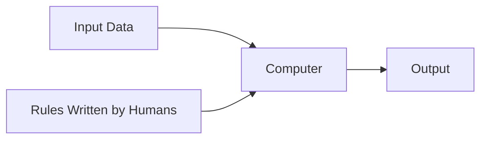
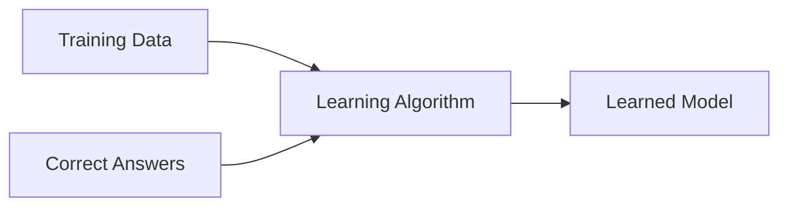
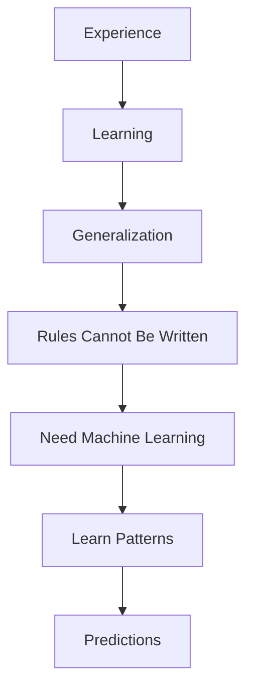

# 📖 Chapter 2 – Classical Programming vs Machine Learning

# **Part 3 – Where Classical Programming Breaks, The Birth of Machine Learning & The Greatest Paradigm Shift in Computing**

> *"The history of computing didn't change because computers became faster. It changed because engineers stopped asking, 'What rules should I write?' and started asking, 'Can the computer discover the rules itself?'"*

---

# 📍 Where We Are

```text
Chapter 2 – Classical Programming vs Machine Learning

✅ Part 1
├── Why This Chapter Matters
├── The Software Engineer's Dilemma
└── A Question That Changed Programming

✅ Part 2
├── What is Classical Programming?
├── Explicit Programming
├── Why It Dominated Computing
└── The Programmer's Role

🚀 Part 3 (Current)
├── Where Classical Programming Breaks
├── The Birth of Machine Learning
├── The Paradigm Shift
├── What Does an ML Model Learn?
└── The New Role of the Programmer

Upcoming

Part 4
├── Interactive Labs
├── Engineering Decision Framework
├── Industry Perspective
├── Interview Guide
├── Revision Sheet
└── Author's Notes
```

---

# A Thought Experiment

Let's begin with a question.

Imagine someone gives you a photograph and asks:

> **"Is there a cat in this image?"**

You immediately answer:

> **"Yes."**

Now imagine they ask the next question.

> **"Explain every rule your brain used to reach that conclusion."**

Most people pause.

You know **that** it's a cat.

But explaining **exactly how** you know is surprisingly difficult.

Maybe you start with:

- It has ears.
- It has whiskers.
- It has fur.

Then someone shows you another cat.

The ears are hidden.

The whiskers aren't visible.

Half of the body is covered.

You still recognize it instantly.

Suddenly you realize something fascinating.

> **Your brain isn't following a short list of handwritten rules.**

It has learned thousands of subtle visual patterns from years of experience.

That realization is the foundation of Machine Learning.

---

# 🧠 Think Like the Inventor

Let's travel back to the late 1980s.

Imagine you're leading a team of software engineers.

Your company wants to build handwriting recognition software.

The goal sounds simple.

Given this image:

```
✍️ 7
```

the computer should output:

```
7
```

You begin writing rules.

---

## Attempt 1

```text
IF

One horizontal line

AND

One diagonal line

↓

Digit 7
```

Works?

For your handwriting, yes.

---

Now test another person's handwriting.

Their "7" looks like this:

```
/|
```

Still works?

Not always.

---

Another person writes:

```
٧
```

(Arabic numeral)

Another writes with a cross through the middle.

Another writes it slightly curved.

Children write it differently.

Doctors write it differently.

Different countries teach different styles.

---

Your rule suddenly becomes:

```text
IF style A

OR style B

OR style C

OR style D

OR style E

...
```

The list never ends.

---

# The Infinite Rule Problem

This wasn't just a handwriting problem.

Researchers discovered the same issue everywhere.

Let's examine a few examples.

---

## Face Recognition

How would you recognize a person?

Should the software check:

- Eye color?
- Hair style?
- Beard?
- Glasses?
- Smile?
- Lighting?
- Camera angle?

What if the person:

- Shaves their beard?
- Wears sunglasses?
- Gets older?
- Changes hairstyle?
- Turns sideways?

Every new situation breaks another rule.

---

## Speech Recognition

Suppose someone says:

> "Open the door."

Now imagine the same sentence spoken by:

- A child
- An elderly person
- Someone with a British accent
- Someone with an Indian accent
- Someone whispering
- Someone shouting
- Someone in a noisy room

The words are identical.

The sound waves are completely different.

Which rule should the programmer write?

---

## Medical Diagnosis

Suppose you're writing software to detect pneumonia from chest X-rays.

Can you write:

```text
IF white spot exists

↓

Pneumonia
```

No.

Healthy lungs can contain bright regions.

Diseased lungs can appear differently across patients.

Symptoms overlap with other conditions.

Even experienced doctors sometimes disagree.

The patterns exist.

But they're too complex to express as simple rules.

---

# The Pattern Behind Every Failure

Let's step back and compare these problems.

| Problem | Rules Easy to Write? | Variation | Classical Programming Suitable? |
|----------|----------------------|-----------|---------------------------------|
| Calculator | ✅ Yes | Very Low | ✅ Yes |
| Binary Search | ✅ Yes | None | ✅ Yes |
| Cat Recognition | ❌ No | Extremely High | ❌ No |
| Speech Recognition | ❌ No | Extremely High | ❌ No |
| Fraud Detection | ❌ No | Constantly Changing | ❌ No |
| Recommendation Systems | ❌ No | Personalized | ❌ No |

A pattern begins to emerge.

Classical programming struggles when:

- the rules are unknown,
- the rules constantly change,
- or the rules are too numerous to write manually.

---

# 🌍 The Realization That Changed Everything

Researchers reached a remarkable conclusion.

Instead of asking:

> **"Can we write every rule?"**

They asked a different question.

> **"Can we allow the computer to discover those rules from examples?"**

This sounds like a small change.

It wasn't.

It completely changed computer science.

---

# The Child Analogy

Imagine teaching a child what an apple looks like.

You don't begin with a textbook definition.

You don't say:

> Apples must have exactly this shade of red.

Or:

> Apples must weigh exactly 180 grams.

Instead, you point.

"This is an apple."

Again.

"And this is also an apple."

Then another.

Eventually the child sees:

- Red apples
- Green apples
- Small apples
- Large apples
- Shiny apples
- Slightly damaged apples

Without realizing it, the child's brain begins extracting common patterns.

No one explicitly teaches every rule.

Learning emerges from experience.

Researchers wondered:

> **Could computers learn in the same way?**

---

# The Birth of Machine Learning

This led to one of the most elegant ideas in computer science.

Instead of writing rules:

```text
Human
   │
Writes Rules
   │
Computer Executes
```

Why not do this?

```text
Human
   │
Provides Examples
   │
Learning Algorithm
   │
Discovers Rules
```

The computer no longer receives intelligence.

It builds intelligence from experience.

---

# The Greatest Paradigm Shift

Let's compare both approaches side by side.

## Classical Programming



The programmer supplies the knowledge.

The computer executes it.

---

## Machine Learning



Notice something extraordinary.

The **rules have disappeared** from the input.

Instead,

the rules become the **output**.

This is arguably one of the most beautiful ideas in modern computing.

---

# But Where Did the Rules Go?

Many beginners become confused here.

They ask:

> **"If there are no rules, what exactly is the computer learning?"**

Excellent question.

The answer is:

The rules still exist.

They simply exist in a different form.

Instead of handwritten code like:

```python
if income > 500000:
```

the rules become numbers.

For example,

Linear Regression learns:

$$
\hat{y}=wx+b
$$

The values of:

$$
w
$$

and

$$
b
$$

are the learned rules.

---

A Neural Network is similar.

Instead of learning two numbers,

it may learn millions or even billions of parameters.

Those parameters collectively encode the patterns hidden inside the data.

---

# Human Learning vs Machine Learning

Notice how surprisingly similar the two learning processes are.

| Human Learning | Machine Learning |
|----------------|------------------|
| Experiences | Dataset |
| Teacher | Labels / Ground Truth |
| Practice | Training |
| Brain Connections Change | Parameters Change |
| Mistakes | Loss |
| Correction | Optimization |
| Knowledge | Trained Model |

This table is not perfect—human learning is far more complex—but it provides a useful intuition for beginners.

---

# The Programmer's New Role

One of the biggest misconceptions is:

> **"Machine Learning replaces programmers."**

It doesn't.

The programmer's role changes.

Instead of asking:

> **"What rules should I write?"**

the programmer now asks:

- What data should I collect?
- Is the data correct?
- Which algorithm should I use?
- How do I measure success?
- How do I improve the model?
- How do I deploy it safely?

The focus shifts from **coding rules** to **designing learning systems**.

---

# 🌉 Concept Connection

Let's connect everything from the first three chapters of our journey.



Notice the flow.

Chapter 1 taught us **what learning is**.

Chapter 2 explains **why learning became necessary for computers**.

Soon we'll study **how computers actually learn those patterns mathematically**.

---

# 📝 Key Takeaways

- Classical programming reaches its limit when humans cannot explicitly describe the rules.
- Many real-world problems contain hidden, complex, or constantly changing patterns.
- Machine Learning solves these problems by learning from examples instead of relying on handwritten rules.
- The output of training is not code—it is a model whose parameters encode learned patterns.
- The programmer's role shifts from writing rules to designing, training, and evaluating learning systems.

---

# ✍️ Author's Reflection

If I could summarize the entire history of Machine Learning in one sentence, it would be this:

> **Classical Programming teaches computers *what to do*. Machine Learning teaches computers *how to discover what to do*.**

That difference may appear subtle, but it transformed the entire technology industry.

Everything from Google's search ranking to Netflix recommendations, Tesla's driving assistance, medical image analysis, fraud detection, and modern language models stems from this single shift in thinking.

As you continue through this book, remember this:

> Every Machine Learning algorithm—whether Linear Regression or a Large Language Model—is simply a different strategy for discovering useful patterns hidden inside data.

That is the unifying idea behind the entire field.

---

## 🚀 Up Next

In **Part 4**, we'll reinforce these ideas through:

- Interactive thought experiments
- An engineering decision framework (Programming vs Machine Learning)
- Real-world system architecture
- Common interview questions
- Revision sheet
- Exercises and concept map

By the end of Chapter 2, you'll not only understand **what Machine Learning is**, but also **when it should—and should not—be used.**
