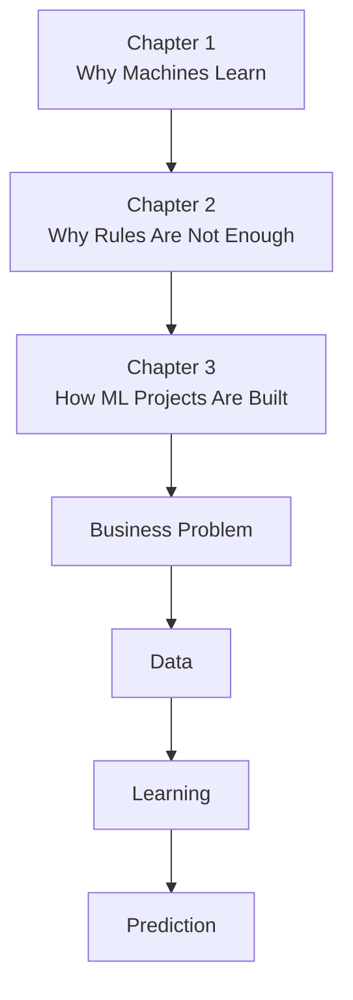

# 📖 Chapter 3 – The Machine Learning Pipeline

# **Part 1 – Why This Chapter Matters + Your First Day as an ML Engineer**

> *"Most people think Machine Learning begins when you choose an algorithm. In reality, that's one of the last decisions you make."*

---

# 🌟 Why This Chapter Matters

In the previous chapters, we answered two fundamental questions.

In **Chapter 1**, we asked:

> **Why do machines need to learn?**

We discovered that intelligence is the ability to learn from experience and generalize to unseen situations.

Then, in **Chapter 2**, we asked:

> **Why can't we simply program everything?**

We learned that many real-world problems have rules that are too complex, too dynamic, or simply unknown. Instead of writing those rules ourselves, we let computers discover them from data.

Naturally, another question arises.

> **Once we've decided to use Machine Learning... what happens next?**

Suppose your manager walks up to you tomorrow morning and says:

> **"We want to predict house prices."**

Or,

> **"Build a spam detection system."**

Or,

> **"Can we recommend better movies to our users?"**

What would you do first?

Would you immediately open Python?

Would you import Scikit-learn?

Would you start training a Neural Network?

**Absolutely not.**

That would be like buying paint before you've even decided where to build your house.

Before a single model is trained...

Before a single line of ML code is written...

There is an entire engineering process that must take place.

That process is called the **Machine Learning Pipeline**.

---

# 📖 What Is a Pipeline?

Before talking specifically about Machine Learning, let's first understand the word **pipeline**.

Imagine a water pipeline carrying water from a reservoir to your home.

The water doesn't magically appear in your kitchen.

It flows through several connected stages.

```text
Reservoir
      │
      ▼
Water Treatment Plant
      │
      ▼
Storage Tank
      │
      ▼
Distribution Pipes
      │
      ▼
Your Home
```

Every stage has a purpose.

If even one stage fails—

the entire system fails.

A Machine Learning project works the same way.

Instead of water,

we move **data**.

Instead of treatment plants,

we prepare the data.

Instead of distribution,

we deploy predictions to users.

A pipeline simply means:

> **A sequence of connected steps where the output of one stage becomes the input of the next.**

---

# 🧭 Chapter Roadmap

```text
Chapter 3 – The Machine Learning Pipeline

Part 1 (Current)
├── Why This Chapter Matters
├── What Is a Pipeline?
├── Your First Day as an ML Engineer
└── The Big Picture

Part 2
├── From Business Problem to Data
├── Data Collection
├── Data Understanding
├── Data Cleaning
├── Exploratory Data Analysis
└── Feature Engineering

Part 3
├── Training the Model
├── Train-Test Split
├── Model Selection
├── Model Training
├── Evaluation
├── Hyperparameter Tuning
├── Deployment
├── Monitoring
└── Retraining

Part 4
├── Interactive Labs
├── Industry Roles
├── Pipeline vs Lifecycle
├── Interview Guide
├── Revision Sheet
└── Author's Notes
```

---

# 🎯 Learning Objectives

By the end of this chapter, you should be able to answer:

- What is a Machine Learning Pipeline?
- Why is a pipeline necessary?
- What are the major stages of every ML project?
- Why is data often more important than the algorithm?
- Where does training happen?
- Where does prediction happen?
- Why doesn't deployment mark the end of an ML project?
- How do companies like Google, Netflix, Amazon, Tesla, and OpenAI follow similar pipelines?

---

# 🎬 Imagine It's Your First Day as an ML Engineer

Congratulations!

After months of studying mathematics, Python, statistics, and Machine Learning...

you've landed your first job as an **ML Engineer**.

You arrive at the office early.

A new laptop is waiting on your desk.

Your manager smiles and says,

> **"Welcome to the team."**

A few minutes later, you're invited to your very first product meeting.

Around the table sit:

- Product Managers
- Software Engineers
- Data Engineers
- ML Engineers
- Business Analysts

The Product Manager begins.

---

# The Business Problem

She projects a dashboard onto the screen.

It looks something like this.

```text
Monthly Sales

January    ₹18 Cr

February   ₹17 Cr

March      ₹16 Cr

April      ₹14 Cr

May        ₹12 Cr
```

Everyone notices the same thing.

Sales are dropping.

The CEO asks:

> **"Why are customers leaving?"**

Silence.

Nobody knows.

After a few minutes of discussion, another question appears.

> **"Can Machine Learning help us recommend products that customers are actually interested in?"**

Everyone turns toward the ML team.

Including you.

---

# The Beginner's Instinct

At this point, many beginners think:

> "Perfect! Let's train a recommendation model."

Or perhaps,

> "Let's use Deep Learning."

Or,

> "Maybe XGBoost will perform better."

But something surprising happens.

No one in the room mentions algorithms.

Not once.

Instead, the discussion sounds like this.

---

## Product Manager

> "What exactly are we trying to improve?"

---

## Business Analyst

> "Which customers are leaving?"

---

## Data Engineer

> "Do we even have historical customer data?"

---

## Software Engineer

> "Can our backend provide this data?"

---

## ML Engineer

> "How will we measure whether our recommendations are actually better?"

Notice something fascinating.

Nobody has opened Jupyter Notebook.

Nobody has imported NumPy.

Nobody has written:

```python
from sklearn...
```

And yet...

the Machine Learning project has already begun.

---

# 🧠 The First Lesson of Machine Learning Engineering

This is one of the most important lessons in this book.

> **Machine Learning projects do not begin with algorithms.**

They begin with **questions**.

Questions like:

- What problem are we solving?
- Why does this problem matter?
- Who benefits if we solve it?
- What does success look like?
- What information do we already have?
- What information do we still need?

Only after answering these questions do we begin thinking about data.

Only much later do we think about algorithms.

---

# The House Analogy

Imagine building your dream house.

Would you begin by choosing the wall color?

Of course not.

You would first ask:

- Where will the house be built?
- Is the land suitable?
- What kind of house do we need?
- How many rooms?
- What's the budget?

Only much later do you think about:

- Paint
- Furniture
- Decorations

The same idea applies to Machine Learning.

```text
Business Problem
        │
        ▼
Understand the Need
        │
        ▼
Collect Information
        │
        ▼
Build the Solution
```

Choosing an algorithm is like choosing the paint color.

Important?

Yes.

The first step?

Not even close.

---

# The Biggest Beginner Misconception

Many online tutorials accidentally teach this workflow.

```text
Dataset

↓

Linear Regression

↓

Accuracy

↓

Finished
```

That is excellent for learning an algorithm.

But it is **not** how real Machine Learning projects are built.

In production, the process looks much more like this.

```text
Business Problem

↓

Data Collection

↓

Data Preparation

↓

Model Training

↓

Deployment

↓

Users

↓

Monitoring

↓

Improvement
```

Notice how the model is just one stage in a much larger engineering system.

---

# 🌍 A Reality Check

Let's look at some famous AI products.

### Netflix

Do you think Netflix started by asking:

> "Should we use Neural Networks?"

No.

They asked:

> **"How can we help users discover movies they'll love?"**

---

### Google Maps

They didn't ask:

> "Should we use Gradient Boosting?"

They asked:

> **"How can we predict traffic before drivers get stuck?"**

---

### Amazon

They didn't ask:

> "Should we use Random Forest?"

They asked:

> **"Which products should we recommend to increase customer satisfaction?"**

---

### Tesla

They didn't begin with:

> "Let's build a Convolutional Neural Network."

They began with:

> **"How can a car safely understand the road around it?"**

---

Every successful Machine Learning system starts with a **human problem**, not a mathematical model.

---

# 💡 The Big Picture

Before we dive into the details in the next sections, let's see the entire journey.


Don't worry if some of these stages are unfamiliar.

By the end of this chapter, every box in this diagram will make complete sense.

---

# 🌉 Concept Connection

Let's connect everything we've learned so far.



Our journey is progressing naturally.

- **Chapter 1** answered **why learning is necessary**.
- **Chapter 2** explained **why handwritten rules are insufficient**.
- **Chapter 3** now begins answering **how an ML solution is actually built from idea to production**.

---

# ✍️ Author's Reflection

When I first learned Machine Learning, I believed that the hardest part of the job was choosing the best algorithm.

Over time, working on real projects changed that belief completely.

I realized that many successful ML projects use surprisingly simple models.

What makes them successful is not magic inside the algorithm.

It's the quality of the pipeline around it:

- asking the right business question,
- collecting the right data,
- preparing it carefully,
- evaluating honestly,
- deploying reliably,
- and continuously improving after release.

That's why experienced ML engineers often say:

> **"Models come and go. Well-designed pipelines create lasting products."**

As you continue through this book, try to think like an engineer building a complete system—not just someone training a model.

---

## 🚀 Up Next

In **Part 2**, we'll continue the story from your first day as an ML Engineer.

The team has agreed on the business problem.

Now the Product Manager asks the next question:

> **"Great... where do we get the data?"**

That single question takes us into the first half of the Machine Learning Pipeline:

- Business Problem
- Data Collection
- Data Understanding
- Data Cleaning
- Exploratory Data Analysis (EDA)
- Feature Engineering

These stages form the foundation upon which every successful Machine Learning model is built.
