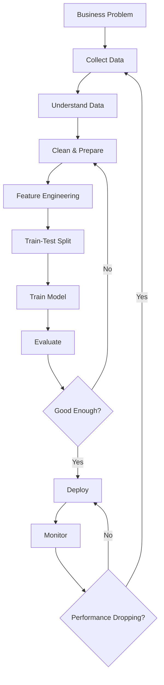

# 📖 Chapter 3 – The Machine Learning Pipeline

# **Part 3 – From Training to Production: Teaching the Computer to Learn**

> *"After weeks of defining the problem, collecting data, cleaning it, and engineering better features, we finally reach the moment everyone was waiting for. But even now, we don't immediately train the model. First, we must answer one critical question: **How do we know the model is truly learning instead of simply memorizing?**"*

---

# 📍 Where We Are

```text
Chapter 3 – The Machine Learning Pipeline

✅ Part 1
├── Why This Chapter Matters
├── What is a Pipeline?
├── Your First Day as an ML Engineer

✅ Part 2
├── Business Problem
├── Data Collection
├── Data Understanding
├── Data Cleaning
├── Exploratory Data Analysis
└── Feature Engineering

🚀 Part 3 (Current)
├── Train-Test Split
├── Model Selection
├── Model Training
├── Model Evaluation
├── Hyperparameter Tuning
├── Deployment
├── Monitoring
└── Retraining

Upcoming

Part 4
├── Interactive Labs
├── Industry Roles
├── Pipeline vs Lifecycle
├── Interview Guide
├── Revision Sheet
└── Author's Notes
```

---

# 🎬 The Story Continues...

After several days, the team has:

- Clearly defined the business problem.
- Collected relevant data.
- Understood the dataset.
- Cleaned inconsistencies.
- Explored hidden patterns.
- Created meaningful features.

The Product Manager looks excited.

> **"Great! The data looks perfect."**

The junior engineer smiles.

> **"Finally... let's train the model on everything!"**

Before anyone else speaks, the senior ML engineer quickly replies:

> **"Absolutely not."**

Everyone looks confused.

---

# 🏗 Stage 7 – Train-Test Split

The senior engineer walks to the whiteboard.

He writes one word.

## **Examination**

Then he asks everyone a question.

---

## Imagine You're Preparing for an Exam

Suppose your teacher gives you **1,000 practice questions**.

You solve all of them.

Then, during the final exam, the teacher asks...

The exact same 1,000 questions.

You score:

```text
100%
```

Does that prove you're intelligent?

Not necessarily.

Maybe you simply memorized the answers.

Now imagine a different situation.

The exam contains completely new questions.

If you still perform well,

then you've demonstrated something much more valuable.

You have **generalized** your knowledge.

---

# Machine Learning Faces the Same Problem

If we train the model using **every available example**, we have no way to determine whether it truly learned patterns or merely memorized the data.

To solve this, we divide the dataset.

```text
Entire Dataset

        │
        ▼
┌─────────────────────────┐
│                         │
│      Entire Dataset     │
│                         │
└──────────┬──────────────┘
           │
           ▼
 ┌──────────────────────────┐
 │                          │
 │  Training Set (80%)      │
 │  Learn from this data    │
 │                          │
 └──────────┬───────────────┘
            │
            ▼
 ┌──────────────────────────┐
 │                          │
 │  Test Set (20%)          │
 │  Never shown during      │
 │  training                │
 │                          │
 └──────────────────────────┘
```

The model studies only the training set.

The test set remains hidden until the very end.

---

# 🎯 Why Can't We Skip This?

Without a test set,

every model appears brilliant.

Imagine memorizing every previous exam paper.

That doesn't prove understanding.

Similarly,

a model that performs perfectly on training data may completely fail on unseen data.

Machine Learning isn't about memorization.

It's about **generalization**.

---

# Stage 8 – Model Selection

Now the senior engineer says:

> **"Excellent. The data is ready."**

> **"Now we can finally choose an algorithm."**

Notice something important.

The algorithm appears **after** all the previous preparation.

Exactly as it happens in real projects.

---

## Which Model Should We Choose?

The answer depends entirely on the problem.

### Regression Problems

Predict a continuous value.

Examples:

- House Price
- Temperature
- Sales
- Salary

Possible algorithms:

- Linear Regression
- Decision Tree Regressor
- Random Forest
- XGBoost
- Neural Networks

---

### Classification Problems

Predict categories.

Examples:

- Spam or Not Spam
- Fraud or Genuine
- Disease or Healthy

Possible algorithms:

- Logistic Regression
- Decision Tree
- Support Vector Machine
- Random Forest
- Neural Networks

---

### Clustering Problems

Group similar data together.

Examples:

- Customer Segmentation
- Market Analysis

Possible algorithms:

- K-Means
- DBSCAN
- Hierarchical Clustering

---

# 🧠 Think Like an Engineer

Notice that we don't ask:

> **"Which algorithm is the best?"**

Instead we ask:

> **"Which algorithm is best for *this* problem?"**

Choosing an algorithm is like choosing a vehicle.

A sports car isn't better than a truck.

It depends on the job.

---

# Stage 9 – Model Training

This is the stage most beginners imagine when they hear "Machine Learning."

For the first time,

the computer begins learning.

---

## What Does the Model Receive?

It receives two things.

```text
Features (X)

+

Correct Answers (Y)
```

The objective is simple.

Learn a relationship between them.

---

Imagine teaching a child.

You repeatedly show pictures.

```text
🐱

Cat

🐶

Dog

🐱

Cat

🐶

Dog
```

Over time,

the child begins recognizing patterns.

Machine Learning works similarly.

---

# What Happens During Training?

Training is not magic.

The model repeats a simple cycle.

```text
Start with Random Parameters

        │
        ▼
Make Prediction

        │
        ▼
Compare Prediction
with Correct Answer

        │
        ▼
Calculate Error

        │
        ▼
Adjust Parameters

        │
        ▼
Predict Again

        │
        ▼
Repeat Thousands
or Millions of Times
```

This loop is the heart of Machine Learning.

Every algorithm you study later—Linear Regression, Logistic Regression, Neural Networks—follows this idea.

Only the details differ.

---

# 🎯 Why Is Training So Important?

Training transforms a model from:

```text
Random Guessing
```

into

```text
Pattern Recognition
```

The output of training is not code.

The output is a **trained model** whose parameters encode useful knowledge extracted from data.

---

# Stage 10 – Model Evaluation

Training finishes.

The junior engineer excitedly announces:

> **"Our model achieved 99% accuracy!"**

The senior engineer asks one question.

> **"On which dataset?"**

The answer:

> **"Training data."**

The senior engineer smiles.

> **"That tells us almost nothing."**

---

# Why?

Imagine memorizing an entire textbook.

During the exam,

you're asked the exact same questions.

Of course you'll score highly.

But what happens if the questions change?

That's why we evaluate on the **test set**.

Only then do we know whether the model has learned general patterns.

---

# Different Problems Need Different Metrics

### Regression

Examples:

- House Prices
- Sales
- Temperature

Common metrics:

- MAE
- MSE
- RMSE
- R² Score

---

### Classification

Examples:

- Spam Detection
- Cancer Diagnosis
- Fraud Detection

Common metrics:

- Accuracy
- Precision
- Recall
- F1-Score
- ROC-AUC

We'll dedicate entire chapters to these metrics later.

For now,

remember one idea:

> **Evaluation measures how well the model performs on data it has never seen before.**

---

# Stage 11 – Hyperparameter Tuning

Suppose you choose a Random Forest.

The algorithm asks you several questions.

For example:

```text
How many trees?

100?

300?

1000?
```

Or perhaps:

```text
How deep should each tree grow?
```

These settings are called **hyperparameters**.

The model does **not** learn them automatically.

The engineer chooses them.

---

## Think of a Car

Buying a car isn't enough.

You still adjust:

- Tire pressure
- Seat position
- Mirrors

These aren't part of the engine.

They are settings chosen before driving.

Hyperparameters work similarly.

They configure how learning happens.

---

# Stage 12 – Deployment

Weeks later,

the team is satisfied.

The Product Manager asks:

> **"Can our customers use the model now?"**

Until this point,

the model has existed only inside a notebook.

Real users cannot access it.

Deployment changes that.

---

## What Is Deployment?

Deployment means integrating the trained model into a real application.

Examples:

```text
Mobile App

↓

Backend API

↓

Machine Learning Model

↓

Prediction

↓

User
```

Now users can benefit from the model's predictions.

---

# Example – Google Photos

When you upload a picture,

something like this happens.

```text
Image

↓

Backend Server

↓

Image Recognition Model

↓

Objects Identified

↓

Results Returned
```

That model has been deployed.

---

# Stage 13 – Monitoring

Many beginners believe deployment is the finish line.

Experienced engineers know...

it's actually the starting line.

The senior engineer asks:

> **"How do we know the model is still performing well six months from now?"**

Excellent question.

---

# What Can Go Wrong?

Perhaps:

- Customer preferences change.
- New products appear.
- Fraud techniques evolve.
- Medical practices improve.
- Traffic patterns shift.

The world changes.

If the world changes,

the data changes.

If the data changes,

the model may become outdated.

Monitoring helps detect these problems.

---

# Questions Monitoring Answers

- Has prediction accuracy dropped?
- Are users satisfied?
- Is inference becoming slower?
- Has incoming data changed?
- Are unusual patterns appearing?

Monitoring is continuous.

---

# Stage 14 – Retraining

Imagine our recommendation system again.

Everything works beautifully.

Then suddenly...

A global event changes customer behavior overnight.

People begin purchasing completely different products.

The model still predicts old preferences.

Recommendation quality drops dramatically.

The model isn't broken.

The world changed.

---

# The Solution

Collect new data.

```text
New Customer Behavior

↓

Updated Dataset

↓

Train Again

↓

Deploy New Model

↓

Better Predictions
```

Machine Learning systems evolve continuously.

---

# The Complete Production Loop

Everything we've learned can now be summarized.



Notice something remarkable.

This isn't a straight line.

It's a cycle.

Successful Machine Learning systems continuously improve.

---

# 🌍 Real-World Example – YouTube

Let's trace a simplified version of YouTube's recommendation system.

```text
Users Watch Videos

↓

Watch History Stored

↓

Data Cleaned

↓

Features Created

↓

Recommendation Model Trained

↓

Model Deployed

↓

Users Receive Better Recommendations

↓

New User Behavior Generated

↓

New Training Data

↓

Retraining

↓

Even Better Recommendations
```

Every click becomes future training data.

Every user helps improve tomorrow's recommendations.

---

# 🌉 Concept Connection

Let's connect everything from Parts 1–3.


You can now see the entire engineering journey from idea to production.

---

# ✍️ Author's Reflection

One of the most surprising discoveries for new ML engineers is that **training a model is only one chapter in a much longer story**.

In software engineering, writing a function is only a small part of building an application.

Similarly, in Machine Learning, training is only one stage in building a production system.

The true value of Machine Learning lies not just in creating accurate models, but in designing systems that continue to learn, adapt, and deliver value as the world changes.

That's why experienced ML teams spend as much effort on deployment, monitoring, and retraining as they do on model development itself.

> **A successful Machine Learning project is not the one with the highest training accuracy. It is the one that continues solving real business problems long after it has been deployed.**

---

## 🚀 Up Next

In **Part 4**, we'll consolidate everything through:

- Interactive hands-on thought experiments
- Real industry team roles (Product Manager, Data Engineer, ML Engineer, MLOps Engineer, Backend Engineer)
- Pipeline vs Lifecycle (a concept that confuses many beginners)
- Common interview questions
- Revision sheet
- Exercises
- Author's final notes

By the end of Part 4, you'll not only know the Machine Learning Pipeline—you'll understand how real ML teams build, deploy, and maintain intelligent systems in production.
