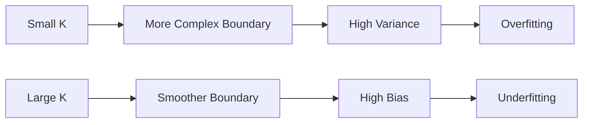
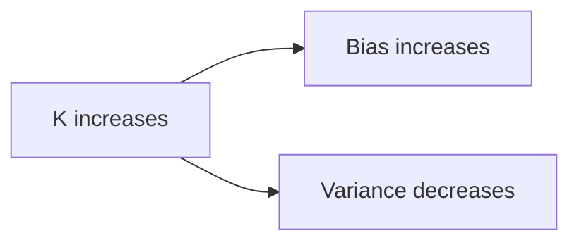

 This video mainly focuses on **how the choice of K affects the KNN model**, especially its **complexity, bias, variance, overfitting, and underfitting**. It also gives a practical example of using KNN to predict whether a student will pass/fail based on study hours.

I’ll keep the scope to this video and connect it with what we already learned.

# KNN — Choosing the Value of K

We already know:

> **K = Number of nearest neighbors used to make a prediction.**

The important question now is:

> **How do we choose a good value of K?**

The choice of K has a major effect on how the KNN model behaves.

---

# 1. Small K vs Large K

Imagine we have the same training data but use different values of K.

The video shows examples such as:

- K = 1
- K = 3
- K = 31

The decision regions become very different.

### K = 1

The model looks at only the closest point.

It becomes very sensitive to individual training examples.

### K = 3

The model considers a small neighborhood.

The decision boundary becomes smoother.

### K = 31

The model considers a much larger neighborhood.

The decision boundary becomes much smoother and more general.

The basic relationship is:

```text
Small K  → Complex / sensitive model
Large K  → Smooth / simple model
```

---

# 2. What Happens When K Is Very Small?

Suppose:

```text
K = 1
```

For every new point, KNN essentially asks:

> "What class does my closest training point belong to?"

This means a single training point can determine the prediction.

Even if that point is unusual or noisy, it can change the result.

Therefore:

> **Small K → High sensitivity to training data**

This means:

> **Small K → Higher Variance → Higher risk of Overfitting**

---

# 3. Why Does Small K Cause Overfitting?

Imagine our training data contains one unusual point.

With:

```text
K = 1
```

that single point can completely determine the prediction around it.

So the model may create a very complicated decision boundary.

It is trying to adapt closely to the training data.

In other words:

> **The model starts learning the small details/noise of the training data.**

That's overfitting.

### Connection:

```text
Small K
   ↓
Very local decisions
   ↓
Sensitive to individual points
   ↓
High Variance
   ↓
Possible Overfitting
```

---

# 4. What Happens When K Is Large?

Now suppose:

```text
K = 31
```

Instead of listening to one or a few neighbors, the model considers many neighbors.

An individual point has much less influence.

Therefore, the decision boundary becomes smoother.

This makes the model less sensitive to noise.

So:

> **Large K → Lower Variance**

But there's a tradeoff.

The model can become **too simple**.

It may start ignoring useful local patterns.

Therefore:

> **Large K → Higher Bias → Possible Underfitting**

---

# 5. The Most Important Relationship

This is probably the most important thing from this video.

As **K increases**:

```text
K ↑
 │
 ├── Bias ↑
 │
 └── Variance ↓
```

As **K decreases**:

```text
K ↓
 │
 ├── Bias ↓
 │
 └── Variance ↑
```

So:

| K | Bias | Variance | Risk |
|---|---|---|---|
| Small | Low | High | Overfitting |
| Appropriate | Balanced | Balanced | Good generalization |
| Large | High | Low | Underfitting |

---

# 6. Why Does Bias Increase with K?

Let's make this intuitive.

Suppose your new point is surrounded by:

```text
A A A A A
      X
B B B B B
```

If you use a **very small K**, you might only consider the nearby points around `X`.

You capture the local pattern.

But if you keep increasing K, eventually you're considering points that are **farther away**.

Now the model starts averaging over a much larger region.

It may miss the local relationship.

That's why:

> **Large K can make the model too simple → High Bias.**

---

# 7. Why Does Variance Decrease with K?

With:

```text
K = 1
```

one training point can completely change the prediction.

But with:

```text
K = 31
```

one training point has very little influence because 30 other neighbors are also involved.

So if one training point changes:

```text
K = 1
→ Prediction may change significantly

K = 31
→ Prediction probably changes very little
```

Therefore:

> **Large K makes the model less sensitive to individual training examples → Lower Variance.**

---

# 8. Visual Mental Model

This is the key visual relationship from the lecture:



And the overall relationship:



### Remember:

> **Small K → model listens to fewer points → more sensitive**

> **Large K → model listens to more points → more stable**

---

# 9. Student Example from the Video

The video uses a simple example involving:

**Hours studied → Pass/Fail**

Suppose we have:

| Hours Studied | Result |
|---:|---|
| 1 | Fail |
| 2 | Fail |
| 3 | Fail |
| 4 | Fail |
| 5 | Pass |
| 6 | Pass |
| 7 | Pass |
| 8 | Pass |
| 9 | Pass |

Now suppose a new student studied:

**5.5 hours**

We want to predict:

> **Pass or Fail?**

---

# 10. Using K = 3

The three nearest study-hour values to 5.5 are:

```text
5 → Pass
6 → Pass
4 → Fail
```

Votes:

```text
Pass → 2
Fail → 1
```

Therefore:

> **Prediction = Pass**

This is normal KNN classification.

The important thing is that KNN doesn't directly use a rule such as:

> "If hours > 5, Pass."

Instead, it looks at the **nearest training examples**.

---

# 11. What if K Is Too Large?

Suppose we use a very large K.

Now KNN may include students who studied:

```text
1, 2, 3, 4, 5, 6, 7, 8, 9...
```

The prediction is now influenced by a much broader population.

The local information around **5.5 hours** becomes less important.

This demonstrates why:

> **Very large K can oversimplify the decision.**

---

# 12. K Is a Hyperparameter

This connects directly with your earlier question.

K is a **hyperparameter** because we choose it before/during model selection.

Examples:

```text
K = 1
K = 3
K = 5
K = 7
...
```

We need to find a value that gives good performance on **unseen/validation data**.

We should not simply say:

> "K = 3 is always best."

There is **no universally best K**.

The appropriate value depends on the dataset.

---

# 13. Don't Choose K Only Based on Training Accuracy

This is a very important practical point.

Suppose:

| K | Training Accuracy | Test Accuracy |
|---:|---:|---:|
| 1 | 100% | 72% |
| 3 | 94% | 88% |
| 5 | 92% | 91% |
| 50 | 78% | 76% |

K = 1 looks fantastic on training data:

**100%**

But its test performance is only:

**72%**

That's a sign of overfitting.

K = 5 gives:

**91% test accuracy**

So K = 5 may generalize better.

The goal isn't:

> **Maximum training accuracy**

The goal is:

> **Good performance on unseen data.**

---

# 14. The Bias-Variance Tradeoff in KNN

Now all our previous concepts come together.

```text
             K increases →
             
Bias       LOW ───────────────→ HIGH

Variance   HIGH ──────────────→ LOW
```

At very small K:

> Model is too flexible.

At very large K:

> Model is too simple.

We want a middle region where the model generalizes well.

```text
Small K       Optimal K        Large K
   ↓              ↓               ↓
Overfitting    Good Fit       Underfitting
   ↓              ↓               ↓
High Variance                High Bias
```

---

# 15. One Important Correction

Don't interpret:

> **"Higher K is always better because variance decreases."**

❌ Wrong.

And don't interpret:

> **"Lower K is always better because bias decreases."**

❌ Also wrong.

Both extremes can be bad.

Our goal is:

> **Find a K that provides the best generalization.**

---

# 16. How Does K Affect the Decision Boundary?

This is what the three graphs in the video are trying to show.

### K = 1

Decision boundary can become very irregular.

It may closely follow individual training points.

→ **Complex**

→ **High Variance**

---

### K = 3

Boundary becomes smoother.

It still captures local patterns.

→ **More balanced**

---

### K = 31

Boundary becomes much smoother.

It may ignore smaller/local patterns.

→ **Simpler**

→ **High Bias**

---

# 17. Connection with Overfitting and Underfitting

You should now be able to derive this rather than memorize it.

### Small K

```text
Few neighbors
    ↓
Individual points have strong influence
    ↓
Model becomes sensitive
    ↓
Variance ↑
    ↓
Overfitting risk ↑
```

### Large K

```text
Many neighbors
    ↓
Individual points have weak influence
    ↓
Model becomes smoother
    ↓
Bias ↑
    ↓
Underfitting risk ↑
```

---

# 18. Interview-Friendly Questions

### Q1. What happens when K is very small?

> The model becomes highly sensitive to individual training points, leading to high variance and a greater risk of overfitting.

### Q2. What happens when K is very large?

> The model becomes smoother and less sensitive to individual observations, which reduces variance but can increase bias and cause underfitting.

### Q3. What happens to bias when K increases?

> **Bias generally increases.**

### Q4. What happens to variance when K increases?

> **Variance generally decreases.**

### Q5. What is the relationship between K and model complexity?

> **Small K produces a more complex, flexible decision boundary, while large K produces a smoother, simpler decision boundary.**

### Q6. How do we choose K?

> We typically evaluate different K values using validation data or cross-validation and choose a value that provides good generalization.

---

# 19. Quick Revision Notes

```markdown
## KNN — Choosing K

K = Number of nearest neighbors considered for prediction.

The choice of K controls the complexity of the KNN model.

### Small K

Example: K = 1

- Considers very few neighbors.
- Individual training points have strong influence.
- Decision boundary can become complex.
- More sensitive to noise.
- Bias → Lower
- Variance → Higher
- Risk of overfitting → Higher

### Large K

Example: K = 31

- Considers many neighbors.
- Individual points have less influence.
- Decision boundary becomes smoother.
- Less sensitive to noise.
- Bias → Higher
- Variance → Lower
- Risk of underfitting → Higher

### As K increases

Bias generally increases.
Variance generally decreases.

### Goal

We should not choose the smallest or largest K blindly.

We want a K that provides good generalization on unseen data.

### Example

Suppose:

| Hours Studied | Result |
|---:|---|
| 1 | Fail |
| 2 | Fail |
| 3 | Fail |
| 4 | Fail |
| 5 | Pass |
| 6 | Pass |
| 7 | Pass |
| 8 | Pass |
| 9 | Pass |

For a new student who studied 5.5 hours:

K = 3

Nearest neighbors:

5 → Pass
6 → Pass
4 → Fail

Votes:

Pass → 2
Fail → 1

Prediction → Pass

### Key Relationship

Small K → High Variance → Overfitting

Large K → High Bias → Underfitting

Optimal K → Better balance → Better generalization
```

---

# 🎯 Final Mental Model

You can now connect **everything we've learned about KNN**:

```text
                    KNN
                     │
              Choose K
                     │
          ┌──────────┴──────────┐
          ↓                     ↓
      Small K                Large K
          ↓                     ↓
    More flexible           More smooth
          ↓                     ↓
    High Variance            High Bias
          ↓                     ↓
    Overfitting             Underfitting
```

And the most important statement from this video:

> **As K increases, Bias generally increases and Variance generally decreases.**

### One-line memory trick

> **Small K = "Listen to a few people very carefully."**

> **Large K = "Ask a large crowd and take the general opinion."**

The **small crowd** can be heavily influenced by one unusual person → **high variance**.

The **large crowd** is more stable but may ignore local details → **high bias**.

**That is the Bias–Variance tradeoff in KNN.**
